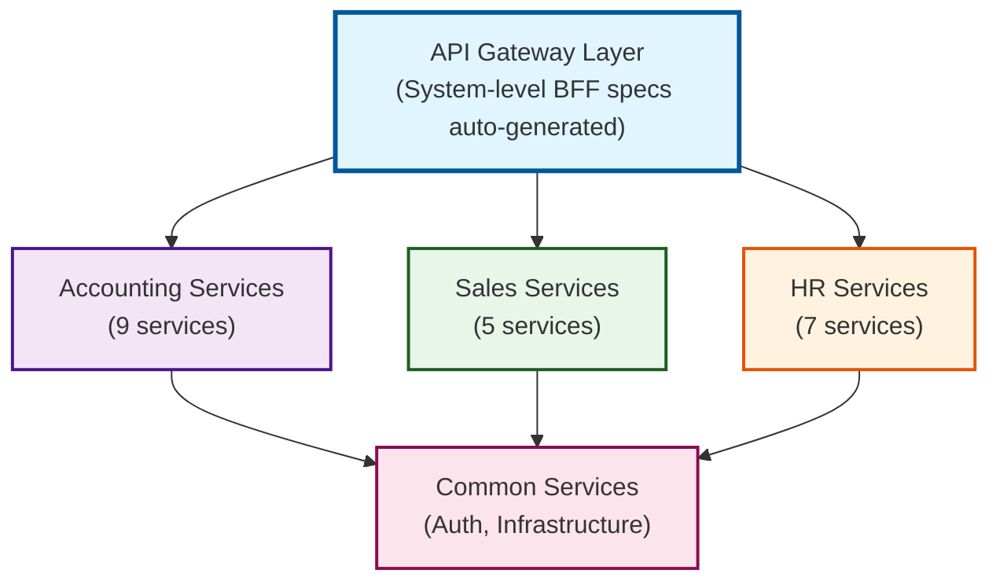

# RERP - Rust Enterprise Resource Planning

> **Cloud-native, microservices-based ERP system built with Rust and OpenAPI-first architecture**

[](https://github.com/microscaler/rerp/actions)
[](https://github.com/microscaler/rerp/actions/workflows/deploy-website.yml)
[](LICENSE)
[](https://www.rust-lang.org/)
[](https://www.openapis.org/)
[](.github/dependabot.yml)
[](https://microscaler.github.io/rerp/)
[](https://github.com/microscaler/rerp/actions/workflows/codeql.yml)
[](https://codecov.io/gh/microscaler/rerp)
[](https://github.com/microscaler/rerp/actions/workflows/base-images.yml)
[](https://microscaler.github.io/rerp/)

---

## Executive Summary

**RERP** (Rust Enterprise Resource Planning) is a next-generation, cloud-native ERP system designed from the ground up for modern enterprises. Built with Rust for performance and reliability, RERP delivers a modular microservices architecture that scales from startups to Fortune 500 companies.

Unlike traditional monolithic ERPs, RERP is architected as **71 independent microservices**, each with its own OpenAPI specification, enabling rapid development, independent scaling, and seamless integration. The system follows an **OpenAPI-first** approach, generating type-safe services automatically from specifications using [BRRTRouter](https://github.com/microscaler/BRRTRouter).

### Key Differentiators

- 🚀 **Cloud-Native**: Microservices architecture built for Kubernetes and cloud deployment
- ⚡ **High Performance**: Rust-based services delivering enterprise-grade performance
- 📐 **OpenAPI-First**: All services defined in OpenAPI 3.1.0, enabling rapid code generation
- 🔧 **Modular**: 71 independent services across 6 implementation phases
- 🔒 **Type-Safe**: Auto-generated handlers and types from OpenAPI specs
- 🌐 **API Gateway**: System-level BFF specs auto-generated from sub-services

---

## What is RERP?

RERP is a comprehensive Enterprise Resource Planning system that manages all aspects of business operations:

- **Financial Management**: Accounting, invoicing, budgeting, financial reporting
- **Sales & CRM**: Lead management, quotations, orders, customer relationships
- **Inventory & Logistics**: Stock management, warehouse operations, shipping
- **Manufacturing**: Production planning, BOM management, quality control
- **Human Resources**: Employee records, payroll, recruitment, performance management
- **Project Management**: Task tracking, timesheets, resource allocation
- **Marketing & E-commerce**: Campaign management, online stores, content management
- **And More**: 71 services covering every aspect of enterprise operations

### RERP Service Architecture

```mermaid
mindmap
  root((RERP System))
    Phase 1: Core Foundation
      Authentication & Authorization
        IDAM
          Identity Management
          User Management
          Session Management
        RBAC
          Role Management
          Permission Control
          Access Policies
      Infrastructure
        API Gateway
          Request Routing
          Load Balancing
          Rate Limiting
        Integration Platform
          API Integration
          Webhook Management
          Data Transformation
      Product Management
        Catalog
          Product Catalog
          SKU Management
          Category Management
        Pricing
          Dynamic Pricing
          Price Rules
          Discount Management
        Tax
          Tax Calculation
          Tax Rules
          Compliance
    Phase 2: Business Operations
      CRM
        Core CRM
          Lead Management
          Contact Management
          Opportunity Tracking
        Automation
          Workflow Automation
          Email Automation
          Task Automation
        Live Chat
          Chat Management
          Customer Support
          Real-time Communication
      Sales
        Sales Core
          Sales Pipeline
          Sales Forecasting
          Sales Analytics
        Quotation
          Quote Generation
          Quote Management
          Quote Approval
        Order
          Order Processing
          Order Fulfillment
          Order Tracking
        Subscription
          Subscription Management
          Recurring Billing
          Subscription Analytics
        Loyalty
          Loyalty Programs
          Points Management
          Rewards System
      Purchase
        Purchase Core
          Purchase Orders
          PO Approval
          Vendor Management
        Vendor
          Vendor Records
          Vendor Performance
          Vendor Contracts
      Inventory
        Inventory Core
          Stock Management
          Stock Movements
          Stock Valuation
        Warehouse
          Warehouse Operations
          Location Management
          Picking & Packing
        Logistics
          Shipping Management
          Carrier Integration
          Delivery Tracking
        Dropshipping
          Dropshipping Orders
          Supplier Integration
          Inventory Sync
    Phase 3: Financial & HR
      Accounting
        General Ledger
          Chart of Accounts
          Journal Entries
          Account Reconciliation
        Accounts Payable
          Vendor Invoices
          Payment Processing
          AP Aging
        Accounts Receivable
          Customer Invoices
          Payment Collection
          AR Aging
        Invoice
          Invoice Generation
          Invoice Management
          Invoice Templates
        Asset
          Fixed Assets
          Asset Depreciation
          Asset Tracking
        Budget
          Budget Planning
          Budget Tracking
          Budget Reports
        Financial Reports
          P&L Reports
          Balance Sheets
          Cash Flow Reports
        Bank Sync
          Bank Reconciliation
          Transaction Import
          Bank Integration
        EDI
          EDI Processing
          EDI Mapping
          EDI Compliance
      HR
        HR Core
          Employee Records
          Employee Onboarding
          Employee Offboarding
        Payroll
          Payroll Processing
          Salary Management
          Tax Deductions
        Recruitment
          Job Postings
          Applicant Tracking
          Interview Management
        Attendance
          Time Tracking
          Attendance Records
          Shift Management
        Leave
          Leave Requests
          Leave Balance
          Leave Policies
        Appraisal
          Performance Reviews
          Goal Setting
          Feedback Management
        Skills
          Skills Inventory
          Skills Assessment
          Training Management
    Phase 4: Advanced Operations
      Manufacturing
        Manufacturing Core
          Production Orders
          Work Centers
          Production Tracking
        BOM
          Bill of Materials
          BOM Management
          BOM Costing
        Production Planning
          Production Scheduling
          Capacity Planning
          Resource Allocation
        Repair
          Repair Orders
          Repair Tracking
          Warranty Management
        Subcontracting
          Subcontractor Management
          Subcontract Orders
          Quality Control
      Project
        Project Core
          Project Management
          Task Tracking
          Resource Management
        Timesheet
          Time Tracking
          Timesheet Approval
          Project Billing
    Phase 5: Customer-Facing
      Marketing
        Email
          Email Campaigns
          Email Templates
          Email Analytics
        Automation
          Marketing Automation
          Lead Nurturing
          Campaign Management
        Social Media
          Social Integration
          Social Publishing
          Social Analytics
      Website
        CMS
          Content Management
          Page Builder
          Media Library
        Ecommerce
          Online Store
          Shopping Cart
          Checkout Process
        Builder
          Website Builder
          Theme Management
          SEO Tools
      POS
        POS Core
          Point of Sale
          Offline Sales
          Receipt Management
        Payment Gateway
          Payment Processing
          Payment Methods
          Payment Security
      Helpdesk
        Helpdesk Core
          Ticket System
          Ticket Routing
          SLA Management
        Knowledge Base
          Knowledge Articles
          FAQ Management
          Search & Discovery
      Field Service
        Field Service Core
          Service Scheduling
          Technician Dispatch
          Service History
    Phase 6: Extensions
      Marketplace
        Marketplace Core
          App Marketplace
          Third-Party Apps
          App Management
        Integration Hub
          Integration Management
          Connector Library
          Integration Monitoring
      Analytics
        BI
          Business Intelligence
          Data Warehousing
          OLAP Cubes
        Dashboards
          Custom Dashboards
          Widget Library
          Real-time Updates
        Reporting
          Report Builder
          Scheduled Reports
          Report Distribution
    Additional Services
      AI
        AI Core
          AI Models
          Machine Learning
          Predictive Analytics
        Document AI
          Document Processing
          OCR & Extraction
          Document Intelligence
      Automation
        Workflow Automation
          Process Automation
          Rule Engine
          Event Triggers
      Appointments
        Appointment Scheduling
          Calendar Management
          Booking System
          Reminders
      Approvals
        Approval Workflows
          Approval Chains
          Approval Rules
          Approval Tracking
      Data
        Data Cleaning
          Data Quality
          Data Validation
          Data Enrichment
      Documents
        Document Management
          Document Storage
          Version Control
          Document Sharing
      ESG
        ESG Compliance
          Sustainability Tracking
          ESG Reporting
          Compliance Management
      IoT
        IoT Integration
          Device Management
          Data Collection
          Real-time Monitoring
      Localization
        Localization Core
          Multi-language Support
          Currency Management
          Regional Settings
        Compliance
          Regulatory Compliance
          Tax Compliance
          Legal Compliance
```



### Architecture

RERP follows a **microservices architecture** where each business function is an independent service:



Each service:
- Has its own OpenAPI 3.1.0 specification
- Can be developed, deployed, and scaled independently
- Follows the same patterns (generated + implementation crates)
- Integrates via well-defined APIs

---

## Why RERP?

### The Problem with Traditional ERPs

Traditional ERP systems suffer from:

- **Monolithic Architecture**: Single codebase makes updates risky and slow
- **Vendor Lock-in**: Proprietary systems create dependency and high costs
- **Poor Performance**: Legacy codebases struggle with modern workloads
- **Complex Integration**: Difficult to connect with modern SaaS tools
- **High Costs**: Licensing fees, implementation costs, and maintenance overhead
- **Slow Innovation**: Large codebases resist rapid feature development

### How RERP Solves This

| Traditional ERP | RERP |
|----------------|------|
| Monolithic codebase | ✅ 71 independent microservices |
| Proprietary APIs | ✅ OpenAPI-first, open standards |
| Slow deployments | ✅ Independent service deployments |
| Vendor lock-in | ✅ Open source, self-hostable |
| Complex integrations | ✅ RESTful APIs, webhooks, event-driven |
| High licensing costs | ✅ Open source, no per-user fees |
| Legacy technology | ✅ Modern Rust, cloud-native |

### Business Benefits

- **Cost Savings**: No licensing fees, reduced infrastructure costs through efficient Rust services
- **Flexibility**: Deploy only the services you need, scale independently
- **Speed**: Rapid development through OpenAPI code generation
- **Reliability**: Rust's memory safety and performance reduce downtime
- **Future-Proof**: Cloud-native architecture adapts to changing needs
- **Integration**: API-first design enables seamless connections with modern tools

---

## How RERP Works

### OpenAPI-First Development

RERP uses an **OpenAPI-first** development approach:

1. **Define API**: Write OpenAPI 3.1.0 specification for each service
2. **Generate Code**: Use BRRTRouter to generate handlers, types, and routing
3. **Implement Logic**: Add business logic in implementation crates
4. **Deploy**: Each service runs independently

### Service Structure

Each RERP service follows a consistent structure:

```
microservices/
├── {suite}/                    # Suite directory (e.g., accounting, hr, sales)
│   ├── {service}/              # Service directory (e.g., general-ledger, invoice)
│   │   ├── gen/                # Generated crate (from OpenAPI)
│   │   │   ├── Cargo.toml
│   │   │   ├── doc/
│   │   │   │   └── openapi.yaml    # Service OpenAPI spec
│   │   │   └── src/                # Auto-generated code
│   │   └── impl/               # Implementation crate (business logic)
│   │       ├── Cargo.toml
│   │       ├── config/
│   │       │   └── config.yaml
│   │       └── src/
│   │           ├── main.rs         # Service entry point
│   │           └── controllers/     # Business logic
```

### Development Workflow

```bash
# 1. Define OpenAPI spec
vim openapi/accounting/general-ledger/openapi.yaml

# 2. Generate service code
cd microservices/accounting/general-ledger/gen
brrtrouter-gen --spec ../../../openapi/accounting/general-ledger/openapi.yaml --output .

# 3. Implement business logic
vim ../impl/src/controllers/accounts.rs

# 4. Build and test
cargo build -p rerp_accounting_general_ledger
cargo test
```

### Auto-Generated BFF Specs

System-level Backend for Frontend (BFF) specs are automatically generated.

**Accounting BFF** (`openapi/accounting/openapi_bff.yaml`): Tilt and local runs use the standalone [bff-generator](https://github.com/microscaler/bff-generator). Install with `pip install bff-generator`, then:

```bash
bff-generator generate-spec --config openapi/accounting/bff-suite-config.yaml --output openapi/accounting/openapi_bff.yaml
```

**All suites** (`openapi/{suite}/openapi_bff.yaml`):

```bash
# Regenerate all system BFF specs from sub-services
rerp bff generate-system
```

This aggregates all sub-service paths and schemas into unified system APIs, automatically kept in sync via GitHub Actions.

---

## Project Status

**Current Phase**: Foundation & Specification

- ✅ **71 Services Defined**: Complete OpenAPI specifications with paths and schemas
- ✅ **Crate Structure**: 142 crates organized in Rust workspace (71 generated + 71 implementation)
- ✅ **BFF Generation**: Auto-generated system-level API gateway specs
- ✅ **CI Automation**: GitHub Actions for automatic BFF spec generation
- ⏳ **Code Generation**: Services ready for BRRTRouter code generation
- ⏳ **Implementation**: Business logic implementation in progress

### Implementation Phases

RERP is organized into 6 implementation phases:

1. **Phase 1: Core Foundation** (7 services) - Auth, infrastructure, product management
2. **Phase 2: Business Operations** (14 services) - CRM, sales, purchase, inventory
3. **Phase 3: Financial & HR** (16 services) - Accounting, HR management
4. **Phase 4: Advanced Operations** (7 services) - Manufacturing, project management
5. **Phase 5: Customer-Facing** (10 services) - Marketing, website, POS, helpdesk
6. **Phase 6: Extensions** (5 services) - Marketplace, analytics, BI

See [RERP_MUSINGS.md](RERP_MUSINGS.md) for detailed module breakdown and market analysis.

---

## Quick Start

### Prerequisites

- Rust toolchain (stable)
- Python 3.12+ (for generation scripts)
- [BRRTRouter](https://github.com/microscaler/BRRTRouter) (for code generation)

### Explore the Project

```bash
# Clone the repository
git clone https://github.com/microscaler/rerp.git
cd rerp

# View service specifications
ls openapi/*/openapi.yaml

# Check crate structure
ls microservices/*/

# Generate system BFF specs
rerp bff generate-system
```

### Generate a Service

```bash
# Navigate to a service
cd microservices/accounting/general-ledger/impl

# Generate code from OpenAPI spec (outputs to gen/)
brrtrouter-gen --spec ../../../openapi/accounting/general-ledger/openapi.yaml --output ../gen

# Build the service
cargo build
```

---

## Project Structure

```
rerp/
├── microservices/          # Rust workspace with all service crates
│   ├── Cargo.toml          # Workspace configuration
│   ├── {suite}/            # Suite directories (e.g., accounting, hr, sales)
│   │   ├── {service}/      # Service directories
│   │   │   ├── gen/        # Generated crate
│   │   │   └── impl/       # Implementation crate
├── openapi/                # OpenAPI specifications
│   ├── {suite}/            # Suite directories
│   │   ├── bff-suite-config.yaml  # Suite BFF config
│   │   ├── openapi_bff.yaml       # Generated suite BFF spec
│   │   ├── README.md       # Suite documentation
│   │   └── {service}/      # Service directories
│   │       ├── openapi.yaml # Service OpenAPI spec
│   │       └── README.md     # Service documentation
├── port-registry.json       # Port registry (rerp ports)
├── tooling/                 # rerp CLI: ports, openapi, ci, bff, build, docker, bootstrap, tilt
└── .github/
    └── workflows/
        └── ci.yml  # CI: validate OpenAPI, validate ports, build, test, multi-arch
```

---

## Documentation

### Core Documentation

- **[RERP_MUSINGS.md](RERP_MUSINGS.md)** - Detailed module breakdown, market analysis, and design rationale
- **Microservices structure**: `microservices/{suite}/{service}/gen/` (generated) and `microservices/{suite}/{service}/impl/` (business logic)
- **[openapi/README.md](openapi/README.md)** - OpenAPI specifications overview

### User-Facing Documentation

All user-facing project documentation is located in the [`docs/`](docs/) directory:

- **[docs/EXECUTIVE_SUMMARY.md](docs/EXECUTIVE_SUMMARY.md)** - Executive summary and project overview
- **[docs/mermaid/](docs/mermaid/)** - Mermaid diagrams and visualizations

### Architecture Decision Records

- **[docs/adrs/](docs/adrs/)** - Architecture Decision Records (ADRs)

---

## Contributing

RERP is in active development. We welcome contributions from developers at all levels!

See [CONTRIBUTING.md](CONTRIBUTING.md) for:
- Getting started as a contributor
- Development workflow and guidelines
- Code standards and best practices
- Testing requirements
- Areas for contribution

---

## Technology Stack

- **Language**: Rust (for performance and safety)
- **Framework**: [BRRTRouter](https://github.com/microscaler/BRRTRouter) (OpenAPI-first HTTP router)
- **API Specification**: OpenAPI 3.1.0
- **Architecture**: Microservices, cloud-native
- **Deployment**: Kubernetes-ready, containerized services

---

## Roadmap

- [x] Define 71 service specifications
- [x] Create crate structure (142 crates)
- [x] Generate OpenAPI specs with paths and schemas
- [x] Set up system-level BFF generation
- [x] Implement CI automation
- [ ] Generate code from OpenAPI specs
- [ ] Implement core services (Phase 1)
- [ ] Add comprehensive testing
- [ ] Deploy to cloud infrastructure
- [ ] Build community and ecosystem

---

## License

RERP is licensed under the **PolyForm Shield License 1.0.0**. See [LICENSE](LICENSE) for the full license text.

### Licensing Overview

**Base Modules (Open Source)**
- All base RERP modules are **open source and publicly viewable**
- Source code is available for inspection, modification, and distribution
- You can use, modify, and contribute to the base modules

**Commercial Restrictions**
- ❌ **No SaaS services may be built or sold** other than by the repository owner (Microscaler)
- ❌ **You may not "sell the software"** - RERP itself cannot be sold as a product
- ✅ **You may sell services** around implementing RERP (consulting, integration, support, customization)
- ✅ **You may use RERP internally** for your own business operations

**Enterprise Components (Future)**
- Enterprise components will be produced by Microscaler at a later stage
- Enterprise components will be **source available to paid users**
- Enterprise components will have separate licensing terms

**System Integrator Modules**
- System integrators may build their own modules that integrate with the RERP ecosystem
- Integrators **own their modules** and can sell them
- Custom modules **must be sold via the future RERP marketplace** (when available)
- This enables an ecosystem of third-party extensions while maintaining quality and compatibility

### What This Means

**You CAN:**
- ✅ View and study the source code
- ✅ Use RERP for your own business operations
- ✅ Modify RERP for your internal use
- ✅ Sell services around implementing, customizing, or supporting RERP
- ✅ Build and sell your own modules via the RERP marketplace
- ✅ Contribute improvements back to the project

**You CANNOT:**
- ❌ Offer RERP as a SaaS service (only Microscaler can do this)
- ❌ Sell RERP itself as a product
- ❌ Build competing products using RERP

For more details, see the [PolyForm Shield License 1.0.0](LICENSE) and the [PolyForm Project website](https://polyformproject.org/licenses/shield/1.0.0/).

---

## Community & Support

- **Issues**: [GitHub Issues](https://github.com/microscaler/rerp/issues)
- **Discussions**: [GitHub Discussions](https://github.com/microscaler/rerp/discussions)

---

## Acknowledgments

RERP is inspired by:
- **Odoo**: Comprehensive modular ERP approach
- **ERPNext**: Open-source ERP philosophy
- **BRRTRouter**: OpenAPI-first development methodology

Built with ❤️ using Rust and open-source principles.
