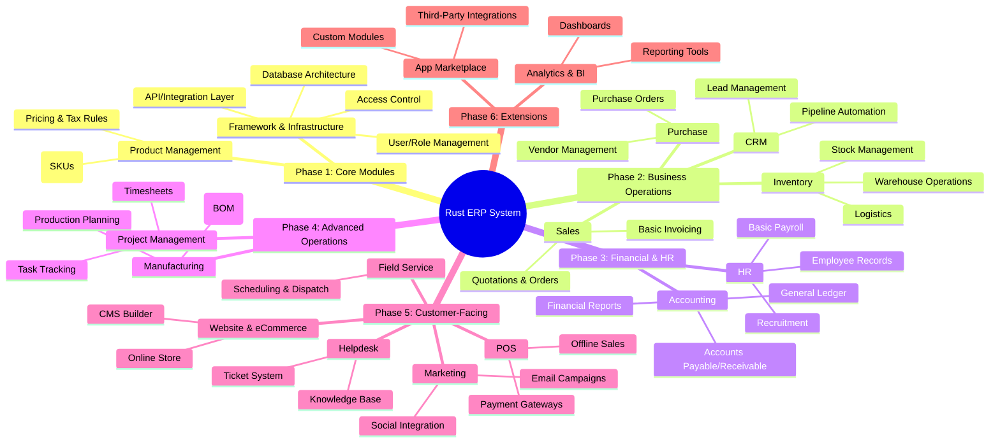

# rerp
musings on an erp

## Introduction

This is a collection of thoughts on what might be included in a new ERP built on top of Rust Loco and either SoldJS or Flutter. 

It is not a complete system, but rather a collection of ideas that could be used to build one.

I will analyze the market for large-scale open-source ERP systems, considering the demand, existing competition, potential gaps, and opportunities for a modular ERP that can cater to businesses of all sizes. I'll also assess the trends and challenges in the space. I'll update you with the findings shortly.

# Market Demand for Open-Source ERP Solutions

([Open Source ERP Market - Solutions, Share & Trends](https://www.mordorintelligence.com/industry-reports/open-source-erp-market)) *Open-source ERP market size is projected to grow from USD 2.85 billion in 2025 to USD 4.60 billion by 2030 (CAGR ~10%), reflecting rising demand for these solutions ([Open Source ERP Market - Solutions, Share & Trends](https://www.mordorintelligence.com/industry-reports/open-source-erp-market#:~:text=Study%20Period%20%202019%20,America%20Market%20Concentration%20%20Low)).* Many organizations, especially small and mid-sized businesses, are adopting open-source ERP systems due to their lower upfront costs and flexibility. In fact, **94% of mid-sized “essential” businesses in the U.S. were adopting ERPs in 2021,** up sharply from the prior year, as cloud-based solutions (including open-source ERP) became a strategic priority ([Open Source ERP Market Trends](https://www.mordorintelligence.com/industry-reports/open-source-erp-market/market-trends#:~:text=market%20for%20open%20source%20ERPs,relevant%20experiences%20to%20the%20customers)). This trend accelerated with the push for digital transformation and remote work, where companies sought adaptable, cost-effective ERP tools.

Open-source ERPs are gaining traction across a wide range of industries. Sectors such as manufacturing, retail, logistics, education, healthcare, and IT services have all begun incorporating open-source ERP – often via cloud deployments – to streamline operations ([Open Source ERP Market Trends](https://www.mordorintelligence.com/industry-reports/open-source-erp-market/market-trends#:~:text=recovery%2C%20and%20lastly%2C%20easy%20integration,are%20also%20investing%20in%20significant)). The appeal is strong for growing companies that need an ERP system which can *scale and be customized* without the hefty licensing fees of proprietary software. For example, the open-source ERP Odoo reported reaching **5 million users worldwide by 2020**, with a **73% increase in subscriptions globally in one year**, attributing the surge to unprecedented demand for open-source ERP solutions ([Odoo Leads the Path for Global Saas Solutions in Hong Kong’s ‘D-biz Pr](https://www.odoo.com/blog/odoo-news-5/odoo-tops-the-rank-in-hong-kongs-d-biz-programme-610#:~:text=in%20the%20program,May%202019)). Odoo’s popularity (now reportedly over 7 million users ([Industries that are moving towards Odoo ERP in 2023](https://www.envertis.com/industries-that-are-moving-towards-odoo-erp-2023/#:~:text=In%20terms%20of%20popularity%2C%20Odoo,to%20SMEs%20and%20large%20enterprises))) and the growth of alternatives like ERPNext and Dolibarr underscore a robust market appetite. In emerging markets and the Asia-Pacific region (the fastest-growing market for open-source ERP ([Open Source ERP Market - Solutions, Share & Trends](https://www.mordorintelligence.com/industry-reports/open-source-erp-market#:~:text=Market%20Size%20,America%20Market%20Concentration%20%20Low))), many businesses choose open-source systems to leapfrog older, expensive legacy ERPs. Overall, market demand is on an upward trajectory, fueled by cost sensitivities, a need for adaptable systems, and increasing trust in open-source software for mission-critical applications.

# Competitive Landscape: Key Open-Source ERP Players

The open-source ERP landscape is **highly fragmented, with a large number of competitors** ranging from full-featured suites to niche solutions ([Open Source ERP Market - Solutions, Share & Trends](https://www.mordorintelligence.com/industry-reports/open-source-erp-market#:~:text=The%20open,developments%20in%20the%20market%20are)). Notable players include **Odoo, ERPNext, and Dolibarr**, among others (such as iDempiere, Metasfresh, Apache OFBiz, Tryton, etc.). Each of these projects has carved out a position in the market with distinct strengths and weaknesses:

- **Odoo:** *Market Position –* Odoo is often regarded as the leading open-source ERP platform globally, with millions of users from startups to large organizations ([Industries that are moving towards Odoo ERP in 2023](https://www.envertis.com/industries-that-are-moving-towards-odoo-erp-2023/#:~:text=In%20terms%20of%20popularity%2C%20Odoo,to%20SMEs%20and%20large%20enterprises)). *Strengths –* It offers a **comprehensive modular suite**: over 30 core applications (accounting, CRM, inventory, HR, e-commerce, etc.) with 10,000+ third-party apps available to extend functionality ([Top free ERP and open source systems (plus hidden costs)](https://www.erpfocus.com/top-free-erp-systems.html#:~:text=Odoo%20Online%20has%20seen%20continued,to%20upgrade%20to%20paid%20plans)). Businesses can start small and enable additional modules as needed, a flexibility that appeals to growing companies. Odoo also boasts an intuitive web interface and a vast community of developers and integration partners, ensuring regular updates and support. This combination of a user-friendly front-end and powerful features makes Odoo accessible to SMEs while still scaling to larger enterprises ([Why Open-Source ERP is the Future of Enterprise Solutions - Flatlogic Blog](https://flatlogic.com/blog/why-open-source-erp-is-the-future-of-enterprise-solutions/#:~:text=Odoo%20is%20a%20comprehensive%20open,and%20customizations%20are%20readily%20available)). *Weaknesses –* Odoo’s open-source Community edition lacks some advanced features that are only in its paid Enterprise edition, which introduces a cost for those add-ons. Implementing and customizing Odoo for complex use cases can be **challenging and time-consuming**, sometimes requiring expert partners – a common issue with many ERPs. While Odoo can support larger companies, extremely complex or high-volume enterprises might find it less proven at the very high end (compared to SAP or Oracle). There have also been critiques of certain modules (e.g. advanced accounting features) needing further maturity. Nonetheless, Odoo occupies a strong market position as a modular, all-in-one open-source ERP with a growing commercial ecosystem.

- **ERPNext:** *Market Position –* ERPNext is a popular fully open-source ERP that targets small and mid-sized businesses looking for an easy-to-use, out-of-the-box solution. It’s developed by Frappe Technologies and has a loyal community. *Strengths –* ERPNext is known for being **truly free and open-source** (GPL licensed) with no functional limitations on user count or modules – even a company with hundreds of users can use it without licensing fees ([Top free ERP and open source systems (plus hidden costs)](https://www.erpfocus.com/top-free-erp-systems.html#:~:text=The%20company%20continues%20to%20grow,community%20contributing%20to%20its%20development)). It includes a broad set of integrated modules (financials, inventory, sales, purchase, manufacturing, HR, project management, etc.) that work together seamlessly, which means a quicker initial implementation for common business processes. Users often praise its clean and straightforward web interface and the fact that it’s relatively easier to configure for a small business compared to heavier ERPs. The system’s design allows for customization via its Frappe framework, and a growing user community contributes to its development. By one account, ERPNext has **10,000+ enterprises using it worldwide** in various self-hosted or cloud setups ([Top free ERP and open source systems (plus hidden costs)](https://www.erpfocus.com/top-free-erp-systems.html#:~:text=The%20company%20continues%20to%20grow,community%20contributing%20to%20its%20development)), indicating real-world adoption. *Weaknesses –* Compared to Odoo, ERPNext has a **smaller ecosystem of apps and third-party modules**. If a business needs very specialized features, they might have to develop them from scratch. The community, while active, is smaller and support often relies on forums or a handful of service providers. ERPNext’s out-of-the-box simplicity is an advantage for straightforward use cases, but it may struggle with highly complex scenarios or performance at massive scale (the developer team is smaller than Odoo’s, and fewer large enterprises have deployed it). Its approach to customization is more developer-centric (requiring Python/JavaScript knowledge for major changes), which can be a hurdle if a company doesn’t have IT expertise. Overall, ERPNext’s market positioning is as an *accessible, fully open* ERP ideal for SMEs, with an emphasis on ease-of-use and zero licensing cost.

- **Dolibarr:** *Market Position –* Dolibarr is an open-source ERP/CRM aimed primarily at small businesses, micro-enterprises, and freelancers. It has a significant user base in the small-business segment due to its lightweight nature. *Strengths –* Dolibarr is **easy to install, simple to use, and lightweight**. It provides all the *basic ERP functions* – modules for contacts and customers, invoicing and billing, orders, products and stock management, basic accounting, human resources, etc. – in an integrated web interface ([Top free ERP and open source systems (plus hidden costs)](https://www.erpfocus.com/top-free-erp-systems.html#:~:text=2)). One of its philosophies is to enable only the features you need, keeping the system as simple as possible for the user. This simplicity means lower training and implementation effort for small organizations; many non-technical users can get Dolibarr up and running quickly to manage their business operations. It’s also fully free with an active open-source community and is often praised for **reliable performance in a small-scale environment**. *Weaknesses –* Dolibarr is **not as feature-rich or scalable** as Odoo or ERPNext. It lacks some advanced capabilities (for example, advanced manufacturing planning, elaborate multi-warehouse logistics, or deep analytics) that mid-sized and large companies might require. Its interface, while simple, is not as modern or slick as some competitors’, and doing major customizations may require development effort that smaller teams don’t have. Essentially, Dolibarr trades off depth for simplicity; it’s an excellent low-end ERP, but companies that outgrow its capabilities often transition to more robust systems. In terms of market positioning, Dolibarr fills the niche for very small businesses and startups that need an affordable, no-frills ERP/CRM solution to get started.

- **Other Noteworthy Players:** In addition to the above, the open-source ERP arena has several other players addressing various needs. **iDempiere**, for instance, is an ERP derived from the older Compiere/ADempiere line – it’s a *mature and comprehensive ERP* favored by some for its rich feature set. *However, iDempiere is known to be complex*: it has a dense codebase and **requires strong technical expertise to implement and maintain** ([Top free ERP and open source systems (plus hidden costs)](https://www.erpfocus.com/top-free-erp-systems.html#:~:text=4)). Organizations with skilled IT teams can leverage iDempiere for heavy-duty ERP needs, but it’s “not for the faint of heart” and not very accessible to SMEs without technical support. **Metasfresh** is another open-source ERP (a fork of ADempiere) that specifically focuses on the wholesale and fresh produce sectors, combining the benefits of open-source development with some industry-specific features ([Top 5 open source ERP | Captivea](https://www.captivea.com/erp/top-5-open-source-erp#:~:text=Image%3A%20Metafresh)). Metasfresh and projects like **Apache OFBiz** (a flexible open-source ERP framework by Apache) indicate how some open-source ERPs target particular niches or act as frameworks for custom solutions. There are also community editions of former commercial ERPs (like xTuple PostBooks, etc.) and newer entrants occasionally emerging. Overall, *no single open-source ERP has a monopoly* – Odoo is arguably the largest in user base, but the competition remains diverse ([Open Source ERP Market - Solutions, Share & Trends](https://www.mordorintelligence.com/industry-reports/open-source-erp-market#:~:text=The%20open,developments%20in%20the%20market%20are)). This fragmented landscape means a new entrant must contend with several established projects, each with its loyal user base and domain strengths.

# Gaps and Opportunities in the Open-Source ERP Market

Although open-source ERPs have made significant strides, there are **gaps in the current offerings** that present opportunities for a new large-scale entrant:

- **Enterprise-Grade Scalability and Performance:** Open-source ERPs have thrived among SMBs, but **they struggle to penetrate the upper enterprise tier**. Many large companies still hesitate to adopt open-source ERP due to concerns about scalability, support, and proven track record at very high transaction volumes ([Top free ERP and open source systems (plus hidden costs)](https://www.erpfocus.com/top-free-erp-systems.html#:~:text=Fast%20forward%20to%202024%2C%20the,ecosystems%20and%20slower%20cloud%20adoption)). Current solutions sometimes face performance issues in very large implementations or require heavy customization to support complex, multi-subsidiary enterprises. A new ERP project that is architected from the ground up for *scalability (e.g. cloud-native microservices architecture, multi-tenant capabilities)* could fill this gap. By demonstrating robust performance in large-scale scenarios and offering features like easy load balancing, high availability, and enterprise-level security/compliance, a newcomer could attract bigger organizations. Essentially, there is room for an open-source ERP that confidently says “we can handle Fortune-500 scale” – something that would differentiate it from Odoo or ERPNext in the minds of cautious enterprise IT planners.

- **Cloud-Native and Modular Architecture:** Many open-source ERPs started as on-premise solutions and are only now adapting to the cloud era. This has led to some “cloud transition” challenges – for example, fragmented hosting approaches or difficulty with multi-tenancy – that have slowed their enterprise adoption ([Top free ERP and open source systems (plus hidden costs)](https://www.erpfocus.com/top-free-erp-systems.html#:~:text=continued%20to%20experience%20significant%20growth%2C,scale%20implementations)). A new entrant can seize the opportunity by being **cloud-native from day one**. This means offering containerized deployment, easy scaling on cloud platforms, and possibly a Software-as-a-Service option while still open-sourcing the code. Coupled with this is the trend toward *modularity*: a modern ERP doesn’t have to be one giant monolith. A new ERP could adopt a microservices or plugin-based design where each module (finance, CRM, inventory, etc.) is a loosely coupled component. This would let businesses implement only the pieces they need and update or replace modules independently, reducing complexity. The **benefit of a truly modular open-source ERP** is that it lowers the barrier for adoption (start with a small footprint and grow) and makes customization safer (one module’s changes won’t break the entire system). While Odoo and others are modular to an extent, a more granular and technologically decoupled approach (e.g. via robust APIs between services) could set a new project apart. *In short, embracing cloud-native, service-oriented design is a key opportunity* to outshine older open-source ERPs that are still modernizing their architectures ([Why Open-Source ERP is the Future of Enterprise Solutions - Flatlogic Blog](https://flatlogic.com/blog/why-open-source-erp-is-the-future-of-enterprise-solutions/#:~:text=optimize%20operations.%202.%20Cloud,to%20small%20and%20medium%20enterprises)).

- **Industry-Specific Functionality:** Most open-source ERPs are relatively general-purpose, which means that for very specialized industries, there can be feature gaps. For example, a manufacturing company might need advanced production planning and scheduling, a retail chain might require sophisticated point-of-sale and merchandise management, or a pharmaceutical company might need compliance tracking (FDA, etc.) built into the ERP. **Vertical solutions** are often better served by proprietary vendors or niche software. According to industry commentary, a generic ERP often *“lacks some advanced industry-specific functionalities compared to vertical (specialized) ERP systems.”* ([? Top 10 open source ERP systems to consider in 2024](https://dynamics.folio3.com/blog/open-source-enterprise-resource-planning-software/#:~:text=%3F%20Top%2010%20open%20source,compared%20to%20vertical%20ERP%20systems)) This gap is an opportunity for an open-source ERP to differentiate by catering to specific industries out-of-the-box. A new entrant could offer **pre-built industry templates or modules** – for instance, a ready-made package for healthcare management, or for construction project management – which current open-source suites may not provide without extensive customization. By addressing underserved sectors (or common sub-sectors of SMBs), the new ERP can attract those users who currently feel that open-source options require too much tailoring for their industry. Even offering official extensions or certified add-ons for certain verticals (manufacturing, nonprofit, government, etc.) could give a new ERP an edge.

- **User Experience and Ease of Implementation:** A frequent criticism of open-source ERP solutions is that they can be **complex to implement and use**, especially without expert help ([Pros and Cons of Using Odoo ERP](https://targetintegration.com/en_us/pros-and-cons-of-using-odoo/#:~:text=What%20is%20the%20disadvantage%20of,strengths%2C%20allowing%20businesses%20to)) ([Top free ERP and open source systems (plus hidden costs)](https://www.erpfocus.com/top-free-erp-systems.html#:~:text=Second%2C%20regardless%20of%20any%20apparent,existent%20at%20all)). Interfaces sometimes prioritize developer needs over end-user friendliness (“hobbyware” feeling, as one source put it ([Top free ERP and open source systems (plus hidden costs)](https://www.erpfocus.com/top-free-erp-systems.html#:~:text=Second%2C%20regardless%20of%20any%20apparent,existent%20at%20all))), and documentation or support can be lacking ([Open-Source ERP Solutions: Key Benefits, Challenges, and Top Providers](https://www.noitechnologies.com/open-source-erp-solutions-benefits-challenges/#:~:text=,Information)). This is an area ripe for improvement. A new ERP platform that emphasizes a **modern, intuitive UI/UX and a guided implementation process** could stand out. For example, incorporating guided setup wizards, in-app tutorials, and a marketplace of one-click installable modules could reduce the learning curve for businesses. Additionally, providing **comprehensive documentation and training materials** (comparable to or better than proprietary vendors) would address a known gap (open-source projects often have spotty documentation). The opportunity here is to position the new ERP as *the easiest to adopt open-source solution* – “ERP for everyone,” not just for those with an IT department. By reducing implementation time and offering a smoother user experience, the newcomer could win over companies that might otherwise shy away from open source due to usability concerns.

- **Integration and API Ecosystem:** Businesses rarely operate an ERP in isolation – it needs to connect with e-commerce platforms, marketing tools, IoT devices, and other specialized systems. Open-source ERPs generally allow integrations (Odoo, for instance, has many third-party connector apps), but there is room for a more **API-first approach**. A new ERP could offer a *robust, well-documented API ecosystem* out-of-the-box, making it easy to integrate with popular services (Salesforce, Shopify, payment gateways, etc.) and to build extensions. Emphasizing an integration-friendly design (support for RESTful APIs, webhooks, and maybe GraphQL, for example) would attract modern developers and SaaS providers to plug into the ERP. This could foster an ecosystem of apps and extensions similar to Odoo’s app store but even broader if the integration is standardized and simple. Essentially, the gap is that current open-source ERPs are not *fully platform-centric* – a new entrant could brand itself not just as an ERP system, but as an **ERP platform** on which others can easily build industry-specific solutions, AI analytics add-ons, mobile apps, etc. This plays into the trend of ERP as a central data hub in a larger software landscape. By filling this gap, the new ERP could become the preferred choice for companies that value interoperability and future-proof flexibility (knowing they can adapt and integrate new tech as needed).

In summary, while existing open-source ERPs cover the basics, **opportunities exist** for a new large-scale ERP project that delivers better on *scalability, cloud-native modular design, vertical depth, user-friendliness, and integration*. A newcomer addressing these gaps – effectively combining the freedom of open source with capabilities on par with top-tier proprietary ERPs – could find significant room to grow in the market.

# Challenges for a New Open-Source ERP Entrant

Entering the open-source ERP arena is not without serious challenges. Any new large-scale ERP project will face **barriers to entry and ongoing hurdles** that need to be carefully navigated:

- **High Development Effort and Complexity:** Building a full-featured ERP system is an enormous undertaking. ERP software by nature touches all aspects of business (accounting, logistics, manufacturing, HR, etc.), so a new entrant must either develop a very wide range of features or focus narrowly (which limits its market). Achieving the breadth and depth of functionality that competitors have accrued over years is difficult. It may take a long time for a new project to mature to a stable, comprehensive solution – and during that time, it must convince users to be early adopters. There is also the complexity of maintaining quality across modules; ERP systems require robust testing since bugs in financial or inventory calculations can be mission-critical. This means a high resource investment in development and QA. Many open-source ERP projects have fragmented or stalled over time because the scope is so large. A new project will need either a strong backing (community or financial) or a very clever strategy to develop features incrementally without disappointing users expecting a “complete” ERP.

- **Established Competitors and Switching Costs:** As outlined, Odoo, ERPNext, and others already have significant mindshare. Convincing businesses to choose an unknown new ERP over a proven one is tough. Companies tend to be conservative in ERP selection because an ERP becomes the backbone of their operations – *“nobody gets fired for choosing SAP,”* as the saying goes, and similarly, opting for a known open-source like Odoo might feel safer than trying a brand-new platform. The **switching costs** are also a barrier: many potential users will already be on some system (even if it’s spreadsheets or a simple accounting software). Moving to a new ERP – especially one without many existing references – is seen as risky and costly in terms of migration and training. This creates a Catch-22 for the entrant: without early adopters it’s hard to prove the product, but without proof, it’s hard to get adopters. Overcoming this challenge may require targeting a niche first (where competition is weaker) or offering compelling incentives (e.g., extensive support or migration help) to build an initial user base.

- **Building and Nurturing a Community:** Open-source software thrives on community contributions and support. A major challenge is to **attract a developer and user community** around the new ERP. This includes getting volunteer developers or partner companies to build modules, fix bugs, and localize the software, as well as having users participate in forums and knowledge-sharing. Competing projects already have active communities – for instance, Odoo’s community has produced thousands of apps, and ERPNext has an active forum and regular conferences. A new ERP project starting from scratch might struggle to gain that momentum. It needs a clear and appealing vision to draw in open-source enthusiasts and integrators. Community-building also involves governance; if the project is backed by a company, it must balance open contributions with its own roadmap (avoiding perceptions of being open-source in name only). Without a vibrant community, the project could remain solely reliant on its core team, which is hard to sustain for a large ERP. Thus, fostering an engaged community is both crucial and challenging – it requires transparency, good documentation, and responsiveness to external input.

- **Monetization and Sustainability:** Developing and maintaining an ERP long-term requires funding, but open-source software is typically free to use. Many existing open-source ERPs use a **“open-core” or service-based model** to sustain development: Odoo has an Enterprise edition and cloud hosting revenue, ERPNext/Frappe offers hosting, support, and implementation services, etc. A new entrant must figure out how to fund its development and provide support. Possible strategies like dual licensing (free community, paid enterprise), subscription for cloud service, or paid support plans each come with trade-offs. Monetization is a challenge because charging too early or too much can stunt community adoption, while not having a revenue stream can make it hard to pay developers for continuous improvement. Striking the right balance is tricky – the project must remain attractive as an open-source initiative while also bringing in enough income to be sustainable and competitive. Additionally, if a new ERP is seen as a purely community project without commercial backing, larger clients might worry about the longevity (the “will it still be maintained in 5 years?” concern). On the flip side, if it’s seen as too commercial, it might not get community love. Handling this balance is a delicate challenge for any new open-source ERP.

- **Adoption Hurdles and Support Expectations:** Convincing organizations to actually implement a new ERP involves addressing several adoption hurdles beyond just software quality. **Trust and risk aversion** play a big role – ERP is critical infrastructure, so prospects will question the new system’s security, reliability, and support. Any high-profile bugs or lack of certain features can create fear, uncertainty, and doubt. Moreover, companies expect that if something goes wrong, they have somewhere to turn. In proprietary ERP, that’s the vendor’s support line. In open-source ERP, it might be community forums or paid consultants. A new project must ensure that early adopters are not left stranded – offering strong support (community-based or official) is essential to overcome hesitation. There’s also the matter of **training and change management**: ERP projects can fail not because of software, but because users don’t adapt. If the new ERP isn’t intuitive or if the team behind it can’t provide guidance, adoption will falter (this ties back to the importance of UX and documentation). Additionally, the new project may face skepticism from management levels; as noted, some executives hold stereotypes that open-source software lacks support or might have security issues ([Open-Source ERP Solutions: Key Benefits, Challenges, and Top Providers](https://www.noitechnologies.com/open-source-erp-solutions-benefits-challenges/#:~:text=Some%20executives%20are%20wary%20of,doubts%20and%20address%20the%20challenge)). Overcoming these stereotypes is a challenge that requires testimonials, case studies, or maybe a smaller-scale success that can be publicized to build credibility. Essentially, winning the first few customers is the hardest – and they must be *supported brilliantly* so they become advocates rather than cautionary tales.

- **Fragmentation and Continuity Risks:** By entering an already fragmented market, a new open-source ERP also risks adding yet another flavor that might fragment community efforts further. There have been cases in open-source ERP history of projects forking or splintering (Compiere -> Adempiere -> iDempiere forks, Odoo’s licensing debates leading to things like Tryton fork, etc.). A new project might struggle if it’s seen as reinventing the wheel unless it clearly outshines predecessors. Additionally, there’s the risk that the project might not achieve the critical mass needed and eventually stall – leaving any companies that did adopt it in a lurch. Businesses considering a new ERP will weigh this risk: *Will the project be around and actively improved in the future?* The challenge for the entrant is to demonstrate stability and momentum, perhaps through backing by a reputable organization or an active foundation. Until that confidence is built, many cautious customers will prefer an established solution even if it’s imperfect.

In summary, launching a new open-source ERP is **an uphill battle**. It requires significant resources to develop, a strategy to penetrate a market with entrenched players, community-building savvy, a smart business model for sustainability, and the ability to instill confidence in prospective users. These challenges are not insurmountable, but any new entrant must have a clear plan to address them – for example, by starting in a niche to gather success stories, by offering exceptional support, and by innovating enough to draw attention away from existing options.

# Future Trends Influencing the ERP Market

Any new ERP solution should be designed with an eye on the future. Several technological and business trends are shaping the ERP landscape, and leveraging these trends will be key for differentiation:

- **Cloud-Native ERP & Hybrid Deployments:** The future of ERP is undeniably linked to the cloud. Companies are increasingly favoring cloud or hybrid models for their enterprise software. Open-source ERPs are evolving to offer **flexible deployment options** – on-premises for those who need it, cloud for ease, or hybrid combinations ([Why Open-Source ERP is the Future of Enterprise Solutions - Flatlogic Blog](https://flatlogic.com/blog/why-open-source-erp-is-the-future-of-enterprise-solutions/#:~:text=optimize%20operations.%202.%20Cloud,and%20complexity%2C%20making%20ERP%20systems)). Multi-tenant cloud architectures (where the ERP vendor hosts a single instance serving multiple companies) are becoming common in SaaS ERP offerings. For open-source projects, containerization (Docker/Kubernetes) and cloud-provider integrations will be important to support this trend. We can expect **two-tier ERP strategies** to grow, where a large enterprise uses a big ERP (like SAP) at HQ but deploys a lighter open-source ERP at subsidiaries or in new regions for agility – cloud deployment makes this easier. A new open-source ERP that is cloud-native can ride this trend by offering hassle-free managed cloud services and easy scaling. Additionally, **edge computing** considerations might come into play: certain ERP functions (like data collection from a factory floor) might run on edge devices and sync to the central cloud. Embracing cloud and edge flexibility will be crucial for future ERP systems.

- **AI and Machine Learning Integration:** ERP systems are starting to embed AI/ML to become smarter and more autonomous. From **predictive analytics** (forecasting demand, predicting maintenance needs) to **AI-driven process automation** (e.g., automatically matching payments to invoices), the opportunities are vast. Major vendors like SAP are infusing AI into their products for competitive advantage, and open-source ERPs are following suit. In open-source, we see early steps like using machine learning for predictive stock replenishment or intelligent chatbots for support. As one analysis notes, open-source ERP platforms are *“increasingly leveraging AI to provide predictive analytics, automate routine tasks, and enhance decision-making.”* ([Why Open-Source ERP is the Future of Enterprise Solutions - Flatlogic Blog](https://flatlogic.com/blog/why-open-source-erp-is-the-future-of-enterprise-solutions/#:~:text=Open,trends%2C%20helping%20businesses%20optimize%20operations)). A future-facing ERP would integrate AI/ML frameworks (perhaps allowing plug-ins of common ML models) to enable features like anomaly detection in finances, smart recommendations (for example, suggesting optimal purchase order quantities), or even using AI to assist in ERP *implementation* (auto-configuring workflows based on company data). Another emerging area is **AI-assisted development** – using AI to help write customizations or queries (which could dramatically reduce the effort to tailor an ERP). For instance, there are predictions that AI will enable more companies to generate custom ERP add-ons quickly via natural language or low-code interfaces ([9 ERP trends for 2025 and beyond | TechTarget](https://www.techtarget.com/searcherp/feature/ERP-trends-for-this-year-and-beyond#:~:text=2,in%20software)) ([9 ERP trends for 2025 and beyond | TechTarget](https://www.techtarget.com/searcherp/feature/ERP-trends-for-this-year-and-beyond#:~:text=3)). Any new ERP should architect for AI-readiness – meaning a robust data model to collect data for ML, and an openness to integrate AI services.

- **Enhanced API Ecosystems and Connectivity:** The modern enterprise relies on a constellation of specialized software (CRM, e-commerce, SCM, etc.), so ERPs must play well with others. The trend is toward **open API ecosystems** where data flows freely between the ERP and other systems in real time. RESTful APIs, webhooks for event notifications, and standardized connectors are becoming expected features. In 2025 and beyond, an ERP might also need to support emerging standards or integration hubs (for instance, connecting with blockchain networks for supply chain, or connecting with government tax systems via APIs). A closely related trend is the concept of *“composable enterprise”* – businesses assembling IT capabilities from various sources. A composable or modular ERP fits this trend by allowing pieces of the ERP to be swapped or integrated as needed. The TechTarget 2025 ERP trends report notes that **midmarket buyers are looking for less complex, cloud-first or open-source ERP products** that come with *preconfigured templates and easier integration* than large monoliths ([9 ERP trends for 2025 and beyond | TechTarget](https://www.techtarget.com/searcherp/feature/ERP-trends-for-this-year-and-beyond#:~:text=While%20SAP%2C%20Oracle%20and%20other,and%20come%20with%20preconfigured%20templates)). This underscores a future where ERP is more flexible and doesn’t exist in a silo. New ERPs should focus on **integration frameworks and marketplaces**, enabling an ecosystem where third-party developers can offer extensions and where the ERP can serve as a backbone connecting to IoT devices, external data services, or partner systems.

- **Modularity and “App Store” Model:** As mentioned, modular architecture is both a gap in some current ERPs and a strong future direction. We anticipate ERP systems breaking down into smaller services or apps – sometimes called a *“postmodern ERP”* approach. Companies might choose a core financials module from one provider and plug in a logistics module from another (possibly an open-source ERP can provide the core, and specialized vendors provide the niche modules that connect via API). To stay relevant, ERP vendors (including open-source ones) are likely to support this by offering **app marketplaces** and easy ways to turn modules on/off. Odoo already has a large app store; this concept will broaden, possibly with more certified integrations. A future open-source ERP might present itself as a platform where both community-contributed and commercially-supported modules coexist. This app store model allows rapid extension of the ERP’s capabilities and aligns with user expectations of software extensibility. For a new ERP project, cultivating such an ecosystem early (maybe by making module development simple and providing incentives for third-party developers) will be important.

- **Focus on Data Privacy, Security, and Compliance:** With increasing data regulations worldwide (GDPR in Europe, CCPA in California, etc.), any business software must handle data carefully. ERPs, which store sensitive financial and personal data, will need built-in **compliance features** – e.g., tools to anonymize or delete personal data on request, audit trails, and robust role-based access controls. Open-source ERPs in the future will highlight their security transparency (being open-source allows code audits) and might integrate compliance modules for various standards. A trend towards **privacy-preserving features** (like encryption of data at rest, or integration with identity management systems) is likely. Also, cybersecurity remains a big concern; future ERPs might include AI-driven security monitoring to detect unusual transactions or access patterns. A new ERP that advertises itself as “secure and compliant by design” could alleviate one of the traditional concerns about open-source solutions (some fear that open-source might be less secure or supported – even if not true, perception matters ([Open-Source ERP Solutions: Key Benefits, Challenges, and Top Providers](https://www.noitechnologies.com/open-source-erp-solutions-benefits-challenges/#:~:text=Some%20executives%20are%20wary%20of,doubts%20and%20address%20the%20challenge))). Showing a strong stance on security (perhaps via third-party audits or certifications) and incorporating compliance tools will be necessary in the evolving landscape.

- **AI-Assisted and Automated Implementation:** A specific future trend in ERP implementation is the use of **AI and automation to reduce deployment time**. ERP vendors know that one of the biggest pain points is the 6-18 month implementation cycles. There are efforts to shorten this with tools that automatically configure parts of the ERP based on industry best practices or even migrate data from legacy systems using AI. For example, using AI to map old data fields to the new ERP’s schema, or to suggest optimal workflows during setup, can drastically cut down consulting hours. While this is still an emerging area, an open-source ERP that leverages these techniques could position itself as faster to implement. Additionally, **low-code customization** is a trend – providing visual editors and drag-and-drop tools so that business analysts (not just programmers) can tweak the ERP (like building a new form or report). Odoo has something like Studio for this; future ERPs will likely offer even more powerful low-code platforms integrated into them. This trend ties into making ERP more accessible and reducing dependency on scarce ERP developer talent.

- **IoT Integration and Real-Time Data:** In manufacturing, retail, and supply chain domains, the Internet of Things is generating streams of data (sensors on machines, RFID scans in warehouses, etc.). Future ERPs will increasingly integrate with IoT and edge devices to capture real-time data and turn it into actionable insights. As noted in one trend analysis, open-source ERPs are *“beginning to integrate with IoT devices and edge computing solutions, enabling real-time data collection and processing,”* which is especially useful in industries like manufacturing and logistics ([Why Open-Source ERP is the Future of Enterprise Solutions - Flatlogic Blog](https://flatlogic.com/blog/why-open-source-erp-is-the-future-of-enterprise-solutions/#:~:text=5,aligning%20with%20global%20sustainability%20goals)). For a new ERP, having an IoT-friendly architecture (e.g., MQTT integration, time-series data handling, real-time dashboards) could be a selling point for companies looking to Industry 4.0 initiatives. Real-time data also feeds back into AI/analytics – an ERP that can process streams (for example, alert a manager immediately if a production line sensor shows an anomaly affecting output) will be valued.

- **Sustainability and Green IT:** Interestingly, even sustainability is a growing consideration. Data centers and software efficiency are under scrutiny for energy use. A trend for software in general is optimizing for lower resource consumption (to save costs and the environment). An open-source ERP might highlight that it can be run on minimal infrastructure or that it optimizes processing to reduce CPU usage. This might not be a primary decision factor for most, but as ESG (Environmental, Social, Governance) concerns grow, having a *“green IT”* angle (like efficient code, support for cloud infrastructure that uses renewable energy, etc.) could be a minor differentiator.

In essence, **the future ERP will be cloud-based, intelligent, modular, and highly connected**. Any new entrant in the ERP market should align itself with these trends: delivering an ERP that can live in the cloud, leverage AI for smarter operations, easily integrate and extend, and meet the modern demands of speed and compliance. This forward-looking approach will not only meet the expectations of tomorrow’s businesses but also help differentiate a new ERP solution from older legacy systems that are slower to adapt.

# Conclusion: Market Potential and Differentiation for a New Open-Source ERP

Considering the above analysis, there **is room in the market for another large-scale open-source ERP**, but success would hinge on addressing current gaps and riding future trends effectively. The demand for open-source ERP is robust and growing, especially among small and mid-sized enterprises seeking flexible and cost-effective systems. While the field has strong players like Odoo, ERPNext, and others, the landscape is not yet dominated by a single solution – it remains fragmented ([Open Source ERP Market - Solutions, Share & Trends](https://www.mordorintelligence.com/industry-reports/open-source-erp-market#:~:text=The%20open,developments%20in%20the%20market%20are)). This fragmentation means a newcomer, if truly innovative, can find its niche. However, to carve out a significant share and be “large-scale,” a new ERP project must offer a **unique value proposition** that clearly differentiates it from existing options.

**What could that unique value proposition be?** Based on the market’s needs, a winning formula would be an ERP that is **modular, highly adaptable, and truly enterprise-ready**, while retaining the open-source advantages of low cost and community collaboration. For example, a new ERP might differentiate itself with:

- **A Next-Gen Architecture:** Imagine an open-source ERP built on a modern, microservices architecture that allows unparalleled scalability and cloud deployment. This system could let businesses add or remove modules like LEGO blocks and update parts of the system independently. Such an architecture, combined with an **API-first design**, would make integrations and custom extensions seamless. None of the existing open-source ERPs have fully achieved this “plug-and-play” enterprise architecture yet – achieving it would be a game-changer.

- **Out-of-the-Box Intelligence:** A new ERP could come with integrated AI/ML features from day one – for instance, an AI-powered financial analysis tool or smart automation of routine tasks (like approving low-value purchases automatically). By marketing itself as the *“smart ERP”* that helps companies work faster and make data-driven decisions, it could attract forward-looking businesses. Open-source projects can collaborate with the rapidly expanding open-source AI ecosystem to embed these capabilities. This would contrast with incumbents where AI is often an afterthought or requires additional modules.

- **Superior User Experience:** If the new ERP offers a clean, modern UI that’s as easy as using a consumer application, it would address a common pain point. Coupled with comprehensive documentation and perhaps a built-in digital assistant (think chat-driven help inside the ERP), it could claim the title of *the easiest ERP to implement and use*. This human-centric approach would attract companies that don’t have deep IT expertise on staff – a segment that open-source ERPs sometimes struggle with due to their complexity ([Open-Source ERP Solutions: Key Benefits, Challenges, and Top Providers](https://www.noitechnologies.com/open-source-erp-solutions-benefits-challenges/#:~:text=,Information)). Essentially, being **user-friendly and quick to deploy** can be a unique selling point in a field known for complexity.

- **Community and Transparency Focus:** The new entrant could differentiate by fostering a truly open governance model – for instance, a foundation-driven project that invites contribution and isn’t controlled by one vendor’s commercial interests. This could attract the open-source community’s goodwill and contributions at a large scale. If businesses see that the project is not just a product but an open platform owned by the community (similar to how Linux is developed), they might trust its longevity more. The project could emphasize transparency (public roadmaps, community votes on features, etc.) to stand out from competitors that are perceived as more commercially guided.

- **Targeted Industry Solutions with Flexibility:** Another angle for differentiation is a hybrid strategy: offer both broad ERP capabilities *and* targeted industry packages. For example, the core is generic and solid, but the project might release officially-supported distributions or configurations for, say, retail, manufacturing, and services sectors (as an example). Each comes pre-loaded with relevant modules and sample data. This way, the ERP can market itself as *ready-made for your business*. Current open-source ERPs rely on partners or community to provide such tailoring; if the new project does it centrally, it can ensure quality and attract those who want a quicker start.

- **Monetization through Value-Add, Not Restriction:** From a business perspective, the new ERP could adopt a model where the **core remains fully open and free**, but revenue is generated via cloud hosting, premium support, or perhaps a marketplace cut (if third-party apps are sold). This model would position the project as very accessible (no functional paywall in the software) – a stance that could win over users unhappy with open-core models. If a company knows they can self-host without limits but can opt into paid convenience, it might choose this new ERP over one like Odoo that charges for certain features. Achieving financial sustainability this way is challenging, but if done, it becomes a differentiator (“we’re the **100% open-source** ERP that’s sustainably funded”).

In conclusion, the ERP market is **evolving** – cloud adoption, AI, and the need for agility are redefining what businesses expect from their ERP systems. Open-source solutions are increasingly sought after for their flexibility and cost advantages, but users still desire the robustness and feature completeness associated with traditional ERPs ([Top free ERP and open source systems (plus hidden costs)](https://www.erpfocus.com/top-free-erp-systems.html#:~:text=Fast%20forward%20to%202024%2C%20the,ecosystems%20and%20slower%20cloud%20adoption)). There is an opening for a new entrant that can blend the best of both worlds: *the innovation, openness, and affordability of open-source, with the polish, scalability, and support of enterprise software*. The market has room for such a solution, especially as many companies (mid-market in particular) look for alternatives to avoid vendor lock-in and high costs. However, any new project must be **strategic in differentiation** – it needs to clearly solve the shortcomings of existing offerings (whether that’s better scalability, ease of use, or specific functionality). If it can do so while harnessing the momentum of future trends (cloud, AI, modularity, etc.), a new large-scale open-source ERP could not only find room in the market but potentially become a leading light in the next generation of ERP software.

**Sources:**

1. Mordor Intelligence – *Open Source ERP Market Size & Growth (2025–2030)* ([Open Source ERP Market - Solutions, Share & Trends](https://www.mordorintelligence.com/industry-reports/open-source-erp-market#:~:text=Study%20Period%20%202019%20,America%20Market%20Concentration%20%20Low)) ([Top free ERP and open source systems (plus hidden costs)](https://www.erpfocus.com/top-free-erp-systems.html#:~:text=Fast%20forward%20to%202024%2C%20the,ecosystems%20and%20slower%20cloud%20adoption))
2. Mordor Intelligence – *Open Source ERP Market Trends (Cloud Adoption & Industries)* ([Open Source ERP Market Trends](https://www.mordorintelligence.com/industry-reports/open-source-erp-market/market-trends#:~:text=market%20for%20open%20source%20ERPs,relevant%20experiences%20to%20the%20customers)) ([Open Source ERP Market Trends](https://www.mordorintelligence.com/industry-reports/open-source-erp-market/market-trends#:~:text=recovery%2C%20and%20lastly%2C%20easy%20integration,are%20also%20investing%20in%20significant))
3. TechTarget – *ERP Trends 2025: Midmarket shifting to cloud and open-source options* ([9 ERP trends for 2025 and beyond | TechTarget](https://www.techtarget.com/searcherp/feature/ERP-trends-for-this-year-and-beyond#:~:text=While%20SAP%2C%20Oracle%20and%20other,and%20come%20with%20preconfigured%20templates))
4. Odoo Official Blog – *Odoo User Base and Growth* ([Odoo Leads the Path for Global Saas Solutions in Hong Kong’s ‘D-biz Pr](https://www.odoo.com/blog/odoo-news-5/odoo-tops-the-rank-in-hong-kongs-d-biz-programme-610#:~:text=in%20the%20program,May%202019))
5. Envertis (Odoo Partner) – *Odoo Adoption and User Stats (7 million users worldwide)* ([Industries that are moving towards Odoo ERP in 2023](https://www.envertis.com/industries-that-are-moving-towards-odoo-erp-2023/#:~:text=In%20terms%20of%20popularity%2C%20Odoo,to%20SMEs%20and%20large%20enterprises))
6. ERPFocus – *“Top Free ERP Systems” (ERPNext, Odoo, Dolibarr strengths/limits)* ([Top free ERP and open source systems (plus hidden costs)](https://www.erpfocus.com/top-free-erp-systems.html#:~:text=The%20company%20continues%20to%20grow,community%20contributing%20to%20its%20development)) ([Top free ERP and open source systems (plus hidden costs)](https://www.erpfocus.com/top-free-erp-systems.html#:~:text=2)) ([Top free ERP and open source systems (plus hidden costs)](https://www.erpfocus.com/top-free-erp-systems.html#:~:text=Odoo%20Online%20has%20seen%20continued,to%20upgrade%20to%20paid%20plans))
7. ERPFocus – *Open-Source ERP Challenges in Enterprise (cloud transition issues)* ([Top free ERP and open source systems (plus hidden costs)](https://www.erpfocus.com/top-free-erp-systems.html#:~:text=continued%20to%20experience%20significant%20growth%2C,scale%20implementations)) ([Top free ERP and open source systems (plus hidden costs)](https://www.erpfocus.com/top-free-erp-systems.html#:~:text=Second%2C%20regardless%20of%20any%20apparent,existent%20at%20all))
8. Flatlogic Blog – *Future Trends in Open-Source ERP (AI, IoT, modular, etc.)* ([Why Open-Source ERP is the Future of Enterprise Solutions - Flatlogic Blog](https://flatlogic.com/blog/why-open-source-erp-is-the-future-of-enterprise-solutions/#:~:text=1,the%20cloud%2C%20or%20through%20a)) ([Why Open-Source ERP is the Future of Enterprise Solutions - Flatlogic Blog](https://flatlogic.com/blog/why-open-source-erp-is-the-future-of-enterprise-solutions/#:~:text=5,aligning%20with%20global%20sustainability%20goals))
9. NOI Tech (ERP consultant) – *Advantages and Cons of Open-Source ERP* ([Open-Source ERP Solutions: Key Benefits, Challenges, and Top Providers](https://www.noitechnologies.com/open-source-erp-solutions-benefits-challenges/#:~:text=,Information))