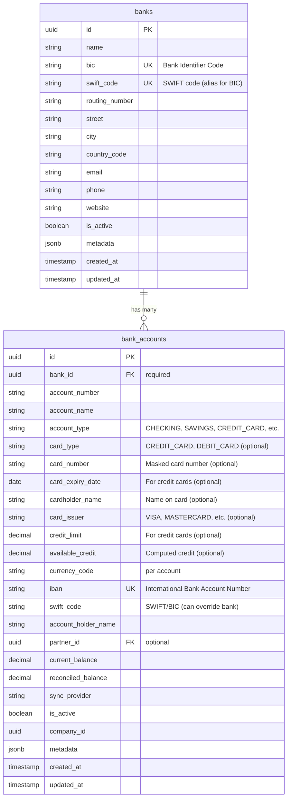
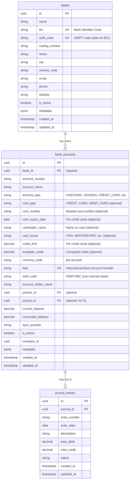

# Bank Account Management Improvement PRD

## Executive Summary

The current bank account design in RERP limits users by storing bank information directly in the `bank_accounts` table. This prevents:
- Creating a master list of banks
- Having multiple accounts per bank with different currencies
- Reusing bank information across accounts
- Proper normalization of bank data

This PRD proposes a fresh implementation based on Odoo's proven architecture, introducing a separate `banks` table and improving the `bank_accounts` table structure. Since RERP is in early stage development, this is a fresh implementation with no migration concerns.

## Current Design Analysis

### Current Structure

**Table: `bank_accounts`**
```sql
CREATE TABLE bank_accounts (
    id UUID PRIMARY KEY,
    account_number VARCHAR(100) UNIQUE,
    account_name VARCHAR(100),
    bank_code VARCHAR(50),           -- Optional, stored per account
    bank_name VARCHAR(255),          -- Optional, stored per account
    account_type VARCHAR(50),
    currency_code VARCHAR(3),
    current_balance NUMERIC(19, 4),
    -- ... other fields
);
```

### Current Limitations

1. **No Bank Master Data**: Bank information (`bank_name`, `bank_code`) is stored redundantly in each account record
2. **No Bank Reusability**: Cannot create a bank once and reuse it across multiple accounts
3. **Limited Multi-Account Support**: While technically possible, the design doesn't encourage or support multiple accounts per bank
4. **Data Inconsistency Risk**: Same bank may be entered with different names/codes across accounts
5. **No Bank Details**: Missing bank address, contact information, BIC/SWIFT codes, etc.

### User Impact

**Example Scenario:**
- User has accounts at Chase Bank:
  - Checking account (USD)
  - Savings account (USD)
  - Business account (EUR)
- User also has accounts at Bank of America:
  - Personal checking (USD)
  - Business checking (USD)

**Current Design Issues:**
- Must enter "Chase Bank" and bank code 3 times (once per account)
- No way to ensure consistency of bank information
- Cannot easily query "all accounts at Chase Bank"
- Cannot maintain bank contact information separately

## Odoo Design Analysis

Odoo uses a two-table approach:

### 1. `res.bank` (Banks Master Table)

```python
class ResBank(models.Model):
    _name = 'res.bank'
    
    name = fields.Char(required=True)           # Bank name
    bic = fields.Char('Bank Identifier Code')    # BIC/SWIFT code
    street = fields.Char()                      # Address
    street2 = fields.Char()
    zip = fields.Char()
    city = fields.Char()
    state = fields.Many2one('res.country.state')
    country = fields.Many2one('res.country')
    email = fields.Char()
    phone = fields.Char()
    active = fields.Boolean(default=True)
```

**Key Features:**
- Master list of banks
- Complete address and contact information
- BIC/SWIFT code for international transfers
- Can be shared across all accounts

### 2. `res.partner.bank` (Bank Accounts Table)

```python
class ResPartnerBank(models.Model):
    _name = 'res.partner.bank'
    
    bank_id = fields.Many2one('res.bank')       # Foreign key to bank
    acc_number = fields.Char(required=True)      # Account number
    acc_holder_name = fields.Char()              # Account holder
    partner_id = fields.Many2one('res.partner')  # Account owner
    currency_id = fields.Many2one('res.currency') # Currency per account
    journal_id = fields.One2many('account.journal') # Accounting journal
    active = fields.Boolean(default=True)
```

**Key Features:**
- Foreign key to `res.bank` (not storing bank name/code directly)
- Each account can have its own currency
- Multiple accounts per bank supported
- Links to accounting journals
- Account holder information

### 3. Relationship Diagram



## Proposed Design

### 1. New Table: `banks`

**Purpose**: Master list of banks with complete information

```sql
CREATE TABLE banks (
    id UUID PRIMARY KEY DEFAULT gen_random_uuid(),
    
    -- Bank identification
    name VARCHAR(255) NOT NULL,
    bic VARCHAR(11),                    -- Bank Identifier Code (SWIFT/BIC - same thing)
    swift_code VARCHAR(11),            -- SWIFT code (alias for BIC, for clarity)
    routing_number VARCHAR(50),        -- US routing number, etc.
    
    -- Address information
    street VARCHAR(255),
    street2 VARCHAR(255),
    city VARCHAR(100),
    state VARCHAR(100),
    zip VARCHAR(20),
    country_code VARCHAR(3),            -- ISO country code
    
    -- Contact information
    email VARCHAR(255),
    phone VARCHAR(50),
    website VARCHAR(255),
    
    -- Status
    is_active BOOLEAN NOT NULL DEFAULT true,
    
    -- Metadata
    metadata JSONB,
    
    -- Audit
    created_at TIMESTAMP NOT NULL DEFAULT CURRENT_TIMESTAMP,
    updated_at TIMESTAMP NOT NULL DEFAULT CURRENT_TIMESTAMP,
    created_by UUID,
    updated_by UUID
);

CREATE UNIQUE INDEX idx_banks_bic ON banks(bic) WHERE bic IS NOT NULL;
CREATE UNIQUE INDEX idx_banks_swift_code ON banks(swift_code) WHERE swift_code IS NOT NULL;
CREATE INDEX idx_banks_name ON banks(name);
CREATE INDEX idx_banks_country_code ON banks(country_code);
CREATE INDEX idx_banks_is_active ON banks(is_active);
COMMENT ON TABLE banks IS 'Master list of banks';
COMMENT ON COLUMN banks.bic IS 'Bank Identifier Code (BIC) - same as SWIFT code';
COMMENT ON COLUMN banks.swift_code IS 'SWIFT code (alias for BIC, for clarity and international standards)';
```

**Key Features:**
- Complete bank information in one place
- BIC/SWIFT code for international transfers
- Address and contact information
- Reusable across all accounts

### 2. Updated Table: `bank_accounts`

**Changes**: Add foreign key to `banks`, remove redundant bank fields

```sql
CREATE TABLE bank_accounts (
    id UUID PRIMARY KEY DEFAULT gen_random_uuid(),
    
    -- Bank reference (REQUIRED)
    bank_id UUID NOT NULL REFERENCES banks(id) ON DELETE RESTRICT,
    
    -- Account identification
    account_number VARCHAR(100) NOT NULL,
    account_name VARCHAR(100) NOT NULL,
    account_type VARCHAR(50) NOT NULL,  -- CHECKING, SAVINGS, MONEY_MARKET, CREDIT_CARD, DEBIT_CARD, etc.
    
    -- Card information (for credit/debit cards)
    card_number VARCHAR(20),            -- Masked card number (last 4 digits, encrypted)
    card_type VARCHAR(20),              -- CREDIT_CARD, DEBIT_CARD, PREPAID_CARD, BANK_ACCOUNT
    card_expiry_date DATE,              -- Expiry date for credit cards
    cardholder_name VARCHAR(255),       -- Name on card
    card_issuer VARCHAR(50),            -- VISA, MASTERCARD, AMEX, DISCOVER, etc.
    credit_limit NUMERIC(19, 4),        -- Credit limit for credit cards
    available_credit NUMERIC(19, 4),    -- Available credit (computed: credit_limit - current_balance)
    
    -- Currency (per account - allows multi-currency per bank)
    currency_code VARCHAR(3) NOT NULL DEFAULT 'USD',
    
    -- International banking identifiers
    iban VARCHAR(34),                   -- International Bank Account Number (IBAN)
    swift_code VARCHAR(11),            -- SWIFT/BIC code (can override bank's default)
    
    -- Account holder (if different from company)
    account_holder_name VARCHAR(255),
    partner_id UUID,                     -- Optional: link to partner/customer/vendor
    
    -- Balance tracking
    current_balance NUMERIC(19, 4) NOT NULL DEFAULT 0,
    reconciled_balance NUMERIC(19, 4) NOT NULL DEFAULT 0,
    last_reconciled_at TIMESTAMP,
    
    -- Synchronization
    sync_provider VARCHAR(50),
    sync_credentials VARCHAR(255),      -- Encrypted
    last_synced_at TIMESTAMP,
    
    -- Status
    is_active BOOLEAN NOT NULL DEFAULT true,
    
    -- Multi-company
    company_id UUID,
    
    -- Metadata
    metadata JSONB,
    
    -- Audit
    created_at TIMESTAMP NOT NULL DEFAULT CURRENT_TIMESTAMP,
    updated_at TIMESTAMP NOT NULL DEFAULT CURRENT_TIMESTAMP,
    created_by UUID,
    updated_by UUID
);

-- Remove unique constraint on account_number alone
-- Add composite unique constraint: (bank_id, account_number) per company
CREATE UNIQUE INDEX idx_bank_accounts_bank_account_number_company 
    ON bank_accounts(bank_id, account_number, company_id) 
    WHERE company_id IS NOT NULL;
    
CREATE UNIQUE INDEX idx_bank_accounts_bank_account_number 
    ON bank_accounts(bank_id, account_number) 
    WHERE company_id IS NULL;

CREATE INDEX idx_bank_accounts_bank_id ON bank_accounts(bank_id);
CREATE INDEX idx_bank_accounts_account_number ON bank_accounts(account_number);
CREATE INDEX idx_bank_accounts_company_id ON bank_accounts(company_id);
CREATE INDEX idx_bank_accounts_currency_code ON bank_accounts(currency_code);
CREATE INDEX idx_bank_accounts_account_type ON bank_accounts(account_type);
CREATE INDEX idx_bank_accounts_card_type ON bank_accounts(card_type) WHERE card_type IS NOT NULL;
CREATE UNIQUE INDEX idx_bank_accounts_iban ON bank_accounts(iban) WHERE iban IS NOT NULL;
CREATE INDEX idx_bank_accounts_swift_code ON bank_accounts(swift_code) WHERE swift_code IS NOT NULL;
COMMENT ON TABLE bank_accounts IS 'Bank accounts and credit/debit cards linked to banks master table';
COMMENT ON COLUMN bank_accounts.account_type IS 'Account type: CHECKING, SAVINGS, MONEY_MARKET, CREDIT_CARD, DEBIT_CARD, etc.';
COMMENT ON COLUMN bank_accounts.card_type IS 'Card type: CREDIT_CARD, DEBIT_CARD, PREPAID_CARD, or NULL for bank accounts';
COMMENT ON COLUMN bank_accounts.iban IS 'International Bank Account Number (IBAN) for international transfers';
COMMENT ON COLUMN bank_accounts.swift_code IS 'SWIFT/BIC code (can override bank default if account has different SWIFT)';
COMMENT ON COLUMN bank_accounts.credit_limit IS 'Credit limit for credit cards (NULL for bank accounts)';
COMMENT ON COLUMN bank_accounts.available_credit IS 'Available credit for credit cards (computed: credit_limit - current_balance)';
```

**Key Changes:**
- ✅ `bank_id` (FK to `banks`) - **REQUIRED**, replaces `bank_name` and `bank_code`
- ✅ `currency_code` - Per account (allows multiple currencies per bank)
- ✅ Composite unique constraint: `(bank_id, account_number, company_id)` - allows same account number at different banks
- ✅ `account_holder_name` - For accounts held by partners/customers/vendors
- ✅ `partner_id` - Optional link to partner entity

### 3. Entity Changes

**New Entity: `Bank`**
```rust
// entities/src/accounting/bank_sync/bank.rs
#[derive(LifeModel)]
#[table_name = "banks"]
pub struct Bank {
    #[primary_key]
    pub id: uuid::Uuid,
    
    #[unique]
    #[indexed]
    #[column_type = "VARCHAR(255)"]
    pub name: String,
    
    #[unique]
    #[indexed]
    #[column_type = "VARCHAR(11)"]
    pub bic: Option<String>,  // Bank Identifier Code (BIC) - same as SWIFT
    
    #[unique]
    #[indexed]
    #[column_type = "VARCHAR(11)"]
    pub swift_code: Option<String>,  // SWIFT code (alias for BIC, for clarity)
    
    #[column_type = "VARCHAR(50)"]
    pub routing_number: Option<String>,
    
    // Address fields...
    pub street: Option<String>,
    pub city: Option<String>,
    pub country_code: Option<String>,
    
    // Contact fields...
    pub email: Option<String>,
    pub phone: Option<String>,
    
    #[default_value = "true"]
    pub is_active: bool,
    
    // ... audit fields
}
```

**Updated Entity: `BankAccount`**
```rust
// entities/src/accounting/bank_sync/bank_account.rs
#[derive(LifeModel)]
#[table_name = "bank_accounts"]
pub struct BankAccount {
    #[primary_key]
    pub id: uuid::Uuid,
    
    // Bank reference (REQUIRED)
    #[foreign_key = "banks(id) ON DELETE RESTRICT"]
    #[indexed]
    pub bank_id: uuid::Uuid,  // Changed from Option<String> bank_name
    
    #[indexed]
    #[column_type = "VARCHAR(100)"]
    pub account_number: String,
    
    #[column_type = "VARCHAR(100)"]
    pub account_name: String,
    
    #[column_type = "VARCHAR(50)"]
    pub account_type: String,  // CHECKING, SAVINGS, CREDIT_CARD, DEBIT_CARD, etc.
    
    // Card information (for credit/debit cards)
    #[indexed]
    #[column_type = "VARCHAR(20)"]
    pub card_number: Option<String>,  // Masked card number (encrypted)
    
    #[indexed]
    #[column_type = "VARCHAR(20)"]
    pub card_type: Option<String>,  // CREDIT_CARD, DEBIT_CARD, PREPAID_CARD
    
    pub card_expiry_date: Option<chrono::NaiveDate>,
    
    #[column_type = "VARCHAR(255)"]
    pub cardholder_name: Option<String>,
    
    #[column_type = "VARCHAR(50)"]
    pub card_issuer: Option<String>,  // VISA, MASTERCARD, AMEX, etc.
    
    #[column_type = "NUMERIC(19, 4)"]
    pub credit_limit: Option<rust_decimal::Decimal>,  // For credit cards
    
    #[column_type = "NUMERIC(19, 4)"]
    pub available_credit: Option<rust_decimal::Decimal>,  // Computed: credit_limit - current_balance
    
    // Currency per account
    #[default_value = "'USD'"]
    #[indexed]
    #[column_type = "VARCHAR(3)"]
    pub currency_code: String,
    
    // International banking identifiers
    #[unique]
    #[indexed]
    #[column_type = "VARCHAR(34)"]
    pub iban: Option<String>,  // International Bank Account Number (IBAN)
    
    #[indexed]
    #[column_type = "VARCHAR(11)"]
    pub swift_code: Option<String>,  // SWIFT/BIC (can override bank default)
    
    // Account holder
    #[column_type = "VARCHAR(255)"]
    pub account_holder_name: Option<String>,
    
    pub partner_id: Option<uuid::Uuid>,  // Optional link to partner
    
    // ... rest of fields unchanged
}
```

### 5. OpenAPI Schema Changes

**New Schema: `Bank`**
```yaml
components:
  schemas:
    Bank:
      type: object
      required:
        - id
        - name
      properties:
        id:
          type: string
          format: uuid
        name:
          type: string
          maxLength: 255
        bic:
          type: string
          maxLength: 11
          description: Bank Identifier Code (BIC) - same as SWIFT code
        swift_code:
          type: string
          maxLength: 11
          description: SWIFT code (alias for BIC, for clarity and international standards)
        routing_number:
          type: string
          maxLength: 50
        street:
          type: string
        city:
          type: string
        country_code:
          type: string
          maxLength: 3
        email:
          type: string
        phone:
          type: string
        is_active:
          type: boolean
```

**Updated Schema: `BankAccount`**
```yaml
components:
  schemas:
    BankAccount:
      type: object
      required:
        - id
        - bank_id
        - account_number
        - account_name
        - account_type
        - currency_code
      properties:
        id:
          type: string
          format: uuid
        bank_id:
          type: string
          format: uuid
          description: Reference to banks table
        account_number:
          type: string
          maxLength: 100
        account_name:
          type: string
          maxLength: 100
        account_type:
          type: string
          enum: [CHECKING, SAVINGS, MONEY_MARKET, CERTIFICATE_OF_DEPOSIT, CREDIT_CARD, DEBIT_CARD, PREPAID_CARD, OTHER]
          description: Account type - CREDIT_CARD and DEBIT_CARD for card accounts
        card_type:
          type: string
          enum: [CREDIT_CARD, DEBIT_CARD, PREPAID_CARD, BANK_ACCOUNT]
          nullable: true
          description: Card type (NULL for regular bank accounts)
        card_number:
          type: string
          maxLength: 20
          nullable: true
          description: Masked card number (last 4 digits only, encrypted)
        card_expiry_date:
          type: string
          format: date
          nullable: true
          description: Expiry date for credit cards
        cardholder_name:
          type: string
          maxLength: 255
          nullable: true
          description: Name on card
        card_issuer:
          type: string
          enum: [VISA, MASTERCARD, AMEX, DISCOVER, OTHER]
          nullable: true
          description: Card issuer network
        credit_limit:
          type: number
          nullable: true
          description: Credit limit for credit cards
        available_credit:
          type: number
          nullable: true
          description: Available credit (computed: credit_limit - current_balance)
        currency_code:
          type: string
          maxLength: 3
        iban:
          type: string
          maxLength: 34
          description: International Bank Account Number (IBAN) for international transfers
        swift_code:
          type: string
          maxLength: 11
          description: SWIFT/BIC code (can override bank default if account has different SWIFT)
        account_holder_name:
          type: string
          maxLength: 255
        partner_id:
          type: string
          format: uuid
          nullable: true
        # ... rest unchanged
```

### 6. New API Endpoints

**Banks Management:**
- `GET /banks` - List all banks
- `POST /banks` - Create a new bank
- `GET /banks/{id}` - Get bank details
- `PUT /banks/{id}` - Update bank
- `DELETE /banks/{id}` - Archive bank (soft delete)

**Bank Accounts (Updated):**
- All existing endpoints remain
- `POST /bank-accounts` now requires `bank_id` instead of `bank_name`/`bank_code`
- `GET /bank-accounts?bank_id={id}` - Filter accounts by bank

## Benefits

### 1. Data Normalization
- ✅ Bank information stored once
- ✅ Consistent bank names and codes
- ✅ Reduced data redundancy

### 2. Multi-Account Support
- ✅ Multiple accounts per bank
- ✅ Each account can have different currency
- ✅ Easy querying: "all accounts at Chase Bank"

### 3. Better User Experience
- ✅ Create bank once, reuse for all accounts
- ✅ Bank autocomplete when creating accounts
- ✅ Bank master data management

### 4. International Support
- ✅ BIC/SWIFT codes for international transfers
- ✅ Country-specific routing numbers
- ✅ Multi-currency per bank

### 5. Data Integrity
- ✅ Foreign key constraints ensure bank exists
- ✅ Composite unique constraints prevent duplicate accounts
- ✅ Cascade rules protect data consistency

## Implementation Considerations

### 1. Default Banks
- Provide initial seed data for common banks (Chase, Bank of America, etc.)
- Allow users to add custom banks

### 2. Bank Lookup
- Consider integration with bank directory APIs
- Auto-populate bank details from BIC/routing number

### 3. Account Number Uniqueness
- New design: `(bank_id, account_number, company_id)` unique
- Allows same account number at different banks

### 4. Partner Integration
- `partner_id` allows linking accounts to customers/vendors
- Enables vendor payment account management
- Customer bank account for AR payments

## Implementation Path

### Step 1: Create `banks` table
- Create new `banks` table with all required fields
- Add indexes and constraints
- Create API endpoints for banks management

### Step 2: Create `bank_accounts` table
- Create `bank_accounts` table with `bank_id` foreign key
- Include all card-related fields
- Add composite unique constraints
- Create API endpoints for bank accounts

### Step 3: Update entities and OpenAPI
- Create `Bank` entity
- Update `BankAccount` entity
- Update OpenAPI schemas
- Update API endpoints

## Success Criteria

1. ✅ Users can create banks independently of accounts
2. ✅ Multiple accounts per bank with different currencies
3. ✅ Bank information is consistent across accounts
4. ✅ Easy querying: "show all accounts at Bank X"
5. ✅ Credit cards and debit cards properly supported
6. ✅ Chart of accounts integration for credit card liabilities
7. ✅ PCI DSS compliance considerations addressed

## Credit Card and Bank Card Considerations

### Chart of Accounts Integration

**Credit Cards as Liabilities**:
- Credit cards should be tracked as **liability accounts** in the chart of accounts
- Account type: `liability_credit_card` (not `asset_cash` like bank accounts)
- Credit card balances represent money **owed** to the card issuer
- Credit card transactions increase the liability (when spending)
- Credit card payments decrease the liability (when paying the bill)

**Debit Cards**:
- Debit cards are linked to checking accounts (asset accounts)
- No separate liability account needed
- Transactions directly affect the linked bank account balance

**Journal Entry Pattern**:
```
Credit Card Purchase:
  Debit: Expense Account (e.g., Office Supplies)
  Credit: Credit Card Liability Account

Credit Card Payment:
  Debit: Credit Card Liability Account
  Credit: Bank Account (checking account used to pay)
```

### Security Considerations

**Card Number Storage**:
- Store only last 4 digits in plain text (for display)
- Full card number should be encrypted or tokenized
- PCI DSS compliance required for full card number storage
- Consider using payment tokenization services

**Card Expiry**:
- Track expiry dates for credit cards
- Alert users when cards are expiring
- Prevent transactions on expired cards

### Online Synchronization

**Credit Card Sync**:
- Credit cards can be synchronized online (same as bank accounts)
- Sync provider must support credit card APIs
- Balance represents outstanding balance (liability)
- Available credit = credit_limit - current_balance

## Open Questions

1. **Bank Initialization**: Should we seed common banks, or require users to create them?
2. **Account Number Format**: Should we validate account number format per bank/country?
3. **Bank Directory**: Should we integrate with external bank directory services?
4. **Soft Delete**: Should banks be soft-deleted (archived) or hard-deleted?
5. **Multi-Company Banks**: Can banks be shared across companies, or company-specific?
6. **Card Security**: Should we store full card numbers (encrypted) or only tokens?
7. **PCI Compliance**: Do we need full PCI DSS compliance, or use tokenization services?
8. **Credit Card Accounts**: Should credit cards have separate account type in chart of accounts, or use existing liability accounts?
9. **Debit Card Handling**: Should debit cards be separate entities or just a flag on bank accounts?
10. **Card Expiry Management**: Should we auto-archive expired cards or keep them for historical records?

## Additional Enterprise Features (Odoo Enterprise Analysis)

### 1. Accounting Journal Integration

**Key Finding**: Bank accounts are linked to accounting journals via bidirectional relationship:

- `res.partner.bank` → `account.journal` (One2many via `journal_id`)
- `account.journal` → `res.partner.bank` (Many2one via `bank_account_id`)

**From Odoo Source** (`account/models/account_journal.py`):
```python
bank_account_id = fields.Many2one('res.partner.bank',
    string="Bank Account",
    ondelete='restrict', copy=False,
    index='btree_not_null',
    check_company=True,
    domain="[('partner_id','=', company_partner_id)]")
bank_id = fields.Many2one('res.bank', related='bank_account_id.bank_id', readonly=False)
```

**Implication for RERP**: 
- Bank accounts should optionally link to accounting journals (General Ledger)
- This enables bank reconciliation and automatic journal entry creation
- Consider adding `journal_id` field to `bank_accounts` table (optional FK to `journal_entries` or similar)

### 2. Online Bank Synchronization

**Enterprise Module**: `account_online_synchronization`

**Key Features**:
- Online bank account linking via `account.online.account` and `account.online.link`
- Automatic transaction import from bank APIs
- Bank statement auto-generation from imported transactions
- Support for multiple bank API providers

**Implication for RERP**:
- Current `sync_provider` and `sync_credentials` fields are on the right track
- May need additional fields for online sync status, last sync date, sync errors
- Consider separate `bank_sync_connections` table for managing API credentials separately from accounts

### 3. Payment Mandate Constraints

**Enterprise Modules**: 
- `account_sepa_direct_debit` - SEPA Direct Debit mandates
- `l10n_uk_bacs` - BACS Direct Debit Instructions

**Key Finding**: Bank accounts cannot be deleted if linked to active payment mandates:
```python
@api.ondelete(at_uninstall=False)
def _unlink_except_linked_to_mandate(self):
    if self.env['sdd.mandate'].search_count([('partner_bank_id', 'in', self.ids), ('state', '=', 'active')], limit=1):
        raise UserError(_('You cannot delete a bank account linked to an active SEPA Direct Debit mandate.'))
```

**Implication for RERP**:
- Add soft delete (archive) instead of hard delete for bank accounts
- Check for active payment mandates/instructions before allowing deletion
- Consider `is_active` flag (already present) for soft delete

### 4. Bank Account Validation and Security

**Key Features from Odoo**:
- `allow_out_payment` - Trust flag for outgoing payments (prevents fraud)
- `sanitized_acc_number` - Normalized account number for duplicate detection
- IBAN validation and warnings
- Account holder verification

**Implication for RERP**:
- Consider adding `allow_outgoing_payments` boolean field
- Add `sanitized_account_number` for duplicate detection
- Add validation for IBAN format when applicable
- Add account holder verification workflow

### 5. Multi-Currency Per Account

**Confirmed**: Each `res.partner.bank` has its own `currency_id`, allowing:
- Multiple accounts at same bank with different currencies
- USD account and EUR account at Chase Bank
- Proper currency handling per account

**Already in PRD**: ✅ Covered in proposed design

### 6. Credit Card and Bank Card Handling

**Key Finding**: Odoo treats credit cards as a separate journal type with specific accounting treatment:

**From Odoo Source** (`account/models/account_journal.py`):
```python
type = fields.Selection([
    ('sale', 'Sales'),
    ('purchase', 'Purchase'),
    ('cash', 'Cash'),
    ('bank', 'Bank'),
    ('credit', 'Credit Card'),  # Separate journal type for credit cards
    ('general', 'Miscellaneous'),
], required=True)
```

**Credit Card Journal Characteristics**:
- **Journal Type**: `'credit'` - Separate from bank journals
- **Account Type**: Uses `'liability_credit_card'` account type in chart of accounts
- **Bank Account Link**: Can link to `bank_account_id` (the issuing bank's account)
- **Default Account Domain**: Credit card journals can use `'liability_credit_card'` or `'asset_cash'` account types
- **Online Synchronization**: Credit cards can be synchronized online (same as bank accounts)
- **Payment Methods**: Treated similarly to bank/cash journals for payment method configuration

**From Odoo Source** (`account_online_synchronization/models/account_online.py`):
```python
journal_ids = fields.One2many('account.journal', 'account_online_account_id', 
    string='Journal', 
    domain="[('type', 'in', ('bank', 'credit')), ('company_id', '=', company_id)]")
```

**Chart of Accounts Integration**:
- Credit cards appear as **liability accounts** (`liability_credit_card`)
- Credit card balances are tracked as liabilities (money owed to card issuer)
- Credit card transactions create journal entries with credit card account as one side
- Credit cards can be reconciled similar to bank accounts

**Implication for RERP**:
- Consider adding `account_type` field to `bank_accounts` to distinguish:
  - `CHECKING`, `SAVINGS` - Bank accounts (asset accounts)
  - `CREDIT_CARD` - Credit cards (liability accounts)
  - `DEBIT_CARD` - Debit cards (linked to checking account)
- Credit cards should link to the **issuing bank** via `bank_id`
- Credit cards may need separate handling in chart of accounts (liability vs asset)
- Credit card accounts should support online synchronization
- Consider `card_number` field for credit/debit card numbers (masked for security)
- Consider `card_type` field: `CREDIT_CARD`, `DEBIT_CARD`, `PREPAID_CARD`
- Consider `expiry_date` for credit cards
- Consider `cardholder_name` for credit cards

## Updated Design Considerations

### Additional Fields to Consider

**For `banks` table:**
- `logo_url` - Bank logo for UI display
- `website` - Bank website URL (already included)
- `bic` - Bank Identifier Code (BIC) - same as SWIFT code
- `swift_code` - SWIFT code (alias for BIC, for clarity and international standards)

**For `bank_accounts` table:**
- `journal_id` - Optional FK to accounting journal (for GL integration)
- `allow_outgoing_payments` - Trust flag for fraud prevention
- `sanitized_account_number` - Normalized account number (computed field)
- `account_holder_name` - Name on account (if different from company) (already included)
- `iban` - International Bank Account Number (IBAN) for international transfers (already included)
- `swift_code` - SWIFT/BIC code (can override bank default if account has different SWIFT) (already included)
- `online_sync_enabled` - Whether online sync is enabled
- `online_sync_last_error` - Last sync error message
- `mandate_count` - Count of active payment mandates (computed)
- **Credit/Debit Card Fields**:
  - `card_number` - Masked card number (last 4 digits only, encrypted)
  - `card_type` - `CREDIT_CARD`, `DEBIT_CARD`, `PREPAID_CARD`, `BANK_ACCOUNT`
  - `card_expiry_date` - Expiry date for credit cards
  - `cardholder_name` - Name on card (if different from account holder)
  - `card_issuer` - Card issuer (Visa, Mastercard, Amex, etc.)
  - `credit_limit` - Credit limit for credit cards
  - `available_credit` - Available credit (computed: credit_limit - current_balance)

### Relationship Diagram (Updated)



## References

- Odoo Base: `~/Workspace/caffeinated.expert/odooforks/odoo/odoo/addons/base/models/res_bank.py`
- Odoo Account: `~/Workspace/caffeinated.expert/odooforks/odoo/addons/account/models/res_partner_bank.py`
- Odoo Account Journal: `~/Workspace/caffeinated.expert/odooforks/odoo/addons/account/models/account_journal.py`
- Odoo Enterprise Online Sync: `~/Workspace/caffeinated.expert/odooforks/enterprise/account_online_synchronization/models/account_bank_statement.py`
- Odoo Enterprise SEPA: `~/Workspace/caffeinated.expert/odooforks/enterprise/account_sepa_direct_debit/models/res_partner_bank.py`
- Current RERP Entity: `entities/src/accounting/bank_sync/bank_account.rs`
- Current RERP OpenAPI: `openapi/accounting/bank-sync/openapi.yaml`

## Next Steps

1. Review this PRD with stakeholders
2. Design bank seed data (if applicable)
3. Create entity definitions for `Bank` and updated `BankAccount`
4. Generate SQL migrations from entities using `lifeguard-migrate generate-from-entities`
5. Update OpenAPI specifications
6. Implement API endpoints for banks
7. Implement updated bank accounts API
8. Add comprehensive tests
9. Update documentation
10. Deploy and monitor

---

**Status**: Draft - Awaiting Review  
**Created**: 2026-01-22  
**Author**: AI Assistant  
**Review Required**: Yes
