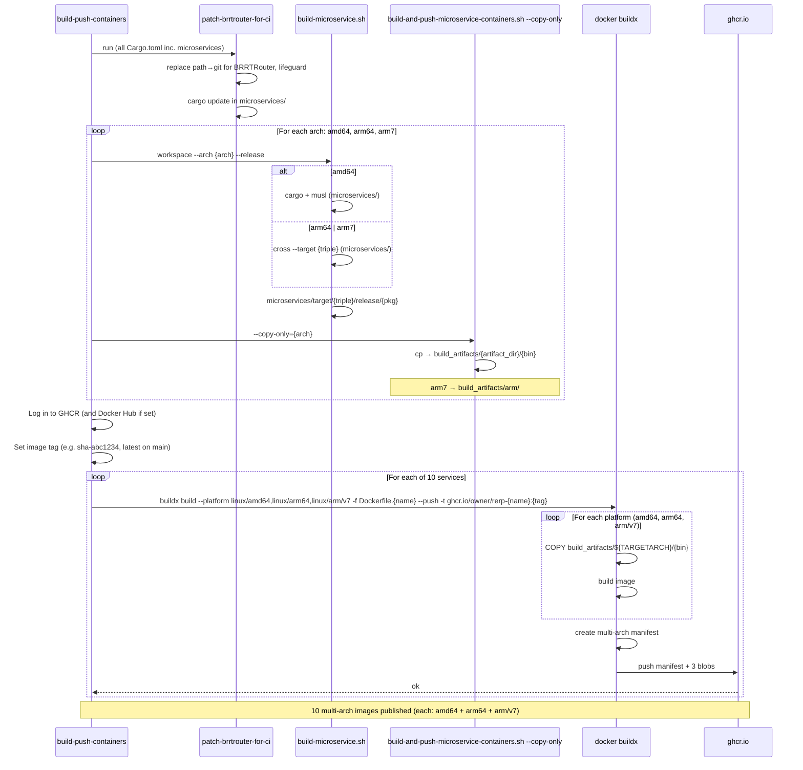
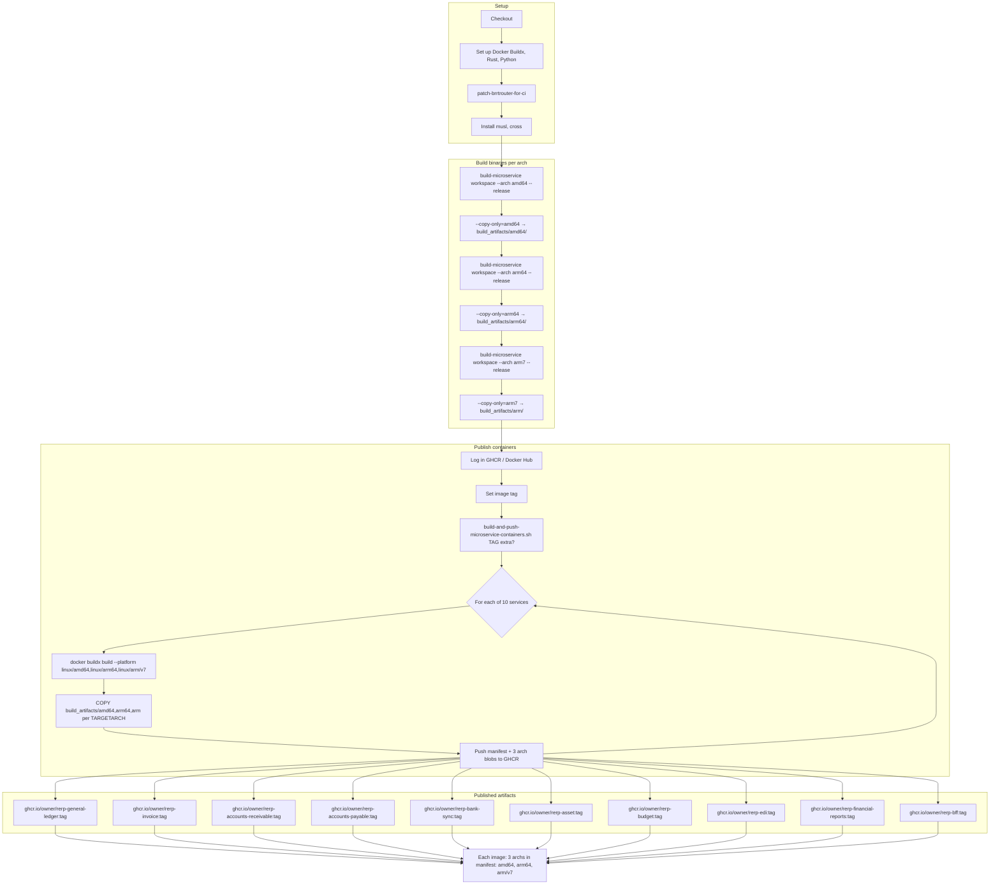

# Container Release Design: Analysis and Proposal

**Goal:** Publish one container image per accounting service, per architecture (amd64, arm64, arm/v7), to validate the end-to-end release process.

---

## 1. Analysis: Current Workflow and Scripts

### 1.1 build-push-containers Job (CI)

| Step | What it does |
|------|--------------|
| Checkout, Docker Buildx, Rust, Python | Setup |
| **patch-brrtrouter-for-ci** | Replaces `path = "../../BRRTRouter"` and `path = "../../lifeguard"` with `git = "https://github.com/microscaler/..."` in **all** Cargo.toml (including `microservices/`). Runs `cargo update` in `microservices/` if any were patched. |
| Install musl, cross | For amd64 (musl-gcc) and arm64/arm7 (cross) |
| **Build amd64** | `build-microservice.sh workspace --arch amd64 --release` → `microservices/target/x86_64-unknown-linux-musl/release/{pkg}` |
| **--copy-only=amd64** | Copies 10 binaries into `build_artifacts/amd64/{bin}` |
| **Build arm64** | `build-microservice.sh workspace --arch arm64 --release` → `microservices/target/aarch64-unknown-linux-musl/release/{pkg}` |
| **--copy-only=arm64** | Copies into `build_artifacts/arm64/` |
| **Build arm7** | `build-microservice.sh workspace --arch arm7 --release` → `microservices/target/armv7-unknown-linux-musleabihf/release/{pkg}` |
| **--copy-only=arm7** | Copies into `build_artifacts/arm/` (Docker TARGETARCH for arm/v7 is `arm`) |
| Log in to GHCR (and optionally Docker Hub) | |
| Set image tag | `sha-{short}` or `v*` from tag; `latest` on main |
| **Build and push microservice images** | `build-and-push-microservice-containers.sh TAG [extra]` |

### 1.2 build-and-push-microservice-containers.sh

- **--copy-only=ARCH:** Reads from `microservices/target/{rust_triple}/release/{pkg}`, writes to `build_artifacts/{artifact_dir}/{bin}`. `artifact_dir`: amd64→amd64, arm64→arm64, arm7→**arm**.
- **Build-and-push (no --copy-only):** For each of 10 **SERVICES**, runs:
  - `docker buildx build --platform linux/amd64,linux/arm64,linux/arm/v7 -f docker/microservices/Dockerfile.{name} --push -t ghcr.io/{owner}/rerp-{name}:{TAG} [ -t ...:extra ] .`
- Each service produces **one multi-arch manifest** ( OCI index ) with 3 blobs: amd64, arm64, arm/v7. So we get **10 images**, each resolving to the correct arch on `docker pull`.

### 1.3 build-microservice.sh

- **workspace --arch amd64|arm64|arm7 --release:** Builds `microservices/` via `cargo` (amd64) or `cross` (arm64/arm7). Output: `microservices/target/{triple}/release/{package_name}`.
- **run_accounting_gen_if_missing:** Only runs if `microservices/accounting/general-ledger/Cargo.toml` is missing. Uses `../BRRTRouter/target/debug/brrtrouter-gen` or `cargo run --manifest-path ../BRRTRouter/Cargo.toml --bin brrtrouter-gen`. **In CI there is no ../BRRTRouter**; we rely on accounting crates being checked in.

### 1.4 Dockerfiles

- `ARG TARGETARCH=amd64`; `COPY ./build_artifacts/${TARGETARCH}/{binary} /app/{binary}`. buildx sets `TARGETARCH` to `amd64`|`arm64`|`arm` per platform.

### 1.5 Services and Binary Mapping

| Service (SERVICES) | Cargo package (PKG) | Artifact name (BIN) / Dockerfile COPY |
|-------------------|---------------------|---------------------------------------|
| general-ledger | general_ledger | general_ledger |
| invoice | invoice_management | invoice |
| accounts-receivable | accounts_receivable | accounts_receivable |
| accounts-payable | accounts_payable | accounts_payable |
| bank-sync | bank_synchronization | bank_sync |
| asset | asset_management | asset |
| budget | budgeting | budget |
| edi | edi___compliance | edi |
| financial-reports | financial_reports | financial_reports |
| bff | rerp_accounting_backend_for_frontend_api | bff |

---

## 2. What Is Wrong or Missing

### 2.1 Design intent vs actual output

- **Intent:** One published container per accounting service, per arch.
- **Current design:** One **multi-arch image** per service (each with amd64, arm64, arm/v7 in a single manifest). So we have **10 publishable images**, each containing 3 archs. That does satisfy “each service, each arch” in the usual OCI sense (pull on arm64 gets arm64, etc.).
- **Gap (if you want 30 explicit tags):** If the goal is 30 separate tags, e.g. `rerp-general-ledger:tag-amd64`, `:tag-arm64`, `:tag-armv7`, the script does **not** do that. It produces 10 tags, each a manifest list.

### 2.2 No microservices build in build-and-test

- **build-and-test** builds **components** (`host-aware-build.py workspace`, `auth_idam`). It does **not** build **microservices**.
- **build-push-containers** is the first job that builds `microservices/`. If `build-microservice.sh` fails (deps, patch, cross, etc.), we only find out in that job.
- **Proposal:** Add a **smoke step** in `build-and-test`: e.g. `./scripts/build-microservice.sh workspace --arch amd64 --release` (or at least a `cargo check -p general_ledger` from `microservices/` after patch). That would also verify that `patch-brrtrouter-for-ci` works for `microservices/`.

### 2.3 build-multiarch is unrelated to containers

- **build-multiarch** builds **components** via `host-aware-build.py workspace {arch}` and uploads `components/target/*/release/rerp_*`. 
- **build-push-containers** uses **microservices** and `build-microservice.sh`. It does **not** use `build-multiarch` or its artifacts.
- So build-multiarch does not contribute to “container per service per arch”. The names are similar; the data flow is separate.

### 2.4 patch-brrtrouter-for-ci and microservices

- The patch **does** run over `microservices/**/Cargo.toml` and `microservices/Cargo.toml` (via `find_cargo_tomls()`). It replaces BRRTRouter and lifeguard path deps; `rerp_entities = { path = "../entities" }` is **not** patched. `entities/` is in-repo, so that’s fine.
- **run_accounting_gen_if_missing** needs `brrtrouter-gen` from `../BRRTRouter`. That is only used when accounting crates are missing. If they are checked in, we never run it in CI. No change needed for the “container per service per arch” path, but worth noting.

### 2.5 cross for arm64/arm7 and microservices

- **build-microservice.sh** uses `cross build --target … --workspace` for arm64 and arm7. `cross` runs in Docker; deps come from git (after patch). 
- If a microservice dep (e.g. native libs, `aws-lc`, OpenSSL) does not build in `cross`’s image, the job will fail. Not something we can see from static analysis; only from a run.

### 2.6 No post-push verification

- The job pushes and exits. There is no check that `ghcr.io/{owner}/rerp-{name}:{tag}` is actually pullable or has the expected platforms.
- **Proposal:** A follow-up step (or a separate “verify-containers” job) that for each service does e.g. `docker buildx imagetools inspect ghcr.io/{owner}/rerp-{name}:{tag}` and asserts `linux/amd64`, `linux/arm64`, `linux/arm/v7` are present. That would validate the end-to-end release for “each service, each arch”.

### 2.7 Log in to registry after builds

- Log in to GHCR happens **after** the three “build + --copy-only” steps. That is correct: we only need to be logged in for the `docker buildx build --push` step.

### 2.8 Order of operations: Set image tag

- “Set image tag” runs **after** “Log in to GHCR” and **before** “Build and push microservice images”. Order is fine. The tag step does not depend on the registry.

### 2.9 build-push-containers is gated (main / develop / tags; temporary: PR branch)

- **Condition in ci.yml:** `build-push-containers` runs when:
  - `github.event_name == 'push'` (not on `pull_request`), **and**
  - `github.ref` is `refs/heads/main`, `refs/heads/develop`, `refs/tags/v*`, **or** (temporarily) `refs/heads/boostrap-accounting-suit`, **and**
  - `needs.build-multiarch.result == 'success'`.
- **Planned change:** Direct pushes to `main` will be turned off; the only way to update `main` is **merge of a PR**. A merge to `main` is a `push` to `main`, so the existing `refs/heads/main` condition already covers “on merge of PR to main”. Once the container process is validated, **remove** `refs/heads/boostrap-accounting-suit` from the `if` so that builds run only on push to `main`, `develop`, or `v*` (i.e. merge to main, develop, or tags).
- **Temporary:** The branch `boostrap-accounting-suit` is included so that pushes to that PR branch produce containers while the base setup is being fixed. Remove it from the `if` when the process is known to work.

### 2.10 The multi-arch uploads (the "3 zips") are never used for containers

- **build-multiarch** uploads three artifacts: `rerp-binaries-amd64`, `rerp-binaries-arm64`, `rerp-binaries-arm7` (each from `components/target/*/release/rerp_*`). These are **component** binaries (e.g. `rerp_ai_core_impl`, `rerp_crm_core_impl`), not microservice binaries.
- **build-push-containers** does **not** call `download-artifact`. It **rebuilds** microservices from scratch (`build-microservice.sh` for amd64, arm64, arm7) and uses `--copy-only` into `build_artifacts/`. The design does not "take the zips, extract them and produce containers" — the zips are not consumed. Moreover, the zips contain **components**; the 10 accounting containers need **microservices** (`general_ledger`, `invoice`, etc.). You cannot produce those container images from the build-multiarch artifacts. To reuse multi-arch builds for containers would require building **microservices** in a matrix job, uploading those, and having a container job that downloads, lays them into `build_artifacts/`, and then runs only the Docker build/push.

---

## 3. Mermaid Sequence Diagram (Target Design)

---

## 4. Mermaid Flowchart (Target Design)

---

## 5. Design Improvements (Proposals, No Code Yet)

| # | Proposal | Rationale |
|---|----------|-----------|
| 1 | **Smoke-test microservices in build-and-test** | Run `./scripts/build-microservice.sh workspace --arch amd64 --release` (or `cargo build -p general_ledger --release` from `microservices/` after patch) in `build-and-test`. Ensures patch works for microservices and that we fail early if the workspace does not build. |
| 2 | **Verify published images (per service, per arch)** | After “Build and push microservice images”, add a step that for each service runs e.g. `docker buildx imagetools inspect ghcr.io/{owner}/rerp-{name}:{tag}` and checks that the manifest contains `linux/amd64`, `linux/arm64`, `linux/arm/v7`. Alternatively a small “verify-containers” job that `docker pull` or `crane manifest` each of the 10 images and asserts the expected platforms. |
| 3 | **Optional: 30 explicit tags** | If the requirement is 30 distinct tags (e.g. `:tag-amd64`, `:tag-arm64`, `:tag-armv7`) instead of 10 multi-arch manifests, extend `build-and-push-microservice-containers.sh` to build and push per-arch images with arch-specific tags, then optionally also create the multi-arch manifest for `:tag`. Current design already delivers “one container per service per arch” via multi-arch; this is only if you need explicit per-arch tags. |
| 4 | **Clarify build-multiarch vs build-push-containers** | In CI or docs, note that `build-multiarch` is for **components** (host-aware-build) and `build-push-containers` is for **microservices** (build-microservice). No change to “container per service per arch”, but avoids confusion. |

---

## 6. Expected Outcome After Changes

- **10 multi-arch images** (one per accounting service), each with **3 archs** (amd64, arm64, arm/v7) in the manifest.
- **build-and-test** includes a microservices build (or equivalent) so patch and basic compile are validated earlier.
- **Post-push verification** that each of the 10 images has the three expected platforms, validating the end-to-end release.

If you adopt **#3 (30 explicit tags)**, you would additionally have 30 tags for scriptable “one container per service per arch” in the tag name itself, on top of (or instead of) the multi-arch `:tag` manifest.
