# RERP Integration with OP, Builder, and Rust Buildpack

Design document for integrating the Octopilot buildpacks ecosystem (op, builder-jammy-base, ghcr.io/octopilot/rust) into RERP.

---

## Executive Summary

RERP currently uses **cargo/cross** for building Rust binaries and **rerp docker** for producing container images. The Octopilot ecosystem provides **op** (pipeline tools), **builder-jammy-base** (multi-language builder), and **ghcr.io/octopilot/rust** (Rust buildpack). This document analyses the current state and proposes a design for integrating both so RERP can:

1. **Optionally** use pack + Rust buildpack for image builds (CI and/or Tilt)
2. Use **op** for build-push and build_result.json when desired
3. Maintain compatibility with the existing cargo-based pipeline

---

## 1. Current State Overview

### 1.1 RERP Architecture

```
RERP/
├── microservices/           # Rust workspace
│   ├── Cargo.toml           # Workspace root with members
│   └── accounting/
│       ├── general-ledger/  # gen + impl
│       ├── invoice/
│       ├── accounts-receivable/
│       ├── ...
│       └── bff/
├── tooling/                 # rerp CLI (Python)
├── docker/
│   ├── base/                # rerp-base (Alpine)
│   └── microservices/
│       └── Dockerfile.template  # Rendered per service
├── helm/rerp-microservice/
├── Tiltfile
└── .github/workflows/
```

### 1.2 Current Build Flow (Cargo Path)

```mermaid
flowchart TB
    subgraph CI [CI Pipeline]
        CC[conventional commits]
        TV[tooling / validate-openapi / validate-ports]
        BAT[build-and-test]
        BM[build-multiarch]
        RBM[rerp build microservices arch --release]
        CDA[rerp docker copy-artifacts]
        BPS[build-push-service matrix]
    end

    subgraph Tilt [Tilt Per Service]
        BCS[build-service]
        CBS[copy-service]
        DIS[docker-service]
        CB[custom_build live_update]
        K8S[k8s_yaml helm]
    end

    CC --> TV --> BAT --> BM
    BM --> RBM
    RBM --> CDA
    CDA --> BPS

    BCS --> CBS --> DIS --> CB --> K8S
```

### 1.3 Current Tilt Flow (Sequence)

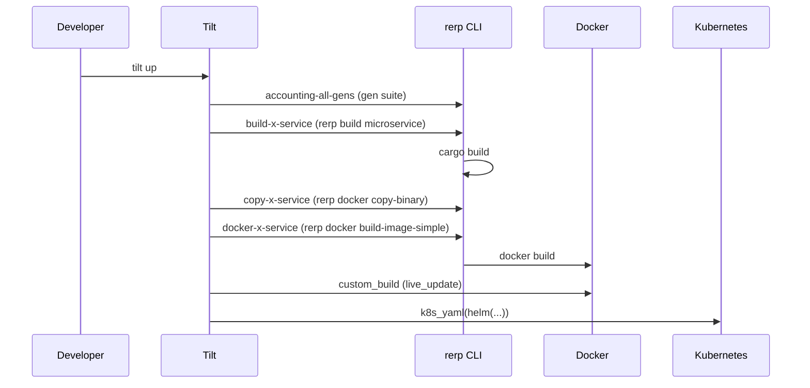

### 1.4 Octopilot Ecosystem (op, builder, rust buildpack)

| Component | Role |
|-----------|------|
| **op** (octopilot-pipeline-tools) | CLI: `op build`, `op push`, `op build-push`. Reads `skaffold.yaml`; for buildpacks artifacts runs `pack build --publish`. Writes `build_result.json`. |
| **builder-jammy-base** | Builder image with Paketo buildpacks + octopilot/rust. Used by `pack builder create`. |
| **ghcr.io/octopilot/rust:0.1.3** | Rust buildpack. Detects Cargo.toml; builds single crate or workspace. Supports `BP_RUST_PACKAGE` for one package, or monolith (all binaries). |

**op build-push** expects:
- `skaffold.yaml` with `build.artifacts` containing `buildpacks.builder`
- Context per artifact (e.g. `microservices/` or service dir)
- Pack CLI installed

**Rust buildpack** expects:
- `Cargo.toml` in build context
- Optional: `BP_RUST_PACKAGE` = package name (e.g. `rerp_accounting_general_ledger`)
- Optional: `BP_RUST_FEATURES` for features
- Output: binaries in `/workspace/bin/`

---

## 2. Gap Analysis

### 2.1 RERP vs Buildpack Expectations

| Aspect | RERP | Rust buildpack |
|--------|------|----------------|
| Structure | Workspace with many impl crates (one binary per service) | Single crate or workspace |
| Per-service image | One image per service (general-ledger, invoice, …) | `BP_RUST_PACKAGE` targets one package |
| Build context | Full workspace (microservices/) | Build context = root with Cargo.toml |
| Output | Binary names like `general_ledger`, `invoice` | Binary name = crate name (e.g. `rerp_accounting_general_ledger`) |

### 2.2 Compatibility

- **Rust buildpack** can build RERP by:
  - Using `build context = microservices/` (or repo root with `BP_RUST_WORKSPACE_DIR=microservices`)
  - Using `BP_RUST_PACKAGE=rerp_accounting_general_ledger` for each service image

- **Binary names**: The buildpack outputs `rerp_accounting_general_ledger` (Cargo package name). RERP expects `general_ledger` (BINARY_NAMES). The buildpack creates binaries in `/workspace/bin/` with the package name. We can either:
  - Use `BP_RUST_BINARY_NAME` if the buildpack supports it, or
  - Accept the Cargo binary name and adjust Procfile/entrypoint.

- **Runtime**: RERP binaries expect `--spec`, `--doc-dir`, `--config`, etc. The buildpack does not copy `gen/doc`, `gen/static_site`, `impl/config` — those are in the Dockerfile template today. Asset copy (public/, config/, etc.) is canonical via `project.toml` inline buildpacks. For RERP we'd need either:
  - A custom buildpack or a **project.toml** build step to copy those, or
  - Keep using the Dockerfile for the runtime layer (copy binary + config + doc from context) and use the buildpack only for the binary build step (complex).

**Simpler path**: Use the buildpack in **monolith mode** to produce one image with all binaries, then **split** into per-service images (like `package.sh --split-images`). Each split image would have `CMD ["/workspace/bin/rerp_accounting_general_ledger", ...]`. The config/doc/static_site would need to be in the image — the buildpack today doesn't copy them. We'd need to extend the buildpack or use a multi-stage Dockerfile: buildpack stage → copy binaries + config + doc into final image.

**Recommendation**: Start with **buildpack for binary production only** in a multi-stage Dockerfile: buildpack stage produces binaries, next stage copies from builder + adds config/doc. That keeps the existing runtime contract (config, doc, static_site) unchanged.

---

## 3. Proposed Integration Design

### 3.1 Option A: Buildpack as Alternative Build Path (Parallel)

Keep the existing cargo path. Add a **buildpack path**:

- **CI**: Add optional job (e.g. `build-packbuild`) that uses `pack build` with builder-jammy-base for a subset of services (e.g. one smoke service) to validate buildpack compatibility.
- **Tilt**: Add optional resource `build-packbuild-smoke` that uses pack for one service (e.g. general-ledger) for local validation.
- **op**: Not required initially; RERP does not use skaffold today.

### 3.2 Option B: Full Buildpack Path (Replace Cargo for Images)

Replace cargo build + docker template with pack build:

1. **Per-service pack build**: For each service, run:
   ```bash
   pack build <image> --path microservices --builder testbuilder \
     -e BP_RUST_PACKAGE=rerp_accounting_<service> \
     -e BP_RUST_WORKSPACE_DIR=. \
     ...
   ```
2. **Buildpack limitation**: The buildpack does not copy `gen/doc`, `gen/static_site`, `impl/config`. We need either:
   - Extend the Rust buildpack to support RERP layout (copy doc, static_site, config), or
   - Use a **multi-stage Dockerfile** where stage 1 = pack build (produces binaries), stage 2 = copy binaries + config + doc from context. This is similar to today but uses buildpack for the binary stage.

3. **Multi-stage with buildpack**:
   ```dockerfile
   # Stage 1: buildpack builds binaries
   FROM gcr.io/paketo-buildpacks/builder-jammy-base AS builder
   COPY microservices /workspace/microservices
   ...
   # (pack build would run here; we'd need to replicate that or use a different approach)

   # Stage 2: runtime
   FROM alpine:3.19
   COPY --from=builder /workspace/bin/rerp_accounting_general_ledger /app/
   COPY microservices/accounting/general-ledger/impl/config /app/config
   COPY microservices/accounting/general-ledger/gen/doc /app/doc
   ...
   ```

   Actually pack build produces a **full runnable image**, not a stage. So we'd run `pack build` and get an image; we can't easily use it as a multi-stage source unless we `docker cp` from it. The standard approach is: **pack build produces the final image**, and the buildpack must put everything in the right place. So we need the buildpack to either copy config/doc/static_site or we need a Procfile/entrypoint that runs from a different layout.

   **Simpler**: Have the buildpack output binaries to `/workspace/bin/`. For runtime, we need config+doc+static_site. Options:
   - **A**: Add config/doc/static_site to the build context in a location the buildpack can copy (e.g. `config/`, `doc/`, `static_site/` at root). Extend the buildpack to copy them when present.
   - **B**: Use a **custom Dockerfile** that does `FROM <pack-built-image>` and then `COPY` config/doc/static_site over. The pack-built image might have `/workspace` as the app dir. We'd `docker run pack-built-image ...` and our Dockerfile would `FROM pack-built-image` and add more files. That works.

   **B is viable**: 
   ```dockerfile
   # Build with pack first (produces image with binaries): pack build temp:general-ledger --path . --builder testbuilder -e BP_RUST_PACKAGE=rerp_accounting_general_ledger
   # Then:
   FROM temp:general-ledger
   COPY microservices/accounting/general-ledger/impl/config /workspace/config
   COPY microservices/accounting/general-ledger/gen/doc /workspace/doc
   COPY microservices/accounting/general-ledger/gen/static_site /workspace/static_site
   ENTRYPOINT ["/workspace/bin/rerp_accounting_general_ledger", "--spec", "/workspace/doc/openapi.yaml", ...]
   ```

   We'd need to run pack build first, then docker build that adds the extra files. So we'd have a **two-step** process: pack build → docker build (from that image + add config/doc). That's more complex than today's single Dockerfile.

   **Pragmatic**: Keep the **cargo path** for the full pipeline. Add a **buildpack smoke test** only: one job that runs `pack build` for one service (e.g. general-ledger) to verify the buildpack works with RERP's Cargo layout. The output image would not have config/doc/static_site, so it wouldn't be a full replacement — but it validates buildpack compatibility.

### 3.3 Option C: op + skaffold + Buildpack (New Pipeline)

Introduce skaffold.yaml and op:

1. Add `skaffold.yaml` with one artifact per service, each with context=microservices and buildpacks.builder.
2. For each artifact, we need env `BP_RUST_PACKAGE=...`. Skaffold/op support env per artifact.
3. Run `op build-push` instead of rerp docker build. Produces build_result.json.

**Challenges**:
- Config/doc/static_site still not in the buildpack output.
- Skaffold expects buildpacks to produce runnable images. We'd need the buildpack (or a Procfile) to run the binary with the right args. The buildpack puts binaries in `/workspace/bin/`. For config/doc/static_site we'd need either buildpack extension or a custom Dockerfile.

**Conclusion**: Full replacement with buildpack + op is blocked until the buildpack (or a wrapper) can produce runnable RERP images with config/doc/static_site. The **recommended first step** is Option A: add a smoke test that validates the buildpack can build RERP binaries.

### 3.4 Option D: Extend Rust Buildpack with Prepackaged Post-Build Steps

**Idea**: Learn from the RERP process and enhance the octopilot/rust buildpack with optional **prepackaged shell steps** that run after `cargo build`.

**Why not CNB extensions?**  
CNB *extensions* (e.g. `run.Dockerfile`) modify the **base run image** (add curl, etc.), not the app output. They run in the platform lifecycle and don't have access to app-specific paths like `impl/config`. Extensions are for base-image customization, not app asset copying.

**Prepackaged steps in `bin/build`**  
The buildpack has full access to the build context and `OUTPUT_DIR`. Asset copy (public/, config/, etc.) is canonical via `project.toml` inline buildpacks; the buildpack does not copy assets by default. Option D would add `BP_RERP_LAYOUT=true` as an optional convenience for RERP-style layout.

**Proposed env vars**:

| Env | Purpose |
|-----|---------|
| `BP_RERP_LAYOUT=true` | Enable RERP-style post-build: copy `impl/config`, `gen/doc`, `gen/static_site` for the built package |
| `BP_RUST_COPY_EXTRA` (optional) | More generic: comma-separated paths relative to package dir, e.g. `impl/config,gen/doc,gen/static_site` |

**Logic** (when `BP_RERP_LAYOUT=true` and single-package mode):

1. Derive package dir from `BP_RUST_PACKAGE` (e.g. `rerp_accounting_general_ledger` → `accounting/general-ledger`).
2. Under `WORKSPACE_DIR`, resolve `{package_dir}/impl/config`, `{package_dir}/gen/doc`, `{package_dir}/gen/static_site`.
3. If present, copy to `OUTPUT_DIR/config`, `OUTPUT_DIR/doc`, `OUTPUT_DIR/static_site`.
4. Update `launch.toml` process `command` to pass `--spec`, `--doc-dir`, `--static-dir`, `--config` (or document expected defaults).

**Binary naming**: RERP expects the binary as `general_ledger` in `/app/`; the buildpack outputs `rerp_accounting_general_ledger` to `bin/`. Either:
- Add `BP_RUST_BINARY_ALIAS` to symlink/copy as a different name, or
- Document that RERP should use `--config ./config/config.yaml` etc. with paths relative to `/workspace` (or `/app` if run image uses that).

**Benefits**:

- Single `pack build` produces a runnable image; no two-step Dockerfile.
- Reusable for other projects with similar layout (gen/impl).
- No new buildpack type.

**Summary**: Extensions modify base images; they don't help with app assets. Option E (project.toml inline buildpack) is canonical for asset copy. Option D would add `BP_RERP_LAYOUT=true` as an optional convenience for RERP-style layout, making a single `pack build` produce runnable images without a two-step Dockerfile.

### 3.5 Option E: project.toml + Inline Buildpack (App-Defined DSL)

**Idea**: Use the CNB **project descriptor** (`project.toml`) to define custom build steps via **inline buildpacks**. No buildpack changes required — the app owns the logic.

**project.toml** (project descriptor):

- Placed in app root (or passed via `pack build --descriptor project.toml`)
- `[[io.buildpacks.build.env]]` — build-time env vars (e.g. `BP_RUST_PACKAGE`)
- `[[io.buildpacks.group]]` — buildpack order; inline scripts run after Rust buildpack

**Example** (Rust buildpack + inline copy):

```toml
[_]
schema-version = "0.2"
id = "io.buildpacks.rerp"

[[io.buildpacks.build.env]]
name = "BP_RUST_PACKAGE"
value = "rerp_accounting_general_ledger"
```

**Inline buildpack** — runs after the Rust buildpack and copies RERP layout:

```toml
[[io.buildpacks.group]]
id = "octopilot/rust"
version = "0.1.3"

[[io.buildpacks.group]]
id = "rerp/copy-layout"

[io.buildpacks.group.script]
api = "0.10"
inline = """
set -e
OUT="${CNB_OUTPUT_DIR:-/workspace}"
WS="${CNB_BUILD_DIR:-/workspace}/${BP_RUST_WORKSPACE_DIR:-.}"
PKG="${BP_RUST_PACKAGE}"
# Derive service dir: rerp_accounting_general_ledger -> accounting/general-ledger
SVC=$(echo "$PKG" | sed 's/^rerp_//' | sed 's/_/\\//' | sed 's/_/-/g')
for d in impl/config gen/doc gen/static_site; do
  [ -d "$WS/$SVC/$d" ] && cp -r "$WS/$SVC/$d" "$OUT/" || true
done
"""
```

**Benefits**:

- No changes to octopilot/rust; app defines the post-build step
- `project.toml` is versioned with the app; layout logic stays in RERP
- Reusable pattern for any project with custom layout

**Relation to Option D**: Option D packages the logic into the buildpack for reuse across projects. Option E keeps it in the app. For RERP, Option E may be sufficient and avoids buildpack releases.

---

## 4. Design: Phased Integration

### Phase 1: Buildpack Smoke Test (Low Risk)

**Goal**: Validate that the Rust buildpack can build RERP's workspace.

**Changes**:
- Add CI job `buildpack-smoke` that:
  1. Creates builder from builder-jammy-base (or uses pre-built).
  2. Runs `pack build` for one service (e.g. general-ledger) with `BP_RUST_PACKAGE=rerp_accounting_general_ledger`, context=microservices.
  3. Asserts build succeeds (image is created).
  4. Does not require the image to run (no config/doc).

**Artifacts**:
- New workflow: `.github/workflows/buildpack-smoke.yml` or a step in `ci.yml`.

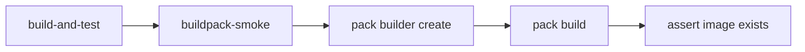

*pack build*: `--path . --builder testbuilder -e BP_RUST_WORKSPACE_DIR=microservices -e BP_RUST_PACKAGE=rerp_accounting_general_ledger`

### Phase 2: Full Buildpack Path (Option D or E)

If we want full buildpack replacement (single `pack build` → runnable image):

- **Option E** (preferred): Add `project.toml` with inline buildpack (Section 3.5). No buildpack changes; app defines the copy step. Per-service or shared `project.toml` in microservices root.
- **Option D** (optional): Add `BP_RERP_LAYOUT=true` to octopilot/rust for reusable packaging. Copy `impl/config`, `gen/doc`, `gen/static_site`; update `launch.toml` with RERP args.
- Fallback: Multi-stage Dockerfile (pack build → COPY config/doc).

### Phase 3: op + skaffold (Optional)

If we add skaffold.yaml to RERP:

- One artifact per service with buildpacks.builder.
- Use `op build-push` in CI or locally.
- Requires Phase 2 (config/doc in image) for runnable images.

### Phase 4: Tilt Buildpack Path (Optional)

- Add Tilt resource that uses pack build for one service instead of rerp build + docker.
- Useful for local validation.

---

## 5. Diagram: Current vs Future State

### 5.1 Current CI Flow (Simplified)

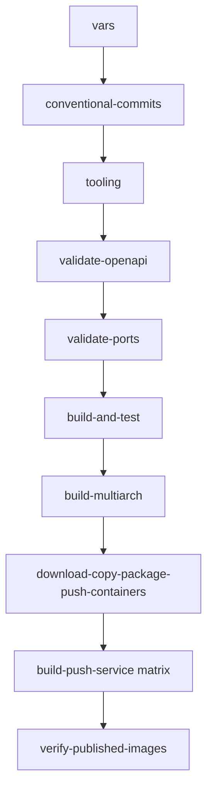

### 5.2 Future CI Flow (With Phase 1)

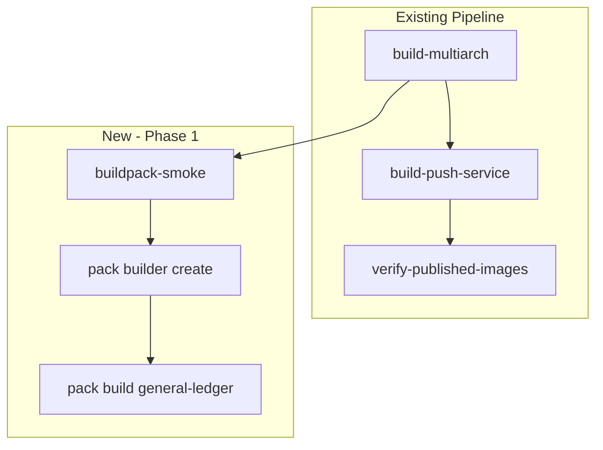

### 5.3 Current Tilt Flow (Per Service)

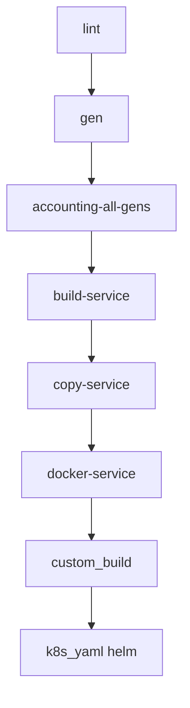

### 5.4 Future Tilt Flow (With Buildpack Option)

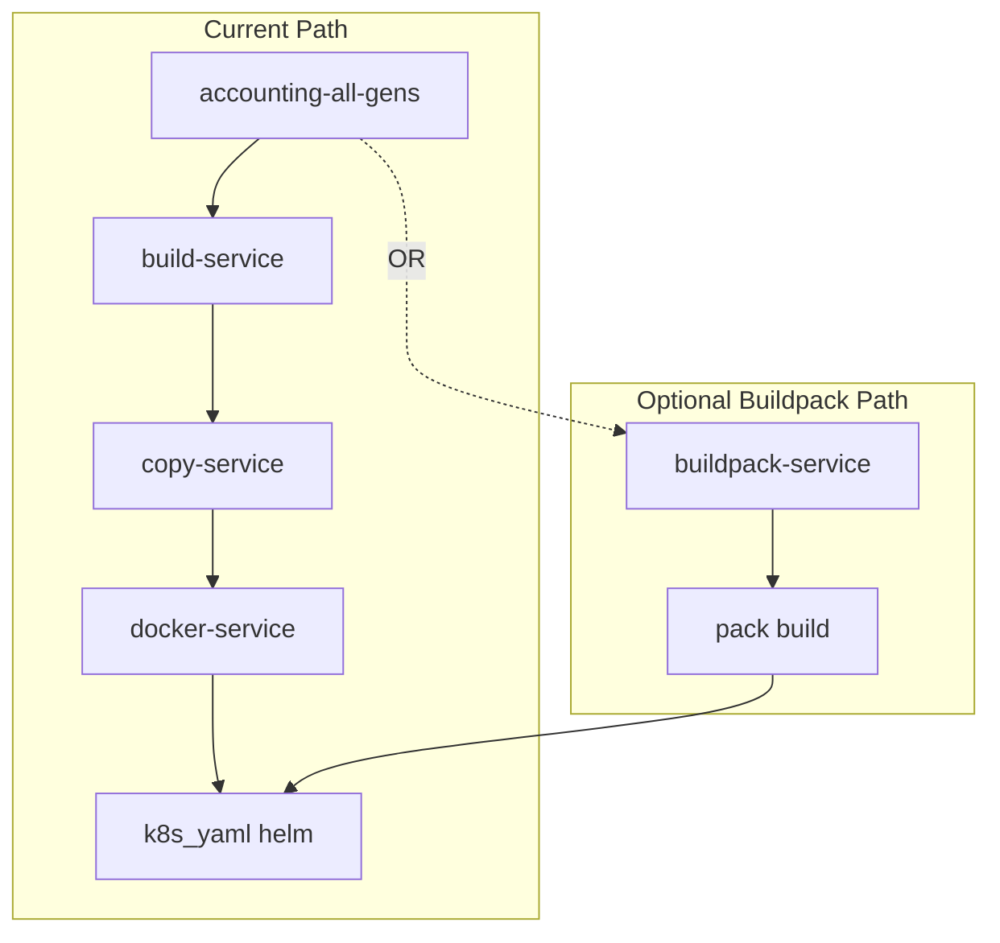

### 5.5 Mermaid Diagrams

#### Current CI Flow (Mermaid)

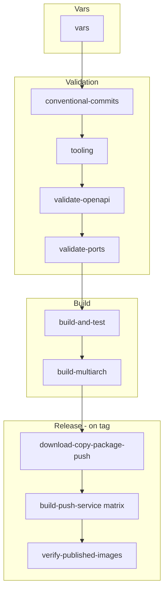

#### Current Tilt Flow (Mermaid)

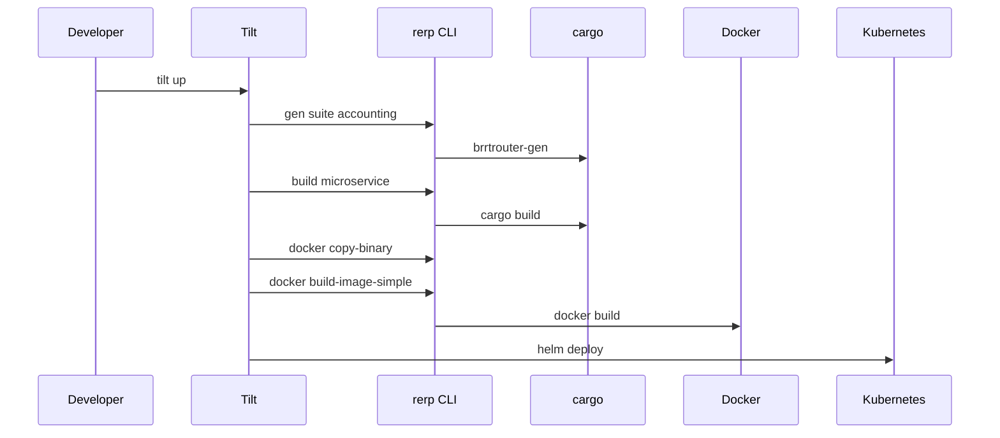

#### Future CI Flow with Buildpack Smoke (Mermaid)

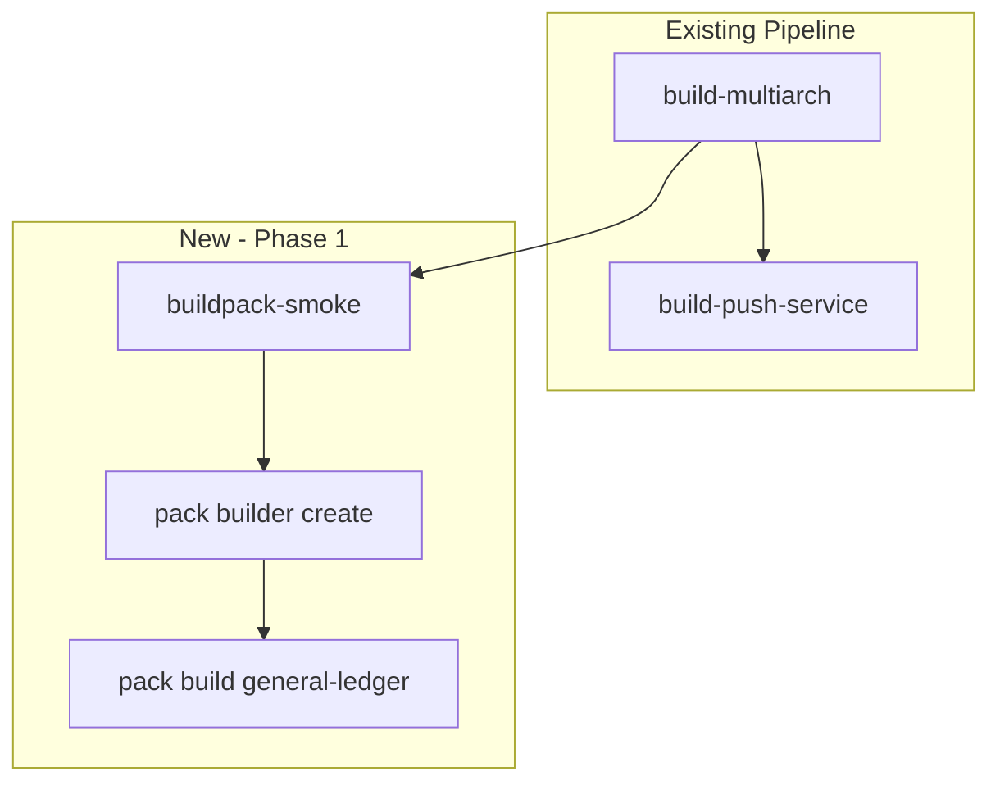

#### Component Integration (Mermaid)

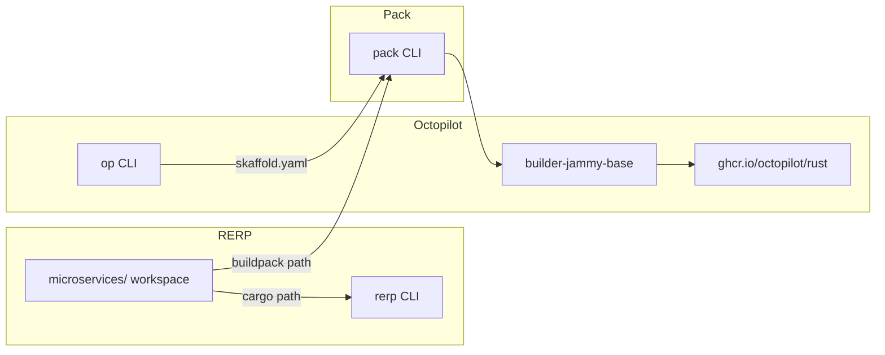

---

## 6. Implementation Checklist

### Phase 1: Buildpack Smoke Test

| Task | Description |
|------|-------------|
| [ ] Add `pack` and `builder` to CI | Install pack; create or pull builder image (builder-jammy-base). |
| [ ] Add `buildpack-smoke` job | Runs after build-multiarch; runs `pack build` for general-ledger. |
| [ ] Configure build context | Use `microservices/` or repo root with `BP_RUST_WORKSPACE_DIR`. |
| [ ] Set BP_RUST_PACKAGE | `rerp_accounting_general_ledger` for general-ledger. |
| [ ] Assert build succeeds | Check that image was created. |

### Phase 2: (Later) Buildpack Extensions

| Task | Description |
|------|-------------|
| [ ] Extend Rust buildpack | Add optional copy of `impl/config`, `gen/doc`, `gen/static_site` for RERP layout. |
| [ ] Or document multi-stage pattern | Use pack build + Dockerfile FROM that image + COPY config/doc. |

### Phase 3: (Later) op + skaffold

| Task | Description |
|------|-------------|
| [ ] Add skaffold.yaml | One artifact per service with buildpacks.builder. |
| [ ] Add .github/octopilot.yaml | If using op run. |
| [ ] Document op build-push usage | For local and CI. |

### Phase 4: (Later) Tilt Buildpack Path

| Task | Description |
|------|-------------|
| [ ] Add Tilt resource | buildpack-general-ledger (or similar) using pack build. |
| [ ] Make it optional | Via Tilt config or env var. |

---

## 7. References

- [Rust buildpack](https://github.com/octopilot/rust) – ghcr.io/octopilot/rust:0.1.3
- [builder-jammy-base](https://github.com/octopilot/builder-jammy-base) – includes Octopilot Rust buildpack
- [octopilot-pipeline-tools (op)](https://github.com/octopilot/octopilot-pipeline-tools) – README, WORKFLOW.md
- [RUST-TEST-PROCESS-AUDIT.md](https://github.com/octopilot/builder-jammy-base/blob/main/docs/RUST-TEST-PROCESS-AUDIT.md) – buildpack test process (in builder-jammy-base repo)
