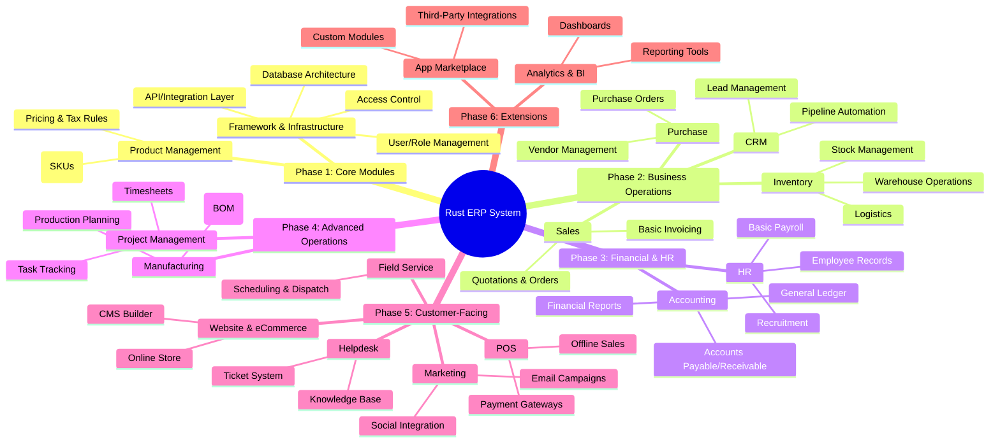

```mermaid
mindmap
  root((Rust ERP System))
    Phase 1: Core Modules
      Framework & Infrastructure
        User/Role Management
        Access Control
        Database Architecture
        API/Integration Layer
      Product Management
        Product Catalog (SKUs)
        Pricing & Tax Rules
    Phase 2: Business Operations
      CRM
        Lead Management
        Pipeline Automation
      Sales
        Quotations & Orders
        Basic Invoicing
      Purchase
        Vendor Management
        Purchase Orders
      Inventory
        Stock Management
        Warehouse Operations
        Logistics
    Phase 3: Financial & HR
      Accounting
        General Ledger
        Accounts Payable/Receivable
        Financial Reports
      HR
        Employee Records
        Basic Payroll
        Recruitment
    Phase 4: Advanced Operations
      Manufacturing
        Bill of Materials (BOM)
        Production Planning
      Project Management
        Task Tracking
        Timesheets
    Phase 5: Customer-Facing
      Marketing
        Email Campaigns
        Social Integration
      Website & eCommerce
        CMS Builder
        Online Store
      POS
        Offline Sales
        Payment Gateways
      Helpdesk
        Ticket System
        Knowledge Base
      Field Service
        Scheduling & Dispatch
    Phase 6: Extensions
      App Marketplace
        Third-Party Integrations
        Custom Modules
      Analytics & BI
        Dashboards
        Reporting Tools
```