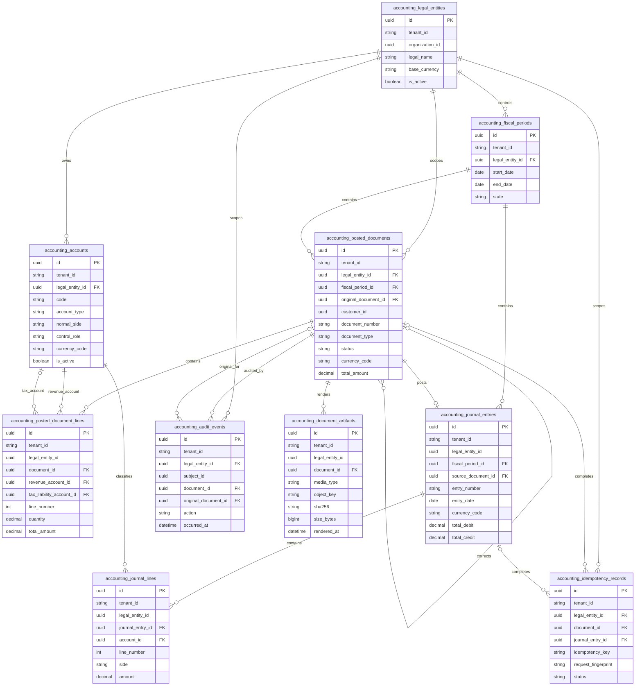
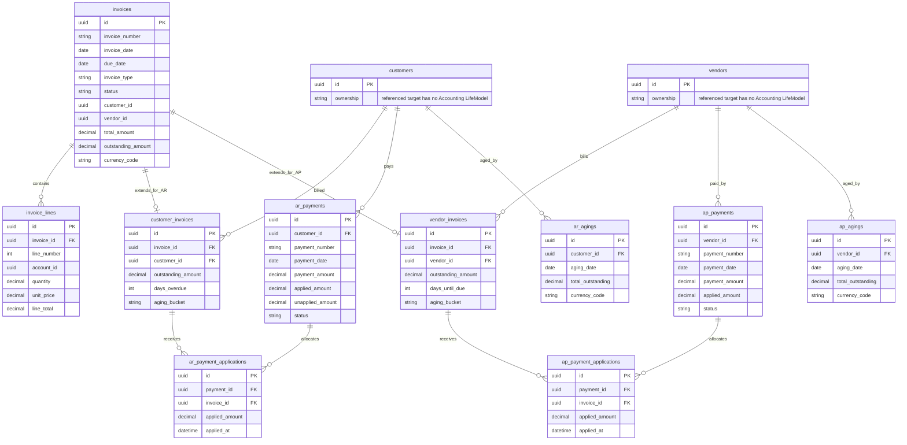
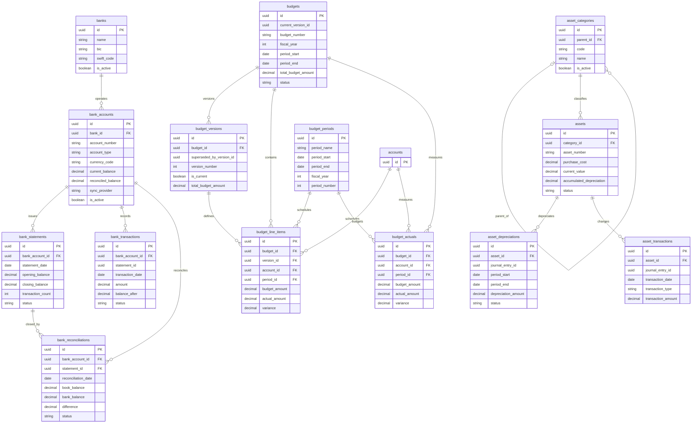
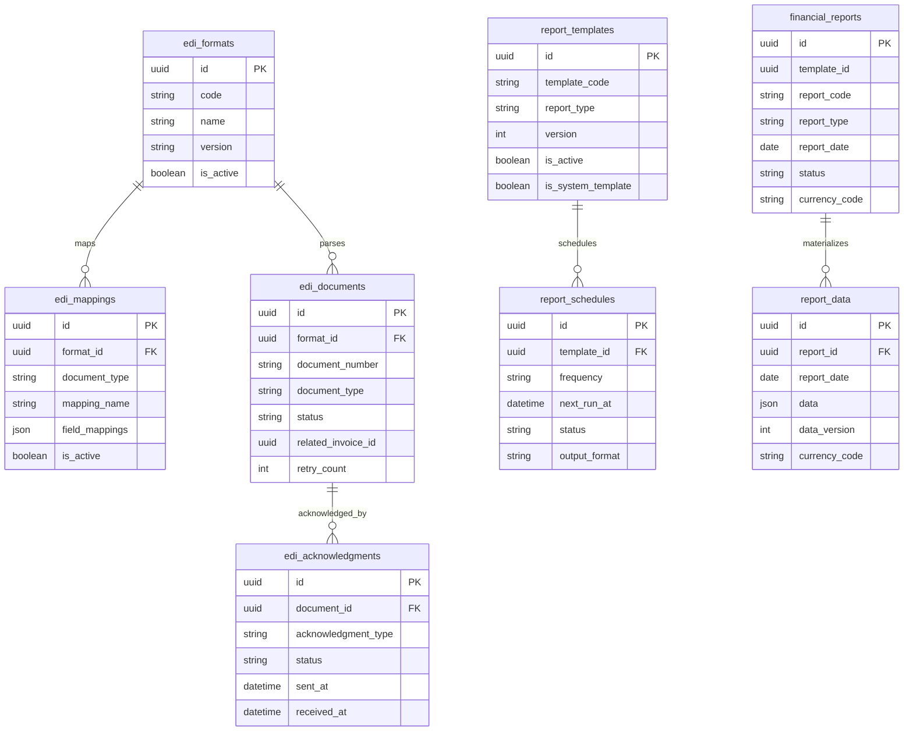

# RERP Accounting Suite

This directory is the installation and ownership boundary for Accounting
runtime code, persistence models, migrations, SQL controls, tests, and
operational assets. RERP hosts multiple suites, so Accounting-specific assets
must not be added at the repository root.

## Current persistence status

This README and its diagrams were reconciled against the effective
`LifeModel` sources and Accounting foundation migrations on **2026-07-16**.

- The effective model inventory contains **42 table models with 42 unique
  owners**.
- The suite-wide `accounting/foundation` provider owns 10 models.
- Eight service providers own the remaining 32 models; the General Ledger
  provider intentionally owns no parallel ledger tables.
- Only the 10-table foundation currently has a delivered, ordered migration
  set and app-owned Accounting/RLS controls.
- The service models describe the current registries. Their presence does not
  mean the corresponding service or migration has passed delivery acceptance.
- Documents Render is a separate suite and is deliberately absent from these
  diagrams.

The audited ownership evidence and remaining semantic decisions are recorded
in
[`../../docs/roadmap/hauliage-accounting-dogfood/service-readiness-plan/entity-ownership.md`](../../docs/roadmap/hauliage-accounting-dogfood/service-readiness-plan/entity-ownership.md).

## Model inventory

| Provider | Model count | Tables |
|---|---:|---|
| `accounting/foundation` | 10 | legal entities, fiscal periods, posting accounts, immutable posted documents/lines, journals/lines, idempotency, audit, document artifacts |
| `accounting/general-ledger` | 0 | consumes the suite foundation; no second ledger schema |
| `accounting/invoice` | 2 | invoices and invoice lines |
| `accounting/accounts-receivable` | 4 | customer invoices, receipts, allocations, aging |
| `accounting/accounts-payable` | 4 | vendor invoices, payments, allocations, aging |
| `accounting/bank-sync` | 5 | banks, bank accounts, statements, transactions, reconciliations |
| `accounting/asset` | 4 | asset categories, assets, depreciation, transactions |
| `accounting/budget` | 5 | budgets, versions, periods, lines, actuals |
| `accounting/edi` | 4 | formats, mappings, documents, acknowledgments |
| `accounting/financial-reports` | 4 | templates, schedules, reports, report data |

## Entity relationship diagrams

These are relationship-focused diagrams. They include every current entity,
all primary keys, declared/migrated foreign keys, and the main fields needed to
understand cardinality. Audit timestamps, metadata, descriptive fields, and
many non-relational values are intentionally omitted.

Relationship rules:

- A relationship is drawn only when it is declared with `#[foreign_key]` or
  enforced by the delivered foundation migrations.
- Optionality reflects nullable foreign-key fields where the current schema
  expresses it.
- `customers` and `vendors` are shown as external target tables because current
  AR/AP models declare foreign keys to them, but no Accounting `LifeModel`
  currently owns either table. That is unresolved schema ownership, not a
  delivered relationship.
- UUID fields that merely look relational are listed later and are not drawn
  as physical relationships.

### Delivered Accounting foundation

This is the currently migrated, tenant-scoped posting kernel. Composite
foreign keys in `migrations/foundation/0002_controls_and_rls.sql` enforce that
related rows share `tenant_id` and `legal_entity_id`.



### Invoice, AR, and AP registries

These are current service-owned workflow/subledger models. General Ledger no
longer owns `accounts`, `chart_of_accounts`, `journal_entries`,
`journal_entry_lines`, or mutable `account_balances`: all posting and future GL
queries use the delivered `accounting_*` foundation shown above. The remaining
semantic gate is to keep Invoice workflow and AR/AP open-item records from
becoming competing sources of posted-document truth.



### Banking, assets, and budgets



### EDI and financial reporting



## Logical references not enforced as foreign keys

The current models contain UUID references that are not annotated as foreign
keys and are not constrained by the delivered foundation migrations. They are
therefore intentionally absent as physical ERD relationships:

- `invoices.customer_id`, `vendor_id`, and `payment_term_id`;
- `invoice_lines.account_id`, `product_id`, and `tax_id`;
- `ar_payments.bank_account_id` and `ap_payments.bank_account_id`;
- asset account IDs and asset journal-entry IDs;
- `bank_transactions.statement_id`, `matched_payment_id`, and
  `reconciled_statement_id`;
- `budgets.current_version_id` and
  `budget_versions.superseded_by_version_id`;
- `financial_reports.template_id`;
- `edi_documents.related_invoice_id` and `related_purchase_order_id`;
- foundation references to external identities/business objects, including
  `accounting_legal_entities.organization_id`,
  `accounting_posted_documents.customer_id`, and subject/actor UUIDs such as
  `posted_by`, `closed_by`, `rendered_by`, and `subject_id`; and
- legacy General Ledger `fiscal_period_id` fields outside the delivered
  `accounting_fiscal_periods` foundation relationship.

Each must eventually become one of: an enforced same-suite foreign key, an
explicit immutable external/source reference, or a field removed from the
contract. A UUID name alone is not referential integrity.

## Layout

- `core/` — deterministic Accounting calculations with no transport or
  database executor.
- `entities/` — genuinely suite-wide foundation persistence models; never a
  duplicate catalog of service-owned models.
- `migrations/` — ordered Accounting schema and control migrations.
- `sql/` — vendored database contracts required by Accounting, including RLS.
- `scripts/` — Accounting database and operational setup.
- `<service>/gen/` — generated BRRTRouter contract layer.
- `<service>/impl/` — deployable, user-owned service behavior, including
  controllers, application services, service-owned Lifeguard models,
  validators, configuration, seeds, and tests.
- `../../openapi/accounting/<service>/openapi.yaml` — authoritative service
  contract; service-local transitional specs are not canonical.

The canonical architecture and ownership rules live in
[`../../CONTRIBUTING.md`](../../CONTRIBUTING.md). In particular:

- every Accounting HTTP service retains its own `gen/` and `impl/` crates;
- a service-specific `LifeModel` belongs in that service's
  `impl/src/models/`;
- only a concept with no natural service owner and shared across the suite
  belongs in `accounting/entities/`;
- the same effective table or view must never be defined by two providers;
- service seeds and tests stay with the owning implementation, while
  cross-service acceptance tests stay in `accounting/tests/`; and
- the single top-level `microservices/migrator/` emits and applies Accounting
  migrations only under this suite's `migrations/` directory.

## Service anatomy

An Accounting service adapts the Hauliage service pattern beneath the suite
directory:

```text
accounting/<service>/
├── README.md
├── gen/                         # generated; never hand-edit
│   ├── doc/
│   ├── static_site/
│   └── src/{controllers,handlers}/
└── impl/                        # user-owned and deployable
    ├── build.rs                 # Lifeguard registry generation
    ├── config/
    ├── seeds/
    ├── src/
    │   ├── controllers/
    │   ├── services/
    │   ├── models/
    │   ├── validators/
    │   ├── impl_registry.rs
    │   ├── lib.rs
    │   └── main.rs
    └── tests/
```

Not every service requires every optional directory, but responsibility must
not be moved to a suite-wide implementation merely because several services
are developed together.

## Persistence and migration ownership

Every effective table/view has one owner and one provider. Service consumers
reuse the owner's library/API; they do not copy the `LifeModel`. The top-level
migrator identifies providers by `(suite, service)`, rejects duplicate table
identity, propagates provider errors, and writes only beneath:

```text
microservices/accounting/migrations/
├── apply_order.txt
├── foundation/
├── general-ledger/
├── invoice/
├── accounts-receivable/
└── accounts-payable/
```

Validate the current registry without writing migrations:

```bash
cd microservices
cargo run -p rerp_migrator --features accounting -- \
  validate --suite accounting --migration-history
```

Full generation remains gated by the Invoice/AR posted-document boundary and
other service-model reviews noted above; unique SQL table names are necessary
but not sufficient accounting architecture.

## Verification

```bash
cd microservices
cargo test -p rerp-accounting-core
cargo check -p rerp-entities --lib
cargo test -p rerp_migrator --features accounting
cargo run -p rerp_migrator --features accounting -- \
  validate --suite accounting --migration-history
```

Database setup is location-independent:

```bash
./microservices/accounting/scripts/setup-db.sh
```
