# RERP Accounting Suite — Design Document

> **Date:** 2026-05-11
> **Version:** 1.0
> **Scope:** Complete accounting suite design — 16 microservices, shared domain model, integration patterns

---

## Table of Contents

1. [System Overview](#1-system-overview)
2. [Architecture Principles](#2-architecture-principles)
3. [Service Topology](#3-service-topology)
4. [Domain Model](#4-domain-model)
5. [Entity Relationships](#5-entity-relationships)
6. [Data Flow](#6-data-flow)
7. [Sequence Diagrams](#7-sequence-diagrams)
8. [API Contracts](#8-api-contracts)
9. [Integration Patterns](#9-integration-patterns)
10. [Security & Multi-Tenancy](#10-security--multi-tenancy)
11. [Implementation Roadmap](#11-implementation-roadmap)

---

## 1. System Overview

RERP Accounting is a comprehensive, cloud-native ERP accounting suite built on Rust (Axum) with PostgreSQL. It provides full double-entry accounting capabilities, multi-entity consolidation, tax compliance, treasury management, and financial reporting — designed as 16 independent but interoperable microservices.

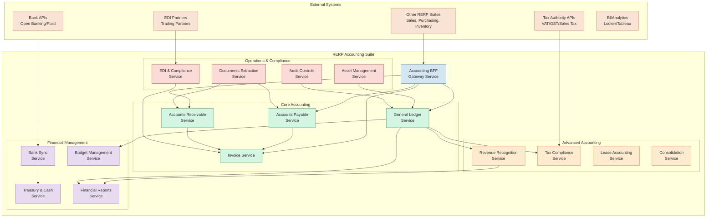
```mermaid
graph TB
    subgraph "External Systems"
        ERP[Other RERP Suites<br/>Sales, Purchasing, Inventory]
        Bank[Bank APIs<br/>Open Banking/Plaid]
        Tax[Tax Authority APIs<br/>VAT/GST/Sales Tax]
        EDI[EDI Partners<br/>Trading Partners]
        BI[BI/Analytics<br/>Looker/Tableau]
    end
    
    subgraph "RERP Accounting Suite"
        BFF[Accounting BFF<br/>Gateway Service]
        
        subgraph "Core Accounting"
            GL[General Ledger<br/>Service]
            AP[Accounts Payable<br/>Service]
            AR[Accounts Receivable<br/>Service]
            INV[Invoice Service]
        end
        
        subgraph "Advanced Accounting"
            REV[Revenue Recognition<br/>Service]
            TAX[Tax Compliance<br/>Service]
            LEASE[Lease Accounting<br/>Service]
            CONSOL[Consolidation<br/>Service]
        end
        
        subgraph "Financial Management"
            BANK[Bank Sync<br/>Service]
            TREASURY[Treasury & Cash<br/>Service]
            BUDGET[Budget Management<br/>Service]
            REPORTS[Financial Reports<br/>Service]
        end
        
        subgraph "Operations & Compliance"
            ASSET[Asset Management<br/>Service]
            AUDIT[Audit Controls<br/>Service]
            DOC[Documents Extraction<br/>Service]
            EDI_SVC[EDI & Compliance<br/>Service]
        end
    end
    
    ERP --> BFF
    Bank --> BANK
    Tax --> TAX
    EDI --> EDI_SVC
    BFF --> GL
    BFF --> AP
    BFF --> AR
    BFF --> INV
    GL --> REV
    GL --> TAX
    AP --> INV
    AR --> INV
    REV --> REPORTS
    BANK --> TREASURY
    GL --> BUDGET
    GL --> REPORTS
    ASSET --> GL
    AUDIT --> GL
    DOC --> AP
    DOC --> AR
    EDI_SVC --> INV
    
    classDef external fill:#f9e3d4,stroke:#d4894a
    classDef bff fill:#d4e6f1,stroke:#2980b9
    classDef core fill:#d5f5e3,stroke:#27ae60
    classDef advanced fill:#fdebd0,stroke:#e67e22
    classDef financial fill:#e8daef,stroke:#8e44ad
    classDef ops fill:#fadbd8,stroke:#c0392b
    
    class ERP,Bank,Tax,EDI,BI external
    class BFF bff
    class GL,AP,AR,INV core
    class REV,TAX,LEASE,CONSOL advanced
    class BANK,TREASURY,BUDGET,REPORTS financial
    class ASSET,AUDIT,DOC,EDI_SVC ops
```

### Service Inventory

| # | Service | OpenAPI Spec | Schema Count | Path Count |
|---|---------|--------------|--------------|------------|
| 1 | General Ledger | `general-ledger/openapi.yaml` | 93 | 44 |
| 2 | Accounts Payable | `accounts-payable/openapi.yaml` | 28 | 12 |
| 3 | Accounts Receivable | `accounts-receivable/openapi.yaml` | 39 | 18 |
| 4 | Invoice | `invoice/openapi.yaml` | 24 | 17 |
| 5 | Revenue Recognition | `revenue-recognition/openapi.yaml` | 15 | 6 |
| 6 | Tax Compliance | `tax-compliance/openapi.yaml` | 21 | 7 |
| 7 | Lease Accounting | `lease-accounting/openapi.yaml` | 15 | 6 |
| 8 | Consolidation | `consolidation/openapi.yaml` | 16 | 6 |
| 9 | Bank Sync | `bank-sync/openapi.yaml` | 29 | 18 |
| 10 | Treasury & Cash | `treasury/openapi.yaml` | 16 | 5 |
| 11 | Budget Management | `budget/openapi.yaml` | 19 | 11 |
| 12 | Financial Reports | `financial-reports/openapi.yaml` | 29 | 14 |
| 13 | Asset Management | `asset/openapi.yaml` | 27 | 14 |
| 14 | Audit Controls | `audit-controls/openapi.yaml` | 17 | 6 |
| 15 | Documents Extraction | `documents-extraction/openapi.yaml` | 17 | 7 |
| 16 | EDI & Compliance | `edi/openapi.yaml` | 26 | 12 |

**Totals:** 431 schemas, 203 paths, 16 services

---

## 2. Architecture Principles

### 2.1 OpenAPI-First Design

Every service is defined in OpenAPI 3.1.0 before implementation. The spec is the source of truth.

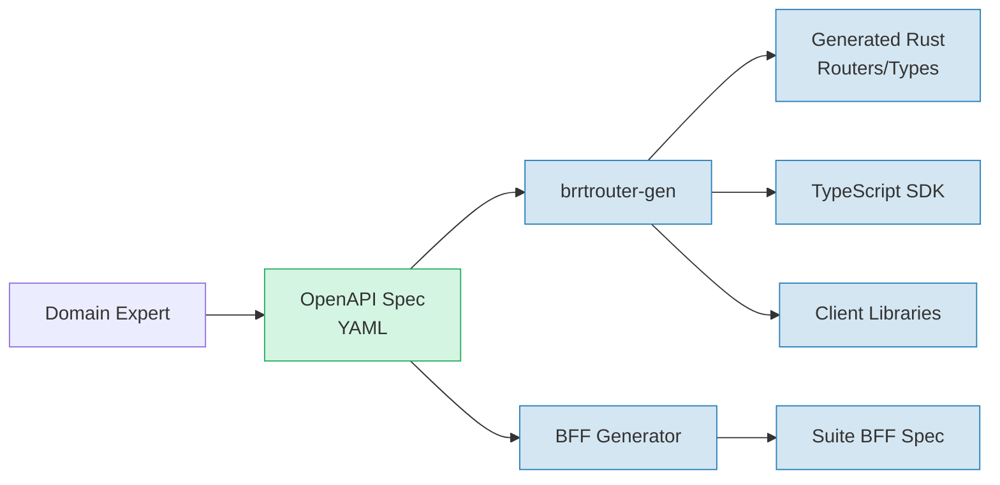
```mermaid
graph LR
    A[Domain Expert] --> B[OpenAPI Spec<br/>YAML]
    B --> C[brrtrouter-gen]
    C --> D[Generated Rust<br/>Routers/Types]
    C --> E[TypeScript SDK]
    C --> F[Client Libraries]
    B --> G[BFF Generator]
    G --> H[Suite BFF Spec]
    
    classDef spec fill:#d5f5e3,stroke:#27ae60
    classDef gen fill:#d4e6f1,stroke:#2980b9
    class B spec
    class C,D,E,F,G,H gen
```

### 2.2 BRRTRouter Convention Compliance

All specs adhere to strict conventions:

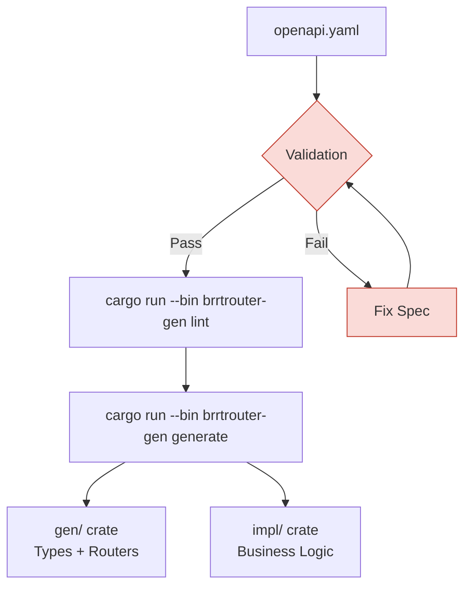
```mermaid
graph TB
    A[openapi.yaml] --> B{Validation}
    B -->|Pass| C[cargo run --bin brrtrouter-gen lint]
    B -->|Fail| D[Fix Spec]
    D --> B
    C --> E[cargo run --bin brrtrouter-gen generate]
    E --> F[gen/ crate<br/>Types + Routers]
    E --> G[impl/ crate<br/>Business Logic]
    
    classDef check fill:#fadbd8,stroke:#c0392b
    class B,D check
```

**Key Conventions:**
- `components` contains exactly 3 keys: `securitySchemes`, `parameters`, `schemas`
- Global security: `bearerAuth: []` referencing `httpBearer`
- List endpoints return `PaginatedResponse` → `Paginated<Entity>`
- All mutations (POST/PUT/PATCH) have `x-brrtrouter-impl: true`
- All mutations include `400`, `401`, `403`, `409` error responses

### 2.3 Database Strategy

```mermaid
graph TB
    subgraph "Shared PostgreSQL Cluster"
        DB[PostgreSQL 16<br/>Primary]
        
        subgraph "Schema-per-Service"
            SCHEMA_GL[general_ledger schema]
            SCHEMA_AP[accounts_payable schema]
            SCHEMA_AR[accounts_receivable schema]
            SCHEMA_INV[invoice schema]
            SCHEMA_OTHER[other 12 schemas]
        end
        
        DB --> SCHEMA_GL
        DB --> SCHEMA_AP
        DB --> SCHEMA_AR
        DB --> SCHEMA_INV
        DB --> SCHEMA_OTHER
    end
    
    subgraph "Cross-Service References"
        FK[Fake Foreign Keys<br/>via application logic<br/>NOT database-level]
        PK[(Primary Key)<br/>company_id + id<br/>composite key]
    end
    
    SCHEMA_GL -.->|company_id join| SCHEMA_AP
    SCHEMA_AP -.->|invoice_id| SCHEMA_INV
    SCHEMA_AR -.->|invoice_id| SCHEMA_INV
    
    classDef db fill:#d4e6f1,stroke:#2980b9
    classDef schema fill:#d5f5e3,stroke:#27ae60
    classDef cross fill:#fdebd0,stroke:#e67e22
    
    class DB db
    class SCHEMA_GL,SCHEMA_AP,SCHEMA_AR,SCHEMA_INV,SCHEMA_OTHER schema
    class FK,PK cross
```

**Database Rules:**
- Each service owns its schema exclusively
- No database-level foreign keys between schemas (services are independent)
- Cross-service references are application-level via `company_id` joins
- Shared domain entities (Company, User, Tenant) live in a shared `entities` crate

### 2.4 Communication Patterns

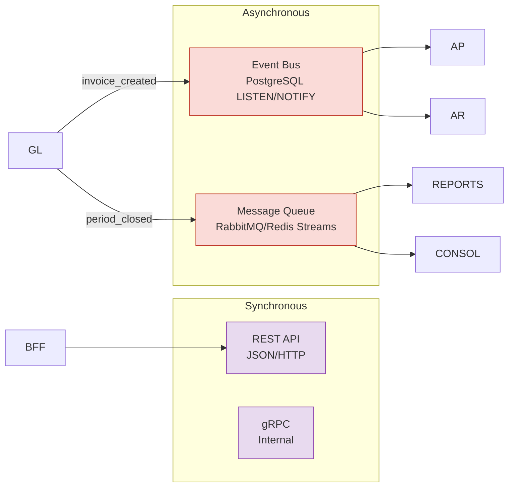
```mermaid
graph LR
    subgraph "Synchronous"
        REST[REST API<br/>JSON/HTTP]
        gRPC[gRPC<br/>Internal]
    end
    
    subgraph "Asynchronous"
        EVENT[Event Bus<br/>PostgreSQL LISTEN/NOTIFY]
        MSG[Message Queue<br/>RabbitMQ/Redis Streams]
    end
    
    BFF --> REST
    GL -- invoice_created --> EVENT
    EVENT --> AP
    EVENT --> AR
    GL -- period_closed --> MSG
    MSG --> REPORTS
    MSG --> CONSOL
    
    classDef sync fill:#e8daef,stroke:#8e44ad
    classDef async fill:#fadbd8,stroke:#c0392b
    class REST,gRPC sync
    class EVENT,MSG async
```

---

## 3. Service Topology

### 3.1 Dependency Graph

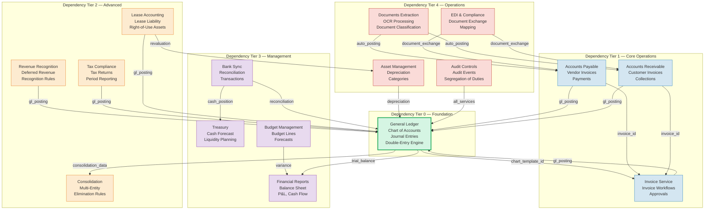
```mermaid
graph TB
    subgraph "Dependency Tier 0 — Foundation"
        GL[General Ledger<br/>Chart of Accounts<br/>Journal Entries<br/>Double-Entry Engine]
    end
    
    subgraph "Dependency Tier 1 — Core Operations"
        AP[Accounts Payable<br/>Vendor Invoices<br/>Payments]
        AR[Accounts Receivable<br/>Customer Invoices<br/>Collections]
        INV[Invoice Service<br/>Invoice Workflows<br/>Approvals]
    end
    
    subgraph "Dependency Tier 2 — Advanced"
        REV[Revenue Recognition<br/>Deferred Revenue<br/>Recognition Rules]
        TAX[Tax Compliance<br/>Tax Returns<br/>Period Reporting]
        LEASE[Lease Accounting<br/>Lease Liability<br/>Right-of-Use Assets]
        CONSOL[Consolidation<br/>Multi-Entity<br/>Elimination Rules]
    end
    
    subgraph "Dependency Tier 3 — Management"
        BANK[Bank Sync<br/>Reconciliation<br/>Transactions]
        TREASURY[Treasury<br/>Cash Forecast<br/>Liquidity Planning]
        BUDGET[Budget Management<br/>Budget Lines<br/>Forecasts]
        REPORTS[Financial Reports<br/>Balance Sheet<br/>P&L, Cash Flow]
    end
    
    subgraph "Dependency Tier 4 — Operations"
        ASSET[Asset Management<br/>Depreciation<br/>Categories]
        AUDIT[Audit Controls<br/>Audit Events<br/>Segregation of Duties]
        DOC[Documents Extraction<br/>OCR Processing<br/>Document Classification]
        EDI[EDI & Compliance<br/>Document Exchange<br/>Mapping]
    end
    
    GL -->|chart_template_id| INV
    AP -->|invoice_id| INV
    AP -->|gl_posting| GL
    AR -->|invoice_id| INV
    AR -->|gl_posting| GL
    INV -->|gl_posting| GL
    
    REV -->|gl_posting| GL
    TAX -->|gl_posting| GL
    LEASE -->|gl_posting| GL
    LEASE -->|revaluation| ASSET
    
    BANK -->|cash_position| TREASURY
    BANK -->|reconciliation| GL
    BUDGET -->|variance| REPORTS
    GL -->|trial_balance| REPORTS
    GL -->|consolidation_data| CONSOL
    
    ASSET -->|depreciation| GL
    AUDIT -->|all_services| GL
    
    DOC -->|auto_posting| AP
    DOC -->|auto_posting| AR
    EDI -->|document_exchange| AP
    EDI -->|document_exchange| AR
    
    classDef foundation fill:#d5f5e3,stroke:#27ae60,stroke-width:3px
    classDef core fill:#d4e6f1,stroke:#2980b9
    classDef advanced fill:#fdebd0,stroke:#e67e22
    classDef management fill:#e8daef,stroke:#8e44ad
    classDef ops fill:#fadbd8,stroke:#c0392b
    
    class GL foundation
    class AP,AR,INV core
    class REV,TAX,LEASE,CONSOL advanced
    class BANK,TREASURY,BUDGET,REPORTS management
    class ASSET,AUDIT,DOC,EDI ops
```

### 3.2 Service Interaction Matrix

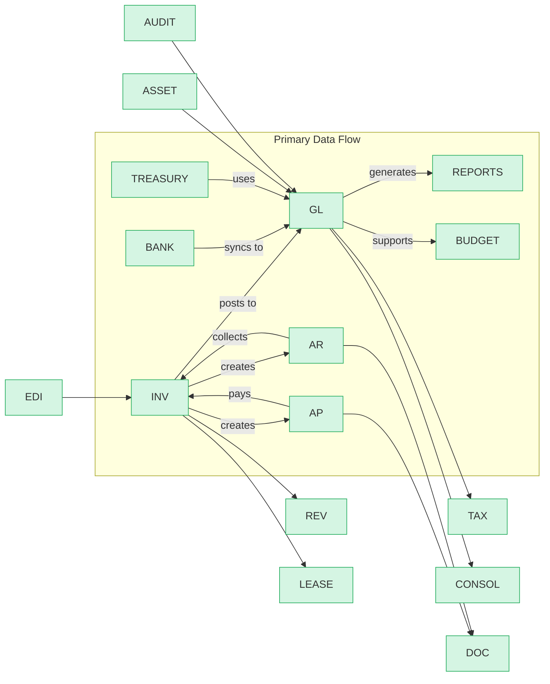
```mermaid
graph LR
    subgraph "Primary Data Flow"
        INV -->|creates| AR
        INV -->|creates| AP
        INV -->|posts to| GL
        AP -->|pays| INV
        AR -->|collects| INV
        GL -->|generates| REPORTS
        GL -->|supports| BUDGET
        BANK -->|syncs to| GL
        TREASURY -->|uses| GL
    end
    
    INV --> REV
    GL --> TAX
    INV --> LEASE
    GL --> CONSOL
    AP --> DOC
    AR --> DOC
    ASSET --> GL
    AUDIT --> GL
    EDI --> INV
    
    classDef flow fill:#d5f5e3,stroke:#27ae60
    class INV,AR,AP,GL,REPORTS,BUDGET,BANK,TREASURY,REV,TAX,LEASE,CONSOL,DOC,ASSET,AUDIT,EDI flow
```

---

## 4. Domain Model

### 4.1 Core Entities

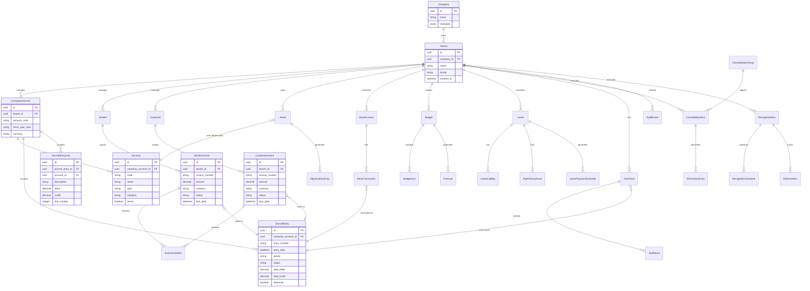
```mermaid
erDiagram
    Company ||--o{ Tenant : "owns"
    Tenant ||--o{ CompanyAccount : "manages"
    CompanyAccount ||--o{ Account : "contains"
    CompanyAccount ||--o{ JournalEntry : "contains"
    CompanyAccount ||--o{ JournalEntryLine : "contains"
    
    Tenant ||--o{ Vendor : "manages"
    Vendor ||--o{ VendorInvoice : "issues"
    VendorInvoice ||--o{ InvoiceLineItem : "contains"
    VendorInvoice }o--|| JournalEntry : "posts to"
    
    Tenant ||--o{ Customer : "manages"
    Customer ||--o{ CustomerInvoice : "creates"
    CustomerInvoice ||--o{ InvoiceLineItem : "contains"
    CustomerInvoice }o--|| JournalEntry : "posts to"
    
    Tenant ||--o{ Asset : "owns"
    Asset }o--|| Account : "uses depreciation"
    Asset ||--o{ DepreciationEntry : "generates"
    
    Tenant ||--o{ BankAccount : "maintains"
    BankAccount ||--o{ BankTransaction : "has"
    BankTransaction }o--|| JournalEntry : "reconciled to"
    
    Tenant ||--o{ Budget : "creates"
    Budget ||--o{ BudgetLine : "contains"
    Budget ||--o{ Forecast : "generates"
    
    Tenant ||--o{ Lease : "maintains"
    Lease ||--o{ LeaseLiability : "has"
    Lease ||--o{ RightOfUseAsset : "has"
    Lease ||--o{ LeasePaymentSchedule : "generates"
    
    Tenant ||--o{ TaxPeriod : "files"
    TaxPeriod ||--o{ TaxReturn : "submits"
    TaxPeriod }o--|| JournalEntry : "posts taxes"
    
    Tenant ||--o{ ConsolidationRun : "executes"
    ConsolidationRun ||--o{ EliminationEntry : "generates"
    ConsolidationGroup ||--o{ ConsolidationRun : "triggers"
    
    Tenant ||--o{ AuditEvent : "records"
    Tenant ||--o{ RecognitionRun : "executes"
    RecognitionRun ||--o{ RecognitionSchedule : "produces"
    RecognitionRun ||--o{ DeferredItem : "tracks"
    
    Company {
        uuid id PK
        string name
        jsonb metadata
    }
    Tenant {
        uuid id PK
        uuid company_id FK
        string name
        string locale
        datetime created_at
    }
    CompanyAccount {
        uuid id PK
        uuid tenant_id FK
        string account_code
        string fiscal_year_start
        string currency
    }
    Account {
        uuid id PK
        uuid company_account_id FK
        string code
        string name
        string type
        string category
        boolean active
    }
    JournalEntry {
        uuid id PK
        uuid company_account_id FK
        string entry_number
        datetime entry_date
        string period
        string status
        decimal total_debit
        decimal total_credit
        boolean balanced
    }
    JournalEntryLine {
        uuid id PK
        uuid journal_entry_id FK
        uuid account_id FK
        string description
        decimal debit
        decimal credit
        integer line_number
    }
    VendorInvoice {
        uuid id PK
        uuid tenant_id FK
        string invoice_number
        decimal amount
        string currency
        string status
        datetime due_date
    }
    CustomerInvoice {
        uuid id PK
        uuid tenant_id FK
        string invoice_number
        decimal amount
        string currency
        string status
        datetime due_date
    }
```

### 4.2 Entity Ownership Matrix


```mermaid
graph TB
    subgraph "Owned By Service"
        GL_OWN[JournalEntry<br/>JournalEntryLine<br/>Account<br/>CompanyAccount<br/>ChartOfAccount]
        AP_OWN[VendorInvoice<br/>VendorPayment<br/>ApprovalRequest<br/>CashFlowForecast]
        AR_OWN[CustomerInvoice<br/>PaymentApplication<br/>CollectionCase<br/>AgingSummary]
        INV_OWN[InvoiceApproval<br/>InvoiceHandoff<br/>InvoicePaymentMatch]
        REV_OWN[RecognitionRule<br/>RecognitionRun<br/>RecognitionSchedule<br/>DeferredItem]
        TAX_OWN[TaxPeriod<br/>TaxReturn<br/>TaxPayment<br/>TaxRule]
        LEASE_OWN[Lease<br/>LeaseLiability<br/>RightOfUseAsset<br/>LeasePaymentSchedule]
        CONSOL_OWN[ConsolidationGroup<br/>ConsolidationRun<br/>EliminationRule<br/>EliminationEntry]
        BANK_OWN[BankAccount<br/>BankTransaction<br/>BankReconciliation<br/>BankStatement]
        TREASURY_OWN[CashPosition<br/>CashForecast<br/>CashTransfer<br/>LiquidityPlan]
        BUDGET_OWN[Budget<br/>BudgetLine<br/>BudgetRevision<br/>Forecast]
        REPORTS_OWN[BalanceSheet<br/>IncomeStatement<br/>CashFlowStatement<br/>TrialBalance]
        ASSET_OWN[Asset<br/>AssetCategory<br/>DepreciationEntry<br/>DepreciationSchedule]
        AUDIT_OWN[AuditEvent<br/>ApprovalPolicy<br/>SegregationRule<br/>ControlException]
        DOC_OWN[ExtractionJob<br/>ExtractionResult<br/>DocumentClassification<br/>AccountingDocument]
        EDI_OWN[EdiDocument<br/>EdiMapping<br/>EdiProfile<br/>EdiSubmission]
    end
    
    subgraph "Shared/Referenced"
        SHARED[Company<br/>User<br/>Tenant<br/>Currency<br/>FiscalPeriod]
    end
    
    SHARED -.-> GL_OWN
    SHARED -.-> AP_OWN
    SHARED -.-> AR_OWN
    SHARED -.-> INV_OWN
    SHARED -.-> REV_OWN
    SHARED -.-> TAX_OWN
    SHARED -.-> LEASE_OWN
    SHARED -.-> CONSOL_OWN
    SHARED -.-> BANK_OWN
    SHARED -.-> TREASURY_OWN
    SHARED -.-> BUDGET_OWN
    SHARED -.-> REPORTS_OWN
    SHARED -.-> ASSET_OWN
    SHARED -.-> AUDIT_OWN
    SHARED -.-> DOC_OWN
    SHARED -.-> EDI_OWN
    
    classDef owned fill:#d5f5e3,stroke:#27ae60
    classDef shared fill:#d4e6f1,stroke:#2980b9
    
    class GL_OWN,AP_OWN,AR_OWN,INV_OWN,REV_OWN,TAX_OWN,LEASE_OWN,CONSOL_OWN,BANK_OWN,TREASURY_OWN,BUDGET_OWN,REPORTS_OWN,ASSET_OWN,AUDIT_OWN,DOC_OWN,EDI_OWN owned
    class SHARED shared
```

---

## 5. Entity Relationships

### 5.1 Cross-Service Entity Links

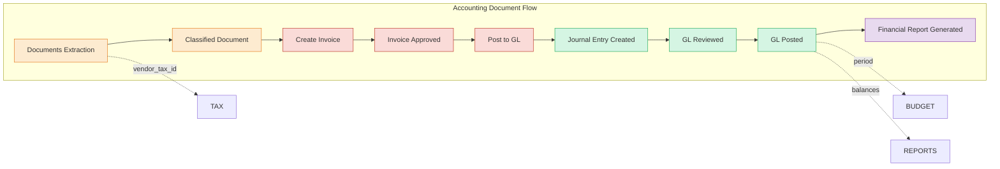
```mermaid
graph LR
    subgraph "Accounting Document Flow"
        DOC_EXTRACT[Documents Extraction]
        DOC_CLASSIFY[Classified Document]
        INV_CREATE[Create Invoice]
        INV_APPROVE[Invoice Approved]
        INV_POST[Post to GL]
        GL_ENTRY[Journal Entry Created]
        GL_REVIEW[GL Reviewed]
        GL_POSTED[GL Posted]
        FIN_REPORT[Financial Report Generated]
        
        DOC_EXTRACT --> DOC_CLASSIFY
        DOC_CLASSIFY --> INV_CREATE
        INV_CREATE --> INV_APPROVE
        INV_APPROVE --> INV_POST
        INV_POST --> GL_ENTRY
        GL_ENTRY --> GL_REVIEW
        GL_REVIEW --> GL_POSTED
        GL_POSTED --> FIN_REPORT
    end
    
    DOC_EXTRACT -.->|vendor_tax_id| TAX
    GL_POSTED -.->|period| BUDGET
    GL_POSTED -.->|balances| REPORTS
    
    classDef document fill:#fdebd0,stroke:#e67e22
    classDef invoice fill:#fadbd8,stroke:#c0392b
    classDef gl fill:#d5f5e3,stroke:#27ae60
    classDef report fill:#e8daef,stroke:#8e44ad
    
    class DOC_EXTRACT,DOC_CLASSIFY,FIN_REPORT document
    class INV_CREATE,INV_APPROVE,INV_POST invoice
    class GL_ENTRY,GL_REVIEW,GL_POSTED gl
    class FIN_REPORT report
```

### 5.2 Double-Entry Flow

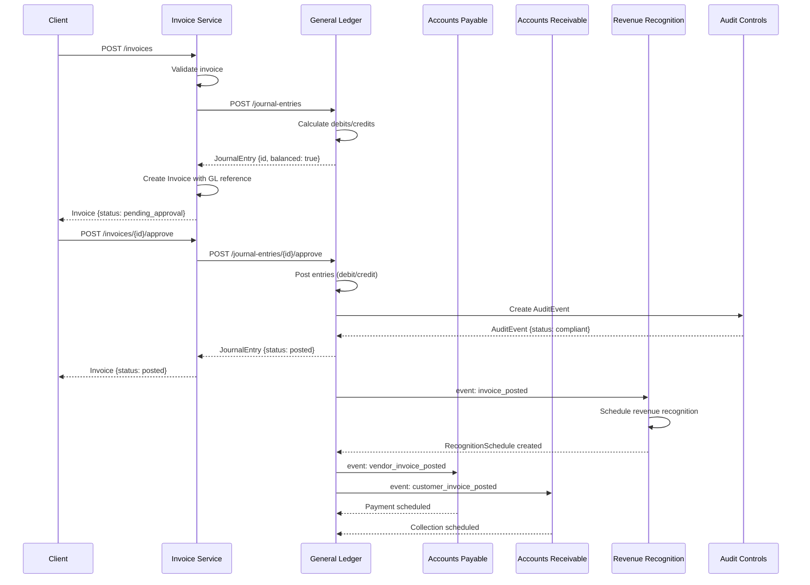
```mermaid
sequenceDiagram
    participant Client
    participant INV as Invoice Service
    participant GL as General Ledger
    participant AP as Accounts Payable
    participant AR as Accounts Receivable
    participant REV as Revenue Recognition
    participant AUDIT as Audit Controls
    
    Client->>INV: POST /invoices
    INV->>INV: Validate invoice
    INV->>GL: POST /journal-entries
    GL->>GL: Calculate debits/credits
    GL-->>INV: JournalEntry {id, balanced: true}
    INV->>INV: Create Invoice with GL reference
    INV-->>Client: Invoice {status: pending_approval}
    
    Client->>INV: POST /invoices/{id}/approve
    INV->>GL: POST /journal-entries/{id}/approve
    GL->>GL: Post entries (debit/credit)
    GL->>AUDIT: Create AuditEvent
    AUDIT-->>GL: AuditEvent {status: compliant}
    GL-->>INV: JournalEntry {status: posted}
    INV-->>Client: Invoice {status: posted}
    
    GL->>REV: event: invoice_posted
    REV->>REV: Schedule revenue recognition
    REV-->>GL: RecognitionSchedule created
    
    GL->>AP: event: vendor_invoice_posted
    GL->>AR: event: customer_invoice_posted
    AP-->>GL: Payment scheduled
    AR-->>GL: Collection scheduled
```

### 5.3 Month-End Close Process

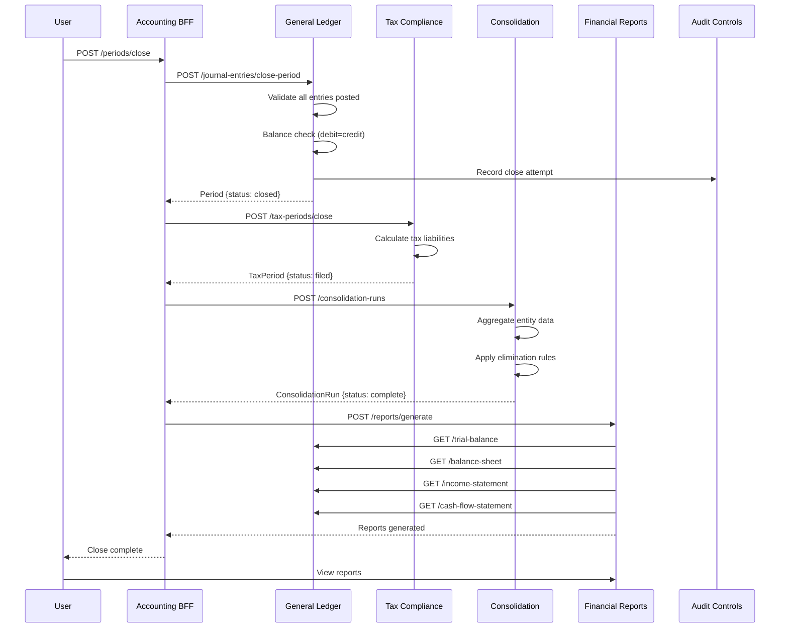
```mermaid
sequenceDiagram
    participant User
    participant BFF as Accounting BFF
    participant GL as General Ledger
    participant TAX as Tax Compliance
    participant CONSOL as Consolidation
    participant REPORTS as Financial Reports
    participant AUDIT as Audit Controls
    
    User->>BFF: POST /periods/close
    BFF->>GL: POST /journal-entries/close-period
    GL->>GL: Validate all entries posted
    GL->>GL: Balance check (debit=credit)
    GL->>AUDIT: Record close attempt
    GL-->>BFF: Period {status: closed}
    
    BFF->>TAX: POST /tax-periods/close
    TAX->>TAX: Calculate tax liabilities
    TAX-->>BFF: TaxPeriod {status: filed}
    
    BFF->>CONSOL: POST /consolidation-runs
    CONSOL->>CONSOL: Aggregate entity data
    CONSOL->>CONSOL: Apply elimination rules
    CONSOL-->>BFF: ConsolidationRun {status: complete}
    
    BFF->>REPORTS: POST /reports/generate
    REPORTS->>GL: GET /trial-balance
    REPORTS->>GL: GET /balance-sheet
    REPORTS->>GL: GET /income-statement
    REPORTS->>GL: GET /cash-flow-statement
    REPORTS-->>BFF: Reports generated
    
    BFF-->>User: Close complete
    User->>REPORTS: View reports
```

---

## 6. Data Flow

### 6.1 Invoice Processing Pipeline

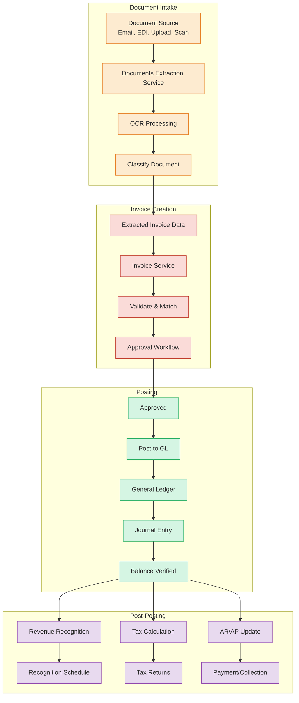
```mermaid
graph TB
    subgraph "Document Intake"
        DOC[Document Source<br/>Email, EDI, Upload, Scan]
        DOC --> EXTRACT[Documents Extraction Service]
        EXTRACT --> OCR[OCR Processing]
        OCR --> CLASSIFY[Classify Document]
    end
    
    subgraph "Invoice Creation"
        CLASSIFY --> INV_DATA[Extracted Invoice Data]
        INV_DATA --> INV_SVC[Invoice Service]
        INV_SVC --> VALIDATE[Validate & Match]
        VALIDATE --> WORKFLOW[Approval Workflow]
    end
    
    subgraph "Posting"
        WORKFLOW --> APPROVED[Approved]
        APPROVED --> POST[Post to GL]
        POST --> GL[General Ledger]
        GL --> ENTRY[Journal Entry]
        ENTRY --> BALANCED[Balance Verified]
    end
    
    subgraph "Post-Posting"
        BALANCED --> REV_REC[Revenue Recognition]
        BALANCED --> TAX_CALC[Tax Calculation]
        BALANCED --> AR_AP[AR/AP Update]
        REV_REC --> SCHEDULE[Recognition Schedule]
        TAX_CALC --> RETURNS[Tax Returns]
        AR_AP --> PAYMENT[Payment/Collection]
    end
    
    classDef intake fill:#fdebd0,stroke:#e67e22
    classDef create fill:#fadbd8,stroke:#c0392b
    classDef post fill:#d5f5e3,stroke:#27ae60
    classDef postflow fill:#e8daef,stroke:#8e44ad
    
    class DOC,EXTRACT,OCR,CLASSIFY intake
    class INV_DATA,INV_SVC,VALIDATE,WORKFLOW create
    class APPROVED,POST,GL,ENTRY,BALANCED post
    class REV_REC,TAX_CALC,AR_AP,SCHEDULE,RETURNS,PAYMENT postflow
```

### 6.2 Bank Reconciliation Flow

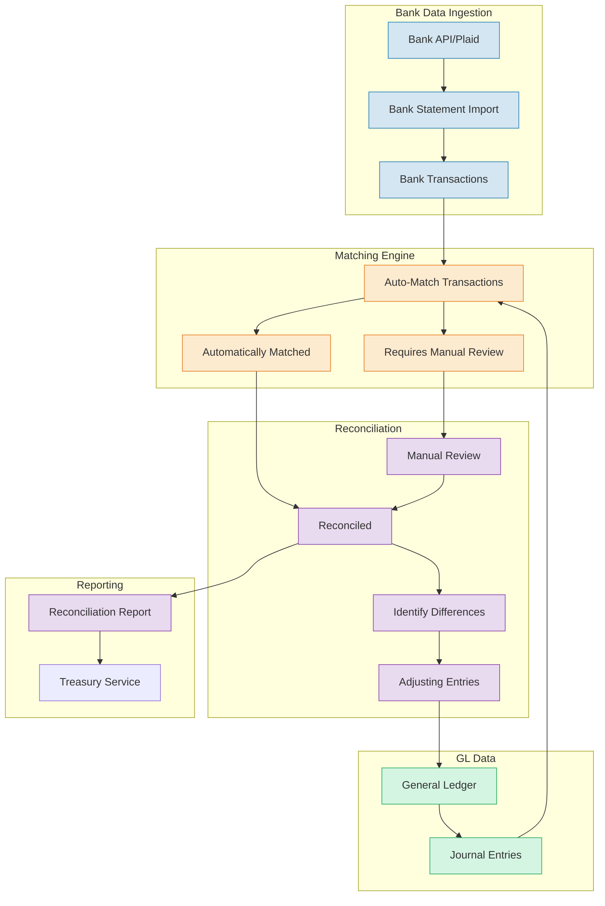
```mermaid
graph TB
    subgraph "Bank Data Ingestion"
        BANK_API[Bank API/Plaid]
        BANK_API --> STATEMENT[Bank Statement Import]
        STATEMENT --> TRANSACTIONS[Bank Transactions]
    end
    
    subgraph "GL Data"
        GL[General Ledger]
        GL --> ENTRIES[Journal Entries]
    end
    
    subgraph "Matching Engine"
        TRANSACTIONS --> MATCH[Auto-Match Transactions]
        ENTRIES --> MATCH
        MATCH --> AUTO[Automatically Matched]
        MATCH --> MANUAL[Requires Manual Review]
    end
    
    subgraph "Reconciliation"
        AUTO --> RECONCILED[Reconciled]
        MANUAL --> REVIEW[Manual Review]
        REVIEW --> RECONCILED
        RECONCILED --> DIFF[Identify Differences]
        DIFF --> ADJUST[Adjusting Entries]
        ADJUST --> GL
    end
    
    subgraph "Reporting"
        RECONCILED --> REPORT[Reconciliation Report]
        REPORT --> TREASURY[Treasury Service]
    end
    
    classDef bank fill:#d4e6f1,stroke:#2980b9
    classDef gl fill:#d5f5e3,stroke:#27ae60
    classDef match fill:#fdebd0,stroke:#e67e22
    classDef recon fill:#e8daef,stroke:#8e44ad
    
    class BANK_API,STATEMENT,TRANSACTIONS bank
    class GL,ENTRIES gl
    class MATCH,AUTO,MANUAL match
    class RECONCILED,REVIEW,DIFF,ADJUST,REPORT,RECONCILED recon
```

---

## 7. Sequence Diagrams

### 7.1 Vendor Invoice to Payment

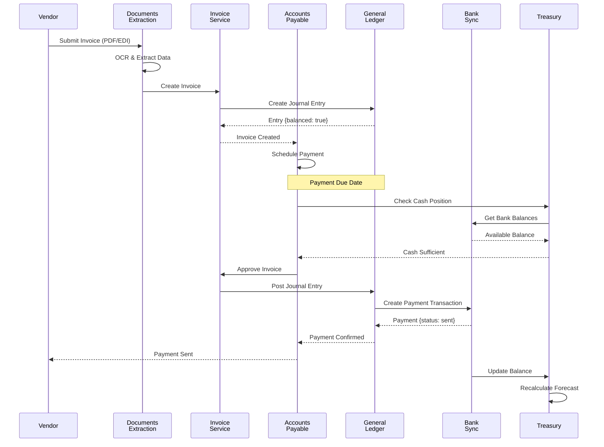
```mermaid
sequenceDiagram
    participant Vendor
    participant DOC as Documents<br/>Extraction
    participant INV as Invoice<br/>Service
    participant AP as Accounts<br/>Payable
    participant GL as General<br/>Ledger
    participant BANK as Bank<br/>Sync
    participant TREASURY as Treasury
    
    Vendor->>DOC: Submit Invoice (PDF/EDI)
    DOC->>DOC: OCR & Extract Data
    DOC->>INV: Create Invoice
    INV->>GL: Create Journal Entry
    GL-->>INV: Entry {balanced: true}
    INV-->>AP: Invoice Created
    AP->>AP: Schedule Payment
    
    Note over AP,GL: Payment Due Date
    AP->>TREASURY: Check Cash Position
    TREASURY->>BANK: Get Bank Balances
    BANK-->>TREASURY: Available Balance
    TREASURY-->>AP: Cash Sufficient
    
    AP->>INV: Approve Invoice
    INV->>GL: Post Journal Entry
    GL->>BANK: Create Payment Transaction
    BANK-->>GL: Payment {status: sent}
    GL-->>AP: Payment Confirmed
    AP-->>Vendor: Payment Sent
    
    BANK->>TREASURY: Update Balance
    TREASURY->>TREASURY: Recalculate Forecast
```

### 7.2 Revenue Recognition Schedule

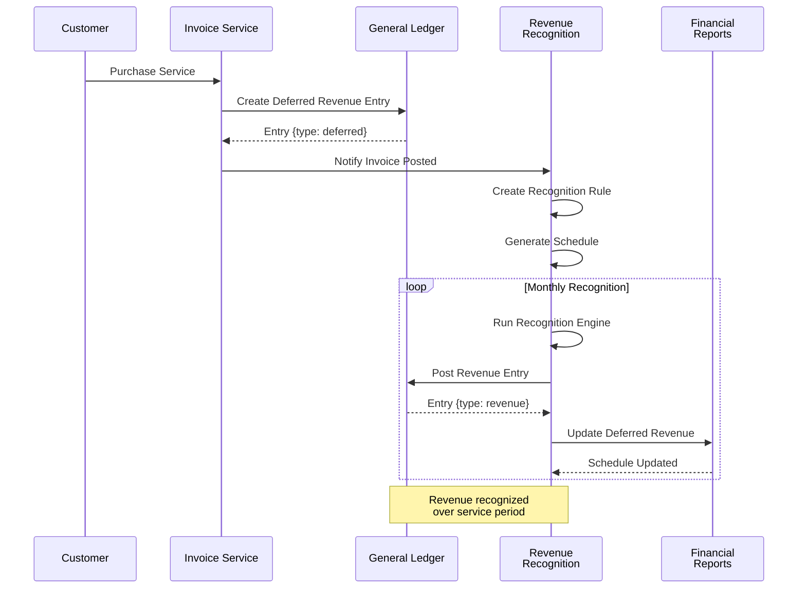
```mermaid
sequenceDiagram
    participant Customer
    participant INV as Invoice Service
    participant GL as General Ledger
    participant REV as Revenue<br/>Recognition
    participant REPORTS as Financial<br/>Reports
    
    Customer->>INV: Purchase Service
    INV->>GL: Create Deferred Revenue Entry
    GL-->>INV: Entry {type: deferred}
    
    INV->>REV: Notify Invoice Posted
    REV->>REV: Create Recognition Rule
    REV->>REV: Generate Schedule
    
    loop Monthly Recognition
        REV->>REV: Run Recognition Engine
        REV->>GL: Post Revenue Entry
        GL-->>REV: Entry {type: revenue}
        REV->>REPORTS: Update Deferred Revenue
        REPORTS-->>REV: Schedule Updated
    end
    
    Note over REV,GL: Revenue recognized<br/>over service period
```

### 7.3 Multi-Entity Consolidation

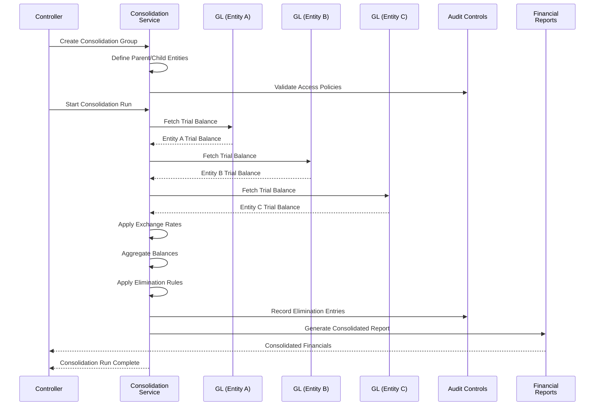
```mermaid
sequenceDiagram
    participant Controller
    participant CONSOL as Consolidation<br/>Service
    participant GL as GL (Entity A)
    participant GL2 as GL (Entity B)
    participant GL3 as GL (Entity C)
    participant AUDIT as Audit Controls
    participant REPORTS as Financial<br/>Reports
    
    Controller->>CONSOL: Create Consolidation Group
    CONSOL->>CONSOL: Define Parent/Child Entities
    CONSOL->>AUDIT: Validate Access Policies
    
    Controller->>CONSOL: Start Consolidation Run
    CONSOL->>GL: Fetch Trial Balance
    GL-->>CONSOL: Entity A Trial Balance
    CONSOL->>GL2: Fetch Trial Balance
    GL2-->>CONSOL: Entity B Trial Balance
    CONSOL->>GL3: Fetch Trial Balance
    GL3-->>CONSOL: Entity C Trial Balance
    
    CONSOL->>CONSOL: Apply Exchange Rates
    CONSOL->>CONSOL: Aggregate Balances
    CONSOL->>CONSOL: Apply Elimination Rules
    CONSOL->>AUDIT: Record Elimination Entries
    
    CONSOL->>REPORTS: Generate Consolidated Report
    REPORTS-->>Controller: Consolidated Financials
    CONSOL-->>Controller: Consolidation Run Complete
```

---

## 8. API Contracts

### 8.1 BFF Aggregation Pattern

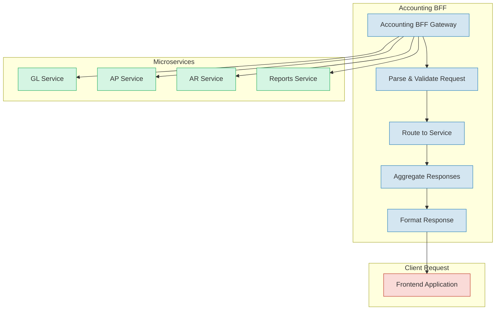
```mermaid
graph TB
    subgraph "Client Request"
        CLIENT[Frontend Application]
    end
    
    subgraph "Accounting BFF"
        BFF[Accounting BFF Gateway]
        BFF --> PARSE[Parse & Validate Request]
        PARSE --> ROUTE[Route to Service]
        ROUTE --> AGGREGATE[Aggregate Responses]
        AGGREGATE --> FORMAT[Format Response]
    end
    
    subgraph "Microservices"
        GL[GL Service]
        AP[AP Service]
        AR[AR Service]
        REPORTS[Reports Service]
    end
    
    BFF --> GL
    BFF --> AP
    BFF --> AR
    BFF --> REPORTS
    
    FORMAT --> CLIENT
    
    classDef client fill:#fadbd8,stroke:#c0392b
    classDef bff fill:#d4e6f1,stroke:#2980b9
    classDef services fill:#d5f5e3,stroke:#27ae60
    
    class CLIENT client
    class BFF,PARSE,ROUTE,AGGREGATE,FORMAT bff
    class GL,AP,AR,REPORTS services
```

### 8.2 Standard Response Format

All services return consistent error responses:

```yaml
# Standard Error Response Schema
ErrorResponse:
  type: object
  required:
    - error_code
    - message
  properties:
    error_code:
      type: string
      example: "VALIDATION_ERROR"
    message:
      type: string
      example: "Invalid request: field 'amount' must be positive"
    details:
      type: array
      items:
        type: object
        properties:
          field:
            type: string
          message:
            type: string

# Standard Success Response (for list endpoints)
PaginatedResponse:
  type: object
  required:
    - total
    - page
    - limit
  properties:
    total:
      type: integer
      example: 150
    page:
      type: integer
      example: 1
    limit:
      type: integer
      example: 20
    items:
      type: array
      items:
        $ref: '#/components/schemas/EntitySchema'
```

### 8.3 OpenAPI Spec Structure

Each service `openapi.yaml` follows this structure:

```yaml
openapi: 3.1.0
info:
  title: Service Name
  version: 1.0.0
  description: Service description
  
servers:
  - url: https://{tenant}.{company}.rerp.local/api/v1

security:
  - bearerAuth: []

paths:
  /entities:
    get:
      operationId: listEntities
      parameters:
        - $ref: '#/components/parameters/CompanyId'
        - $ref: '#/components/parameters/Page'
        - $ref: '#/components/parameters/Limit'
      responses:
        '200':
          description: Paginated list
          content:
            application/json:
              schema:
                $ref: '#/components/schemas/PaginatedEntities'
    post:
      operationId: createEntity
      x-brrtrouter-impl: true
      requestBody:
        required: true
        content:
          application/json:
            schema:
              $ref: '#/components/schemas/CreateEntityRequest'
      responses:
        '201':
          description: Entity created
        '400':
          description: Validation error
          content:
            application/json:
              schema:
                $ref: '#/components/schemas/ErrorResponse'
        '401':
          description: Unauthorized
        '403':
          description: Forbidden
        '409':
          description: Conflict

components:
  securitySchemes:
    httpBearer:
      type: http
      scheme: bearer
      bearerFormat: JWT
  parameters:
    CompanyId:
      name: X-Company-ID
      in: header
      required: true
      schema:
        type: string
        format: uuid
    Page:
      name: page
      in: query
      schema:
        type: integer
        default: 1
    Limit:
      name: limit
      in: query
      schema:
        type: integer
        default: 20
  schemas:
    PaginatedResponse:
      type: object
      required:
        - total
        - page
        - limit
      properties:
        total:
          type: integer
        page:
          type: integer
        limit:
          type: integer
```

---

## 9. Integration Patterns

### 9.1 Event-Driven Architecture

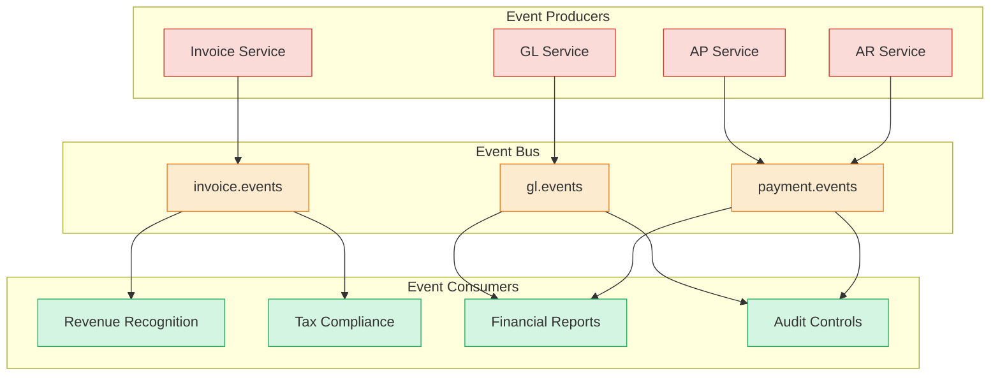
```mermaid
graph TB
    subgraph "Event Producers"
        PROD1[Invoice Service]
        PROD2[GL Service]
        PROD3[AP Service]
        PROD4[AR Service]
    end
    
    subgraph "Event Bus"
        TOPIC_INVOICE[invoice.events]
        TOPIC_GL[gl.events]
        TOPIC_PAYMENT[payment.events]
    end
    
    subgraph "Event Consumers"
        CONS1[Revenue Recognition]
        CONS2[Tax Compliance]
        CONS3[Financial Reports]
        CONS4[Audit Controls]
    end
    
    PROD1 --> TOPIC_INVOICE
    PROD2 --> TOPIC_GL
    PROD3 --> TOPIC_PAYMENT
    PROD4 --> TOPIC_PAYMENT
    
    TOPIC_INVOICE --> CONS1
    TOPIC_INVOICE --> CONS2
    TOPIC_GL --> CONS3
    TOPIC_GL --> CONS4
    TOPIC_PAYMENT --> CONS3
    TOPIC_PAYMENT --> CONS4
    
    classDef producer fill:#fadbd8,stroke:#c0392b
    classDef bus fill:#fdebd0,stroke:#e67e22
    classDef consumer fill:#d5f5e3,stroke:#27ae60
    
    class PROD1,PROD2,PROD3,PROD4 producer
    class TOPIC_INVOICE,TOPIC_GL,TOPIC_PAYMENT bus
    class CONS1,CONS2,CONS3,CONS4 consumer
```

### 9.2 Cross-Service API Calls

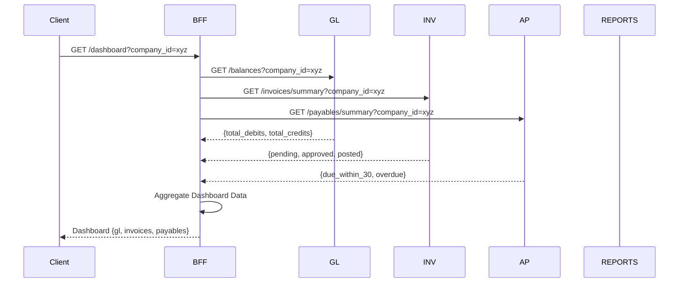
```mermaid
sequenceDiagram
    participant Client
    participant BFF
    participant GL
    participant INV
    participant AP
    participant REPORTS
    
    Client->>BFF: GET /dashboard?company_id=xyz
    BFF->>GL: GET /balances?company_id=xyz
    BFF->>INV: GET /invoices/summary?company_id=xyz
    BFF->>AP: GET /payables/summary?company_id=xyz
    
    GL-->>BFF: {total_debits, total_credits}
    INV-->>BFF: {pending, approved, posted}
    AP-->>BFF: {due_within_30, overdue}
    
    BFF->>BFF: Aggregate Dashboard Data
    BFF-->>Client: Dashboard {gl, invoices, payables}
```

---

## 10. Security & Multi-Tenancy

### 10.1 Tenancy Model

```mermaid
graph TB
    subgraph "Tenant Isolation"
        TENANT1[Tenant 1]
        TENANT2[Tenant 2]
        TENANT3[Tenant 3]
    end
    
    subgraph "Schema Isolation"
        SCHEMA1[Schema: tenant_1_*]
        SCHEMA2[Schema: tenant_2_*]
        SCHEMA3[Schema: tenant_3_*]
    end
    
    subgraph "RLS Policies"
        RLS[Row-Level Security<br/>company_id filter]
        RLS --> VERIFY[JWT Validation]
        VERIFY --> TENANT[Extract Tenant ID]
        TENANT --> FILTER[Apply company_id WHERE clause]
    end
    
    TENANT1 --> SCHEMA1
    TENANT2 --> SCHEMA2
    TENANT3 --> SCHEMA3
    
    SCHEMA1 -.->|RLS| RLS
    SCHEMA2 -.->|RLS| RLS
    SCHEMA3 -.->|RLS| RLS
    
    classDef tenant fill:#d5f5e3,stroke:#27ae60
    classDef schema fill:#d4e6f1,stroke:#2980b9
    classDef security fill:#fadbd8,stroke:#c0392b
    
    class TENANT1,TENANT2,TENANT3 tenant
    class SCHEMA1,SCHEMA2,SCHEMA3 schema
    class RLS,VERIFY,TENANT,FILTER security
```

### 10.2 Authentication Flow

```mermaid
sequenceDiagram
    participant User
    participant Frontend
    participant BFF
    participant Auth
    participant Gateway
    
    User->>Frontend: Login
    Frontend->>Auth: POST /auth/login
    Auth-->>Frontend: JWT Token
    Frontend->>BFF: GET /api/v1/invoices
    Note over Frontend,BFF: Authorization: Bearer <token>
    BFF->>BFF: Validate JWT
    BFF->>BFF: Extract tenant_id
    BFF->>BFF: Extract company_id
    BFF->>GL: Forward Request<br/>+ X-Tenant-ID<br/>+ X-Company-ID
    GL->>GL: Validate tenant access
    GL-->>BFF: Response (filtered by tenant)
    BFF-->>Frontend: Response
    Frontend-->>User: Display Data
```

### 10.3 Role-Based Access Control

```mermaid
graph TB
    subgraph "RBAC Hierarchy"
        ROLE_ADMIN[Administrator<br/>Full Access]
        ROLE_ACC_MGR[Accounting Manager<br/>Approve/Post/Closed]
        ROLE_ACCOUNTANT[Accountant<br/>Create/Edit/Submit]
        ROLE_CLERK[Clerk<br/>Create Only]
        ROLE_VIEWER[Viewer<br/>Read Only]
    end
    
    subgraph "Service-Level Permissions"
        GL_PERM[GL: All Operations]
        AP_PERM[AP: Invoices, Payments]
        AR_PERM[AR: Invoices, Collections]
        REPORTS_PERM[Reports: Read Only]
    end
    
    ROLE_ADMIN --> GL_PERM
    ROLE_ACC_MGR --> GL_PERM
    ROLE_ACC_MGR --> AP_PERM
    ROLE_ACCOUNTANT --> AP_PERM
    ROLE_ACCOUNTANT --> AR_PERM
    ROLE_CLERK --> AP_PERM
    ROLE_CLERK --> AR_PERM
    ROLE_VIEWER --> REPORTS_PERM
    
    classDef admin fill:#fadbd8,stroke:#c0392b
    classDef manager fill:#fdebd0,stroke:#e67e22
    classDef accountant fill:#d5f5e3,stroke:#27ae60
    classDef clerk fill:#d4e6f1,stroke:#2980b9
    classDef viewer fill:#e8daef,stroke:#8e44ad
    
    class ROLE_ADMIN admin
    class ROLE_ACC_MGR manager
    class ROLE_ACCOUNTANT accountant
    class ROLE_CLERK clerk
    class ROLE_VIEWER viewer
```

---

## 11. Implementation Roadmap

### 11.1 Phased Delivery

```mermaid
gantt
    title RERP Accounting Suite Implementation
    dateFormat YYYY-MM
    axisFormat %Y-%m
    
    section Phase 1: Core Foundation
    General Ledger          :done,    gl,    2026-01, 2026-03
    Chart of Accounts       :done,    coa,   2026-01, 2026-02
    Journal Entries         :done,    je,    2026-02, 2026-03
    Double-Entry Engine     :done,    de,    2026-03, 2026-04
    
    section Phase 2: Core Operations
    Invoice Service         :active,  inv,   2026-04, 2026-05
    Accounts Payable        :         ap,    2026-05, 2026-07
    Accounts Receivable     :         ar,    2026-05, 2026-07
    Bank Sync               :         bank,  2026-06, 2026-07
    
    section Phase 3: Advanced
    Revenue Recognition     :         rev,   2026-07, 2026-08
    Tax Compliance          :         tax,   2026-08, 2026-09
    Lease Accounting        :         lease, 2026-09, 2026-10
    Consolidation           :         consol,2026-10, 2026-11
    
    section Phase 4: Management
    Treasury & Cash         :         treas, 2026-09, 2026-10
    Budget Management       :         budget,2026-10, 2026-11
    Financial Reports       :         report,2026-08, 2026-09
    
    section Phase 5: Operations
    Asset Management        :         asset, 2026-08, 2026-09
    Audit Controls          :         audit, 2026-09, 2026-10
    Documents Extraction    :         doc,   2026-10, 2026-11
    EDI & Compliance        :         edi,   2026-11, 2026-12
```

### 11.2 Sprint Breakdown (Phase 1)

```mermaid
graph LR
    subgraph "Sprint 1: GL Foundation"
        S1A[Chart of Accounts Schema]
        S1B[Account CRUD]
        S1C[Chart Template System]
    end
    
    subgraph "Sprint 2: Journal Entries"
        S2A[Journal Entry Schema]
        S2B[Line Item Management]
        S2C[Balance Verification]
    end
    
    subgraph "Sprint 3: Posting Engine"
        S3A[Post/Unpost Operations]
        S3B[Bulk Operations]
        S3C[Period Locking]
    end
    
    subgraph "Sprint 4: Audit & Reports"
        S4A[Audit Trail]
        S4B[Trial Balance Report]
        S4C[Account Balances]
    end
    
    S1A --> S1B --> S1C --> S2A --> S2B --> S2C --> S3A --> S3B --> S3C --> S4A --> S4B --> S4C
    
    classDef sprint fill:#d4e6f1,stroke:#2980b9
    class S1A,S1B,S1C,S2A,S2B,S2C,S3A,S3B,S3C,S4A,S4B,S4C sprint
```

---

## Appendix

### A. OpenAPI Spec Compliance Checklist

Each service must pass:

- [ ] `components` contains exactly 3 keys: `securitySchemes`, `parameters`, `schemas`
- [ ] Global security uses `bearerAuth: []`
- [ ] All list endpoints return `PaginatedResponse` → `Paginated<Entity>`
- [ ] All mutations (POST/PUT/PATCH) have `x-brrtrouter-impl: true`
- [ ] All mutations include `400`, `401`, `403`, `409` error responses
- [ ] No inline list schemas on collection endpoints
- [ ] All required fields marked in request/response schemas
- [ ] `brrtrouter-gen lint` passes

### B. Service Port Assignments

| Service | Default Port |
|---------|--------------|
| Accounting BFF | 10350 |
| General Ledger | 10351 |
| Accounts Payable | 10352 |
| Accounts Receivable | 10353 |
| Invoice | 10354 |
| Revenue Recognition | 10355 |
| Tax Compliance | 10356 |
| Lease Accounting | 10357 |
| Consolidation | 10358 |
| Bank Sync | 10359 |
| Treasury & Cash | 10360 |
| Budget Management | 10361 |
| Financial Reports | 10362 |
| Asset Management | 10363 |
| Audit Controls | 10364 |
| Documents Extraction | 10365 |
| EDI & Compliance | 10366 |

### C. Key Metrics

- **Total Services:** 16
- **Total Schemas:** 431
- **Total Paths:** 203
- **Total Mutations:** ~150
- **Average Schemas per Service:** 27
- **Largest Service:** General Ledger (93 schemas, 44 paths)
- **Smallest Services:** Treasury, Lease Accounting, Revenue Recognition (15-16 schemas)

---

*This document is a living specification. Update as services evolve.*
