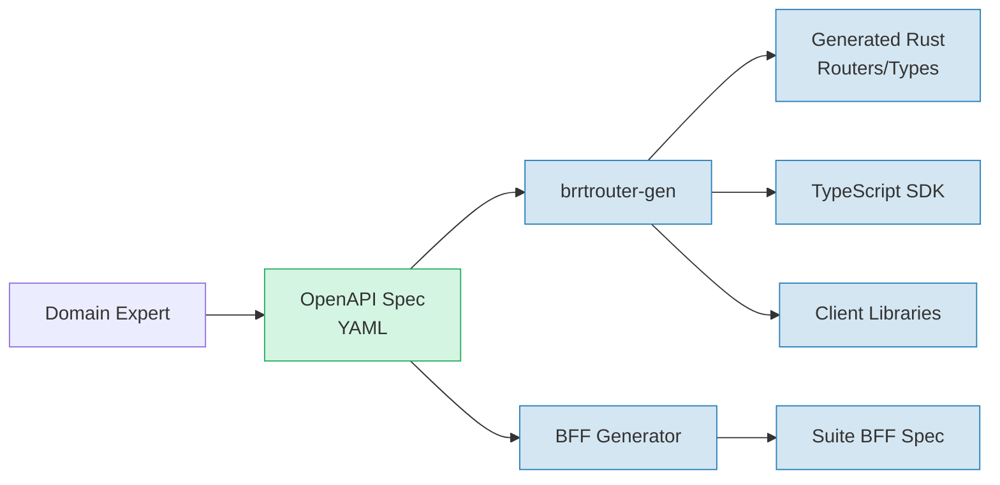
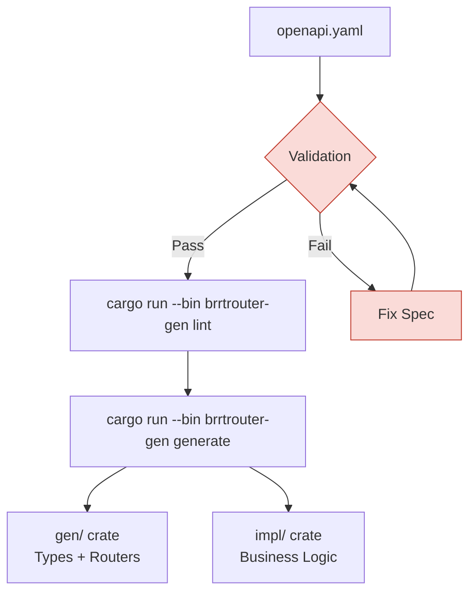
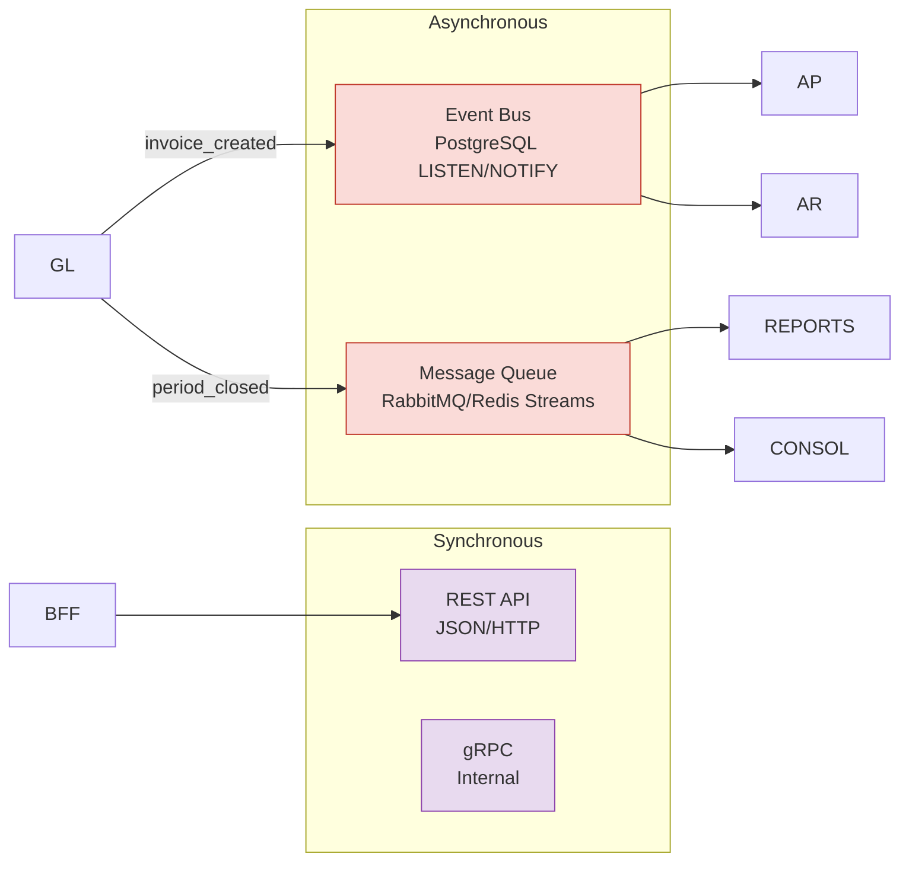
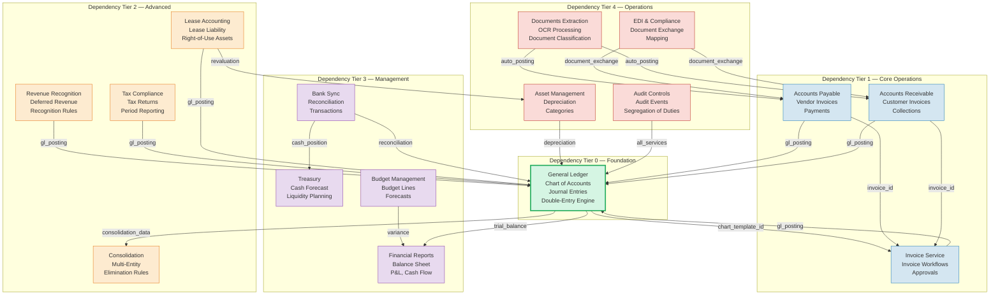
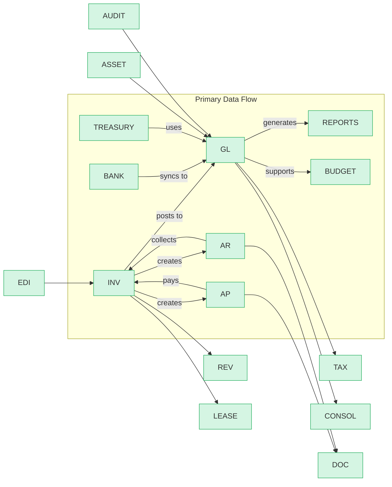
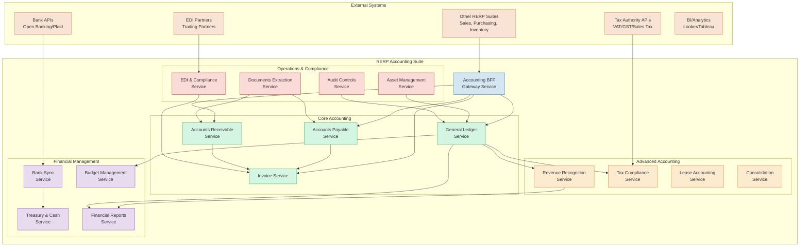

# System Overview & Architecture

> Part of RERP Accounting Suite Design
> See [main DESIGN.md](../DESIGN.md) for complete reference

---

## Architecture Principles

### OpenAPI-First Design

Every service is defined in OpenAPI 3.1.0 before implementation. The spec is the source of truth.



### BRRRouter Convention Compliance

All specs adhere to strict conventions:



**Key Conventions:**
- `components` contains exactly 3 keys: `securitySchemes`, `parameters`, `schemas`
- Global security: `bearerAuth: []` referencing `httpBearer`
- List endpoints return `PaginatedResponse` → `Paginated<Entity>`
- All mutations (POST/PUT/PATCH) have `x-brrtrouter-impl: true`
- All mutations include `400`, `401`, `403`, `409` error responses

### Database Strategy

```mermaid
graph TB
    subgraph "Shared PostgreSQL Cluster"
        DB[PostgreSQL 16<br/>Primary]
        
        subgraph "Schema-per-Service"
            SCHEMA_GL[general_ledger schema]
            SCHEMA_AP[accounts_payable schema]
            SCHEMA_AR[accounts_receivable schema]
            SCHEMA_INV[invoice schema]
            SCHEMA_OTHER[other 12 schemas]
        end
        
        DB --> SCHEMA_GL
        DB --> SCHEMA_AP
        DB --> SCHEMA_AR
        DB --> SCHEMA_INV
        DB --> SCHEMA_OTHER
    end
    
    subgraph "Cross-Service References"
        FK[Fake Foreign Keys<br/>via application logic<br/>NOT database-level]
        PK[(Primary Key)<br/>company_id + id<br/>composite key]
    end
    
    SCHEMA_GL -.->|company_id join| SCHEMA_AP
    SCHEMA_AP -.->|invoice_id| SCHEMA_INV
    SCHEMA_AR -.->|invoice_id| SCHEMA_INV
    
    classDef db fill:#d4e6f1,stroke:#2980b9
    classDef schema fill:#d5f5e3,stroke:#27ae60
    classDef cross fill:#fdebd0,stroke:#e67e22
    
    class DB db
    class SCHEMA_GL,SCHEMA_AP,SCHEMA_AR,SCHEMA_INV,SCHEMA_OTHER schema
    class FK,PK cross
```

**Database Rules:**
- Each service owns its schema exclusively
- No database-level foreign keys between schemas (services are independent)
- Cross-service references are application-level via `company_id` joins
- Shared domain entities (Company, User, Tenant) live in a shared `entities` crate

### Communication Patterns



---

## Service Inventory

| # | Service | OpenAPI Spec | Schema Count | Path Count | Tier |
|---|---------|--------------|--------------|------------|------|
| 1 | General Ledger | `general-ledger/openapi.yaml` | 93 | 44 | Foundation |
| 2 | Accounts Payable | `accounts-payable/openapi.yaml` | 28 | 12 | Core |
| 3 | Accounts Receivable | `accounts-receivable/openapi.yaml` | 39 | 18 | Core |
| 4 | Invoice | `invoice/openapi.yaml` | 24 | 17 | Core |
| 5 | Revenue Recognition | `revenue-recognition/openapi.yaml` | 15 | 6 | Advanced |
| 6 | Tax Compliance | `tax-compliance/openapi.yaml` | 21 | 7 | Advanced |
| 7 | Lease Accounting | `lease-accounting/openapi.yaml` | 15 | 6 | Advanced |
| 8 | Consolidation | `consolidation/openapi.yaml` | 16 | 6 | Advanced |
| 9 | Bank Sync | `bank-sync/openapi.yaml` | 29 | 18 | Management |
| 10 | Treasury & Cash | `treasury/openapi.yaml` | 16 | 5 | Management |
| 11 | Budget Management | `budget/openapi.yaml` | 19 | 11 | Management |
| 12 | Financial Reports | `financial-reports/openapi.yaml` | 29 | 14 | Management |
| 13 | Asset Management | `asset/openapi.yaml` | 27 | 14 | Operations |
| 14 | Audit Controls | `audit-controls/openapi.yaml` | 17 | 6 | Operations |
| 15 | Documents Extraction | `documents-extraction/openapi.yaml` | 17 | 7 | Operations |
| 16 | EDI & Compliance | `edi/openapi.yaml` | 26 | 12 | Operations |

**Totals:** 431 schemas, 203 paths, 16 services

---

## Service Topology

### Dependency Graph



### Service Interaction Matrix



---

## System Overview



---

*Continue to [Domain Model](./02-domain-model.md)*
