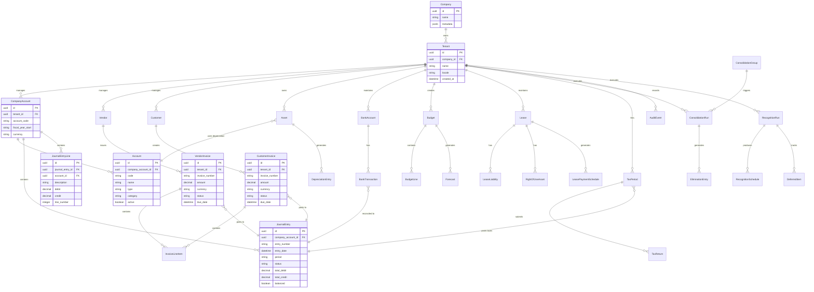
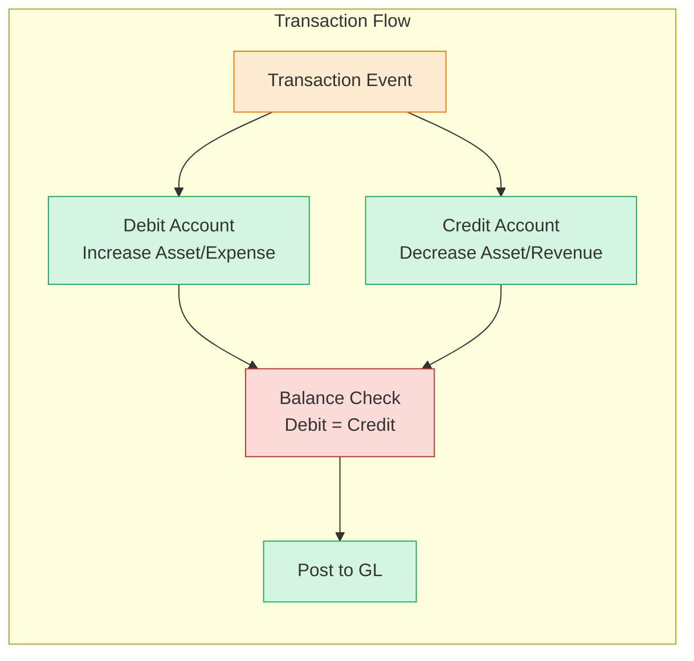
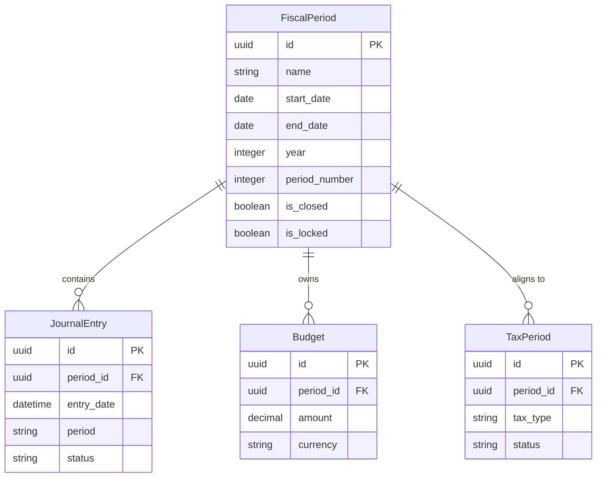

# Domain Model

> Part of RERP Accounting Suite Design
> See [main DESIGN.md](../DESIGN.md) for complete reference

---

## Core Entities

---

## Entity Ownership Matrix

```mermaid
graph TB
    subgraph "Owned By Service"
        GL_OWN[JournalEntry<br/>JournalEntryLine<br/>Account<br/>CompanyAccount<br/>ChartOfAccount]
        AP_OWN[VendorInvoice<br/>VendorPayment<br/>ApprovalRequest<br/>CashFlowForecast]
        AR_OWN[CustomerInvoice<br/>PaymentApplication<br/>CollectionCase<br/>AgingSummary]
        INV_OWN[InvoiceApproval<br/>InvoiceHandoff<br/>InvoicePaymentMatch]
        REV_OWN[RecognitionRule<br/>RecognitionRun<br/>RecognitionSchedule<br/>DeferredItem]
        TAX_OWN[TaxPeriod<br/>TaxReturn<br/>TaxPayment<br/>TaxRule]
        LEASE_OWN[Lease<br/>LeaseLiability<br/>RightOfUseAsset<br/>LeasePaymentSchedule]
        CONSOL_OWN[ConsolidationGroup<br/>ConsolidationRun<br/>EliminationRule<br/>EliminationEntry]
        BANK_OWN[BankAccount<br/>BankTransaction<br/>BankReconciliation<br/>BankStatement]
        TREASURY_OWN[CashPosition<br/>CashForecast<br/>CashTransfer<br/>LiquidityPlan]
        BUDGET_OWN[Budget<br/>BudgetLine<br/>BudgetRevision<br/>Forecast]
        REPORTS_OWN[BalanceSheet<br/>IncomeStatement<br/>CashFlowStatement<br/>TrialBalance]
        ASSET_OWN[Asset<br/>AssetCategory<br/>DepreciationEntry<br/>DepreciationSchedule]
        AUDIT_OWN[AuditEvent<br/>ApprovalPolicy<br/>SegregationRule<br/>ControlException]
        DOC_OWN[ExtractionJob<br/>ExtractionResult<br/>DocumentClassification<br/>AccountingDocument]
        EDI_OWN[EdiDocument<br/>EdiMapping<br/>EdiProfile<br/>EdiSubmission]
    end
    
    subgraph "Shared/Referenced"
        SHARED[Company<br/>User<br/>Tenant<br/>Currency<br/>FiscalPeriod]
    end
    
    SHARED -.-> GL_OWN
    SHARED -.-> AP_OWN
    SHARED -.-> AR_OWN
    SHARED -.-> INV_OWN
    SHARED -.-> REV_OWN
    SHARED -.-> TAX_OWN
    SHARED -.-> LEASE_OWN
    SHARED -.-> CONSOL_OWN
    SHARED -.-> BANK_OWN
    SHARED -.-> TREASURY_OWN
    SHARED -.-> BUDGET_OWN
    SHARED -.-> REPORTS_OWN
    SHARED -.-> ASSET_OWN
    SHARED -.-> AUDIT_OWN
    SHARED -.-> DOC_OWN
    SHARED -.-> EDI_OWN
    
    classDef owned fill:#d5f5e3,stroke:#27ae60
    classDef shared fill:#d4e6f1,stroke:#2980b9
    
    class GL_OWN,AP_OWN,AR_OWN,INV_OWN,REV_OWN,TAX_OWN,LEASE_OWN,CONSOL_OWN,BANK_OWN,TREASURY_OWN,BUDGET_OWN,REPORTS_OWN,ASSET_OWN,AUDIT_OWN,DOC_OWN,EDI_OWN owned
    class SHARED shared
```

---

## Key Domain Concepts

### Double-Entry Accounting

Every financial transaction affects at least two accounts:
- **Debits** increase assets/expenses, decrease liabilities/revenue
- **Credits** decrease assets/expenses, increase liabilities/revenue
- Every journal entry must balance: `sum(debits) == sum(credits)`

### Fiscal Period Management

### Chart of Accounts Hierarchy

```mermaid
graph TB
    COA[Chart of Accounts]
    
    COA --> ASSETS[1000-1999: Assets]
    COA --> LIABILITIES[2000-2999: Liabilities]
    COA --> EQUITY[3000-3999: Equity]
    COA --> REVENUE[4000-4999: Revenue]
    COA --> EXPENSES[5000-5999: Expenses]
    
    ASSETS --> CURRENT[Current Assets<br/>1000-1999]
    ASSETS --> NON_CURRENT[Non-Current Assets<br/>1000-1999]
    
    CURRENT --> CASH[Cash & Equivalents<br/>1000-1099]
    CURRENT --> AR[Accounts Receivable<br/>1100-1199]
    CURRENT --> INV[Inventory<br/>1200-1299]
    
    NON_CURRENT --> PP&E[Property, Plant, Equip<br/>1500-1599]
    NON_CURRENT --> INTANGIBLE[Intangible Assets<br/>1600-1699]
    
    LIABILITIES --> CURRENT_LIAB[Current Liabilities<br/>2000-2999]
    LIABILITIES --> LONG_TERM[Long-Term Liabilities<br/>2500-2999]
    
    CURRENT_LIAB --> AP[Accounts Payable<br/>2000-2099]
    CURRENT_LIAB --> TAX_LIAB[Taxes Payable<br/>2100-2199]
    
    EQUITY --> COMMON_STOCK[Common Stock<br/>3000-3099]
    EQUITY --> RETAINED[Retained Earnings<br/>3100-3199]
    
    REVENUE --> SALES[Sales Revenue<br/>4000-4099]
    REVENUE --> OTHER_REV[Other Revenue<br/>4900-4999]
    
    EXPENSES --> COGS[Cost of Goods Sold<br/>5000-5099]
    EXPENSES --> OP_EXP[Operating Expenses<br/>5100-5999]
    
    classDef root fill:#d4e6f1,stroke:#2980b9,stroke-width:3px
    classDef category fill:#d5f5e3,stroke:#27ae60
    classDef sub fill:#e8daef,stroke:#8e44ad
    classDef leaf fill:#fadbd8,stroke:#c0392b
    
    class COA root
    class ASSETS,LIABILITIES,EQUITY,REVENUE,EXPENSES category
    class CURRENT,NON_CURRENT,CURRENT_LIAB,LONG_TERM,COMMON_STOCK,RETAINED,SALES,OTHER_REV,COGS,OP_EXP sub
    class CASH,AR,INV,PP&E,INTANGIBLE,AP,TAX_LIAB,REVENUE,EXPENSES leaf
```

---

*Continue to [Entity Relationships](./03-entity-relationships.md)*
