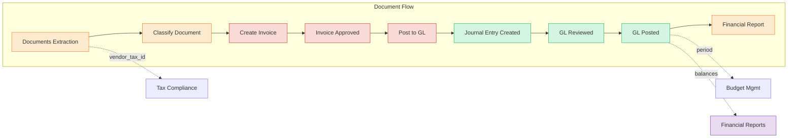
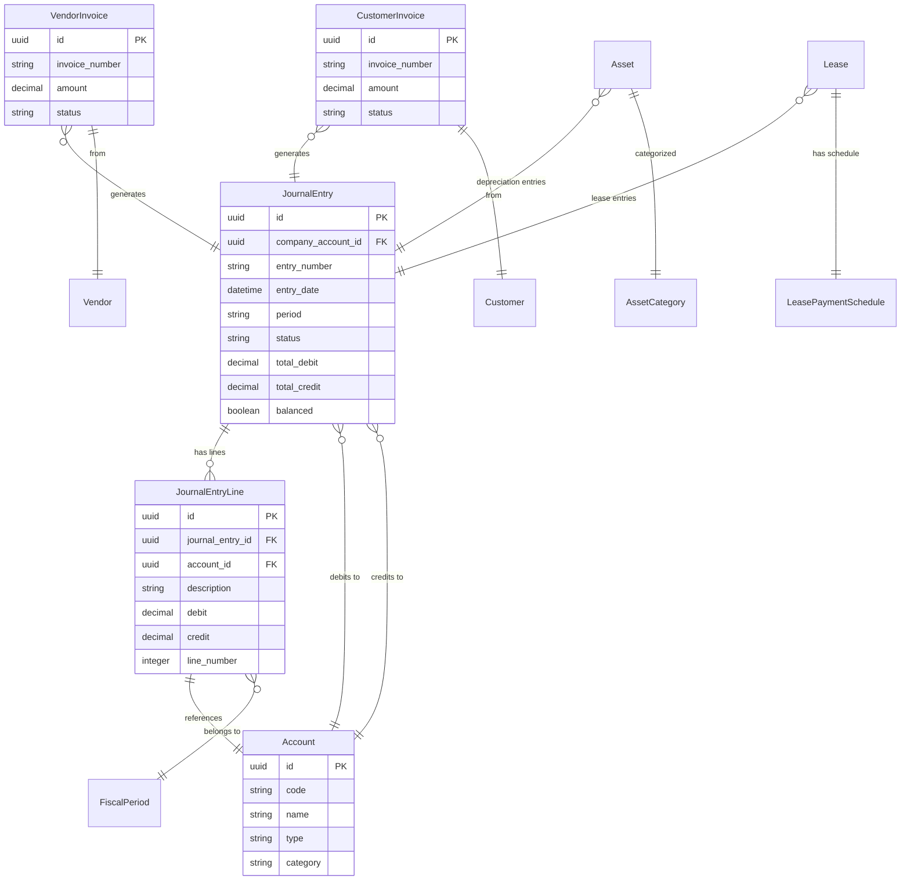
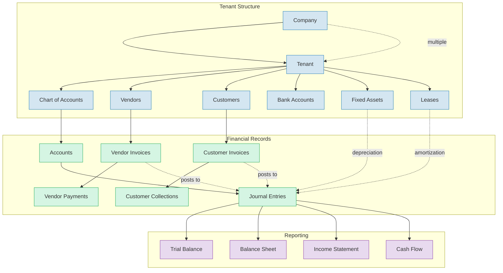
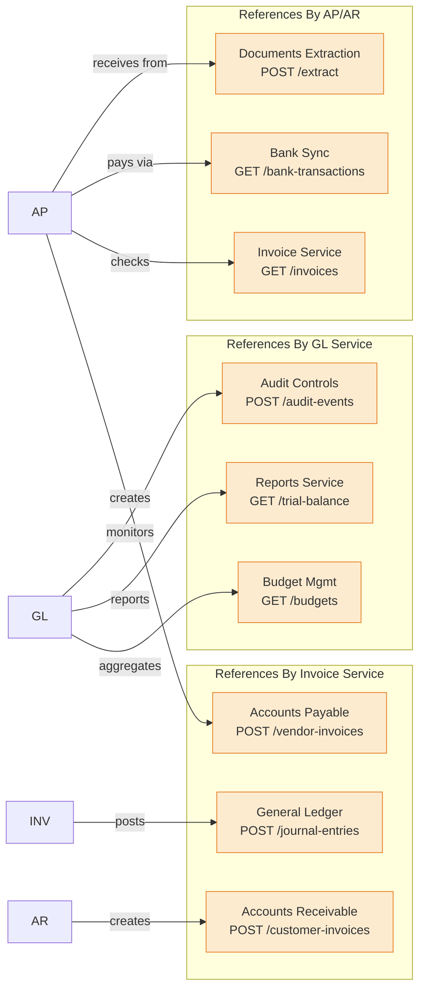
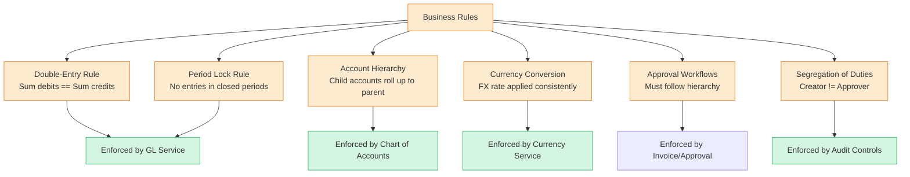

# Entity Relationships

> Part of RERP Accounting Suite Design
> See [main DESIGN.md](../DESIGN.md) for complete reference

---

## Cross-Service Entity Links

### Accounting Document Flow

### Financial Transaction Flow

### Master Data Relationships

---

## Cross-Service API Relationships

### Service-to-Service References

### Shared Entity Dependencies

```mermaid
graph TB
    subgraph "Shared Domain Entities"
        COMPANY[Company]
        TENANT[Tenant]
        USER[User]
        CURRENCY[Currency]
        FISCAL_PERIOD[FiscalPeriod]
    end
    
    subgraph "Dependent Services"
        GL[General Ledger]
        AP[Accounts Payable]
        AR[Accounts Receivable]
        INV[Invoice Service]
        TAX[Tax Compliance]
        BUDGET[Budget Management]
        REPORTS[Financial Reports]
    end
    
    COMPANY -.-> GL
    TENANT -.-> GL
    CURRENCY -.-> GL
    FISCAL_PERIOD -.-> GL
    
    COMPANY -.-> AP
    TENANT -.-> AP
    CURRENCY -.-> AP
    FISCAL_PERIOD -.-> AP
    
    COMPANY -.-> AR
    TENANT -.-> AR
    CURRENCY -.-> AR
    FISCAL_PERIOD -.-> AR
    
    COMPANY -.-> INV
    TENANT -.-> INV
    CURRENCY -.-> INV
    FISCAL_PERIOD -.-> INV
    
    COMPANY -.-> TAX
    TENANT -.-> TAX
    CURRENCY -.-> TAX
    FISCAL_PERIOD -.-> TAX
    
    COMPANY -.-> BUDGET
    TENANT -.-> BUDGET
    CURRENCY -.-> BUDGET
    FISCAL_PERIOD -.-> BUDGET
    
    COMPANY -.-> REPORTS
    TENANT -.-> REPORTS
    CURRENCY -.-> REPORTS
    FISCAL_PERIOD -.-> REPORTS
    
    classDef shared fill:#d4e6f1,stroke:#2980b9,stroke-width:3px
    classDef service fill:#d5f5e3,stroke:#27ae60
    
    class COMPANY,TENANT,USER,CURRENCY,FISCAL_PERIOD shared
    class GL,AP,AR,INV,TAX,BUDGET,REPORTS service
```

---

## Constraint Relationships

### Business Rules

---

*Continue to [Data Flow](./04-data-flow.md)*
