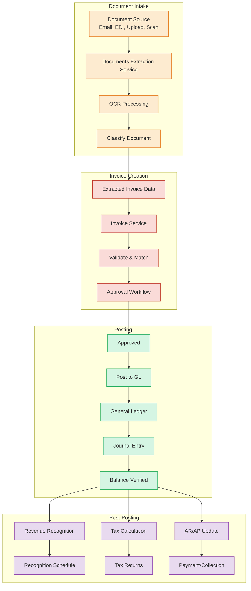
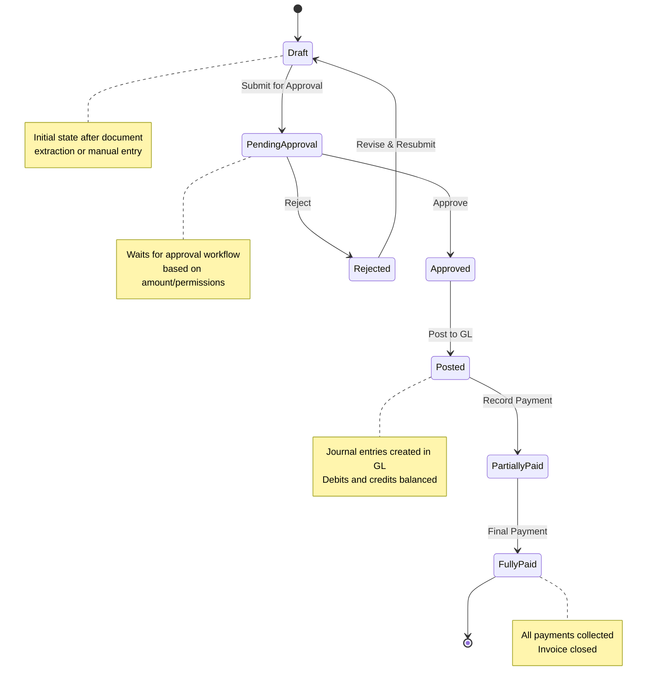
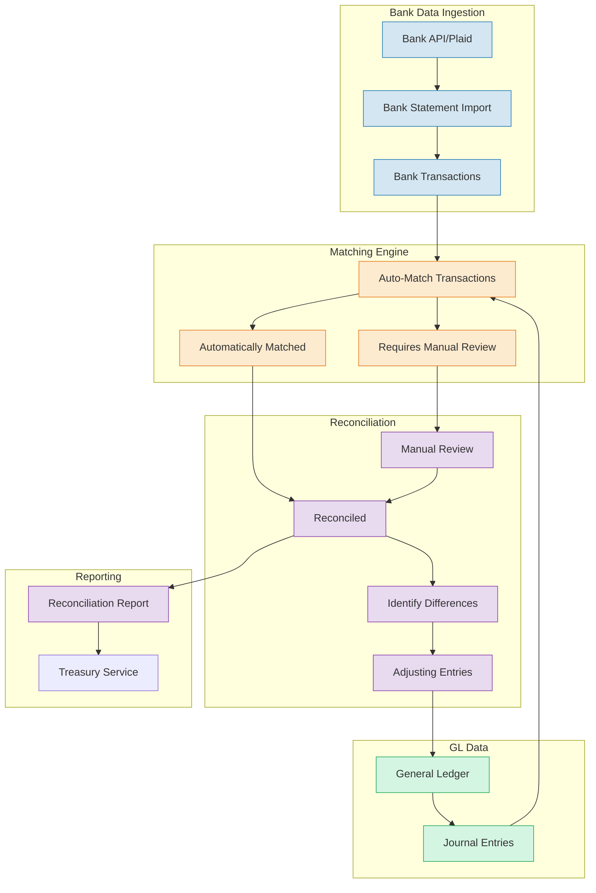
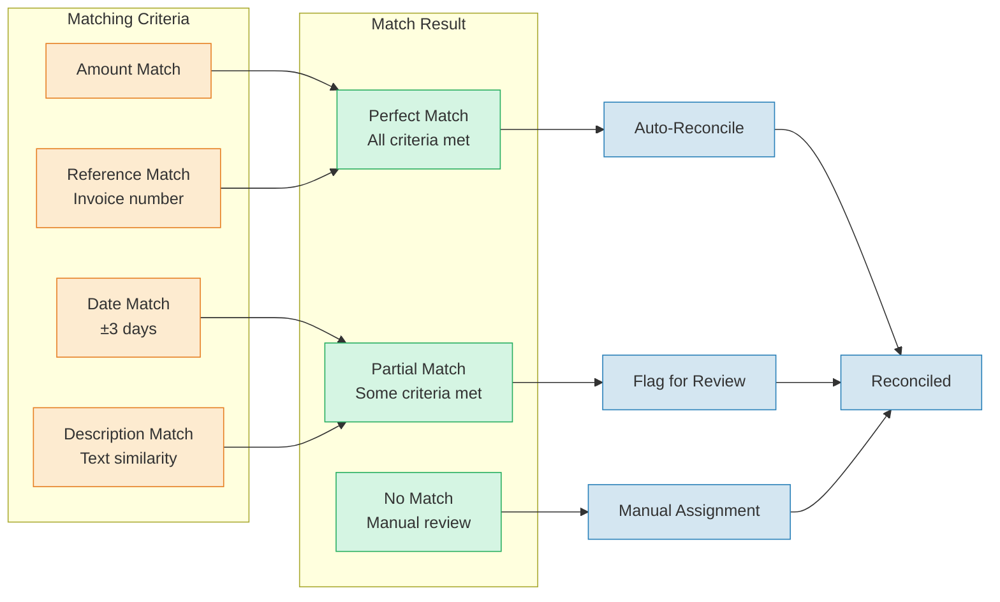
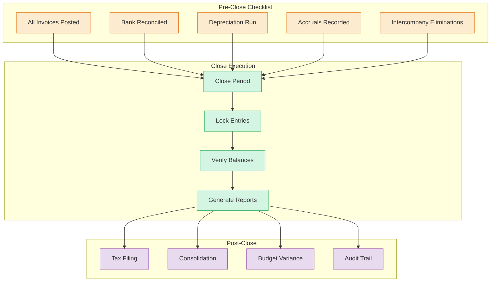
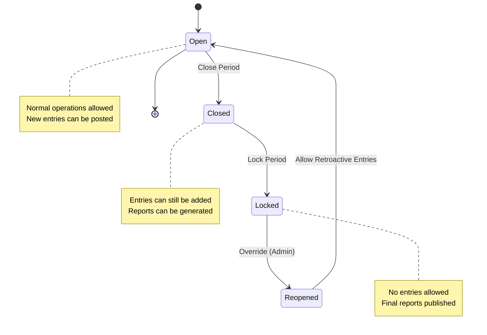
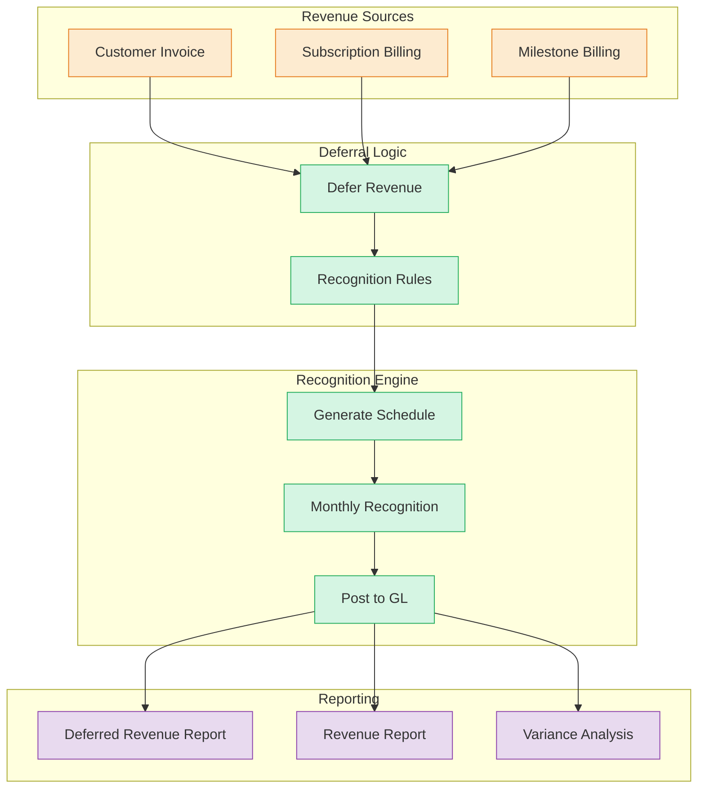

# Data Flow

> Part of RERP Accounting Suite Design
> See [main DESIGN.md](../DESIGN.md) for complete reference

---

## Invoice Processing Pipeline

### Invoice State Machine

---

## Bank Reconciliation Flow

### Reconciliation Matching Logic

---

## Month-End Close Process

### Close Workflow

### Period State Machine

---

## Revenue Recognition Flow

---

*Continue to [Sequence Diagrams](./05-sequence-diagrams.md)*
