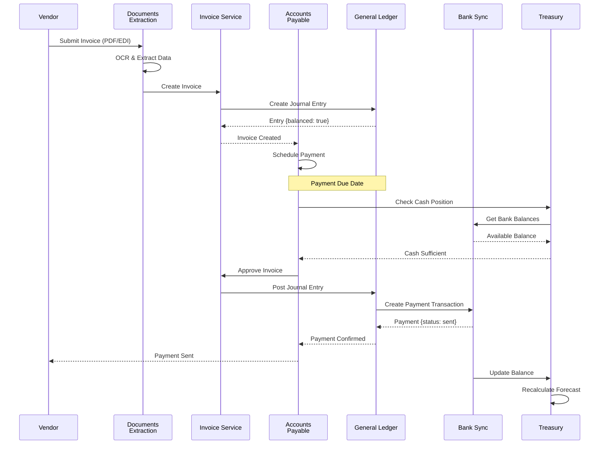
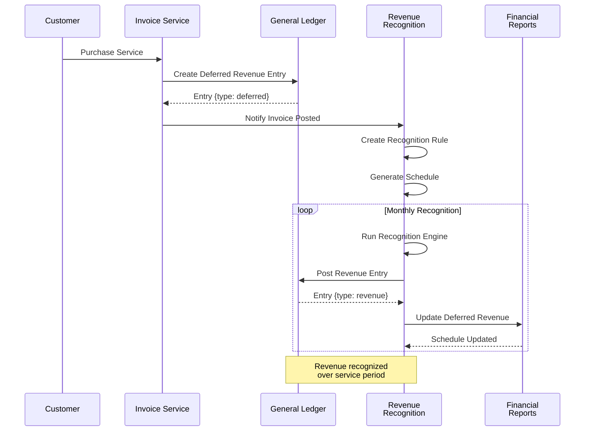
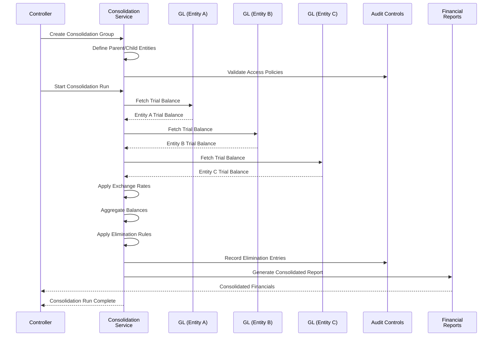
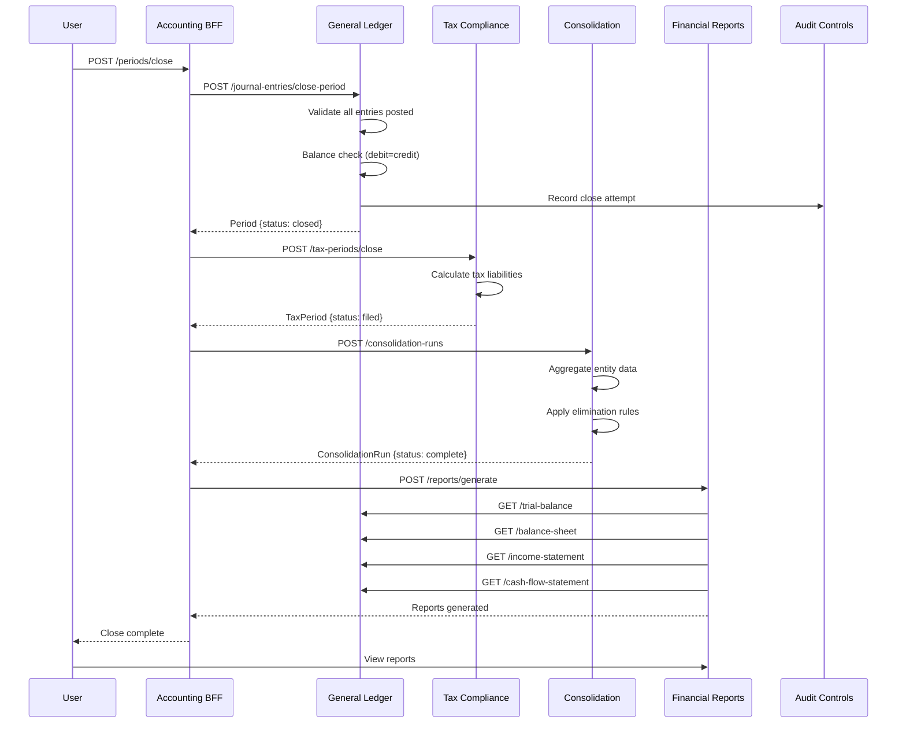
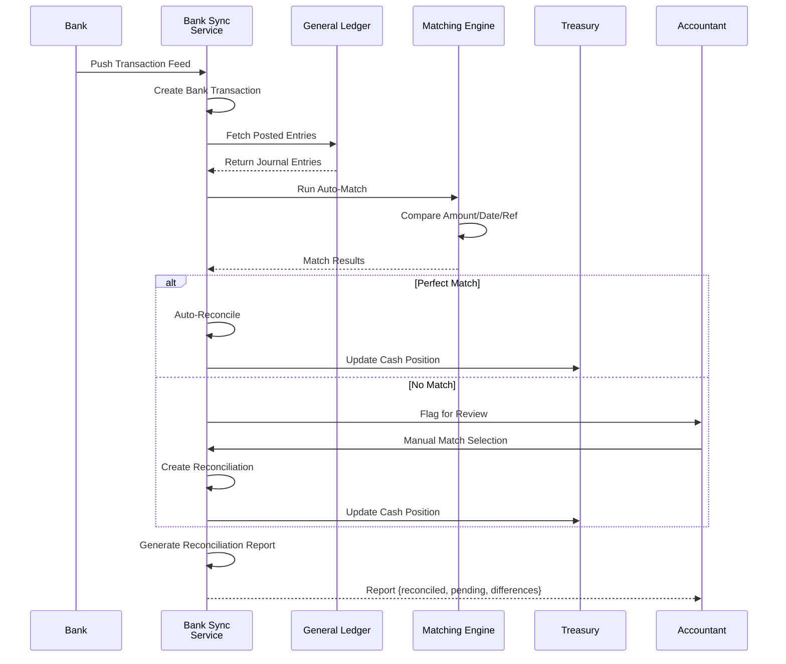
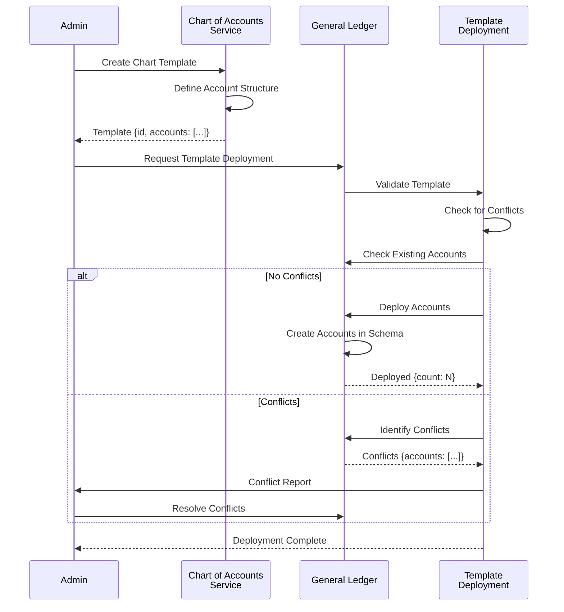
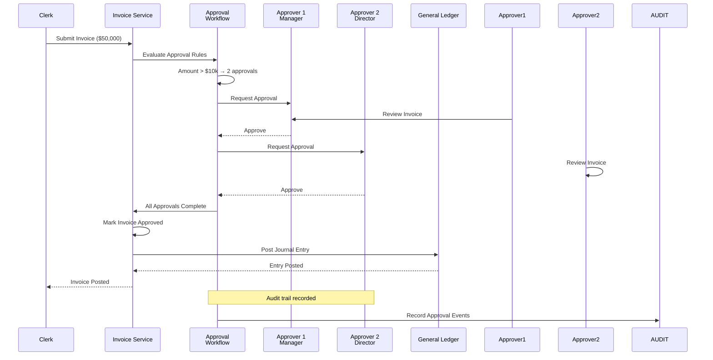

# Sequence Diagrams

> Part of RERP Accounting Suite Design
> See [main DESIGN.md](../DESIGN.md) for complete reference

---

## Vendor Invoice to Payment

---

## Revenue Recognition Schedule

---

## Multi-Entity Consolidation

---

## Month-End Close Process

---

## Bank Reconciliation Process

---

## Chart Template Deployment

---

## Approval Workflow

---

*Continue to [API Contracts](./06-api-contracts.md)*
