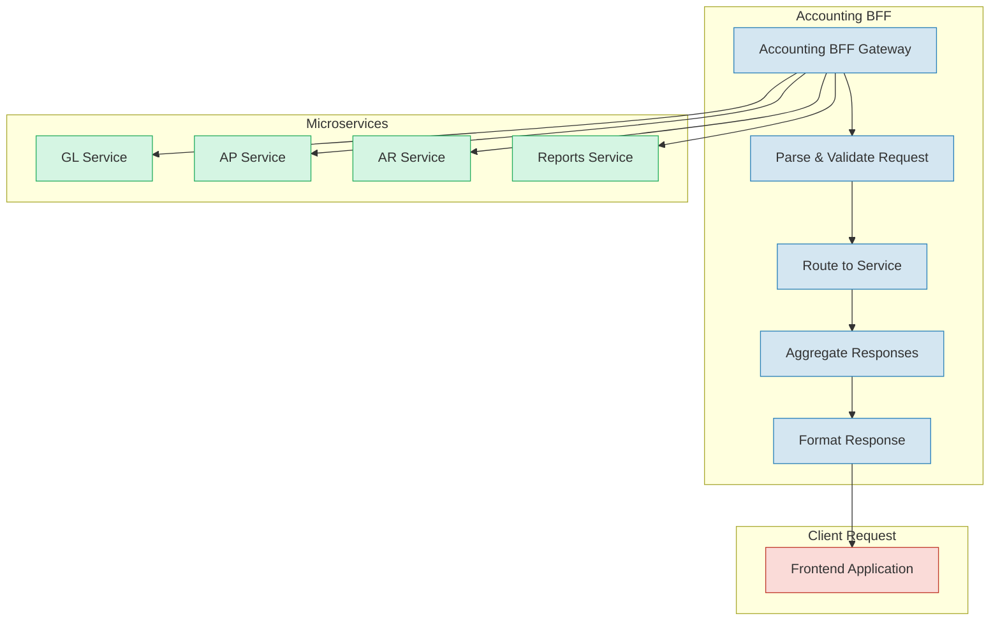
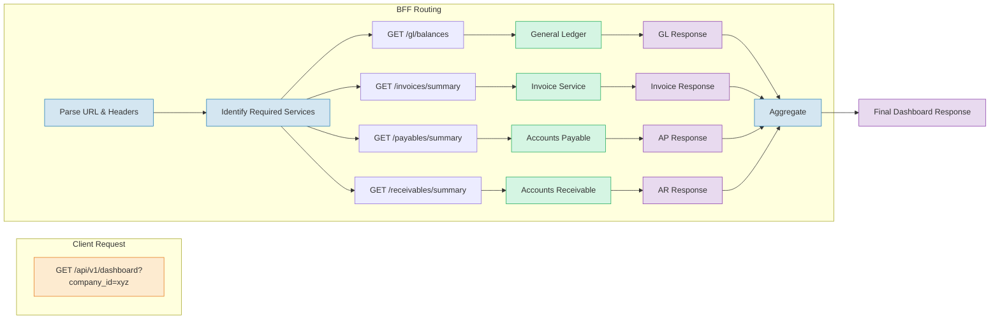
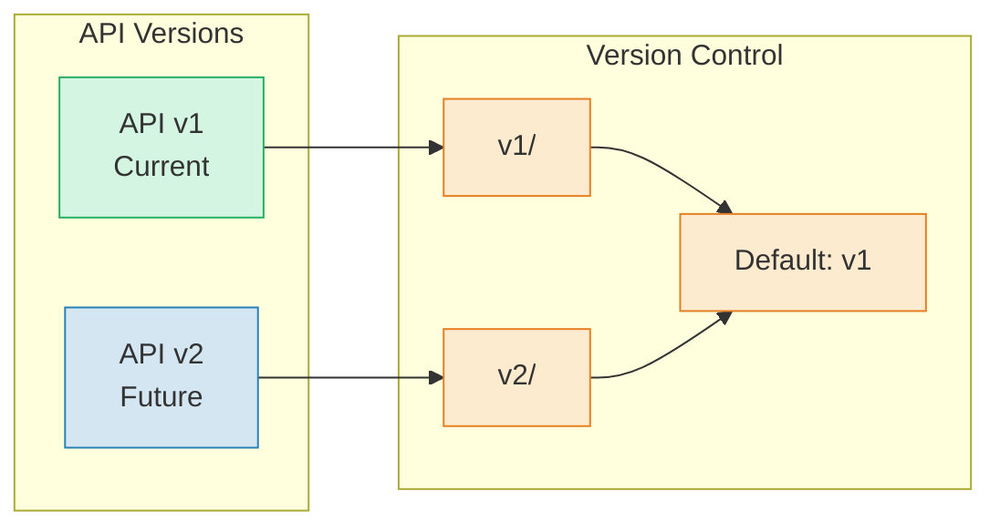

# API Contracts

> Part of RERP Accounting Suite Design
> See [main DESIGN.md](../DESIGN.md) for complete reference

---

## BFF Aggregation Pattern



### BFF Request Routing



---

## Standard Response Format

### Error Response Schema

All services return consistent error responses:

```yaml
# Standard Error Response Schema
ErrorResponse:
  type: object
  required:
    - error_code
    - message
  properties:
    error_code:
      type: string
      example: "VALIDATION_ERROR"
    message:
      type: string
      example: "Invalid request: field 'amount' must be positive"
    details:
      type: array
      items:
        type: object
        properties:
          field:
            type: string
          message:
            type: string
```

### Standard Success Response (for list endpoints)

```yaml
# Standard Paginated Response
PaginatedResponse:
  type: object
  required:
    - total
    - page
    - limit
  properties:
    total:
      type: integer
      example: 150
    page:
      type: integer
      example: 1
    limit:
      type: integer
      example: 20
    items:
      type: array
      items:
        $ref: '#/components/schemas/EntitySchema'
```

### Service-Specific Pagination

Each service extends the base pagination:

```yaml
# Example: Paginated Vendor Invoices
PaginatedVendorInvoices:
  allOf:
    - $ref: '#/components/schemas/PaginatedResponse'
    - type: object
      properties:
        items:
          type: array
          items:
            $ref: '#/components/schemas/VendorInvoice'

# Example: Paginated Journal Entries
PaginatedJournalEntries:
  allOf:
    - $ref: '#/components/schemas/PaginatedResponse'
    - type: object
      properties:
        items:
          type: array
          items:
            $ref: '#/components/schemas/JournalEntry'
```

---

## OpenAPI Spec Structure

### Standard Spec Template

Each service `openapi.yaml` follows this structure:

```yaml
openapi: 3.1.0
info:
  title: Service Name
  version: 1.0.0
  description: Service description
  
servers:
  - url: https://{tenant}.{company}.rerp.local/api/v1

security:
  - bearerAuth: []

paths:
  /entities:
    get:
      operationId: listEntities
      parameters:
        - $ref: '#/components/parameters/CompanyId'
        - $ref: '#/components/parameters/Page'
        - $ref: '#/components/parameters/Limit'
      responses:
        '200':
          description: Paginated list
          content:
            application/json:
              schema:
                $ref: '#/components/schemas/PaginatedEntities'
    post:
      operationId: createEntity
      x-brrtrouter-impl: true
      requestBody:
        required: true
        content:
          application/json:
            schema:
              $ref: '#/components/schemas/CreateEntityRequest'
      responses:
        '201':
          description: Entity created
        '400':
          description: Validation error
          content:
            application/json:
              schema:
                $ref: '#/components/schemas/ErrorResponse'
        '401':
          description: Unauthorized
        '403':
          description: Forbidden
        '409':
          description: Conflict
```

### Standard Parameters

All services share these parameters:

```yaml
components:
  parameters:
    CompanyId:
      name: X-Company-ID
      in: header
      required: true
      schema:
        type: string
        format: uuid
        example: "550e8400-e29b-41d4-a716-446655440000"
    
    TenantId:
      name: X-Tenant-ID
      in: header
      required: true
      schema:
        type: string
        format: uuid
        example: "650e8400-e29b-41d4-a716-446655440001"
    
    Page:
      name: page
      in: query
      schema:
        type: integer
        default: 1
        minimum: 1
    
    Limit:
      name: limit
      in: query
      schema:
        type: integer
        default: 20
        minimum: 1
        maximum: 100
    
    Search:
      name: search
      in: query
      schema:
        type: string
        example: "invoice number:INV-001"
    
    Id:
      name: id
      in: path
      required: true
      schema:
        type: string
        format: uuid
```

### Security Scheme

```yaml
components:
  securitySchemes:
    httpBearer:
      type: http
      scheme: bearer
      bearerFormat: JWT
      description: JWT token from authentication service
```

---

## API Versioning Strategy



### Versioning Rules

1. **URL Versioning**: `/api/v1/resources`
2. **Backward Compatible Changes**: New fields, new endpoints
3. **Breaking Changes**: New major version (v2)
4. **Deprecation**: Headers (`X-Deprecation: true`, `Sunset: 2027-01-01`)
5. **Lifecycle**: Min 18 months support for active version

---

## Request/Response Examples

### Create Invoice Request

```json
{
  "vendor_id": "550e8400-e29b-41d4-a716-446655440000",
  "invoice_number": "INV-2026-001",
  "invoice_date": "2026-05-11",
  "due_date": "2026-06-11",
  "currency": "USD",
  "amount": 5000.00,
  "tax_amount": 500.00,
  "total_amount": 5500.00,
  "line_items": [
    {
      "description": "Consulting Services",
      "quantity": 1,
      "unit_price": 5000.00,
      "account_code": "5100"
    }
  ],
  "notes": "Project alpha phase 1"
}
```

### Create Invoice Response

```json
{
  "id": "650e8400-e29b-41d4-a716-446655440001",
  "vendor_id": "550e8400-e29b-41d4-a716-446655440000",
  "invoice_number": "INV-2026-001",
  "status": "pending_approval",
  "amount": 5000.00,
  "tax_amount": 500.00,
  "total_amount": 5500.00,
  "currency": "USD",
  "created_at": "2026-05-11T10:30:00Z",
  "approval_status": "pending"
}
```

### Error Response

```json
{
  "error_code": "VALIDATION_ERROR",
  "message": "Invalid request: field 'amount' must be positive",
  "details": [
    {
      "field": "amount",
      "message": "Amount must be greater than zero"
    }
  ]
}
```

---

*Continue to [Integration Patterns](./07-integration-patterns.md)*
