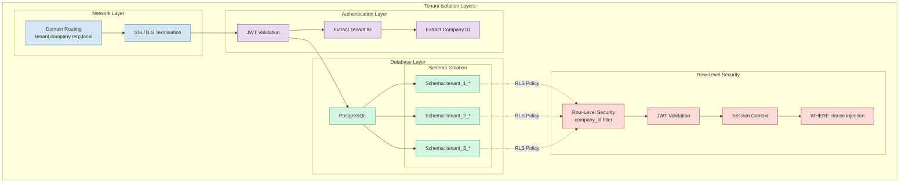
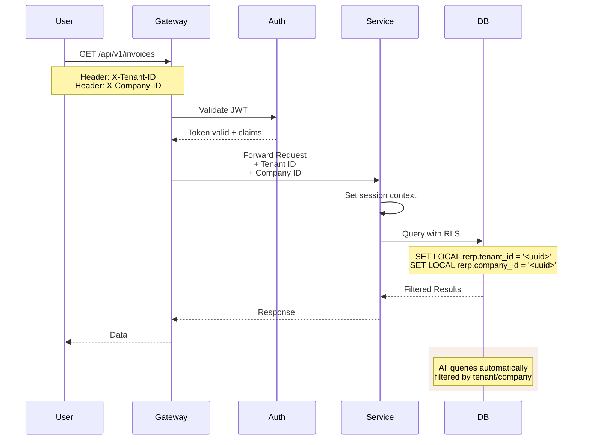
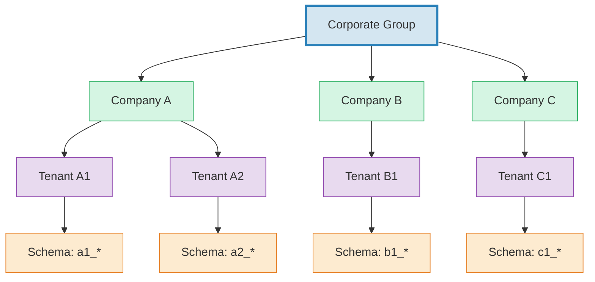
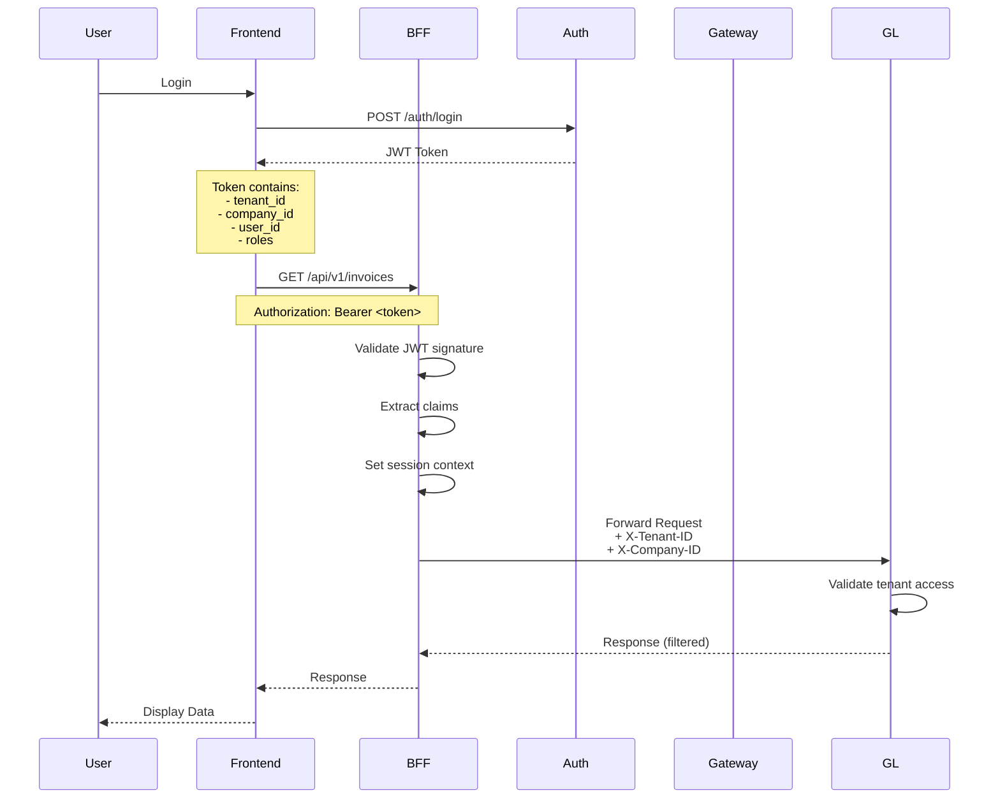
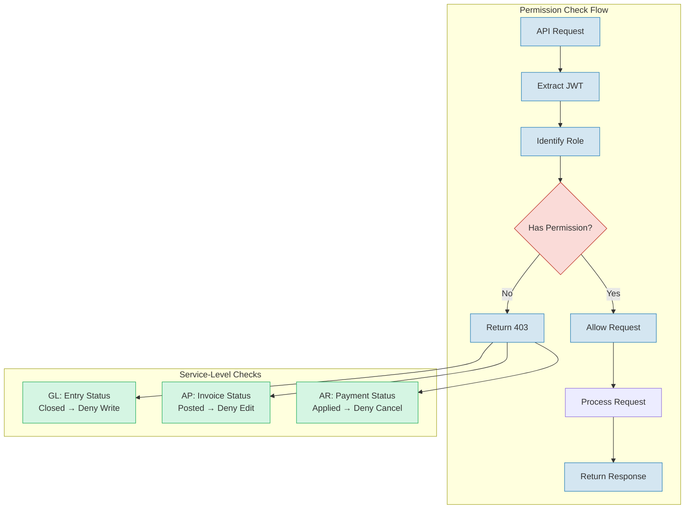
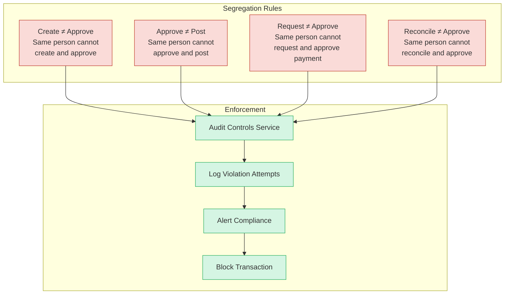
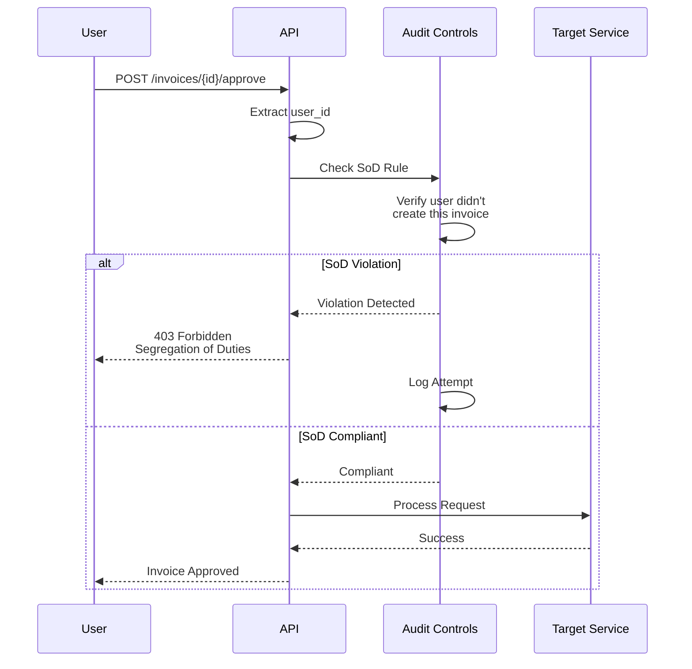
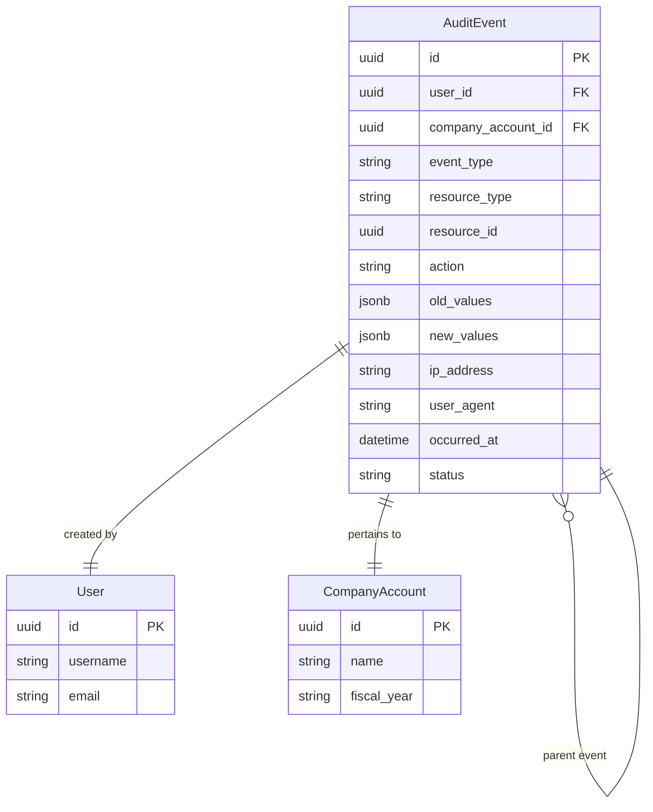
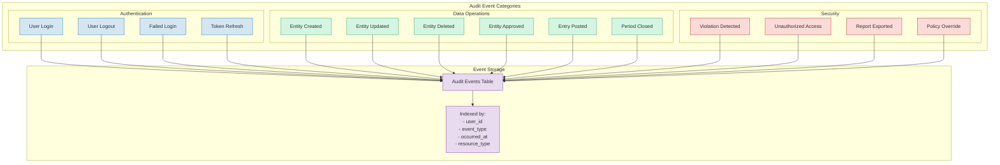

# Security & Multi-Tenancy

> Part of RERP Accounting Suite Design
> See [main DESIGN.md](../DESIGN.md) for complete reference

---

## Tenancy Model

### Tenant Isolation Architecture



### Multi-Tenant Data Flow



### Tenant Hierarchy



---

## Authentication Flow



### JWT Token Structure

```json
{
  "sub": "user-uuid",
  "tenant_id": "tenant-uuid",
  "company_id": "company-uuid",
  "roles": ["accountant", "viewer"],
  "permissions": [
    "invoices:read",
    "invoices:write",
    "journal_entries:read",
    "reports:read"
  ],
  "iat": 1715452800,
  "exp": 1715456400
}
```

---

## Role-Based Access Control

### RBAC Hierarchy

```mermaid
graph TB
    subgraph "Role Hierarchy"
        ROLE_ADMIN[Administrator<br/>Full Access]
        ROLE_ACC_MGR[Accounting Manager<br/>Approve/Post/Close]
        ROLE_ACCOUNTANT[Accountant<br/>Create/Edit/Submit]
        ROLE_CLERK[Clerk<br/>Create Only]
        ROLE_VIEWER[Viewer<br/>Read Only]
    end
    
    subgraph "Permissions Matrix"
        subgraph "GL Permissions"
            GL_READ[Read Accounts]
            GL_WRITE[Write Accounts]
            GL_POST[Post Entries]
            GL_APPROVE[Approve Entries]
            GL_CLOSE[Close Periods]
        end
        
        subgraph "AP Permissions"
            AP_CREATE[Create Invoices]
            AP_APPROVE[Approve Invoices]
            AP_PAY[Process Payments]
        end
        
        subgraph "AR Permissions"
            AR_CREATE[Create Invoices]
            AR_COLLECT[Record Collections]
            AR_WRITEOFF[Write Off]
        end
        
        subgraph "Report Permissions"
            REPORT_READ[View Reports]
            REPORT_EXPORT[Export Reports]
        end
    end
    
    ROLE_ADMIN --> GL_READ
    ROLE_ADMIN --> GL_WRITE
    ROLE_ADMIN --> GL_POST
    ROLE_ADMIN --> GL_APPROVE
    ROLE_ADMIN --> GL_CLOSE
    ROLE_ADMIN --> AP_CREATE
    ROLE_ADMIN --> AP_APPROVE
    ROLE_ADMIN --> AP_PAY
    ROLE_ADMIN --> AR_CREATE
    ROLE_ADMIN --> AR_COLLECT
    ROLE_ADMIN --> REPORT_READ
    ROLE_ADMIN --> REPORT_EXPORT
    
    ROLE_ACC_MGR --> GL_READ
    ROLE_ACC_MGR --> GL_POST
    ROLE_ACC_MGR --> GL_APPROVE
    ROLE_ACC_MGR --> GL_CLOSE
    ROLE_ACC_MGR --> AP_CREATE
    ROLE_ACC_MGR --> AP_APPROVE
    ROLE_ACC_MGR --> AR_CREATE
    ROLE_ACC_MGR --> AR_COLLECT
    ROLE_ACC_MGR --> REPORT_READ
    ROLE_ACC_MGR --> REPORT_EXPORT
    
    ROLE_ACCOUNTANT --> GL_READ
    ROLE_ACCOUNTANT --> GL_WRITE
    ROLE_ACCOUNTANT --> AP_CREATE
    ROLE_ACCOUNTANT --> AR_CREATE
    ROLE_ACCOUNTANT --> REPORT_READ
    
    ROLE_CLERK --> GL_READ
    ROLE_CLERK --> AP_CREATE
    ROLE_CLERK --> AR_CREATE
    ROLE_CLERK --> REPORT_READ
    
    ROLE_VIEWER --> GL_READ
    ROLE_VIEWER --> REPORT_READ
    
    classDef admin fill:#fadbd8,stroke:#c0392b,stroke-width:3px
    classDef manager fill:#fdebd0,stroke:#e67e22
    classDef accountant fill:#d5f5e3,stroke:#27ae60
    classDef clerk fill:#d4e6f1,stroke:#2980b9
    classDef viewer fill:#e8daef,stroke:#8e44ad
    
    class ROLE_ADMIN admin
    class ROLE_ACC_MGR manager
    class ROLE_ACCOUNTANT accountant
    class ROLE_CLERK clerk
    class ROLE_VIEWER viewer
```



### Permission Enforcement



---

## Segregation of Duties

### SoD Matrix



### SoD Check Flow



---

## Audit Trail

### Audit Event Model



### Audit Event Types



---

## Security Headers & Best Practices

### Required Headers

| Header | Purpose | Example |
|--------|---------|---------|
| `X-Company-ID` | Tenant scoping | `550e8400-e29b-41d4-a716-446655440000` |
| `X-Tenant-ID` | Company scoping | `650e8400-e29b-41d4-a716-446655440001` |
| `Authorization` | Bearer token | `Bearer eyJhbGciOi...` |
| `Content-Type` | Request format | `application/json` |
| `Accept` | Response format | `application/json` |

### Security Checklist

- [ ] All endpoints require authentication
- [ ] JWT tokens validated on every request
- [ ] Tenant/company context injected via session
- [ ] RLS policies enforce data isolation
- [ ] SoD rules validated on sensitive operations
- [ ] Audit events logged for all mutations
- [ ] Rate limiting applied per tenant
- [ ] CORS configured for approved origins
- [ ] HTTPS enforced (TLS 1.2+)
- [ ] Sensitive data encrypted at rest

---

*Continue to [Implementation Roadmap](./09-implementation-roadmap.md)*
