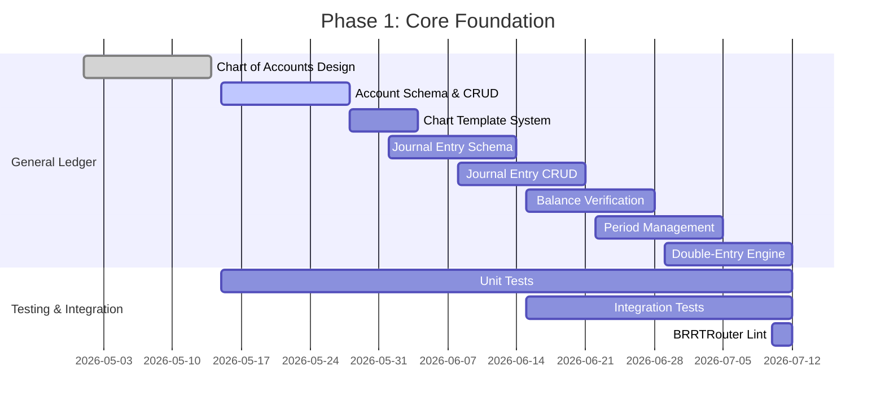
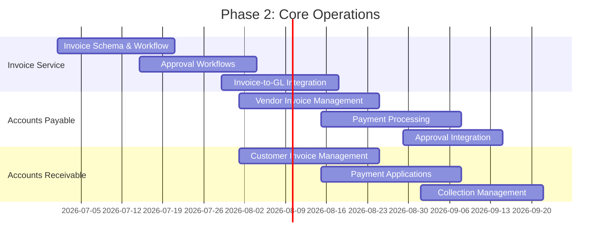
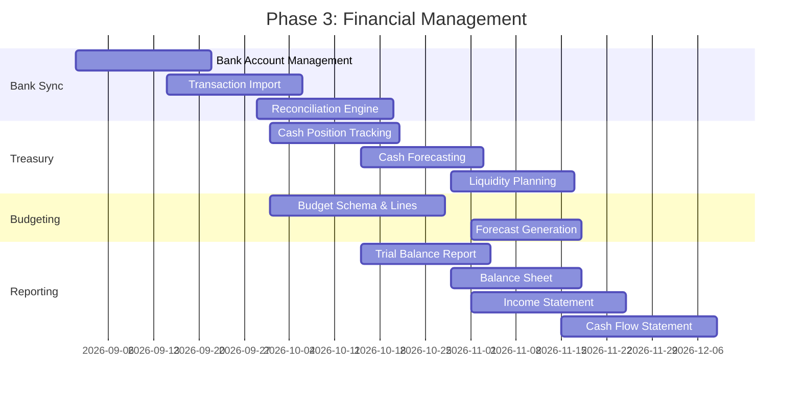
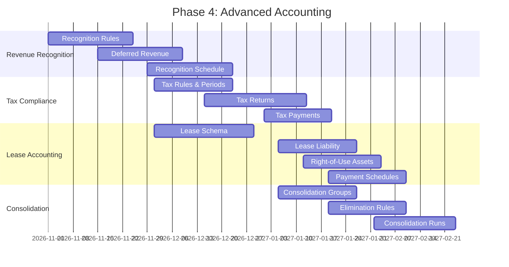
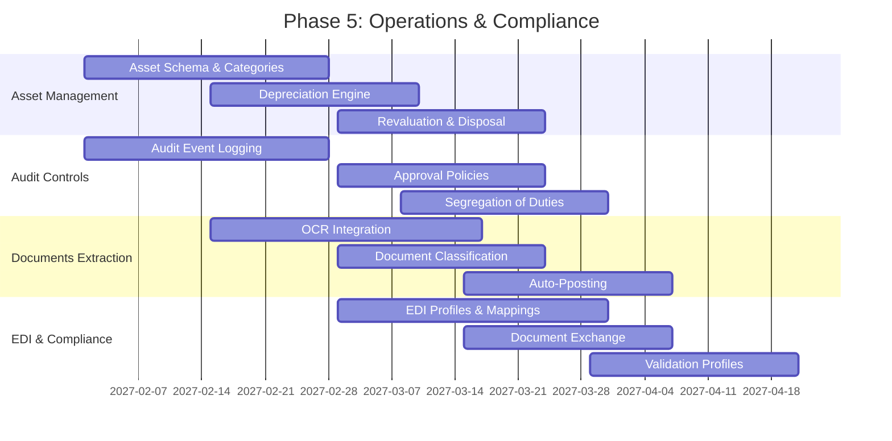
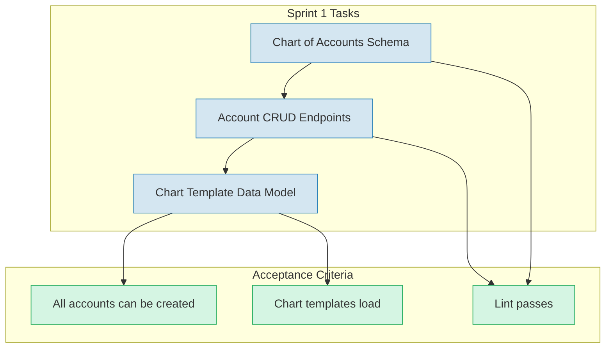
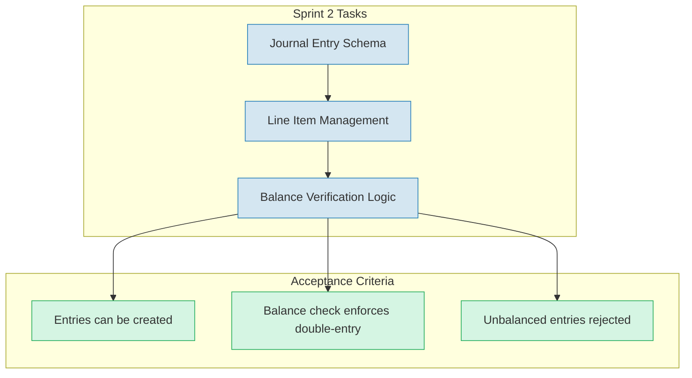
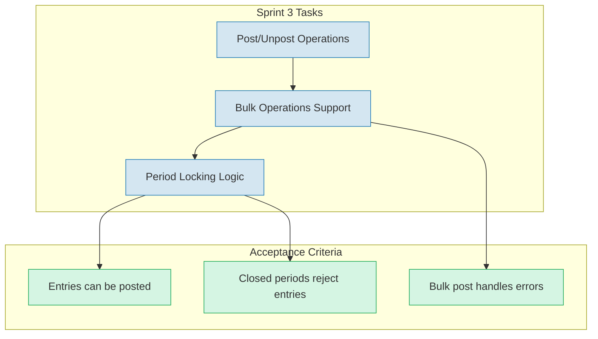
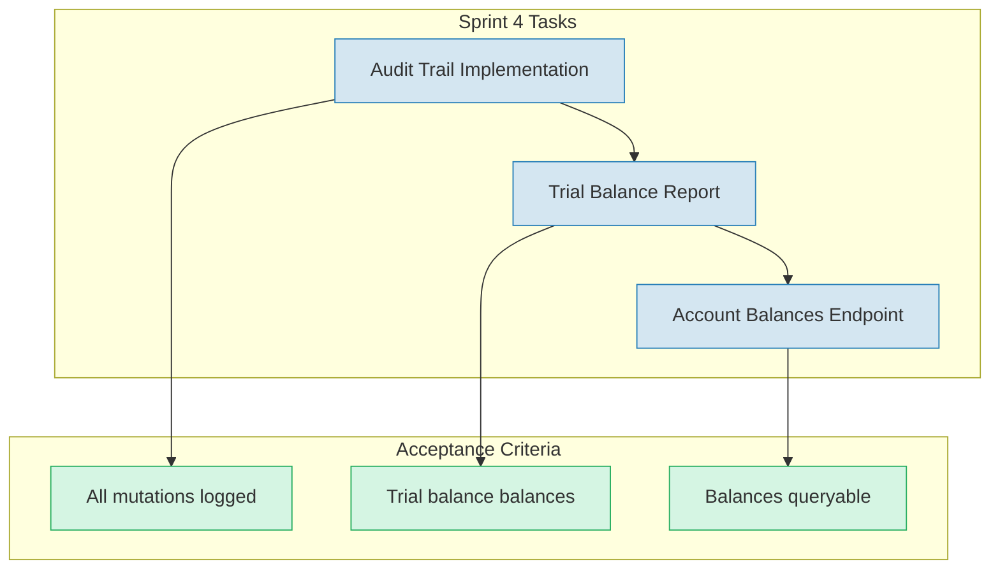

# Implementation Roadmap

> Part of RERP Accounting Suite Design
> See [main DESIGN.md](../DESIGN.md) for complete reference

---

## Phased Delivery Plan

### Phase 1: Core Foundation (Weeks 1-8)

**Goal:** Establish the double-entry accounting engine with chart of accounts and journal entries.

**Deliverables:**
- General Ledger service with 93 schemas
- Chart of accounts with template support
- Journal entry creation with balance verification
- Fiscal period management
- All specs pass `brrtrouter-gen lint`

### Phase 2: Core Operations (Weeks 9-16)

**Goal:** Implement invoice processing, accounts payable, and accounts receivable.

**Deliverables:**
- Invoice service with approval workflows
- Accounts payable with vendor payments
- Accounts receivable with collections
- Invoice-to-GL posting integration

### Phase 3: Financial Management (Weeks 17-24)

**Goal:** Add bank reconciliation, treasury management, budgeting, and reporting.

### Phase 4: Advanced Accounting (Weeks 25-32)

**Goal:** Implement revenue recognition, tax compliance, lease accounting, and consolidation.

### Phase 5: Operations & Compliance (Weeks 33-40)

**Goal:** Implement asset management, audit controls, document extraction, and EDI.

---

## Sprint Breakdown (Phase 1 Example)

### Sprint 1: GL Foundation (Weeks 1-2)

### Sprint 2: Journal Entries (Weeks 3-4)

### Sprint 3: Posting Engine (Weeks 5-6)

### Sprint 4: Audit & Reporting (Weeks 7-8)

---

## Implementation Priority Matrix

| Priority | Component | Effort | Impact | Rationale |
|----------|-----------|--------|--------|-----------|
| **P0** | General Ledger | High | Critical | Foundation — double-entry engine is core |
| **P0** | Chart of Accounts | Medium | Critical | Nothing works without account structure |
| **P1** | Invoice Service | High | Critical | Primary document for all transactions |
| **P1** | Accounts Payable | High | High | Core AP workflow |
| **P1** | Accounts Receivable | High | High | Core AR workflow |
| **P2** | Bank Sync | Medium | High | Cash visibility required early |
| **P2** | Financial Reports | High | High | Management needs reports to justify system |
| **P2** | Revenue Recognition | Medium | High | Required for SaaS/service businesses |
| **P3** | Tax Compliance | Medium | Medium | Can be phased; basic VAT first |
| **P3** | Asset Management | Medium | Medium | Important but not blocking |
| **P3** | Audit Controls | Low | Medium | Compliance requirement |
| **P4** | Lease Accounting | Medium | Low | Niche requirement |
| **P4** | Consolidation | High | Low | Multi-entity is advanced use case |
| **P4** | Documents Extraction | High | Low | Nice-to-have automation |
| **P4** | EDI & Compliance | High | Low | Partner-specific requirement |
| **P4** | Treasury | Medium | Low | Cash management can be phased |
| **P4** | Budget Management | Medium | Low | Planning feature, not transactional |

---

## Success Criteria

### Phase 1 Success Criteria

- [ ] General Ledger service passes all BRRTRouter lint checks
- [ ] Chart of accounts can be created and deployed from templates
- [ ] Journal entries can be created with automatic balance verification
- [ ] Unbalanced journal entries are rejected
- [ ] Fiscal periods can be opened, closed, and locked
- [ ] Trial balance report shows correct debits/credits
- [ ] All 93 schemas implemented and validated

### Phase 2 Success Criteria

- [ ] Invoice service supports approval workflows
- [ ] Vendor invoices can be created and paid
- [ ] Customer invoices can be created and collected
- [ ] Invoice posting creates balanced journal entries
- [ ] AP and AR aging reports generated correctly

### Phase 3 Success Criteria

- [ ] Bank transactions can be imported and matched
- [ ] Reconciliation identifies differences
- [ ] Cash position reflects all posted transactions
- [ ] Financial reports (BS, IS, CF) balance correctly

### Phase 4-5 Success Criteria

- [ ] Revenue recognized over time per schedules
- [ ] Tax returns can be prepared and filed
- [ ] Lease liabilities calculated per ASC 842/IFRS 16
- [ ] Multi-entity consolidation with eliminations
- [ ] Asset depreciation posted automatically
- [ ] Audit trail captures all sensitive operations
- [ ] EDI documents exchanged with trading partners

---

## Risk Mitigation

| Risk | Impact | Probability | Mitigation |
|------|--------|-------------|------------|
| Schema complexity grows | High | Medium | Strict OpenAPI-first, review gates |
| Cross-service dependencies | High | High | Event-driven, async communication |
| Double-entry balance errors | Critical | Low | Automated balance verification |
| Performance at scale | Medium | Medium | Pagination, indexing, caching |
| Regulatory compliance gaps | High | Low | Audit trail, SoD enforcement |

---

*Continue to [Service Specifications](./10-service-specifications.md)*
