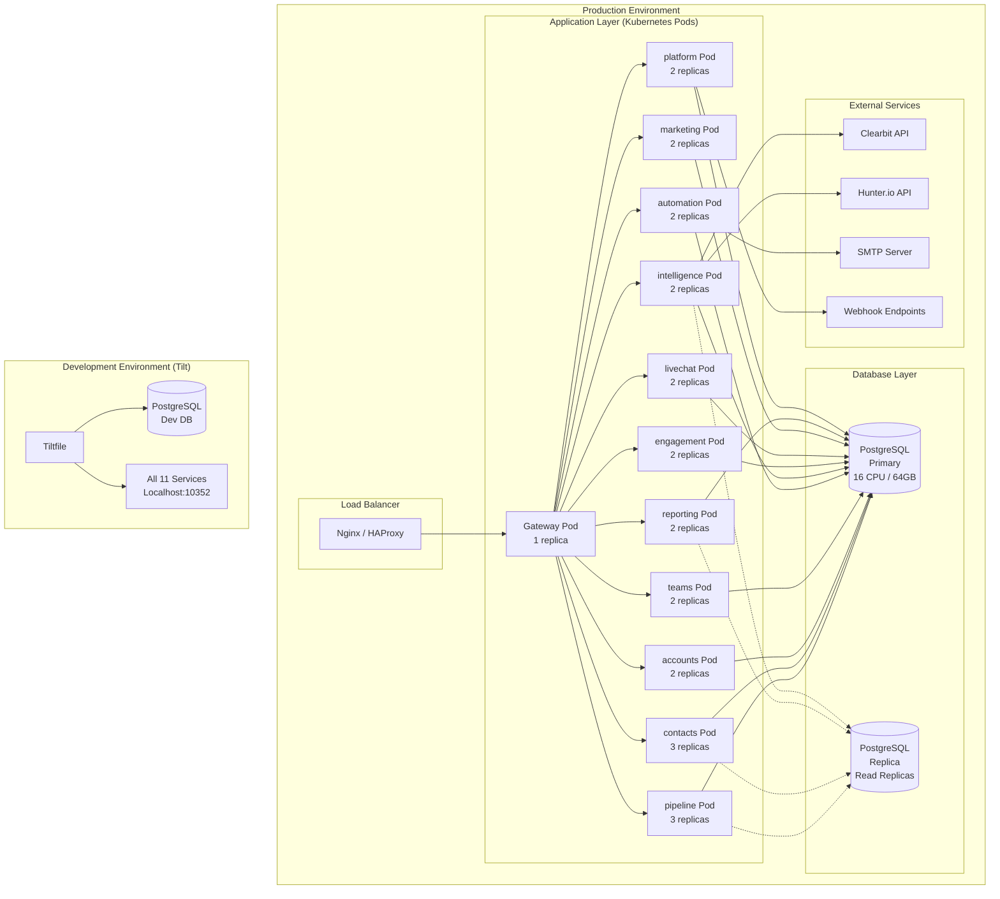
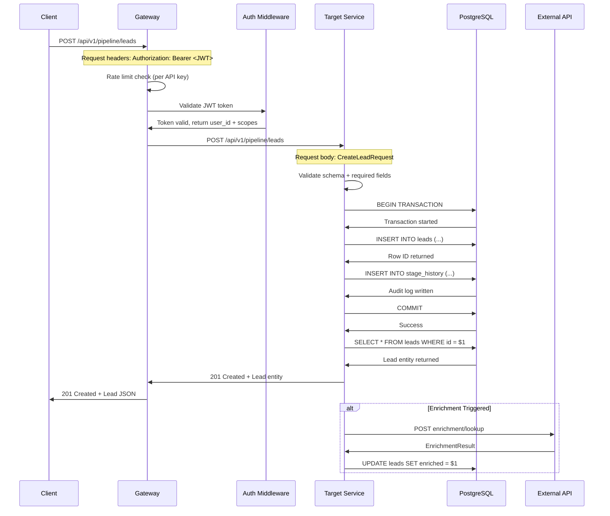
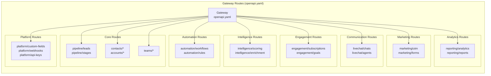
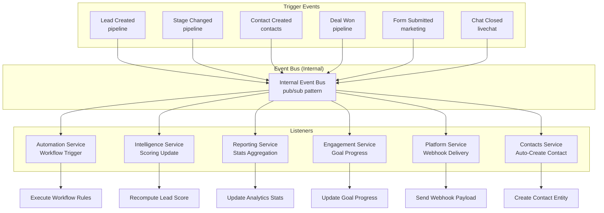
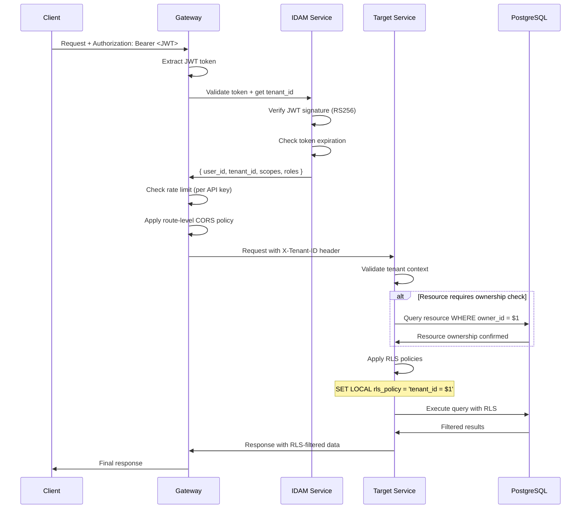

# CRM System Architecture Design

> **Version:** 1.0.0
> **Scope:** High-level architecture, service boundaries, deployment topology, and communication patterns
> **Status:** Active design spec

---

## 1. System Topology

RERP CRM is an **OpenAPI-first, Rust-native, self-hosted** platform with 11 independent microservices. Each service owns its OpenAPI spec, generated code (gen/), and business logic (impl/).

```mermaid
graph TB
    subgraph "Client Tier"
        Web[Web Dashboard<br/>SolidJS]
        Mobile[Mobile App<br/>Flutter]
        CLI[CLI Tools<br/>rust + python]
        Ext[External Systems<br/>ERP/Accounting]
    end

    subgraph "Gateway Layer"
        GW[CRM Gateway<br/>openapi.yaml]
        Auth[Auth Middleware<br/>bearerAuth + RBAC]
    end

    subgraph "Service Tier — Core"
        Pipeline[pipeline/ — Leads & Stages<br/>9 paths, 18 schemas]
        Contacts[contacts/ — Contacts & Tree<br/>7 paths, 9 schemas]
        Accounts[accounts/ — Accounts & Hierarchy<br/>6 paths, 10 schemas]
        Teams[teams/ — Teams & Assignment<br/>6 paths, 12 schemas]
    end

    subgraph "Service Tier — Automation"
        Automation[automation/ — Workflows & Rules<br/>14 paths, 27 schemas]
    end

    subgraph "Service Tier — Intelligence"
        Intelligence[intelligence/ — Scoring & Enrichment<br/>21 paths, 29 schemas]
    end

    subgraph "Service Tier — Engagement"
        Engagement[engagement/ — Subscriptions & Goals<br/>14 paths, 21 schemas]
    end

    subgraph "Service Tier — Communication"
        Livechat[livechat/ — Chat Sessions & Agents<br/>15 paths, 23 schemas]
    end

    subgraph "Service Tier — Marketing"
        Marketing[marketing/ — UTM & Forms<br/>14 paths, 26 schemas]
    end

    subgraph "Service Tier — Analytics"
        Reporting[reporting/ — Analytics & Forecasts<br/>17 paths, 23 schemas]
    end

    subgraph "Service Tier — Platform"
        Platform[platform/ — Custom Fields, Webhooks, Audit<br/>14 paths, 27 schemas]
    end

    subgraph "Storage Tier"
        DB[(PostgreSQL<br/>CRM Core DB)]
    end

    Web --> GW
    Mobile --> GW
    CLI --> GW
    Ext --> GW

    GW --> Auth
    GW --> Pipeline
    GW --> Contacts
    GW --> Accounts
    GW --> Teams
    GW --> Automation
    GW --> Intelligence
    GW --> Engagement
    GW --> Livechat
    GW --> Marketing
    GW --> Reporting
    GW --> Platform

    Pipeline --> DB
    Contacts --> DB
    Accounts --> DB
    Teams --> DB
    Automation --> DB
    Intelligence --> DB
    Engagement --> DB
    Livechat --> DB
    Marketing --> DB
    Reporting --> DB
    Platform --> DB
```



---

## 2. Service Communication Matrix

```mermaid
matrix
    title "Service Communication Matrix (direct API calls)"
    columns ["", "pipeline", "contacts", "accounts", "teams", "automation", "intelligence", "engagement", "livechat", "marketing", "reporting"]
    rows ["pipeline", "", "GET/{id}/leads", "GET/{id}/accounts", "GET user_id/team_id", "POST trigger", "POST score/bulk", "POST opportunity", "", "POST contact from lead", "GET summary"]
    rows ["contacts", "POST create lead", "", "GET/{id}/contacts", "GET user_ids", "POST contact create trigger", "", "POST subscription", "", "POST contact from form", "GET rep performance"]
    rows ["accounts", "POST create lead", "POST create contact", "", "GET contacts/leads", "", "POST enrichment", "POST subscription", "", "POST contact from form", "GET by industry"]
    rows ["teams", "", "", "", "", "GET team assignments", "", "", "", "", "GET team performance"]
    rows ["automation", "POST stage change trigger", "POST contact change", "POST account change", "", "", "POST workflow", "POST renewal alert", "", "", "POST report schedule"]
    rows ["intelligence", "", "", "", "", "", "", "POST scoring", "", "", "GET scoring frequencies"]
    rows ["engagement", "", "POST goal progress", "POST goal progress", "", "POST subscription goals", "POST enrichment", "", "", "POST goals", "GET leaderboards"]
    rows ["livechat", "", "POST create contact", "POST create account", "POST assign agent", "POST chat conversion trigger", "", "POST chat conversion", "", "", "GET conversion rates"]
    rows ["marketing", "", "POST create lead", "POST create contact", "POST create account", "", "POST enrichment", "", "", "", "GET campaign leads"]
    rows ["reporting", "GET pipeline summary", "GET contact stats", "GET account stats", "GET team stats", "GET workflow stats", "GET scoring stats", "GET subscription stats", "GET chat stats", "GET campaign stats", ""]
```

---

## 3. Deployment Architecture



---

## 4. Request Flow Architecture



---

## 5. Gateway Routing Topology



---

## 6. Cross-Service Event Flow



---

## 7. Data Partitioning Strategy (4-DB Architecture)

```mermaid
graph TB
    subgraph "Database 1: CRM Core"
        subgraph "Schema: crm_core"
            Pipeline[(Pipeline Schema<br/>leads, stages, stage_history)]
            Contacts[(Contacts Schema<br/>contacts, contact_tree, merge_history)]
            Accounts[(Accounts Schema<br/>accounts, account_tree)]
            Teams[(Teams Schema<br/>teams, team_members)]
        end
    end

    subgraph "Database 2: CRM Analytics"
        subgraph "Schema: crm_analytics"
            Automation[(Automation Schema<br/>workflows, rules, triggers)]
            Intelligence[(Intelligence Schema<br/>scoring, enrichment)]
            Reporting[(Reporting Schema<br/>analytics, forecasts)]
        end
    end

    subgraph "Database 3: CRM Events"
        subgraph "Schema: crm_events"
            Livechat[(Livechat Schema<br/>chat_sessions, chat_messages)]
            Marketing[(Marketing Schema<br/>utm_campaigns, forms)]
        end
    end

    subgraph "Database 4: CRM Platform"
        subgraph "Schema: crm_platform"
            CustomFields[(Custom Fields Schema)]
            Webhooks[(Webhooks Schema)]
            Audit[(Audit Log Schema)]
            APIKeys[(API Keys Schema)]
            Integrations[(Integrations Schema)]
        end
    end

    subgraph "Service Connections"
        S1[pipeline/ → DB1]
        S2[contacts/ → DB1]
        S3[accounts/ → DB1]
        S4[teams/ → DB1]
        S5[automation/ → DB2]
        S6[intelligence/ → DB2]
        S7[reporting/ → DB2]
        S8[livechat/ → DB3]
        S9[marketing/ → DB3]
        S10[platform/ → DB4]
    end

    S1 --> Pipeline
    S2 --> Contacts
    S3 --> Accounts
    S4 --> Teams
    S5 --> Automation
    S6 --> Intelligence
    S7 --> Reporting
    S8 --> Livechat
    S9 --> Marketing
    S10 --> CustomFields
```



---

## 8. Authentication & Authorization Flow



---

*This document defines the high-level architecture. See **02-entity-relationships.md** for entity-level design, **03-data-flow.md** for detailed request/response flows, **04-automation-engine.md** for workflow execution details, and **05-graph-database.md** for hierarchical entity graphs.*
