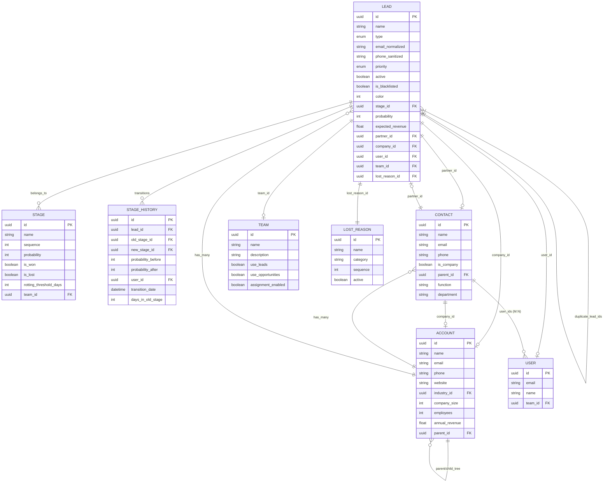
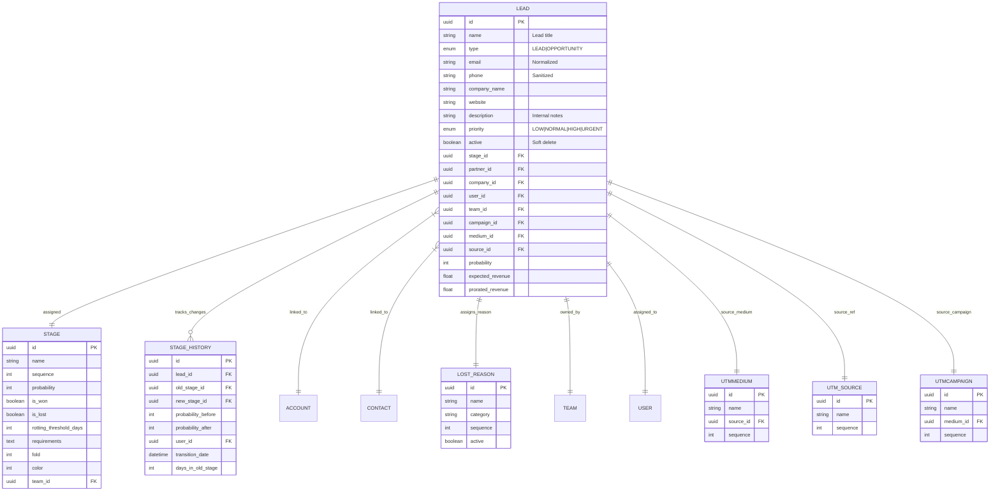
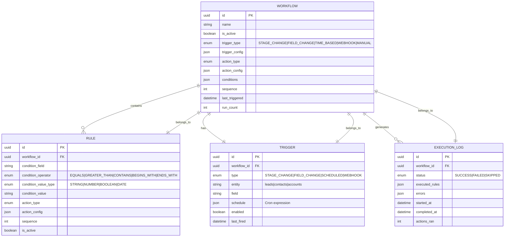
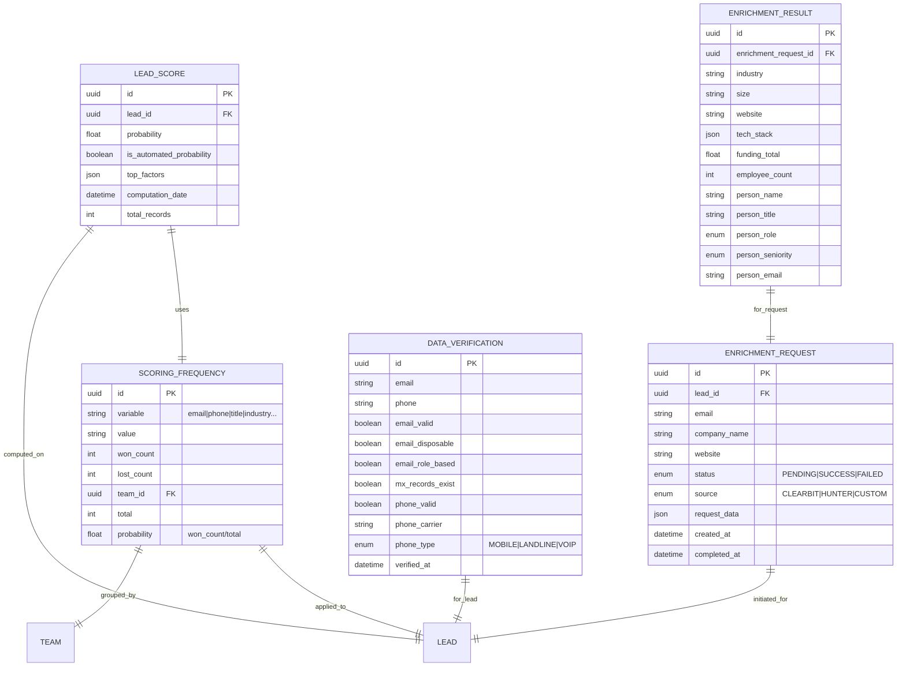
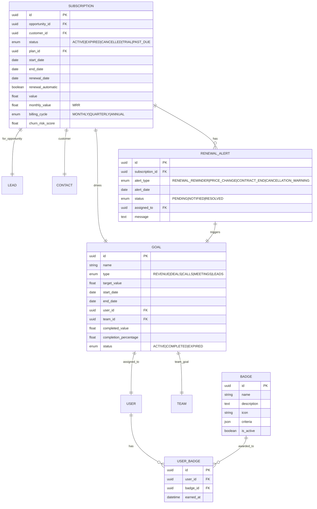
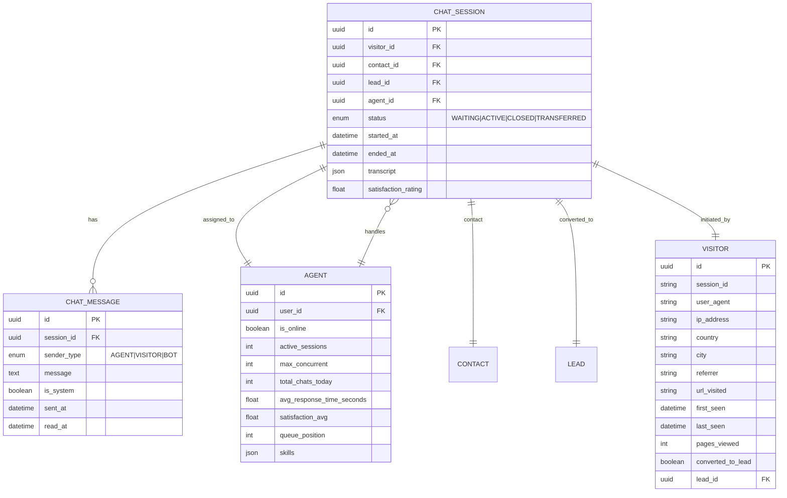
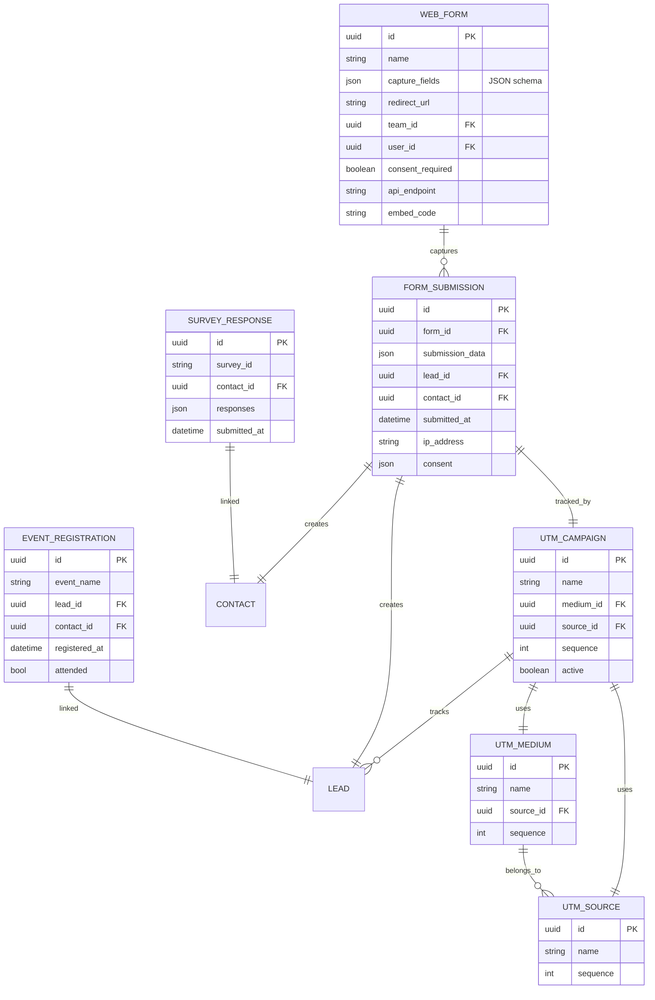
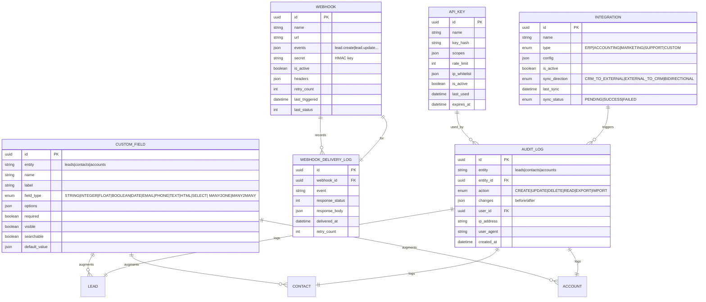
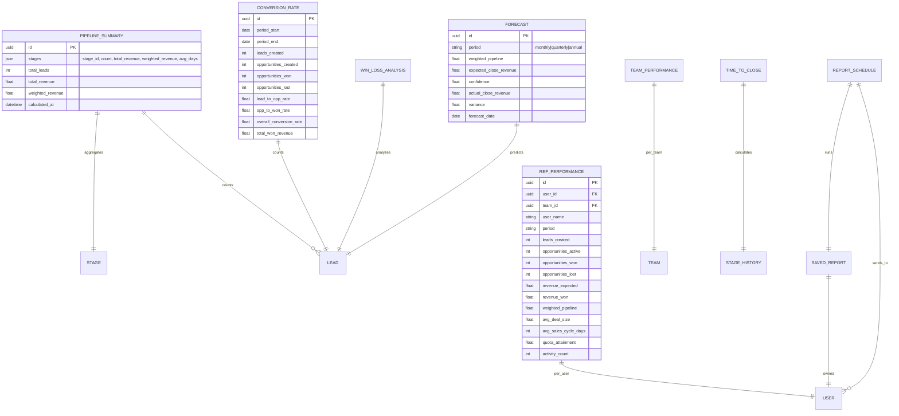

# CRM Entity Relationships

> **Version:** 1.0.0
> **Scope:** Complete entity relationship diagrams for all 11 CRM services
> **Status:** Active design spec

---

## 1. Core Entity Relationship Diagram



---

## 2. Pipeline Service Entities



---

## 3. Contacts & Accounts Service Entities

```mermaid
erDiagram
    CONTACT ||--|| CONTACT : "parent/child_tree"
    CONTACT ||--|| ACCOUNT : "company_link"
    CONTACT ||--o{ LEAD : "partner_link"
    CONTACT ||--o{ TASK : "assigned"
    CONTACT ||--o{ ACTIVITY : "belongs_to"
    CONTACT ||--o{ FOLLOW_UP : "has_followups"

    ACCOUNT ||--o{ ACCOUNT : "parent/child_tree"
    ACCOUNT ||--o{ CONTACT : "has_contacts"
    ACCOUNT ||--o{ LEAD : "has_leads"
    ACCOUNT ||--o{ INDUSTRY_CLASS : "belongs_to"

    INDUSTRY_CLASS {
        uuid id PK
        string name
        string code
        int parent_id FK
    }

    ACCOUNT {
        uuid id PK
        string name
        string email
        string phone
        string website
        uuid industry_id FK
        int company_size
        int employees
        float annual_revenue
        uuid parent_id FK
        uuid child_ids FK[]
    }

    CONTACT {
        uuid id PK
        string name
        string email
        string phone
        string mobile
        string title "Salutation"
        string function "Job title"
        string department
        boolean is_company
        uuid company_id FK
        uuid parent_id FK
        uuid[] user_ids
        uuid partner_id FK
    }

    ACTIVITY {
        uuid id PK
        enum activity_type "EMAIL|CALL|MEETING|NOTE|TASK|FOLLOW_UP"
        string summary
        text description
        uuid related_id FK
        enum related_type "LEAD|CONTACT|ACCOUNT"
        uuid user_id FK
        datetime scheduled_date
        datetime completed_date
    }

    FOLLOW_UP {
        uuid id PK
        string title
        text description
        date due_date
        enum priority
        enum status "TODO|IN_PROGRESS|DONE|CANCELLED"
        uuid assigned_to FK
        uuid related_id FK
        datetime reminder_date
    }
```

---

## 4. Automation Service Entities



---

## 5. Intelligence Service Entities



---

## 6. Engagement Service Entities



---

## 7. Livechat Service Entities



---

## 8. Marketing Service Entities



---

## 9. Platform Service Entities



---

## 10. Reporting Service Entities



---

## 11. Unified Entity Relationship Summary

```mermaid
graph TB
    subgraph "Core Domain"
        Lead[LEAD]
        Contact[CONTACT]
        Account[ACCOUNT]
        Stage[STAGE]
        LostReason[LOST_REASON]
    end

    subgraph "Organization"
        Team[TEAM]
        User[USER]
        TeamMember[TEAM_MEMBER]
    end

    subgraph "Automation"
        Workflow[WORKFLOW]
        Rule[RULE]
        Trigger[TRIGGER]
        ExecutionLog[EXECUTION_LOG]
    end

    subgraph "Intelligence"
        LeadScore[LEAD_SCORE]
        ScoringFrequency[SCORING_FREQUENCY]
        EnrichmentRequest[ENRICHMENT_REQUEST]
        EnrichmentResult[ENRICHMENT_RESULT]
        DataVerification[DATA_VERIFICATION]
    end

    subgraph "Engagement"
        Subscription[SUBSCRIPTION]
        RenewalAlert[RENEWAL_ALERT]
        Goal[GOAL]
        Badge[BADGE]
        UserBadge[USER_BADGE]
    end

    subgraph "Communication"
        ChatSession[CHAT_SESSION]
        ChatMessage[CHAT_MESSAGE]
        Agent[AGENT]
        Visitor[VISITOR]
    end

    subgraph "Marketing"
        UTMCampaign[UTM_CAMPAIGN]
        UTMMedium[UTM_MEDIUM]
        UTMSource[UTM_SOURCE]
        WebForm[WEB_FORM]
        FormSubmission[FORM_SUBMISSION]
        EventRegistration[EVENT_REGISTRATION]
        SurveyResponse[SURVEY_RESPONSE]
    end

    subgraph "Analytics"
        PipelineSummary[PIPELINE_SUMMARY]
        ConversionRate[CONVERSION_RATE]
        RepPerformance[REP_PERFORMANCE]
        WinLossAnalysis[WIN_LOSS_ANALYSIS]
        Forecast[FORECAST]
        TimeToClose[TIME_TO_CLOSE]
        SavedReport[SAVED_REPORT]
        ReportSchedule[REPORT_SCHEDULE]
    end

    subgraph "Platform"
        CustomField[CUSTOM_FIELD]
        Webhook[WEBHOOK]
        WebhookDeliveryLog[WEBHOOK_DELIVERY_LOG]
        AuditLog[AUDIT_LOG]
        APIKey[API_KEY]
        Integration[INTEGRATION]
    end

    Lead --> Contact
    Lead --> Account
    Lead --> Stage
    Lead --> Team
    Lead --> User
    Lead --> LeadScore
    Lead --> Subscription
    Lead --> UTMCampaign
    Lead --> PipelineSummary
    Lead --> RepPerformance
    Lead --> WinLossAnalysis
    Lead --> CustomField
    Lead --> AuditLog

    Contact --> Account
    Contact --> LeadScore
    Contact --> Subscription
    Contact --> CustomField
    Contact --> AuditLog

    Account --> LeadScore
    Account --> CustomField
    Account --> AuditLog

    Stage --> PipelineSummary
    Stage --> TimeToClose

    User --> TeamMember
    User --> Team
    User --> RepPerformance
    User --> Goal
    User --> UserBadge
    User --> APIKey

    Workflow --> Rule
    Workflow --> Trigger
    Workflow --> ExecutionLog

    LeadScore --> ScoringFrequency

    Subscription --> RenewalAlert
    Subscription --> Goal

    ChatSession --> ChatMessage
    ChatSession --> Agent
    ChatSession --> Visitor

    UTMCampaign --> UTMMedium
    UTMCampaign --> UTMSource
    WebForm --> FormSubmission
    FormSubmission --> Lead

    PipelineSummary --> Stage
    RepPerformance --> User
    Forecast --> Lead

    Webhook --> WebhookDeliveryLog
    APIKey --> AuditLog
    Integration --> AuditLog
```



---

*This document defines all entity relationships. The core lead entity is the central hub connecting all 11 services. Each service owns its entities and exposes them via its OpenAPI spec.*
