# CRM Data Flow Design

> **Version:** 1.0.0
> **Scope:** Request/response flows, event-driven patterns, change data capture, and batch processing
> **Status:** Active design spec

---

## 1. Standard CRUD Request Flow

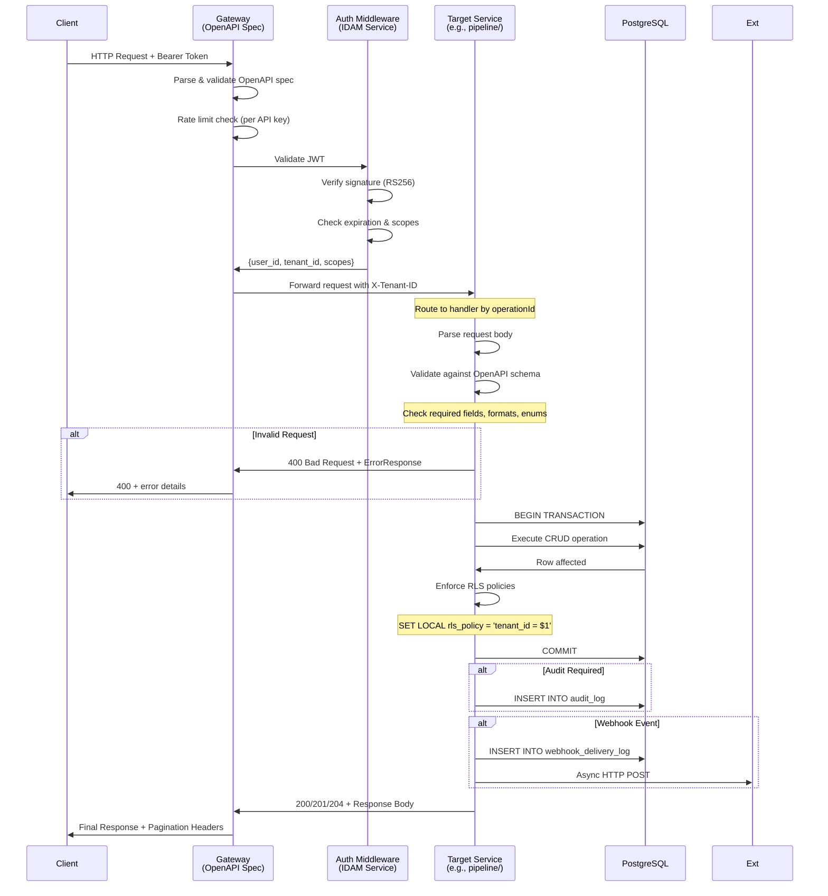

---

## 2. Lead Creation & Enrichment Flow

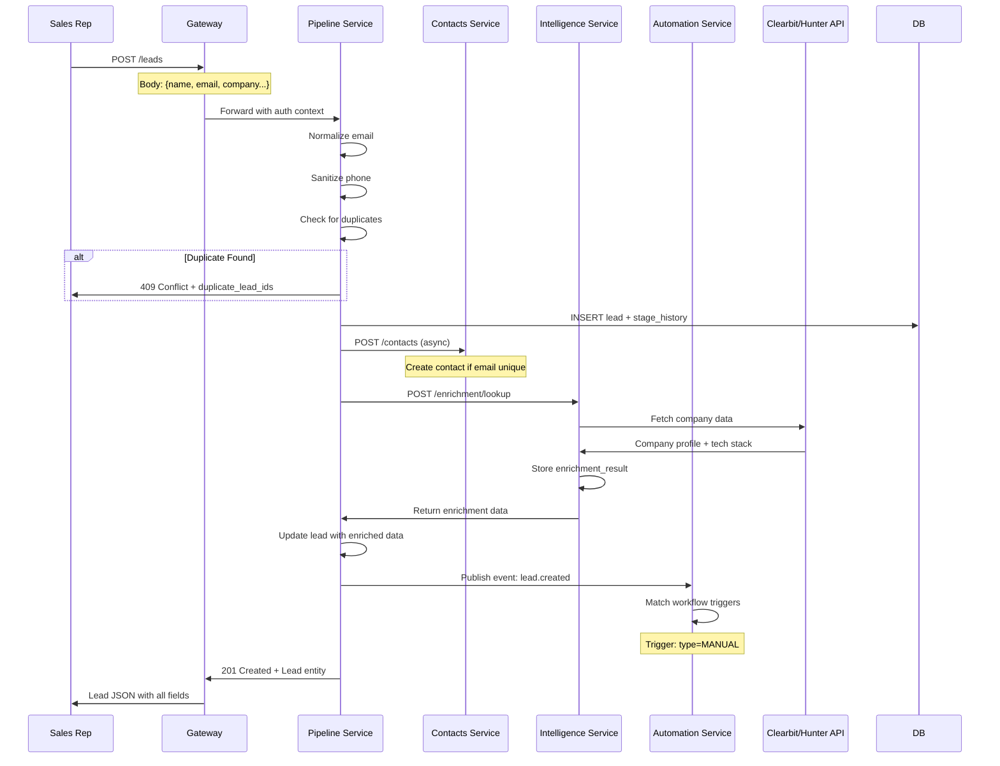

---

## 3. Stage Transition & Scoring Flow

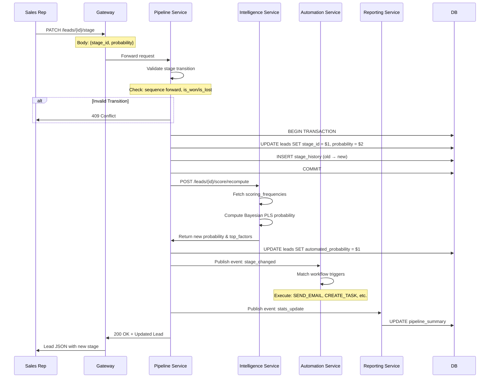

---

## 4. Lead Conversion Flow (Lead → Contact + Account)

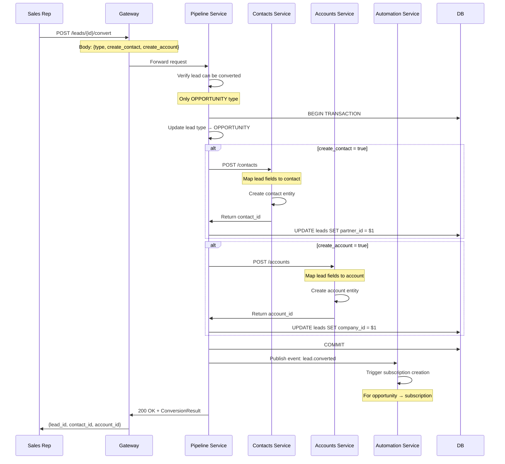

---

## 5. Event-Driven Cross-Service Communication

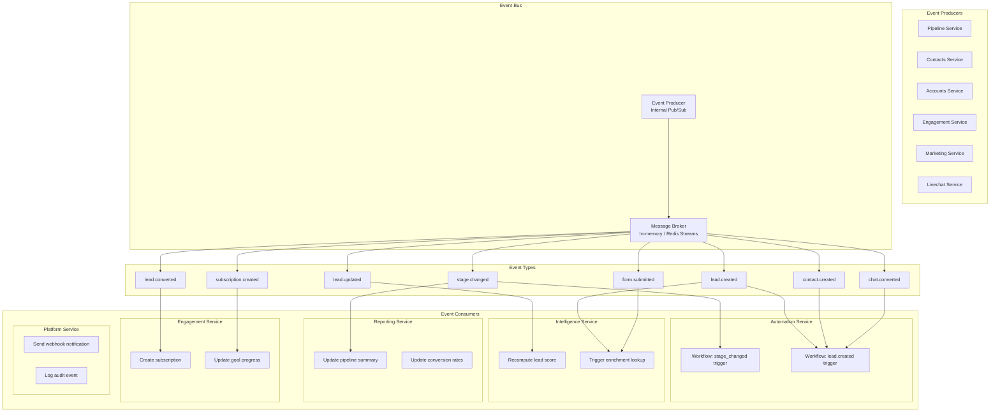

---

## 6. Change Data Capture (CDC) Pattern

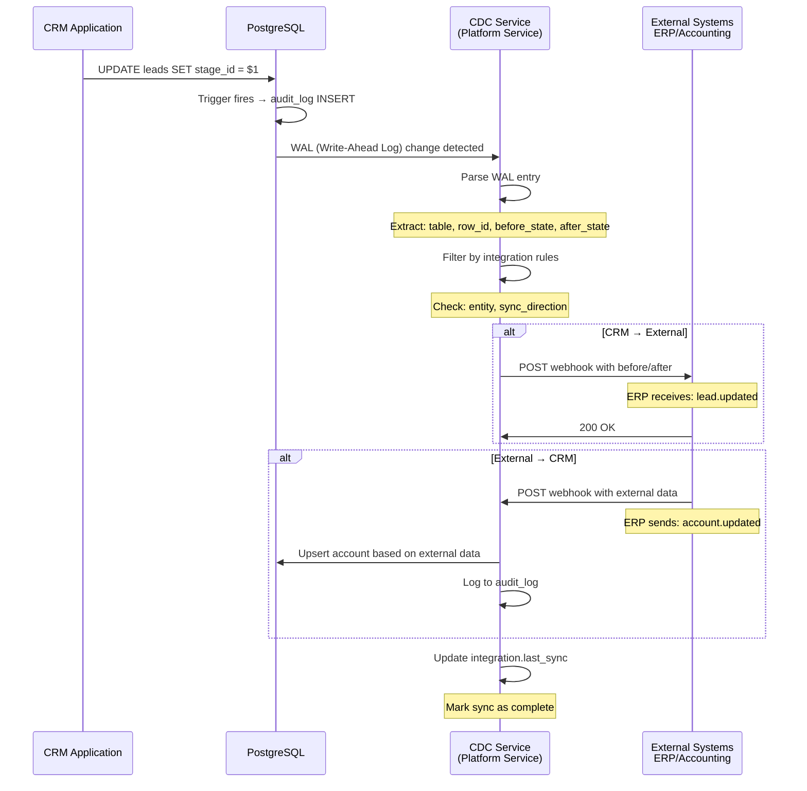

---

## 7. Batch Processing Flow (Lead Scoring)

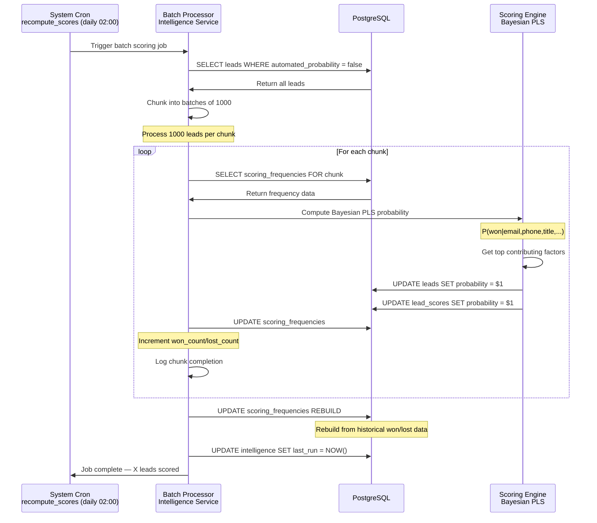

---

## 8. Webhook Delivery Flow

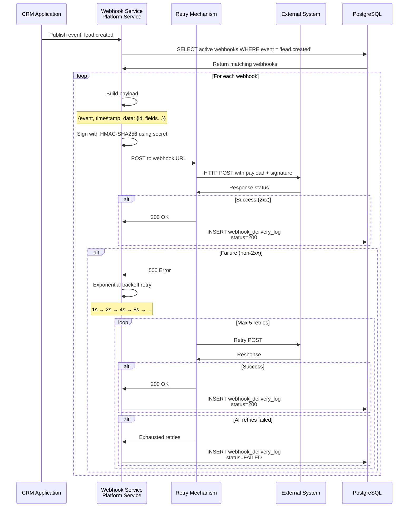

---

## 9. Marketing Form Submission Flow

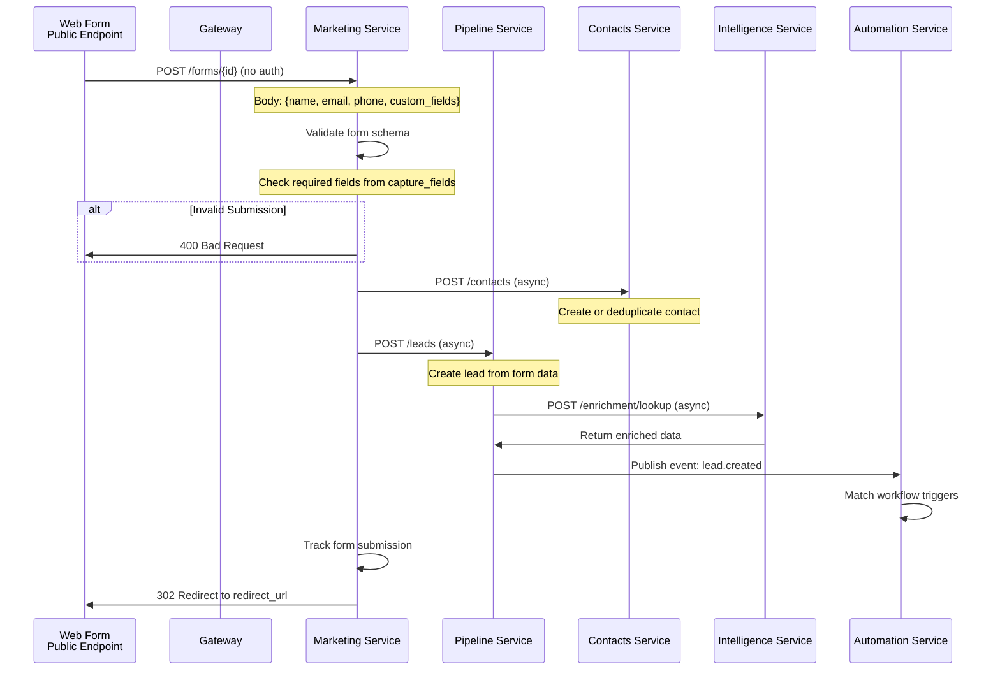

---

## 10. Livechat → Lead Conversion Flow

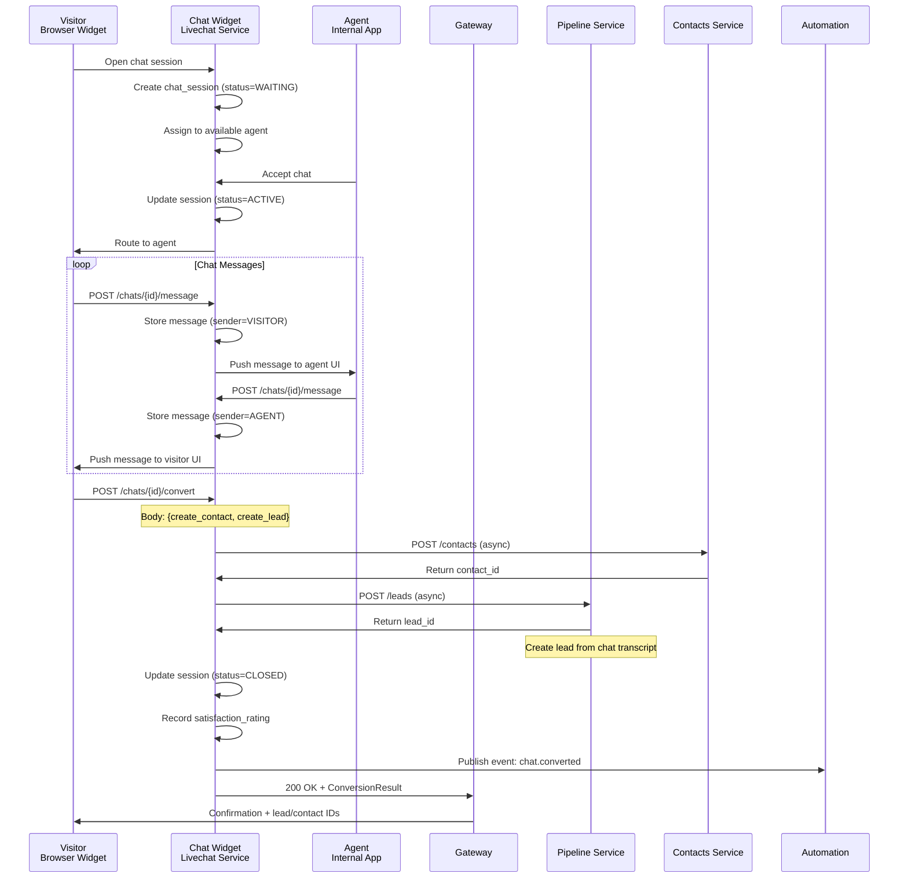

---

## 11. Report Generation Flow

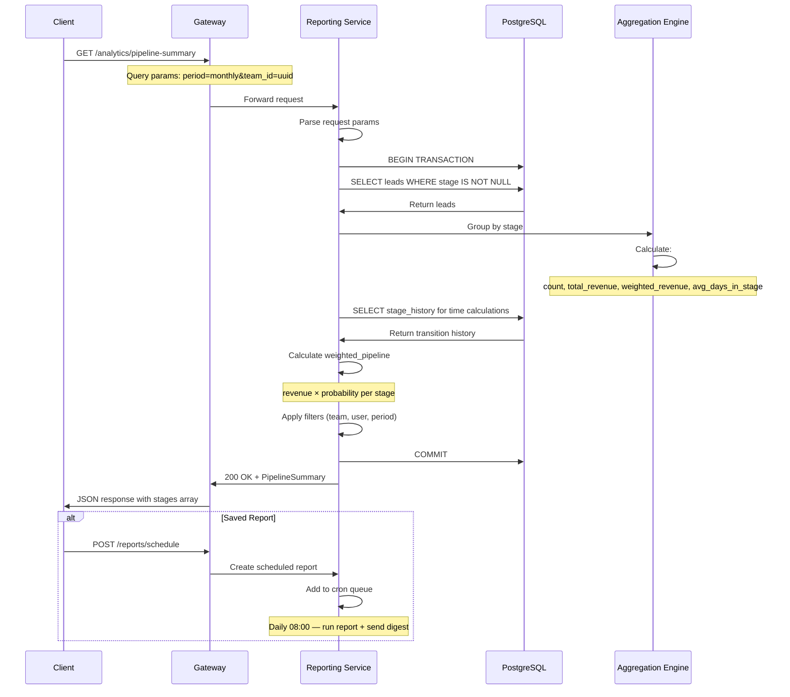

---

## 12. Data Flow Summary by Service

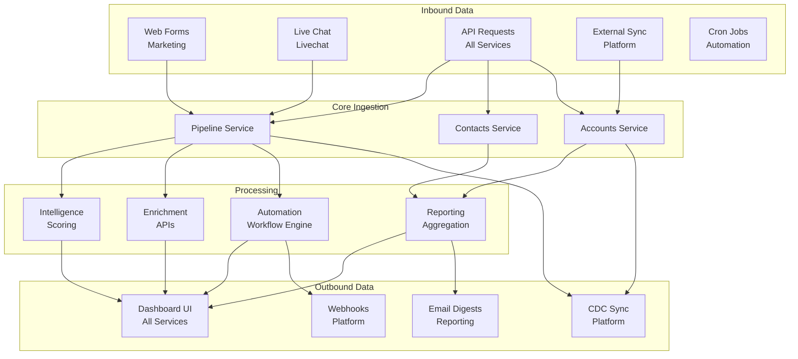

---

*This document defines all data flows. The standard CRUD flow applies to all services, while event-driven flows enable cross-service communication. Batch processing handles scoring and aggregation, while CDC enables real-time sync with external systems.*
