# CRM Automation Engine Design

> **Version:** 1.0.0
> **Scope:** Workflow trigger-execution model, rule engine, cron scheduling, and action processing
> **Status:** Active design spec

---

## 1. Trigger-Action Execution Model

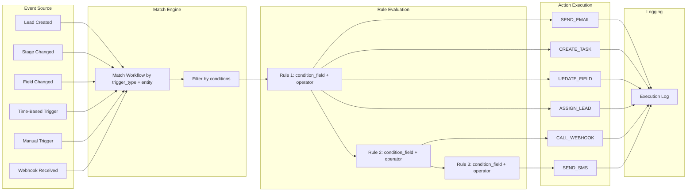

---

## 2. Workflow Engine Sequence Diagram

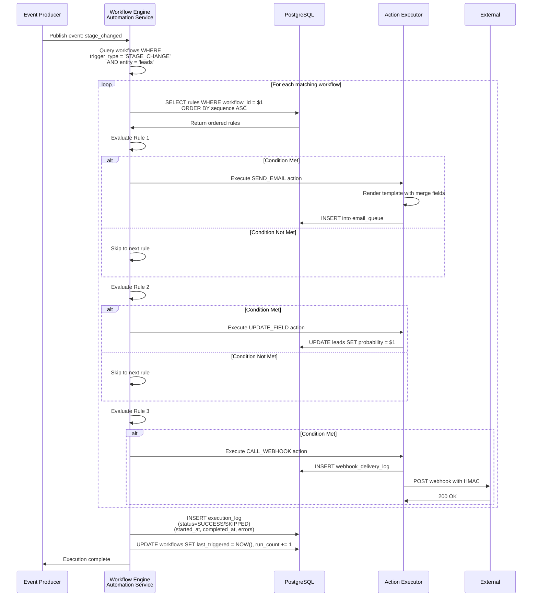

---

## 3. Rule Evaluation Flow

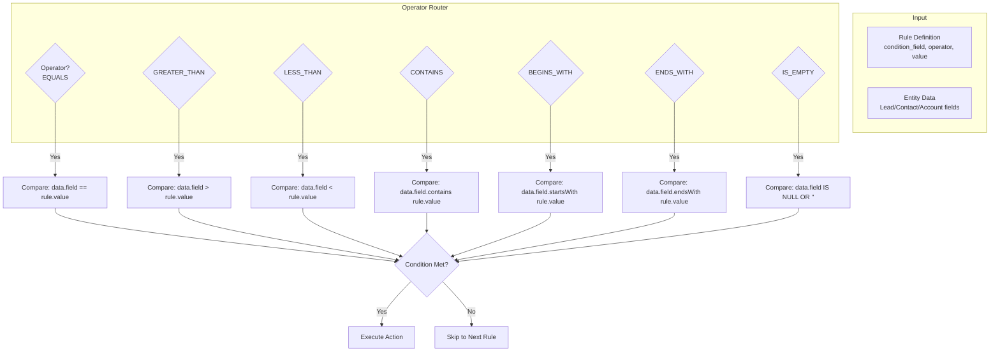

---

## 4. Action Execution Model

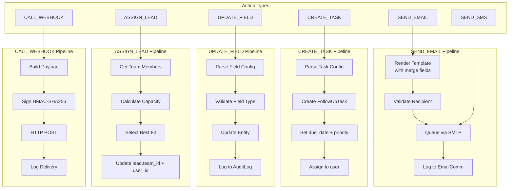

---

## 5. Cron Job Scheduling

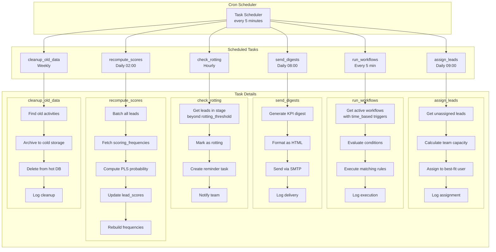

---

## 6. Workflow Execution States

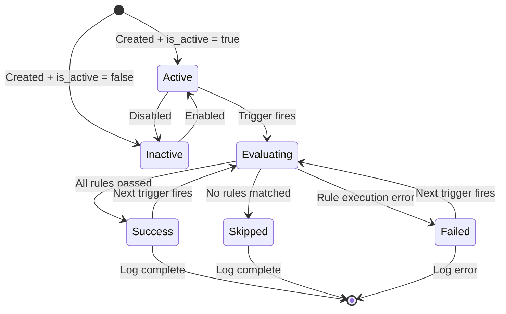

---

## 7. Workflow-Trigger-Action Relationship

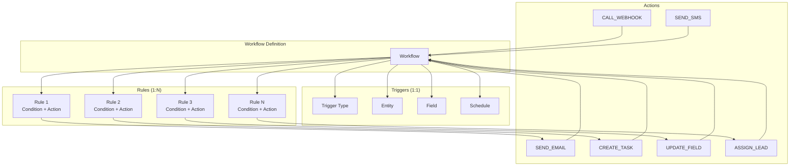

---

## 8. Time-Based Trigger Evaluation

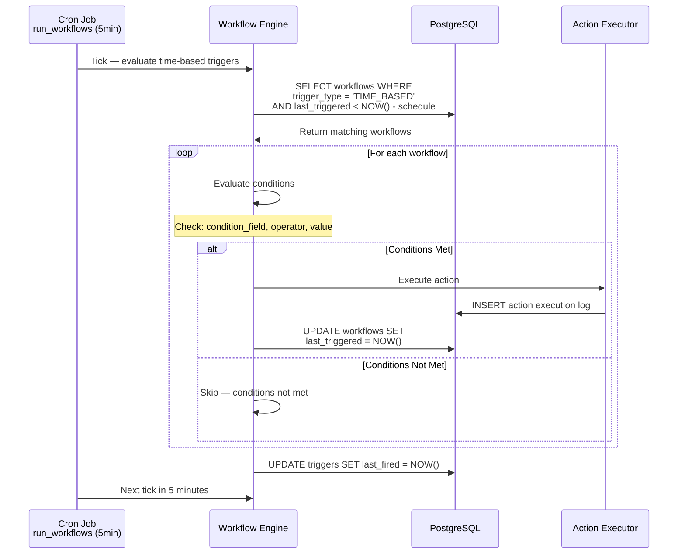

---

## 9. Manual Trigger Execution

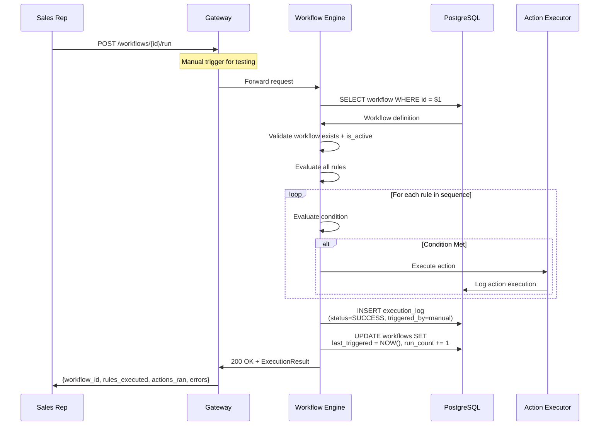

---

## 10. Lead Assignment Algorithm

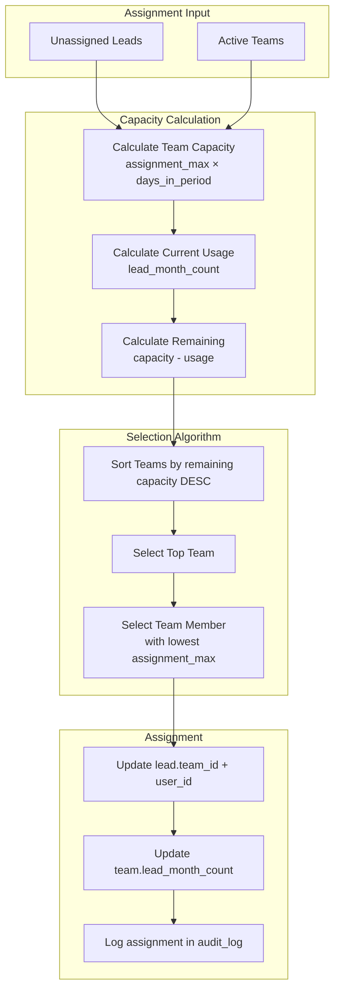

---

## 11. Action Execution Pipeline Detail

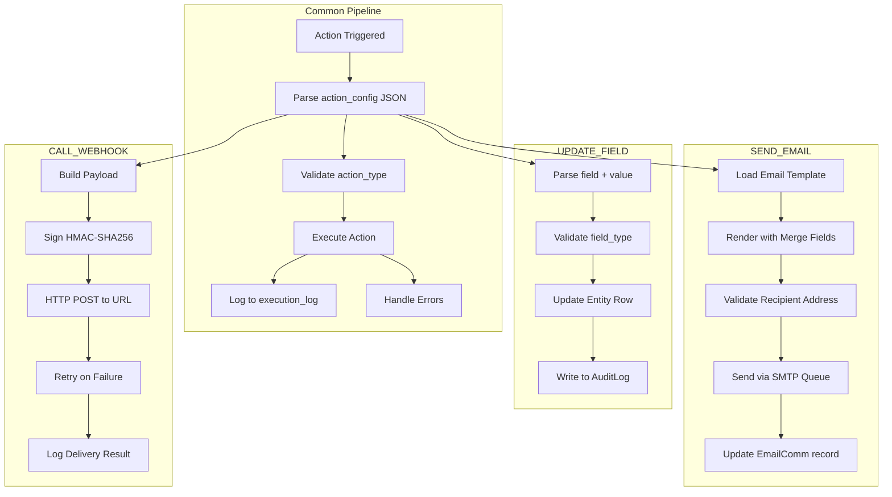

---

## 12. Automation Service Entity Map

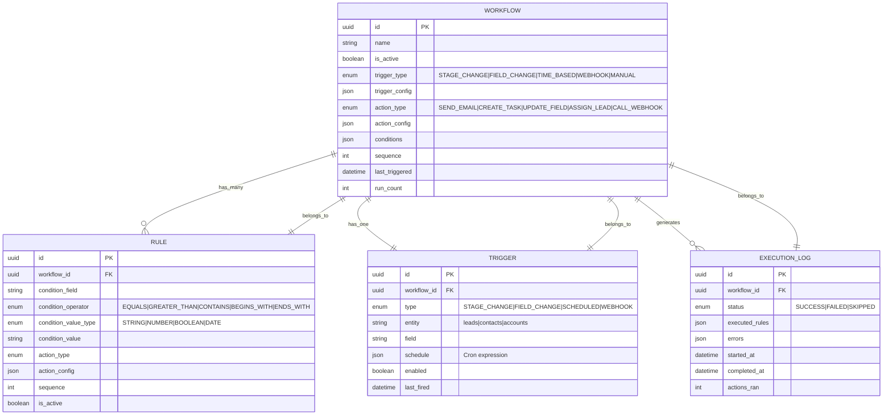

---

*This document defines the complete automation engine. Workflows are defined by trigger type + entity, evaluated by rules in sequence order, and execute actions (SEND_EMAIL, CREATE_TASK, UPDATE_FIELD, ASSIGN_LEAD, CALL_WEBHOOK). Cron jobs handle time-based triggers and periodic maintenance.*
