# CRM Entity Graph & Hierarchy Design

> **Version:** 1.0.0
> **Scope:** Hierarchical entity trees (accounts, contacts, pipelines), relationship graphs, and self-referential patterns
> **Status:** Active design spec

---

## 1. Unified Lead-Contact-Account Relationship Graph

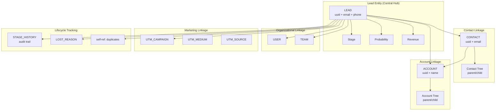

---

## 2. Account Hierarchy Tree

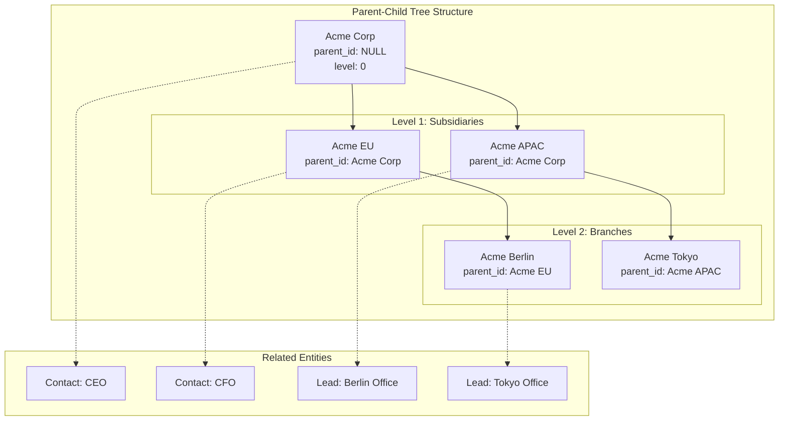

---

## 3. Contact Tree Hierarchy

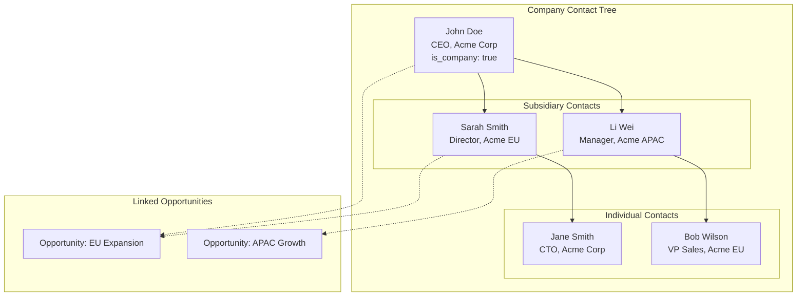

---

## 4. Pipeline Stage Graph (Sequential Flow)

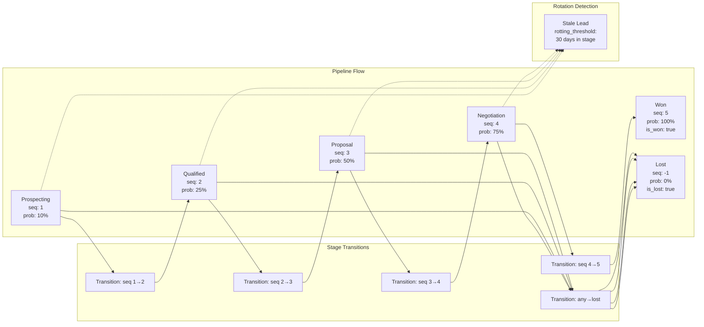

---

## 5. Lead Scoring Graph (Bayesian PLS)

```mermaid
graph TB
    subgraph "Input Signals"
        Email[Email Format<br/>valid/disposable/role]
        Phone[Phone Type<br/>mobile/landline/voip]
        Title[Job Title<br/>executive/mid/entry]
        Industry[Industry<br/>tech/finance/healthcare]
        Company[Company Size<br/>1-10/11-50/51-200/200+]
        Source[Lead Source<br/>form/ referral/referral/organic]
    end

    subgraph "Scoring Frequencies"
        F1[P(won|email_valid) = 0.72]
        F2[P(won|mobile) = 0.65]
        F3[P(won|executive) = 0.81]
        F4[P(won|tech) = 0.58]
        F5[P(won|51-200) = 0.62]
        F6[P(won|referral) = 0.74]
    end

    subgraph "Bayesian Aggregation"
        Prior[Prior Probability<br/>P(won) = base_rate]
        Bayes[Bayesian Update:<br/>P(won|signals) = prior × ∏ P(signal|won)]
        Normalize[Normalize Probability<br/>P(won) ∈ [0, 100]]
    end

    subgraph "Output"
        Score[Lead Score<br/>probability: 68%]
        Factors[Top Factors<br/>1. executive title<br/>2. referral source<br/>3. mobile phone]
        Bucket[Score Bucket<br/>HOT / WARM / COLD]
    end

    Email --> F1
    Phone --> F2
    Title --> F3
    Industry --> F4
    Company --> F5
    Source --> F6

    F1 --> Prior --> Bayes
    F2 --> Prior
    F3 --> Prior
    F4 --> Prior
    F5 --> Prior
    F6 --> Prior

    Bayes --> Normalize
    Normalize --> Score
    Normalize --> Factors
    Score --> Bucket
```

---

## 6. Team Assignment Graph

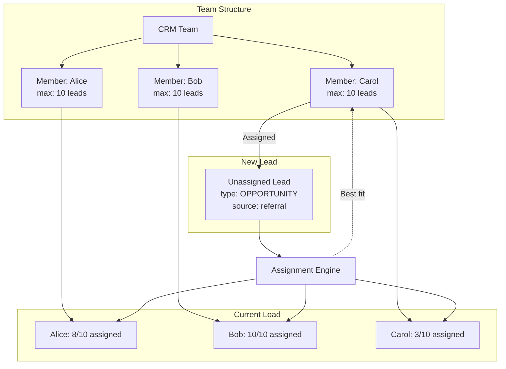

---

## 7. Campaign-to-Lead-Conversion Funnel

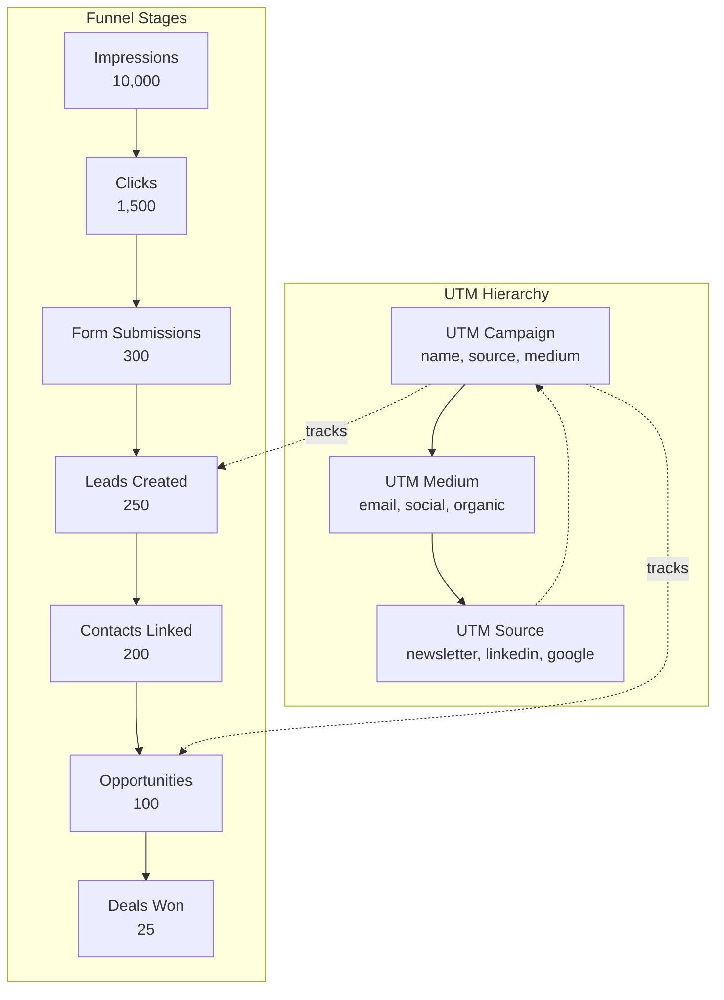

---

## 8. Subscription Lifecycle Graph

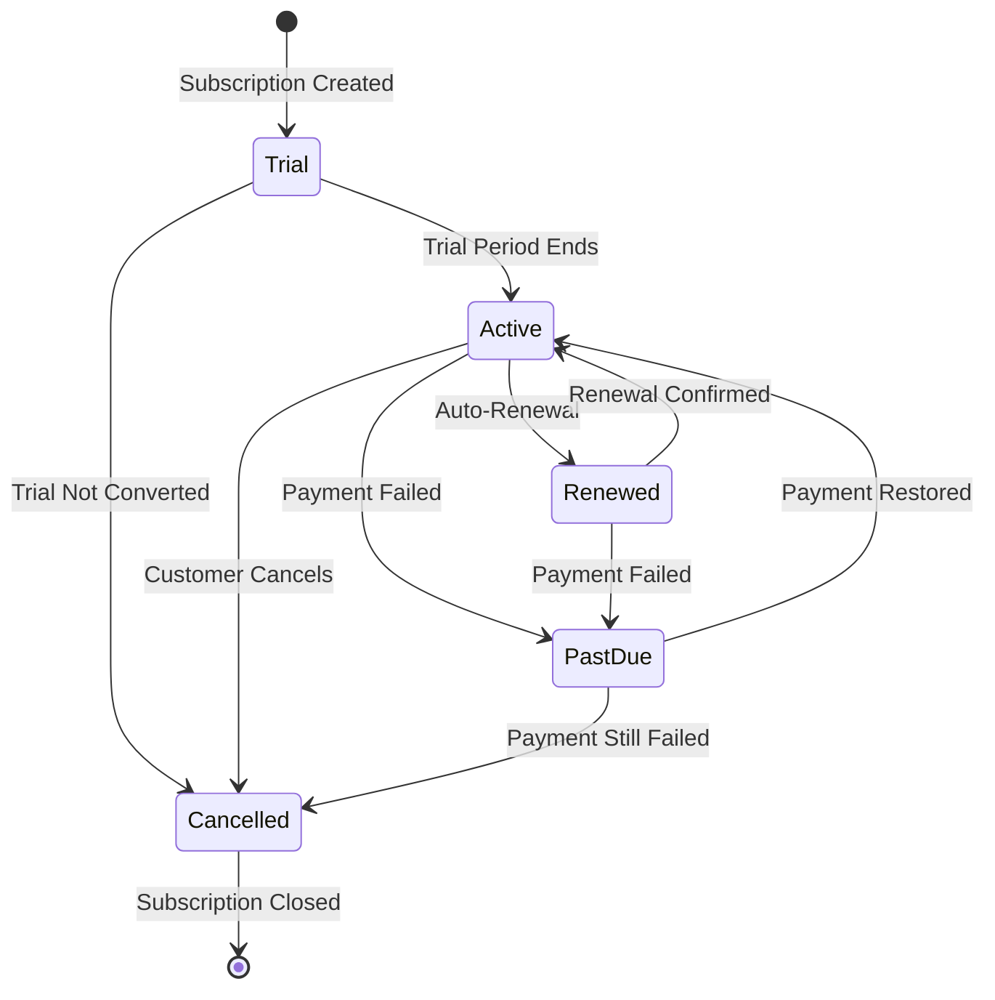

---

## 9. Chat Session Conversion Graph

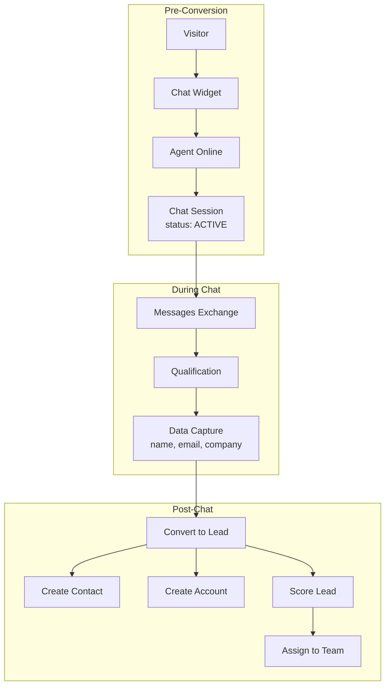

---

## 10. Custom Field Extension Graph

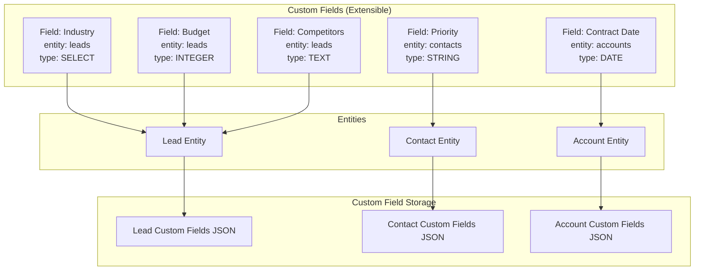

---

## 11. Webhook Event Graph

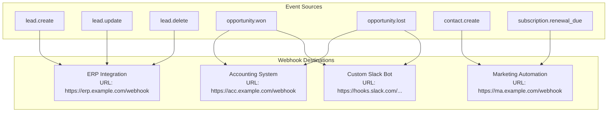

---

## 12. Complete Entity Graph Summary

```mermaid
graph TD
    subgraph "Core Hub"
        Lead[LEAD]
    end

    subgraph "Entity Relationships"
        Contact[CONTACT]
        Account[ACCOUNT]
        Stage[STAGE]
        Team[TEAM]
        User[USER]
        Campaign[UTM_CAMPAIGN]
    end

    subgraph "Analytics & Intelligence"
        LeadScore[LEAD_SCORE]
        PipelineSummary[PIPELINE_SUMMARY]
        ConversionRate[CONVERSION_RATE]
        Forecast[FORECAST]
    end

    subgraph "Automation & Events"
        Workflow[WORKFLOW]
        Webhook[WEBHOOK]
        AuditLog[AUDIT_LOG]
    end

    subgraph "Engagement & Communication"
        Subscription[SUBSCRIPTION]
        ChatSession[CHAT_SESSION]
        EmailComm[EMAIL_COMMUNICATION]
    end

    Lead --> Contact
    Lead --> Account
    Lead --> Stage
    Lead --> Team
    Lead --> User
    Lead --> Campaign
    Lead --> LeadScore
    Lead --> PipelineSummary
    Lead --> Workflow
    Lead --> AuditLog
    Lead --> Subscription
    Lead --> ChatSession
    Lead --> EmailComm
```

---

## 13. Hierarchical Tree Queries (SQL Pattern)

```
-- Account hierarchy with recursive CTE
WITH RECURSIVE account_tree AS (
    -- Base case: top-level accounts (no parent)
    SELECT id, name, parent_id, 0 AS level, ARRAY[id] AS path
    FROM accounts WHERE parent_id IS NULL
    
    UNION ALL
    
    -- Recursive case: children
    SELECT a.id, a.name, a.parent_id, at.level + 1, at.path || a.id
    FROM accounts a
    JOIN account_tree at ON a.parent_id = at.id
)
SELECT * FROM account_tree ORDER BY path;

-- Contact tree with recursive CTE
WITH RECURSIVE contact_tree AS (
    SELECT id, name, parent_id, 0 AS level
    FROM contacts WHERE parent_id IS NULL
    
    UNION ALL
    
    SELECT c.id, c.name, c.parent_id, ct.level + 1
    FROM contacts c
    JOIN contact_tree ct ON c.parent_id = ct.id
)
SELECT * FROM contact_tree;

-- Pipeline summary with stage aggregation
SELECT 
    s.name AS stage,
    s.probability AS stage_probability,
    COUNT(l.id) AS lead_count,
    SUM(l.expected_revenue) AS total_revenue,
    SUM(l.expected_revenue * s.probability / 100.0) AS weighted_revenue,
    AVG(EXTRACT(DAY FROM l.date_closed - l.date_open)) AS avg_days_in_stage
FROM leads l
JOIN stages s ON l.stage_id = s.id
WHERE l.active = true
GROUP BY s.name, s.probability
ORDER BY s.sequence;
```

---

*This document defines all entity graph and hierarchy patterns. The lead entity serves as the central hub connecting contacts, accounts, stages, teams, and marketing campaigns. Recursive CTEs handle hierarchical trees for accounts and contacts. Bayesian scoring aggregates multiple input signals into a probability score.*
