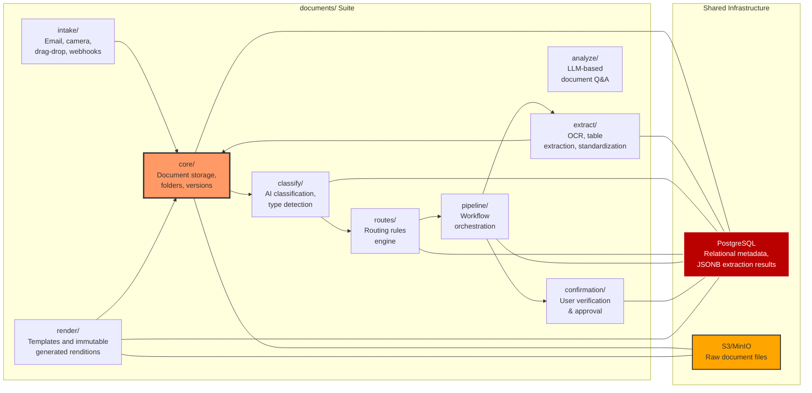
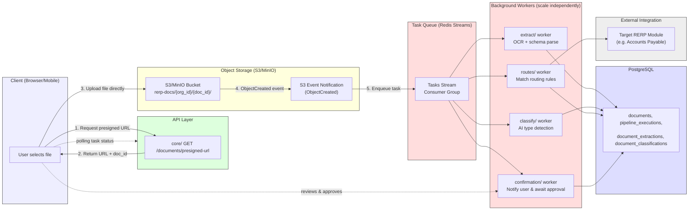
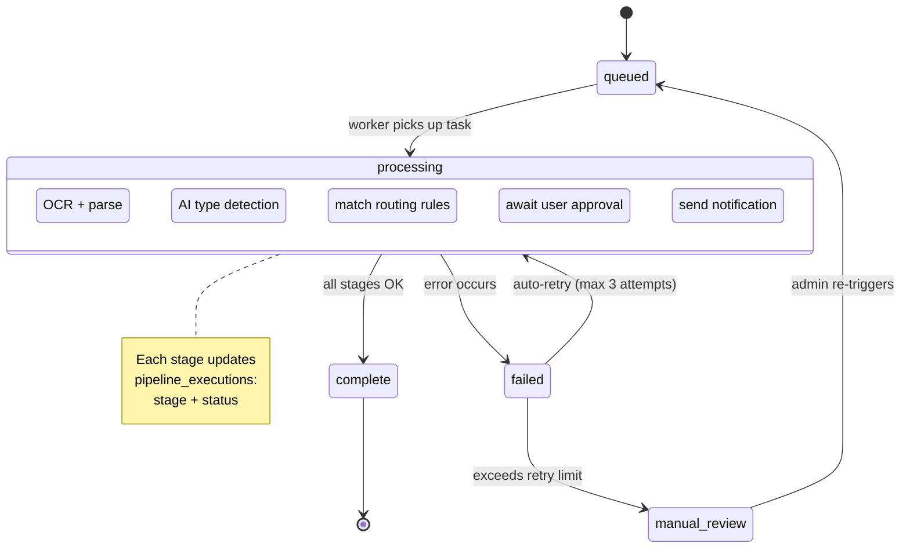
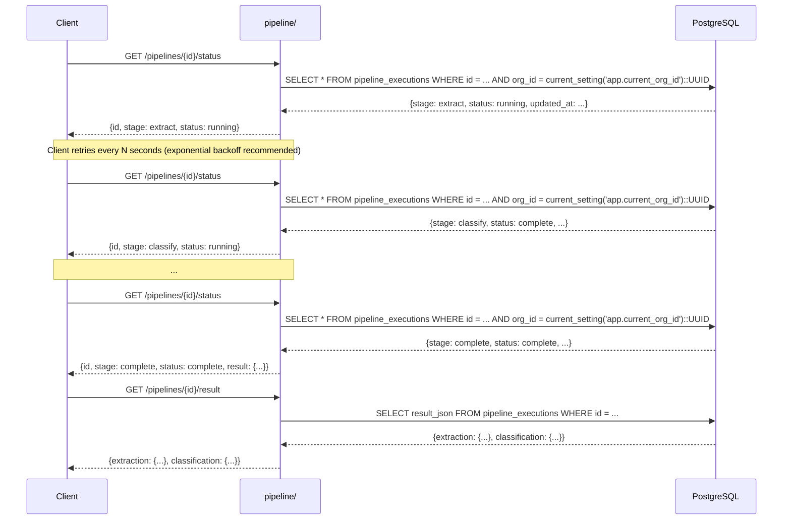
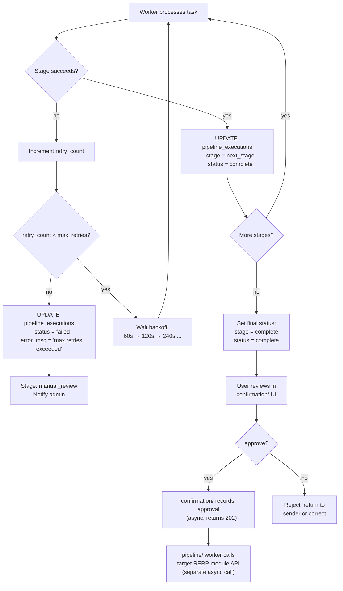

# RERP Documents — Service Design Blueprint

> **Status**: Draft v0.1
> **Scope**: Database schema, microservice boundaries, API contracts, data flow.
> **Purpose**: Reference document for generating `openapi/documents/{service}/` directories and OpenAPI specs.

---

## 1. System Architecture

The Documents suite has **9 product/API components**. Components may share a Documents deployment initially, while retaining independent API and scaling boundaries. They share PostgreSQL for RLS-scoped relational metadata and S3/MinIO for source files, template assets, and generated renditions.



**Core principle**: `core/` is the **canonical store**. Input components read from `core/`, process, and write results back as metadata. `render/` creates output artifacts but registers their file, lineage and version identity in `core/`; it does not create a second document store.

---

## 2. Database Schema

All tables live in a shared `documents` schema. RLS policies enforce per-`org_id` isolation.

### 2.1 Core Entities

```sql
CREATE TABLE folders (
    id          UUID PRIMARY KEY DEFAULT gen_random_uuid(),
    org_id      UUID NOT NULL,
    parent_id   UUID REFERENCES folders(id) ON DELETE CASCADE,
    name        TEXT NOT NULL,
    path        TEXT GENERATED ALWAYS AS (
        CASE WHEN parent_id IS NULL THEN '/' || name
             ELSE (SELECT path FROM folders WHERE id = parent_id) || '/' || name
        END
    ) STORED,
    created_at  TIMESTAMPTZ DEFAULT now(),
    created_by  UUID NOT NULL
);

CREATE INDEX idx_folders_org_path ON folders (org_id, path);

CREATE TABLE documents (
    id           UUID PRIMARY KEY DEFAULT gen_random_uuid(),
    org_id       UUID NOT NULL,
    user_id      UUID NOT NULL,
    filename     TEXT NOT NULL,
    file_type    TEXT NOT NULL,          -- pdf, image, docx, etc.
    file_size    BIGINT NOT NULL,
    storage_uri  TEXT NOT NULL,          -- s3://bucket/path/uuid.pdf
    folder_id    UUID REFERENCES folders(id),
    status       TEXT DEFAULT 'uploaded',-- uploaded | processing | extracted | failed
    metadata     JSONB DEFAULT '{}',     -- source: email/camera/webhook, tags, sender_email
    search_vector tsvector GENERATED ALWAYS AS (
        to_tsvector('english',
            coalesce(metadata->>'tags', '') || ' ' || filename || ' ' || coalesce(metadata->>'sender_email', '')
        )
    ) STORED,
    created_at   TIMESTAMPTZ DEFAULT now(),
    updated_at   TIMESTAMPTZ DEFAULT now()
);

CREATE INDEX idx_docs_org        ON documents (org_id);
CREATE INDEX idx_docs_folder     ON documents (folder_id);
CREATE INDEX idx_docs_status     ON documents (status);
CREATE INDEX idx_docs_search     ON documents USING GIN (search_vector);
CREATE INDEX idx_docs_metadata   ON documents USING GIN (metadata);

CREATE TABLE document_versions (
    id            UUID PRIMARY KEY DEFAULT gen_random_uuid(),
    document_id   UUID NOT NULL REFERENCES documents(id) ON DELETE CASCADE,
    version_no    INT NOT NULL,
    storage_uri   TEXT NOT NULL,
    metadata      JSONB DEFAULT '{}',     -- author, comment, diff_hash
    created_at    TIMESTAMPTZ DEFAULT now()
);

CREATE INDEX idx_versions_doc ON document_versions (document_id, version_no DESC);
```

### 2.2 Processing Entities

```sql
CREATE TABLE schemas (
    id          UUID PRIMARY KEY DEFAULT gen_random_uuid(),
    org_id      UUID NOT NULL,
    name        TEXT NOT NULL,
    schema_def  JSONB NOT NULL,           -- JSON schema definition
    created_at  TIMESTAMPTZ DEFAULT now()
);

CREATE TABLE document_extractions (
    id            UUID PRIMARY KEY DEFAULT gen_random_uuid(),
    org_id        UUID NOT NULL,
    document_id   UUID NOT NULL REFERENCES documents(id) ON DELETE CASCADE,
    schema_id     UUID REFERENCES schemas(id),
    result_json   JSONB NOT NULL,
    confidence    DECIMAL(3,2) NOT NULL,
    status        TEXT DEFAULT 'processing', -- processing | complete | failed
    highlights_json JSONB DEFAULT '[]',   -- bounding box coordinates per field
    search_vector tsvector GENERATED ALWAYS AS (
        to_tsvector('english', coalesce(result_json::text, ''))
    ) STORED,
    created_at    TIMESTAMPTZ DEFAULT now(),
    updated_at    TIMESTAMPTZ DEFAULT now()
);

CREATE INDEX idx_ext_doc    ON document_extractions (document_id);
CREATE INDEX idx_ext_schema ON document_extractions (schema_id);
CREATE INDEX idx_ext_status ON document_extractions (status);
CREATE INDEX idx_ext_search ON document_extractions USING GIN (search_vector);
CREATE INDEX idx_ext_result ON document_extractions USING GIN (result_json);

CREATE TABLE document_classifications (
    id            UUID PRIMARY KEY DEFAULT gen_random_uuid(),
    org_id        UUID NOT NULL,
    document_id   UUID NOT NULL REFERENCES documents(id) ON DELETE CASCADE,
    document_type TEXT NOT NULL,          -- invoice, resume, timesheet, etc.
    confidence    DECIMAL(3,2) NOT NULL,
    classifier_id UUID REFERENCES classifiers(id),
    created_at    TIMESTAMPTZ DEFAULT now()
);

CREATE INDEX idx_class_doc ON document_classifications (document_id);
CREATE INDEX idx_class_org ON document_classifications (org_id);

CREATE TABLE classifiers (
    id          UUID PRIMARY KEY DEFAULT gen_random_uuid(),
    org_id      UUID NOT NULL,
    name        TEXT NOT NULL,
    model       TEXT NOT NULL,
    labels      TEXT[] NOT NULL DEFAULT '{}',
    model_params JSONB DEFAULT '{}',
    created_at  TIMESTAMPTZ DEFAULT now(),
    updated_at  TIMESTAMPTZ
);

CREATE INDEX idx_classifiers_org ON classifiers (org_id);

### 2.3 Routing & Execution Entities

```sql
CREATE TABLE routing_rules (
    id                UUID PRIMARY KEY DEFAULT gen_random_uuid(),
    org_id            UUID NOT NULL,
    name              TEXT NOT NULL,
    document_type     TEXT NOT NULL,
    source            TEXT[] DEFAULT '{}',-- email, camera, webhook, upload
    target_module     TEXT NOT NULL,
    target_endpoint   TEXT NOT NULL,
    schema_id         UUID REFERENCES schemas(id),
    auto_approve      BOOLEAN DEFAULT FALSE,
    auto_approve_threshold DECIMAL(3,2) DEFAULT 0.85,
    notify            TEXT[] DEFAULT '{}',-- user roles or IDs
    fallback_route    TEXT,
    retry_count       INT DEFAULT 3,
    retry_delay       INT DEFAULT 60,     -- seconds
    created_at        TIMESTAMPTZ DEFAULT now()
);

CREATE TABLE pipeline_executions (
    id            UUID PRIMARY KEY DEFAULT gen_random_uuid(),
    org_id        UUID NOT NULL,
    document_id   UUID REFERENCES documents(id) ON DELETE SET NULL,
    stage         TEXT NOT NULL,          -- ingest | parse | classify | extract | route | confirm | create | notify
    status        TEXT DEFAULT 'running', -- running | complete | failed | skipped
    result_json   JSONB DEFAULT '{}',
    error_msg     TEXT,
    started_at    TIMESTAMPTZ DEFAULT now(),
    completed_at  TIMESTAMPTZ
);

CREATE INDEX idx_exec_doc ON pipeline_executions (document_id);
CREATE INDEX idx_exec_stage ON pipeline_executions (stage, status);
CREATE INDEX idx_exec_org ON pipeline_executions (org_id);

### 2.4 Confirmation Entities

```sql
CREATE TABLE confirmation_requests (
    id            UUID PRIMARY KEY DEFAULT gen_random_uuid(),
    org_id        UUID NOT NULL,
    document_id   UUID NOT NULL REFERENCES documents(id) ON DELETE CASCADE,
    execution_id  UUID REFERENCES pipeline_executions(id),
    status        TEXT DEFAULT 'pending',  -- pending | approved | rejected | corrected | expired
    classification JSONB NOT NULL,          -- cached classification result for the review UI
    extraction    JSONB NOT NULL,          -- cached extraction result for the review UI
    extracted_data JSONB DEFAULT '{}',     -- structured extracted fields
    confidence    DECIMAL(3,2),
    target_module TEXT,
    target_endpoint TEXT,
    approved_at   TIMESTAMPTZ,
    created_at    TIMESTAMPTZ DEFAULT now()
);

CREATE INDEX idx_confirm_doc ON confirmation_requests (document_id);
CREATE INDEX idx_confirm_org ON confirmation_requests (org_id);
CREATE INDEX idx_confirm_status ON confirmation_requests (org_id, status);

CREATE TABLE split_operations (
    id            UUID PRIMARY KEY DEFAULT gen_random_uuid(),
    org_id        UUID NOT NULL,
    document_id   UUID NOT NULL REFERENCES documents(id),
    split_ids     UUID[] NOT NULL,         -- resulting document IDs
    pages         INT[] DEFAULT '{}',       -- page assignments (optional)
    created_at    TIMESTAMPTZ DEFAULT now()
);

CREATE INDEX idx_split_org ON split_operations (org_id);

CREATE TABLE merge_operations (
    id            UUID PRIMARY KEY DEFAULT gen_random_uuid(),
    org_id        UUID NOT NULL,
    document_id   UUID NOT NULL REFERENCES documents(id),  -- result document
    source_ids    UUID[] NOT NULL,        -- original document IDs
    storage_uri   TEXT,
    created_at    TIMESTAMPTZ DEFAULT now()
);

CREATE INDEX idx_merge_org ON merge_operations (org_id);
```

---

## 3. Microservice API Contracts

Each service gets its own `openapi/{service}/openapi.yaml`. Below are the endpoint summaries.

### 3.1 `core` — Document Storage

**Base Path**: `/api/v1/documents/core`

| Method | Path | Summary | Request Body | Response |
|---|---|---|---|---|
| `POST` | `/documents` | Upload document to `core/` | `multipart/form-data` + metadata JSON | `Document` |
| `GET` | `/documents` | List documents (paginated) | Query: `page`, `limit`, `search`, `folder_id` | `Paginated<Document>` |
| `GET` | `/documents/{id}` | Get document metadata | — | `Document` |
| `PUT` | `/documents/{id}` | Update metadata/tags | `UpdateDocumentRequest` | `Document` |
| `DELETE` | `/documents/{id}` | Delete document | — | `204` |
| `POST` | `/documents/{id}/versions` | Create version | `CreateVersionRequest` | `Version` |
| `GET` | `/documents/{id}/versions` | List versions | — | `Paginated<Version>` |
| `GET` | `/folders` | List folder tree | — | `FolderTree` |
| `POST` | `/folders` | Create folder | `CreateFolderRequest` | `Folder` |
| `GET` | `/documents/{id}/download` | Download raw file | — | `file` |
| `GET` | `/documents/{id}/presigned-url` | Get presigned upload URL | `PresignedUrlRequest` | `PresignedUrl` |
| `POST` | `/documents/{id}/presigned-download` | Get presigned download URL | — | `PresignedUrl` |
| `GET` | `/documents/search` | Full-text search | Query: `q`, `page`, `limit` | `Paginated<Document>` |

### 3.2 `intake` — Multi-Channel Ingestion

**Base Path**: `/api/v1/documents/intake`

| Method | Path | Summary | Request Body | Response |
|---|---|---|---|---|
| `POST` | `/upload` | Upload with metadata | `multipart/form-data` | `Document` |
| `POST` | `/url` | Submit document by URL | `CreateDocumentRequest` | `Document` |
| `POST` | `/batch` | Batch upload | Array of files + metadata | `BatchResult` |
| `POST` | `/email` | Webhook email forwarding | `EmailPayload` | `Accepted` |
| `GET` | `/email-aliases` | List email aliases | — | `List<EmailAlias>` |
| `POST` | `/email-aliases` | Create alias | `EmailAlias` | `EmailAlias` |
| `DELETE` | `/email-aliases/{id}` | Remove alias | — | `204` |
| `GET` | `/mobile/status` | Mobile app sync status | — | `MobileStatus` |

**Note**: `POST /url` returns `201` with `Document` because URL fetch is performed synchronously by the API. For very large files or slow connections, this may time out. Consider using `POST /upload` or `POST /batch` for large documents instead.

### 3.3 `extract` — Parse + Standardize

**Base Path**: `/api/v1/documents/extract`

| Method | Path | Summary | Request Body | Response |
|---|---|---|---|---|
| `POST` | `/documents/{id}/parse` | Submit for OCR | `ParseRequest` | `ExtractionJob` |
| `POST` | `/documents/{id}/standardize` | Extract using schema | `StandardizeRequest` | `ExtractionJob` |
| `GET` | `/documents/{id}/extract/{sid}` | Get results | — | `ExtractionResult` |
| `GET` | `/documents/{id}/extract/{sid}/highlights` | Get bounding boxes | — | `Highlights` |
| `POST` | `/schemas` | Create schema | `SchemaDef` | `Schema` |
| `POST` | `/schemas/generate` | Auto-generate schema | `GenerateSchemaRequest` | `Schema` |
| `GET` | `/schemas` | List schemas | — | `Paginated<Schema>` |

### 3.4 `classify` — AI Classification

**Base Path**: `/api/v1/documents/classify`

| Method | Path | Summary | Request Body | Response |
|---|---|---|---|---|
| `POST` | `/documents/{id}/classify` | Submit for classification | `ClassifyRequest` | `ClassificationJob` (202) or `Classification` (200 if cached) |
| `GET` | `/classifications/{id}` | Poll classification job | — | `ClassificationJob` |
| `GET` | `/documents/{id}/classification` | Get cached result | — | `Classification` |
| `POST` | `/classifiers` | Create custom classifier | `ClassifierDef` | `Classifier` |
| `GET` | `/classifiers` | List classifiers | — | `Paginated<Classifier>` |

**Note**: Classification is asynchronous because it invokes an ML model. `POST /documents/{id}/classify` returns `202 Accepted` with a `ClassificationJob`. Poll `GET /classifications/{id}` for the result. Returns `200` with cached result if a classification already exists for this document.

### 3.5 `analyze` — LLM Analysis

**Base Path**: `/api/v1/documents/analyze`

| Method | Path | Summary | Request Body | Response |
|---|---|---|---|---|
| `POST` | `/documents/{id}/analyze` | Ask a question about a document | `AnalyzeRequest` | `AnalysisJob` (202) or `AnalysisResult` (200 if cached) |
| `GET` | `/analysis/{id}` | Poll analysis job | — | `AnalysisJob` |
| `GET` | `/documents/{id}/analysis` | Get cached result | — | `AnalysisResult` |
| `POST` | `/documents/analyze-bulk` | Ask a question about multiple docs | `AnalyzeBulkRequest` (max 20 docs) | `AnalysisJob` (202) or `AnalysisResult` (200 if cached) |

**Note**: LLM analysis is asynchronous. `POST /documents/{id}/analyze` returns `202 Accepted` with an `AnalysisJob`. Poll `GET /analysis/{id}` for the result. Returns `200` with cached result if an analysis already exists. Bulk analysis has a maximum of 20 documents to prevent context window overflow.

### 3.6 `routes` — Routing Rules

**Base Path**: `/api/v1/documents/routes`

| Method | Path | Summary | Request Body | Response |
|---|---|---|---|---|
| `POST` | `/rules` | Create routing rule | `RouteDef` | `Route` |
| `GET` | `/rules` | List rules | — | `Paginated<Route>` |
| `GET` | `/rules/{id}` | Get rule | — | `Route` |
| `PUT` | `/rules/{id}` | Update rule | `RouteDef` | `Route` |
| `DELETE` | `/rules/{id}` | Delete rule | — | `204` |
| `POST` | `/rules/{id}/test` | Test rule | `TestRouteRequest` | `TestResult` |
| `GET` | `/rules/by-document-type` | Get rules by type | Query: `document_type` | `List<Route>` |
| `POST` | `/rules/import` | Bulk import rules | `ImportRoutesRequest` | `ImportResult` |
| `GET` | `/rules/export` | Export all rules | — | `List<Route>` |

### 3.7 `pipeline` — Workflow Orchestration

**Base Path**: `/api/v1/documents/pipeline`

| Method | Path | Summary | Request Body | Response |
|---|---|---|---|---|
| `POST` | `/pipelines` | Create pipeline definition | `PipelineDef` | `Pipeline` |
| `POST` | `/pipelines/{id}/execute` | Execute pipeline on doc(s) | `ExecuteRequest` | `PipelineJob` (202) |
| `GET` | `/pipelines/{id}/status` | Check pipeline status | — | `PipelineJob` |
| `GET` | `/pipelines/{id}/result` | Get pipeline output | — | `PipelineResult` |
| `GET` | `/executions` | List executions | — | `Paginated<Execution>` |
| `GET` | `/executions/{id}` | Get execution details | — | `Execution` |

**Note**: All pipeline execution is asynchronous. `POST /pipelines/{id}/execute` returns `202 Accepted` with a `PipelineJob`. Poll `GET /pipelines/{id}/status` for progress. The `sync` field has been removed — there is no synchronous path. If a pipeline needs to wait for a stage (e.g., confirm), it pauses and waits for the `confirmation/` service to signal completion.

`split_document` and `merge_documents` have been moved to the `confirmation/` service (see §3.8) as they produce document versions managed by `core/`.

### 3.8 `confirmation` — User Verification

**Base Path**: `/api/v1/documents/confirmation`

| Method | Path | Summary | Request Body | Response |
|---|---|---|---|---|
| `GET` | `/confirmations/pending` | List pending confirmations | — | `Paginated<Confirmation>` |
| `GET` | `/confirmations/{id}` | Get confirmation details | — | `Confirmation` |
| `POST` | `/confirmations/{id}/approve` | Approve (triggers target module API) | — | `ConfirmationApproved` (202) |
| `POST` | `/confirmations/{id}/reject` | Reject (returns to manual review) | `RejectRequest` | `Confirmation` |
| `POST` | `/confirmations/{id}/correct` | Correct (updates schema/ML model) | `CorrectRequest` | `Confirmation` |
| `POST` | `/confirmations/batch-approve` | Approve multiple at once | `BatchApproveRequest` | `BatchResult` |
| `GET` | `/rules` | List auto-approve rules | — | `Paginated<AutoApproveRule>` |
| `POST` | `/rules` | Create auto-approve rule | `AutoApproveRuleDef` | `AutoApproveRule` |
| `POST` | `/documents/{id}/split` | Split a multi-page document | `SplitRequest` | `SplitResult` (202) |
| `POST` | `/documents/{id}/merge` | Merge multiple documents | `MergeRequest` | `MergedDocument` (202) |

**Note**: `approve_confirmation` does NOT directly call the target module API. It marks the confirmation as approved (async), and a background worker in the `pipeline/` service then calls the target module endpoint. This prevents the approval from blocking if the target module is slow or unavailable. Returns `202 Accepted` immediately.

`split` and `merge` are now asynchronous — returns `202` with the new document IDs. The documents are created as new versions in `core/`.

`confirm_extraction` and `correct_extraction` have been removed from `pipeline/` (see §3.7 note) — they are now managed via the `confirmation/` service.

### 3.9 `render` — Document Generation and Rendition

**Base Path**: `/api/v1/documents/render`

`render/` owns versioned HTML/CSS templates, validation and preview, idempotent asynchronous rendition creation, immutable lineage, explicit derivative copies and download grants. A source suite owns the business facts and frozen render snapshot and submits it only after committing its domain transaction. Tenant and actor scope are derived from validated Sesame identity, never from request fields.

The authoritative API is [render/openapi.yaml](render/openapi.yaml); requirements and acceptance criteria are in [PRD-008](DOCUMENTS_ANALYSIS/PRDs/PRD-008-Document-Generation-and-Rendition.md). The cross-suite ownership boundary is fixed by [ADR 002](../../docs/adrs/002-document-generation-ownership.md).

---

## 4. Data Flow & Integration

### 4.1 Document Lifecycle

#### 4.1.1 S3 Upload & Event Trigger

Document processing is triggered by an **S3 object event**. The client uploads files directly to S3 using presigned authentication URLs. Upon successful upload, S3 emits an `ObjectCreated` event, which enqueues a processing task to the Redis stream. Background workers then consume this task and process the document through the extract → classify → route pipeline, updating `pipeline_executions` in PostgreSQL as they go.



#### 4.1.2 Synchronous Processing Removed

**Deprecated**: The synchronous processing path (`sync=true` on `POST /documents` or `POST /pipelines/{id}/execute`) has been removed from the design. All document processing is now exclusively asynchronous.

The previous sync fallback allowed clients to block until a result was available, with a 60-second timeout that fell back to async. This was removed because:

1. It contradicted the async architecture established by the S3 upload → Redis → worker pattern.
2. HTTP connection waste: blocking connections for 60s per document, especially when many documents share the same connection pool.
3. Polling already exists and is the correct pattern: clients poll `GET /pipelines/{id}/status` with a configurable interval.
4. Mixed sync/async semantics added complexity and error-prone timeout handling.

Clients should always use the async pattern: POST → 202 Accepted → poll GET for status → GET for result.

#### 4.1.3 Task State Machine

Each pipeline execution progresses through well-defined stages. Workers advance the state by writing to `pipeline_executions`.



#### 4.1.4 Polling Contract

The client polls task status via the pipeline service until the task completes or fails.



Clients SHOULD implement exponential backoff when polling: start at 2s, double each retry up to 30s. This prevents thundering herd on the polling endpoint during high document volume.

#### 4.1.5 Error Handling and Retry

Failed tasks are retried automatically with exponential backoff. After exhausting retries, the task enters a manual review state.



#### 4.1.6 Async Approval Pattern

When a user approves a confirmation, the `confirmation/` service records the decision immediately (returns 202). A background worker in `pipeline/` then calls the target RERP module endpoint. This separation ensures:

1. The user gets immediate feedback — no waiting for downstream API latency.
2. Target module failures don't block the approval itself — the worker retries with exponential backoff.
3. If the target module is unavailable for too long, the pipeline record flags it for admin review.

### 4.2 S3 Storage Pattern

```
s3://rerp-docs/{org_id}/{document_id}/{version_uuid}.pdf
```

- `storage_uri` in `documents` and `document_versions` tables points to this path.
- Presigned URLs are generated by `core/` service for download/preview.
- Raw files are never stored in the database.

### 4.3 JSONB Extraction Pattern

```json
{
  "invoice_number": "INV-2024-001",
  "vendor": "Summit Office Supplies",
  "total_amount": 1448.18,
  "currency": "USD",
  "due_date": "2024-07-31",
  "items": [
    {"description": "A4 Paper", "quantity": 12, "unit_price": 32.99, "total": 395.88}
  ]
}
```

- Stored in `document_extractions.result_json`.
- Indexed via GIN for full-text search.
- Schema-agnostic: different document types have different JSON structures.
- `highlights_json` stores `{field_name: {page, x, y, width, height}}` for bounding boxes.

---

## 5. Security & RLS

Every table has `org_id`. RLS policies enforce isolation:

```sql
ALTER TABLE documents ENABLE ROW LEVEL SECURITY;
ALTER TABLE document_extractions ENABLE ROW LEVEL SECURITY;
ALTER TABLE document_classifications ENABLE ROW LEVEL SECURITY;
ALTER TABLE document_versions ENABLE ROW LEVEL SECURITY;
ALTER TABLE folders ENABLE ROW LEVEL SECURITY;
ALTER TABLE pipeline_executions ENABLE ROW LEVEL SECURITY;
ALTER TABLE routing_rules ENABLE ROW LEVEL SECURITY;
ALTER TABLE schemas ENABLE ROW LEVEL SECURITY;
ALTER TABLE classifiers ENABLE ROW LEVEL SECURITY;
ALTER TABLE confirmation_requests ENABLE ROW LEVEL SECURITY;

-- Policy: users see only their organization's documents
CREATE POLICY org_documents ON documents
    FOR ALL USING (org_id = current_setting('app.current_org_id')::UUID);

-- All tables with direct org_id use simple policy
CREATE POLICY org_extractions ON document_extractions
    FOR ALL USING (org_id = current_setting('app.current_org_id')::UUID);

CREATE POLICY org_classifications ON document_classifications
    FOR ALL USING (org_id = current_setting('app.current_org_id')::UUID);

CREATE POLICY org_executions ON pipeline_executions
    FOR ALL USING (org_id = current_setting('app.current_org_id')::UUID);
```

**Note**: `document_extractions`, `document_classifications`, and `pipeline_executions` all include a direct `org_id` column (not just a FK to `documents`). This allows efficient RLS policies that check a single column instead of requiring subquery joins through `documents`. This eliminates the performance penalty of `IN (SELECT ...)` patterns.

---

## 6. Implementation Notes

1. **Code Generation**: All services use `brrtrouter-gen` from their `openapi.yaml` specs.
2. **Migration Strategy**: Entity structs are updated in `entities/` first. `lifeguard_migrator` generates SQL migrations. Never edit migration files directly.
3. **Indexing**: GIN indexes on `search_vector` and `result_json` (GIN). pg_trgm extension for fuzzy search if needed later.
4. **Search Today**: PostgreSQL GIN for Day 1. External search (Elasticsearch/OpenSearch) is Day 3 — sync via logical replication or background worker. No changes to schema required.
5. **Service Discovery**: The gateway is auto-generated by `brrtrouter-gen` from sub-service specs — do not maintain it manually.
6. **BFF Generation**: Suite BFF (`openapi/documents/openapi_bff.yaml`) aggregates all service specs automatically.
7. **Rate Limiting**: All services return `429 Too Many Requests` with `Retry-After` header. Implement token-bucket rate limiting per-organization.
8. **Error Format**: All services use a consistent `Error` schema with `error` (code), `message` (human-readable), and optional `details` (additional context). Every endpoint documents `400`, `401`, `404` responses with this schema.

---

*Blueprint for generating openapi/documents/{core, intake, extract, classify, analyze, routes, pipeline, confirmation} directories.*
