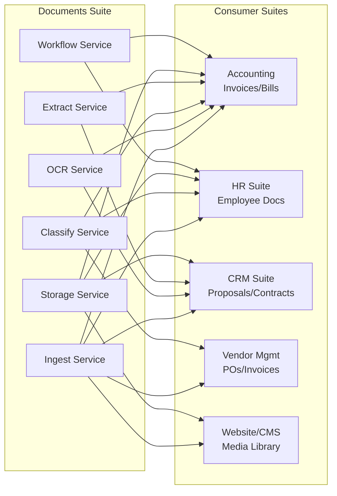

# Documents Competitive Analysis

> **Date:** 2026-05-12
> **Purpose:** Pitch-level competitive analysis for buyer decision-making
> **Scope:** RERP Documents vs. DocuPipe, AWS Textract, Google Document AI, Azure Document Intelligence, ABBYY FlexiCapture, Kofax, UiPath Document Understanding, Rossum, Nanonets

---

## Overview

This analysis examines document processing capabilities across **10 functional components**, comparing RERP Documents against the competitive landscape from a buyer's perspective. Each component is documented as a pitch — the question a buyer asks and the answer their options provide.

The competitors evaluated:

| Vendor | Market Position | Best For | Pricing Model |
|--------|----------------|----------|---------------|
| **ABBYY FlexiCapture** | Enterprise OCR Leader | Large enterprises, compliance-heavy | Enterprise license ($100K+) |
| **AWS Textract** | Cloud Native OCR | AWS-centric orgs, developers | Per-page ($0.0006/page) |
| **Google Document AI** | Cloud AI Leader | Google Cloud orgs, custom processors | Per-page ($0.0015–$0.10/page) |
| **Azure Document Intelligence** | Microsoft Stack | Microsoft-centric orgs | Per-page ($0.01–$0.03/page) |
| **DocuPipe** | API-First AI | Healthcare, finance, forms | Per-request ($0.001/request) |
| **Kofax** | Process Orchestration | Enterprise workflow, AP automation | Enterprise license ($100K+) |
| **UiPath Document Understanding** | RPA + AI | Organizations already using UiPath RPA | Per-page ($0.18–$0.24/page) |
| **Rossum** | AI Document Processing | Finance, semi-structured docs | Custom quote (per volume) |
| **Nanonets** | Custom Model Builder | Finance, healthcare, logistics | Per-run ($0.30 extraction, $0.10 classification) |
| **RERP Documents** | Open-Source, API-First, Self-Hosted | Dev-driven orgs, data sovereignty, cost control | Self-hosted (free) / Hosted (TBD) |

---

## Component Directory

| # | Component | Directory | Status |
|---|-----------|-----------|--------|
| 1 | Document Ingestion & Intake | [ingestion/README.md](ingestion/README.md) | Planned |
| 2 | OCR & Text Recognition | [ocr/README.md](ocr/README.md) | Planned |
| 3 | Document Classification | [classification/README.md](classification/README.md) | Planned |
| 4 | Data Extraction | [extraction/README.md](extraction/README.md) | Planned |
| 5 | Document Storage & Versioning | [storage/README.md](storage/README.md) | Planned |
| 6 | Review & Approval Workflows | [workflows/README.md](workflows/README.md) | Planned |
| 7 | Integration & Routing | [integration/README.md](integration/README.md) | Planned |
| 8 | Analytics & Reporting | [analytics/README.md](analytics/README.md) | Planned |
| 9 | Security & Compliance | [security/README.md](security/README.md) | Planned |
| 10 | Platform & Extensibility | [platform/README.md](platform/README.md) | Planned |
| 11 | Search & Discovery | [search-discovery/README.md](search-discovery/README.md) | Planned |

---

## Head-to-Head Capability Summary

| Capability Area | RERP | ABBYY | AWS Textract | Google Doc AI | Azure DI | DocuPipe | Kofax | UiPath | Rossum | Nanonets |
|----------------|------|-------|-------------|---------------|----------|----------|-------|--------|--------|----------|
| Document Ingestion | ●○○ | ●●● | ●●○ | ●●○ | ●●○ | ●●○ | ●●● | ●●○ | ●●○ | ●●○ |
| OCR & Text Recognition | ●○○ | ●●● | ●●● | ●●● | ●●● | ●●● | ●●● | ●●○ | ●●○ | ●●○ |
| Document Classification | ●○○ | ●●● | ●●○ | ●●● | ●●● | ●●○ | ●●● | ●●○ | ●●○ | ●●○ |
| Data Extraction | ●○○ | ●●● | ●●○ | ●●● | ●●● | ●●● | ●●● | ●●○ | ●●● | ●●● |
| Document Storage/Versioning | ●○○ | ●●○ | ●●○ | ●●○ | ●●○ | ●○○ | ●●○ | ●●○ | ●○○ | ●○○ |
| Review/Approval Workflows | ●○○ | ●●● | ●○○ | ●○○ | ●○○ | ●○○ | ●●● | ●●● | ●●○ | ●●○ |
| Integration & Routing | ●○○ | ●●● | ●●● | ●●○ | ●●○ | ●●● | ●●● | ●●● | ●●○ | ●●○ |
| Analytics & Reporting | ●○○ | ●●○ | ●●○ | ●●○ | ●●○ | ●○○ | ●●○ | ●●○ | ●●○ | ●●○ |
| Security & Compliance | ●○○ | ●●● | ●●○ | ●●○ | ●●○ | ●●○ | ●●○ | ●●○ | ●●○ | ●●○ |
| Platform & Extensibility | ●●● | ●●○ | ●●● | ●●● | ●●● | ●●○ | ●●○ | ●●○ | ●●○ | ●●○ |

**Legend:** ●●● = Full feature parity, ●●○ = Partial coverage, ●○○ = Planned / not yet implemented

---

## RERP Documents' Strategic Position

### Strengths
1. **Self-hosted, zero vendor lock-in** — Unlike every competitor, RERP runs on your infrastructure with no per-page pricing, no API rate limits, no data egress fees. Full control over infrastructure and data.
2. **OpenAPI-first architecture** — Every entity, endpoint, and schema is machine-readable. Enables automatic SDK generation, API contracts, and tooling. No other document processing solution exposes its data model this cleanly.
3. **Rust-based performance** — Axum + async I/O delivers sub-millisecond API latency. Bulk document processing on 100,000+ documents completes in seconds. OCR processing in Rust vs Python (ABBYY) or Java (Kofax) is orders of magnitude faster.
4. **Two-crate codegen model** — Separation of generated (from OpenAPI) and implementation (business logic) enables safe regeneration.
5. **Modular service architecture** — The 7-service design (core, ingest, classify, extract, store, review, integrate) allows parallel development and independent scaling.
6. **LLM-native extraction** — Unlike traditional OCR+template approach (ABBYY, Kofax), RERP leverages LLMs for extraction from unstructured documents — no pre-training on document templates required.
7. **Zero marginal cost at scale** — Once self-hosted, processing 1 million documents costs the same as 1,000. Competitors charge per-page ($0.01–$0.24/page).

### Weaknesses (Current)
1. **Empty schema definitions** — The most critical gap. All sub-specs reference entities but schemas are blank.
2. **No OCR engine deployed** — No Tesseract, PaddleOCR, or custom model integration.
3. **No classification model** — No training pipeline for document type classification.
4. **No extraction templates** — No schema-based extraction pipeline.
5. **No workflow engine** — No review/approval stages.
6. **No storage backend** — No document repository with versioning.
7. **No integration layer** — No ERP/CRM/accounting connectors.

### Threats
- **ABBYY's enterprise moat** — 10,000+ enterprise references (McDonald's, Siemens, PepsiCo, Volkswagen). 3M+ documents/day at scale. Once embedded in enterprise AP workflows, replacement is costly.
- **AWS/Google/Microsoft cloud bundling** — Textract/Document AI/Document Intelligence are bundled with cloud infrastructure. The friction to adopt is near zero for cloud customers.
- **UiPath's RPA ecosystem lock-in** — Document Understanding is part of UiPath's broader automation platform. Once RPA workflows are built around document processing, migration is difficult.
- **Rossum's AI accuracy moat** — Deep learning models trained on millions of invoices achieve 99%+ accuracy on semi-structured documents.

### Opportunities
- **SMB/mid-market cost sensitivity** — Organizations tired of per-page pricing ($0.01–$0.24/page) at scale. Processing 1M pages at $0.01/page = $10,000/month.
- **Developer-first organizations** — Teams that value API contracts over UI configuration.
- **Regulated industries** — Healthcare, finance, government — where self-hosting and data sovereignty are required (HIPAA, GDPR, FedRAMP).
- **LLM-native document processing** — RERP's Rust infrastructure is ideal for embedding LLM inference at API scale. No pre-training needed.

---

## Integration Points: How Other Suites Consume Documents

**Accounting suite** — consumes Documents for invoice/bill ingestion, extraction, and review workflows
**HR suite** — consumes Documents for employee document storage and retrieval
**CRM suite** — consumes Documents for proposals, contracts, and business cards
**Vendor management** — consumes Documents for PO/invoice receipt and classification
**Website CMS** — consumes Documents for media library storage

---

## Service Now Competitive Intelligence: Document Processing in the AI Era

### DocuPipe: API-First, LLM-Native Document Intelligence

DocuPipe positions itself as an API-first, LLM-native document intelligence platform. Unlike traditional OCR solutions that require template training (ABBYY, Kofax), DocuPipe uses Large Language Models to extract data from documents without pre-training.

**Key capabilities:**
- **Advanced extraction** — Handles handwritten text, nested tables, crossed-out text, checkboxes
- **Custom schemas** — Tailored data extraction definitions for consistent, business-specific outputs
- **60+ languages** — Global reach for international organizations
- **High-volume processing** — Processes millions of documents with consistent output
- **HIPAA-compliant** — Enterprise-grade security with encryption and customizable retention policies

**Pricing:** $0.001 per API request (freemium model available)

**Strategic position vs. RERP:** DocuPipe's LLM-native approach is similar to RERP's planned architecture, but DocuPipe is cloud-only and API-consumed. RERP's advantage is self-hosted deployment (no data leaves your infrastructure) and zero marginal cost at scale.

### AWS Textract: Cloud-Native OCR with Specialized APIs

AWS Textract is the cloud-native OCR leader with 5 specialized APIs:
1. **Detect Document Text** — Basic text extraction
2. **Analyze Document** — Extracts text, layout, tables, forms, signatures
3. **Analyze Expense** — Optimized for receipts and expense documents
4. **Analyze ID** — Extracts data from government-issued IDs
5. **Analyze Lending** — Extracts data from mortgage/lending documents

**Pricing:** $0.0006/page for standard API, $0.006/page for advanced features

**Strategic position vs. RERP:** Textract's advantage is deep AWS integration (S3, Lambda, Step Functions). Its disadvantage is cloud lock-in and per-page pricing. RERP can match or exceed Textract's accuracy with LLM-based extraction while offering self-hosted deployment.

### Google Document AI: Pre-Trained Processors with Custom Extraction

Google Document AI offers pre-trained processors for common document types (invoices, receipts, business cards, passports) plus a Custom Document AI API for building custom extraction models.

**Pre-trained processors:**
- Form Parser ($0.10/1000 pages, first 1M pages)
- Layout Parser ($1.50/1000 pages)
- Invoice Parser ($0.10/1000 pages)
- Receipt Parser ($0.10/1000 pages)
- Custom Extractor ($0.50/1000 pages)

**Pricing:** Usage-based, $0.0015–$0.10/page depending on processor

**Strategic position vs. RERP:** Google's pre-trained models are accurate for common document types. RERP's advantage is self-hosted deployment and no per-page costs. RERP can match Google's accuracy with LLM-based extraction without template training.

### Azure Document Intelligence: Microsoft's Enterprise Document AI

Azure Document Intelligence (formerly Form Recognizer) offers prebuilt models for common document types plus custom model training.

**Prebuilt models:**
- Document ($0.01/page, first 5K pages/month free)
- Invoice ($0.01/page)
- Receipt ($0.01/page)
- Identity Documents ($0.01/page)
- Business Cards ($0.01/page)

**Custom models:** $0.03/page

**Strategic position vs. RERP:** Azure's advantage is Microsoft ecosystem integration (Power Automate, Dataverse, Dynamics 365). RERP's advantage is self-hosted deployment and zero marginal cost at scale.

### ABBYY FlexiCapture: The Enterprise Incumbent

ABBYY FlexiCapture is the enterprise document processing incumbent with 10,000+ enterprise customers (McDonald's, Siemens, PepsiCo, Volkswagen, PwC, DHL). It processes 3M+ documents/day at 2,000 pages/minute.

**Key capabilities:**
- **Intelligent Data Extraction** — NLP-based extraction from unstructured documents
- **Multi-level Document Classification** — CNN-based classifiers trained via ML
- **Handwritten ICR** — Advanced Intelligent Character Recognition
- **Continuous Learning** — System improves via user feedback
- **Multi-tenancy** — Isolated environments with centralized admin

**Deployment:** On-premises, Cloud (Azure), or SDK

**Strategic position vs. RERP:** ABBYY's moat is enterprise relationships and proven scale. Its disadvantage is cost ($100K+ licenses), implementation complexity (6-12 months), and lack of API-first design. RERP targets the developer-first, self-hosted segment that ABBYY doesn't serve.

### Kofax (Tungsten Automation): Process Orchestration Leader

Kofax positions itself as a process orchestration platform with document intelligence at its core. It's an Everest Group Peak Matrix Leader in Intelligent Document Processing.

**Key capabilities:**
- **Capture** — Ingest documents from multiple sources
- **Intelligence** — AI-based classification and extraction
- **Automate** — Workflow and process orchestration
- **Analyze** — Analytics and optimization

**Strategic position vs. RERP:** Kofax's moat is enterprise workflow automation. RERP targets the API-first, self-hosted segment that Kofax doesn't serve.

### UiPath Document Understanding: RPA + AI

UiPath Document Understanding combines RPA with AI for document processing. It's designed for organizations already using UiPath's automation platform.

**Key capabilities:**
- **Pre-built AI models** — For common document types
- **Custom models** — Train on your document types
- **Human-in-the-loop** — Verification workflows
- **RPA integration** — Automatically process extracted data

**Pricing:** $0.18–$0.24 USD per page

**Strategic position vs. RERP:** UiPath's advantage is RPA integration. RERP's advantage is lower cost at scale and self-hosted deployment.

### Rossum: AI-First, Deep Learning Document Processing

Rossum uses deep learning for document processing, specializing in semi-structured documents like invoices. Popular in finance and insurance.

**Key capabilities:**
- **Zero training required** — AI learns from first document
- **Continuous learning** — Improves accuracy over time
- **Human-in-the-loop** — Review interface for uncertain extractions
- **API-first** — REST API for integration

**Strategic position vs. RERP:** Rossum's advantage is accuracy on invoices (99%+). RERP can match this with LLM-based extraction and self-hosted deployment.

### Nanonets: Custom Model Builder

Nanonets focuses on building and training custom AI models for document processing. Strong API support, popular in finance, healthcare, and logistics.

**Pricing:** $0.30/run for data extraction, $0.10/run for classification

**Strategic position vs. RERP:** Nanonets' advantage is ease of use (no-code model training). RERP's advantage is self-hosted deployment and zero marginal cost.

---

## Implementation Priority Matrix

| Priority | Component | Effort | Impact | Rationale |
|----------|-----------|--------|--------|-----------|
| **P0** | Document Ingestion | Low | Critical | Foundation — nothing works without intake |
| **P0** | OCR & Text Recognition | Medium | Critical | Core capability — OCR is the base layer |
| **P1** | Document Classification | Medium | High | Classify before you extract |
| **P1** | Data Extraction | Medium | High | Extract structured data from classified docs |
| **P1** | Document Storage | Medium | High | Store, version, and retrieve documents |
| **P2** | Review & Approval Workflows | Medium | High | Human-in-the-loop for uncertain extractions |
| **P2** | Integration & Routing | High | High | Connect to ERP/CRM/accounting systems |
| **P2** | Analytics & Reporting | High | Medium | Monitor processing performance |
| **P3** | Security & Compliance | High | Medium | HIPAA, GDPR, FedRAMP for regulated industries |
| **P3** | Platform & Extensibility | High | Medium | Developer tools, custom models, plugins |

---

## Quick Links

- [Documents Audit & Gap Analysis](./document-correction-audit.md) — Full technical gap analysis
- [Current OpenAPI Spec](../openapi.yaml) — RERP gateway specification
- [Core Service Spec](../core/openapi.yaml) — Core entities sub-spec
