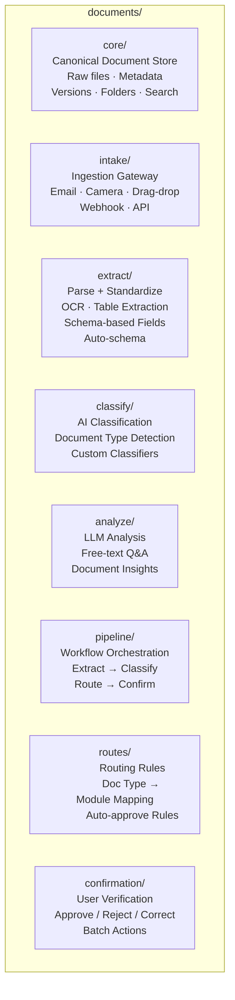
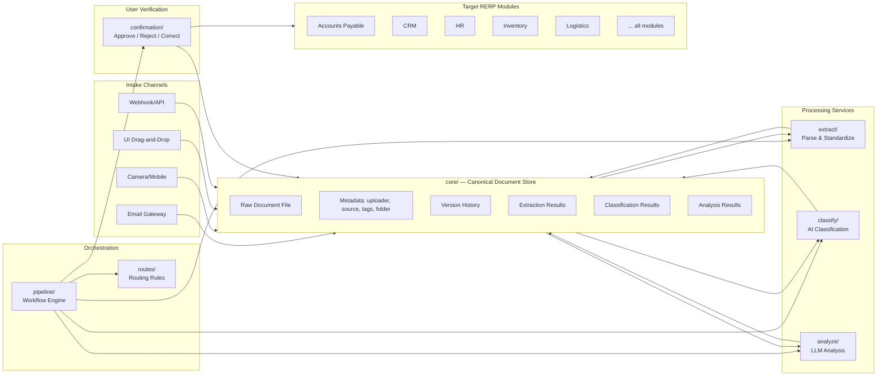

# Document Intelligence Platform

## Overview

The Documents suite is **RERP's primary input layer** — not just a document store, but an active ingestion engine that receives documents from anywhere (email, camera, upload, webhook), extracts structured data, and automatically creates or updates records across every RERP module.

At its heart is the **core service** — the canonical, authoritative store for every document that enters RERP. All other services (intake, extraction, classification, analysis, routing) read from and annotate documents stored in `core/`. Documents are stored first, processed second.

The user workflow is simple:

```
User emails a vendor invoice → core/ stores it → Documents classifies it → Extracts invoice data → Creates AP record in accounts-payable → Notifies AP manager for approval
```

User takes a photo of a business card → core/ stores it → Documents extracts contact info → Creates lead in CRM → Assigns to sales rep

User snaps a photo of a timesheet → core/ stores it → Documents extracts hours → Creates timesheet entry in hr → Routes to manager for approval

No navigation. No manual data entry. No form-filling. Just send the document.

## Architecture

The Documents suite is split into **8 microservices**. All services share a single PostgreSQL database for relational metadata and a shared object storage bucket (S3/MinIO) for raw document files.



Each service is independently deployable, independently scalable, and independently documented in its own `openapi.yaml`. All services reference documents by their UUID in `core/`.

### Document Data Flow



## Services

Each service has its own design document with detailed API surface, capabilities, and integration specs.

| Service | Purpose | Design Doc |
|---|---|---|
| **core/** | Canonical document storage, versions, folders, search | [docs/core.md](docs/core.md) |
| **intake/** | Multi-channel ingestion (email, camera, webhook, drag-drop) | [docs/intake.md](docs/intake.md) |
| **extract/** | OCR, table extraction, schema-based field extraction | [docs/extract.md](docs/extract.md) |
| **classify/** | AI document classification, type detection | [docs/classify.md](docs/classify.md) |
| **analyze/** | LLM-based document Q&A and analysis | [docs/analyze.md](docs/analyze.md) |
| **routes/** | Routing rules engine, document-type-to-module mapping | [docs/routes.md](docs/routes.md) |
| **pipeline/** | Workflow orchestration, state machine, retry logic | [docs/pipeline.md](docs/pipeline.md) |
| **confirmation/** | User verification and approval workflows | [docs/confirmation.md](docs/confirmation.md) |

See also: [DESIGN.md](DESIGN.md) — full system design (DB schema, API contracts, data flow, RLS).

## Competitive Positioning

### The Killer Feature: Zero Data Entry

With DocuPipe, a user must:
1. Upload a document
2. Define a schema
3. Extract data
4. Copy-paste the JSON into their accounting system
5. Fill in any missing fields manually

With RERP Documents, the user:
1. **Emails or snaps a photo** (or drags onto a page)
2. `core/` stores it
3. RERP does everything else — classifies, extracts, routes, confirms, creates the ERP record

No navigation. No API calls. No JSON copy-paste. The extracted data creates records directly in the appropriate RERP module.

### Feature Comparison: RERP vs DocuPipe

| Capability | DocuPipe | RERP | Notes |
|---|---|---|---|
| Document storage & versioning | ✅ | ✅ | **core/ is the canonical store** |
| OCR / text extraction | ✅ | ✅ | Extract service |
| Document classification | ✅ | ✅ | Classify service |
| LLM document Q&A | ✅ | ✅ | Analyze service |
| Email intake | ❌ | ✅ | RERP native email gateway |
| Mobile/camera intake | ❌ | ✅ | RERP mobile app integration |
| UI drag-and-drop | ❌ | ✅ | Drag onto module pages |
| Suite-level email routing | ❌ | ✅ | Per-suite email aliases |
| Routing to ERP modules | ❌ | ✅ | Routes docs to target module records |
| Auto-create ERP records | ❌ | ✅ | Creates records via API |
| User confirmation flow | ❌ | ✅ | Verified extraction before creation |
| Pricing model | Per-page credits | Free (self-hosted) | No usage limits |
| RLS / multi-tenant | ❌ | ✅ | Built-in |
| ERP integration | Limited (API only) | Deep | Documents → invoices → POs → payments |

## Full RERP Module Integration Map

Every RERP module can receive documents automatically. Documents flow from `core/` → extraction → classification → routing → record creation in the target module.

### Phase 1: Core Foundation

| Module | Document Intake | Auto-Created Record |
|---|---|---|
| Product Catalog | Product photo, spec sheet, catalog PDF | Product SKU with extracted metadata |
| Pricing & Tax | Price list PDF, tax rate document | Price rules, tax configurations |

### Phase 2: Business Operations

| Module | Document Intake | Auto-Created Record |
|---|---|---|
| CRM (Leads) | Business card photo, inquiry email | Lead contact with extracted info |
| CRM (Pipeline) | Signed proposal, proposal PDF | Deal/opportunity with extracted terms |
| Sales (Quotes) | Customer quote request email | Sales quote with extracted requirements |
| Sales (Orders) | Customer PO via email | Sales order with extracted line items |
| Sales (Invoicing) | Invoice PDF (outgoing) | Sales invoice with customer + amount |
| Purchase (Vendors) | Vendor registration form, W-9 | Vendor profile with extracted details |
| Purchase (POs) | Vendor quote PDF, vendor catalog | Purchase requisition with extracted items |
| Inventory | Receiving report photo, count sheet | Stock receipt / stock adjustment |
| Warehouse | Bin location map, warehouse diagram | Warehouse layout / storage zones |
| Logistics | Shipping document, packing slip | Shipment record with tracking info |

### Phase 3: Financial & HR

| Module | Document Intake | Auto-Created Record |
|---|---|---|
| Accounting (GL) | Journal entry support docs | Journal entry with extracted figures |
| AP | Vendor invoice email, receipt photo | Accounts payable invoice |
| AR | Customer invoice, payment confirmation | Accounts receivable invoice |
| Financial Reports | External financial statement | Comparison data / benchmarks |
| HR (Employee Records) | ID document, offer letter, contract | Employee profile with extracted details |
| HR (Payroll) | Payslip, tax form, benefits enrollment | Payroll record, tax deduction config |
| HR (Recruitment) | Resume/CV email, cover letter | Recruitment application with extracted skills |
| HR (Leave) | Leave request email, medical certificate | Leave application with dates + justification |

### Phase 4: Advanced Operations

| Module | Document Intake | Auto-Created Record |
|---|---|---|
| Manufacturing (BOM) | BOM document, engineering spec | Bill of Materials with extracted components |
| Manufacturing (Production) | Production schedule, work order | Production order with extracted quantities |
| Quality | Inspection report photo, test results | Quality record with pass/fail data |
| Project (Tasks) | Task assignment email, brief | Project task with extracted details |
| Project (Timesheets) | Timesheet photo, timesheet PDF | Timesheet entry with extracted hours |
| Project (Proposals) | Project proposal, RFP response | Project record with extracted scope + budget |

### Phase 5: Customer-Facing

| Module | Document Intake | Auto-Created Record |
|---|---|---|
| Marketing | Campaign brief, creative assets | Marketing campaign with extracted targeting |
| Website/CMS | Product images, content document | CMS page/product listing |
| eCommerce | Customer return request email | Return authorization |
| POS | Receipt photo, refund receipt | Sales transaction / refund record |
| Helpdesk | Support email, bug screenshot | Support ticket with extracted description |
| Helpdesk (KB) | Article draft, how-to document | Knowledge base article |
| Field Service | Service request email, repair photo | Service ticket with extracted details |

### Phase 6: Extensions

| Module | Document Intake | Auto-Created Record |
|---|---|---|
| Analytics | Performance report, dashboard export | Analytics data points |
| App Marketplace | Extension documentation, integration spec | Marketplace listing |

## Security & Compliance

| Standard | Implementation |
|---|---|
| Encryption at rest | AES-256 on storage volumes |
| Encryption in transit | TLS 1.3 (all API endpoints) |
| Access control | PostgreSQL RLS policies per-organization |
| Email security | SMTP with STARTLS, DKIM/SPF verification |
| Mobile security | OAuth 2.0, device binding, offline encryption |
| Audit logging | All document operations logged with full trail |
| HIPAA | Supported via infrastructure configuration |
| GDPR | Data residency controlled via deployment config |
| SOC 2 / ISO 27001 | Available via shared K8s cluster compliance |

## Future Roadmap

1. **Email auto-reply** — Send confirmation emails to senders with extracted data preview
2. **Multi-modal AI** — Support for audio documents, scanned photos, handwriting
3. **Vector search** — Semantic search across all document content in core/
4. **Batch processing** — Process thousands of documents asynchronously via cron
5. **Web UI** — Drag-and-drop document management with real-time pipeline status
6. **Smart defaults** — ML learns routing rules from user behavior (auto-suggest new rules)
7. **Approval workflows** — Multi-level approval chains for high-value documents
8. **Digital signatures** — E-signature integration for contracts and forms
9. **SMS intake** — Send documents via SMS/MMS for low-tech environments
10. **WhatsApp/Telegram bot** — Send documents via messaging apps
11. **Self-improving extraction** — User corrections feed back into schema/ML model
12. **Document templates** — Pre-built schemas for common document types per industry

## Getting Started

1. **Configure intake channels** — Set up email aliases, register mobile app, enable webhook endpoints
2. **Define routing rules** — Map document types to target RERP modules (`POST /routes`)
3. **Define extraction schemas** — Create or auto-generate schemas for each document type (`POST /schemas`)
4. **Configure confirmation** — Set auto-approve rules (confidence threshold) and notification targets
5. **Send documents** — Email a PDF, snap a photo, drag onto a page, or trigger via webhook
6. **Review & approve** — Check pending confirmations and approve/reject/correct
7. **Monitor** — Track pipeline execution status and audit trail in `core/`

---

*The ERP platform where documents do the work — email a PDF, snap a photo, drag onto a page, and let RERP handle the rest.*
