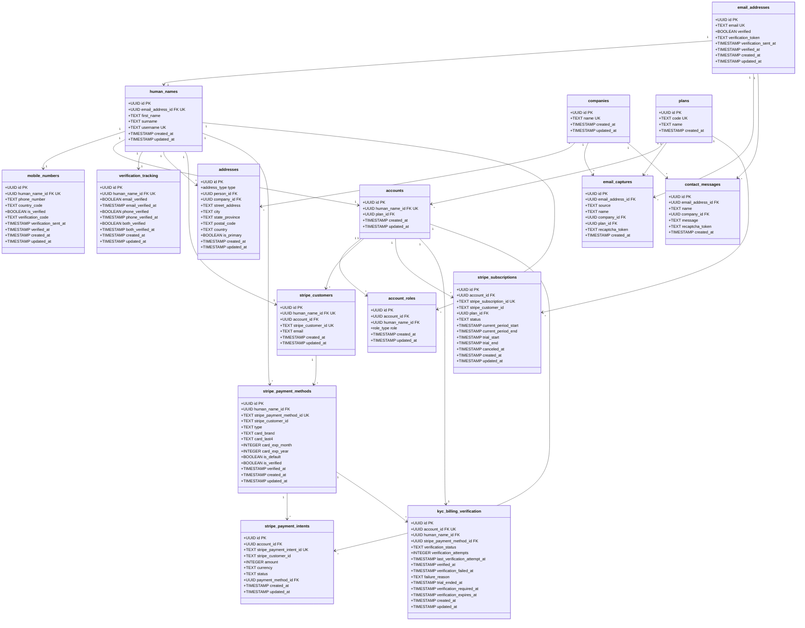
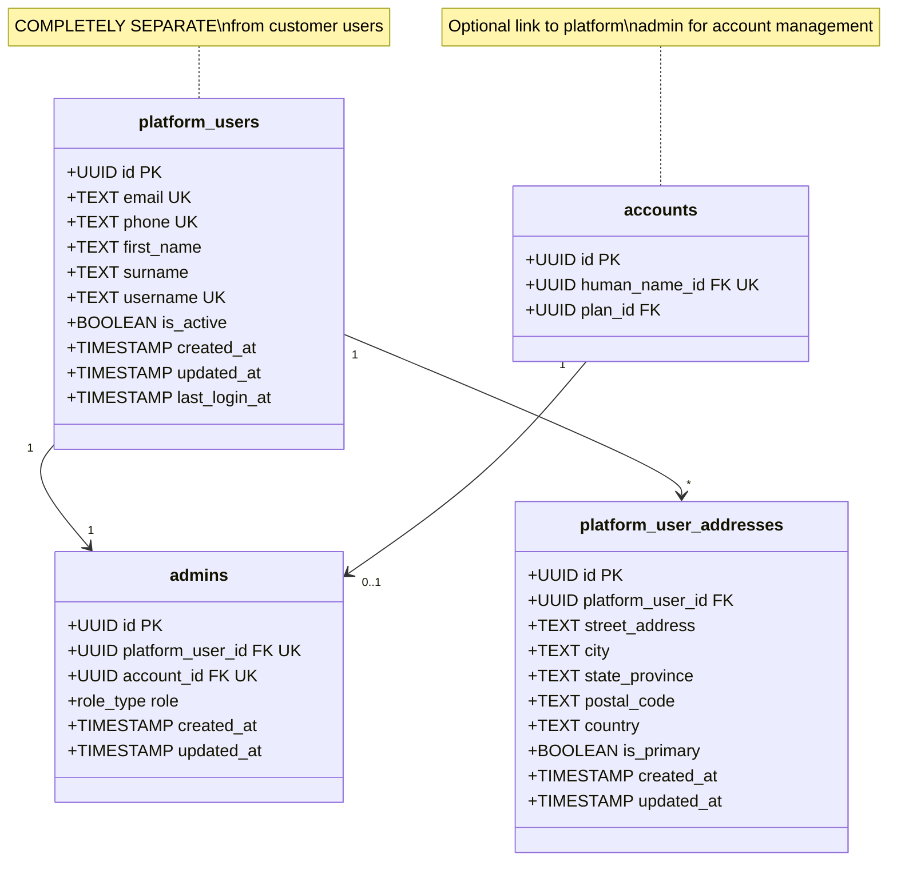
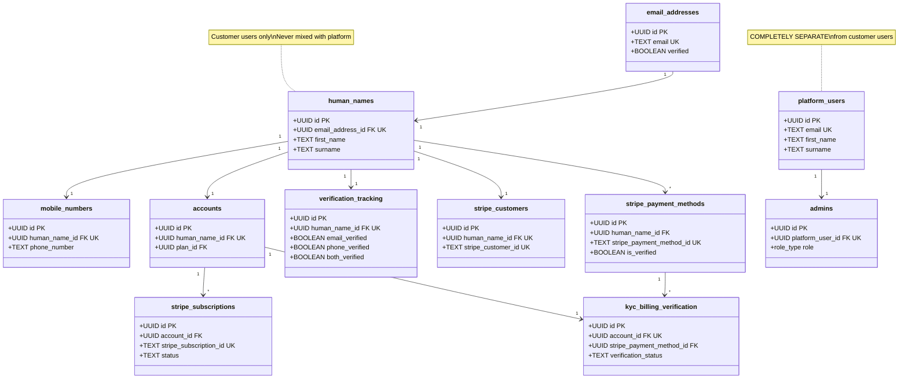

# PriceWhisperer Database Schema

This document provides a complete overview of the database structure, including all tables, relationships, enums, functions, and security policies.

> **📋 Microservices Architecture Analysis**: For domain-driven design analysis and recommended microservices decomposition, see [MICROSERVICES_ARCHITECTURE.md](./MICROSERVICES_ARCHITECTURE.md)

## Table of Contents

- [Enums](#enums)
- [Customer Tables](#customer-tables)
- [Platform Tables](#platform-tables)
- [Payment Tables](#payment-tables)
- [Verification Tables](#verification-tables)
- [Functions](#functions)
- [Row Level Security](#row-level-security)

---

## Enums

### `address_type`
```sql
CREATE TYPE address_type AS ENUM ('person', 'company');
```

### `role_type`
```sql
CREATE TYPE role_type AS ENUM (
  'admin',
  'user',
  'moderator',
  'viewer',
  'customer_success',
  'finance',
  'billing_admin'
);
```

---

## Customer Tables

### `email_addresses`
Central table for all email addresses. Used as a foreign key by all other tables requiring an email.

| Column | Type | Constraints | Description |
|--------|------|-------------|-------------|
| `id` | UUID | PRIMARY KEY, DEFAULT gen_random_uuid() | Unique identifier |
| `email` | TEXT | NOT NULL, UNIQUE | Email address (lowercase) |
| `verified` | BOOLEAN | NOT NULL, DEFAULT false | Email verification status |
| `verification_token` | TEXT | | Token for email verification |
| `verification_sent_at` | TIMESTAMP WITH TIME ZONE | | When verification email was sent |
| `verified_at` | TIMESTAMP WITH TIME ZONE | | When email was verified |
| `created_at` | TIMESTAMP WITH TIME ZONE | NOT NULL, DEFAULT NOW() | Creation timestamp |
| `updated_at` | TIMESTAMP WITH TIME ZONE | NOT NULL, DEFAULT NOW() | Last update timestamp |

**Indexes:**
- `idx_email_addresses_email` on `email`
- `idx_email_addresses_verified` on `verified`
- `idx_email_addresses_verification_token` on `verification_token`

**Functions:**
- `upsert_email_address(email_address TEXT)` → UUID

---

### `human_names`
Represents individual human users. One-to-one relationship with `email_addresses`.

| Column | Type | Constraints | Description |
|--------|------|-------------|-------------|
| `id` | UUID | PRIMARY KEY, DEFAULT gen_random_uuid() | Unique identifier |
| `email_address_id` | UUID | NOT NULL, UNIQUE, FK → `email_addresses(id)` | One-to-one with email |
| `first_name` | TEXT | | First name |
| `surname` | TEXT | | Surname |
| `username` | TEXT | UNIQUE | Username (optional) |
| `created_at` | TIMESTAMP WITH TIME ZONE | NOT NULL, DEFAULT NOW() | Creation timestamp |
| `updated_at` | TIMESTAMP WITH TIME ZONE | NOT NULL, DEFAULT NOW() | Last update timestamp |

**Indexes:**
- `idx_human_names_email_address_id` on `email_address_id`
- `idx_human_names_username` on `username` (where not null)

---

### `mobile_numbers`
Phone numbers for users. One-to-one relationship with `human_names`.

| Column | Type | Constraints | Description |
|--------|------|-------------|-------------|
| `id` | UUID | PRIMARY KEY, DEFAULT gen_random_uuid() | Unique identifier |
| `human_name_id` | UUID | NOT NULL, UNIQUE, FK → `human_names(id)` | One-to-one with human name |
| `phone_number` | TEXT | NOT NULL | Phone number |
| `country_code` | TEXT | | Country code |
| `is_verified` | BOOLEAN | NOT NULL, DEFAULT false | Phone verification status |
| `verification_code` | TEXT | | OTP code for verification |
| `verification_sent_at` | TIMESTAMP WITH TIME ZONE | | When OTP was sent |
| `verified_at` | TIMESTAMP WITH TIME ZONE | | When phone was verified |
| `created_at` | TIMESTAMP WITH TIME ZONE | NOT NULL, DEFAULT NOW() | Creation timestamp |
| `updated_at` | TIMESTAMP WITH TIME ZONE | NOT NULL, DEFAULT NOW() | Last update timestamp |

**Indexes:**
- `idx_mobile_numbers_human_name_id` on `human_name_id`
- `idx_mobile_numbers_phone_number` on `phone_number`

---

### `addresses`
Addresses for KYC requirements. Can be for a person or company.

| Column | Type | Constraints | Description |
|--------|------|-------------|-------------|
| `id` | UUID | PRIMARY KEY, DEFAULT gen_random_uuid() | Unique identifier |
| `type` | `address_type` | NOT NULL | 'person' or 'company' |
| `person_id` | UUID | FK → `human_names(id)` | For person addresses |
| `company_id` | UUID | FK → `companies(id)` | For company addresses |
| `street_address` | TEXT | | Street address |
| `city` | TEXT | | City |
| `state_province` | TEXT | | State/Province |
| `postal_code` | TEXT | | Postal/ZIP code |
| `country` | TEXT | | Country |
| `is_primary` | BOOLEAN | DEFAULT false | Primary address flag |
| `created_at` | TIMESTAMP WITH TIME ZONE | NOT NULL, DEFAULT NOW() | Creation timestamp |
| `updated_at` | TIMESTAMP WITH TIME ZONE | NOT NULL, DEFAULT NOW() | Last update timestamp |

**Constraints:**
- `addresses_owner_check`: Exactly one of `person_id` or `company_id` must be set

**Indexes:**
- `idx_addresses_person_id` on `person_id`
- `idx_addresses_company_id` on `company_id`
- `idx_addresses_is_primary` on `is_primary`

---

### `companies`
Company/organization records.

| Column | Type | Constraints | Description |
|--------|------|-------------|-------------|
| `id` | UUID | PRIMARY KEY, DEFAULT gen_random_uuid() | Unique identifier |
| `name` | TEXT | NOT NULL, UNIQUE | Company name |
| `created_at` | TIMESTAMP WITH TIME ZONE | NOT NULL, DEFAULT NOW() | Creation timestamp |
| `updated_at` | TIMESTAMP WITH TIME ZONE | NOT NULL, DEFAULT NOW() | Last update timestamp |

**Indexes:**
- `idx_companies_name` on `name`

**Functions:**
- `upsert_company(company_name TEXT)` → UUID

---

### `plans`
Subscription plan lookup table.

| Column | Type | Constraints | Description |
|--------|------|-------------|-------------|
| `id` | UUID | PRIMARY KEY, DEFAULT gen_random_uuid() | Unique identifier |
| `code` | TEXT | NOT NULL, UNIQUE | Plan code (e.g., 'starter', 'growth') |
| `name` | TEXT | NOT NULL | Plan display name |
| `created_at` | TIMESTAMP WITH TIME ZONE | NOT NULL, DEFAULT NOW() | Creation timestamp |

**Pre-populated Plans:**
- `starter`
- `growth`
- `pro`
- `enterprise`

---

### `accounts`
User accounts. One-to-one relationship with `human_names`.

| Column | Type | Constraints | Description |
|--------|------|-------------|-------------|
| `id` | UUID | PRIMARY KEY, DEFAULT gen_random_uuid() | Unique identifier |
| `human_name_id` | UUID | NOT NULL, UNIQUE, FK → `human_names(id)` | One-to-one with human name |
| `plan_id` | UUID | FK → `plans(id)` | Subscription plan |
| `created_at` | TIMESTAMP WITH TIME ZONE | NOT NULL, DEFAULT NOW() | Creation timestamp |
| `updated_at` | TIMESTAMP WITH TIME ZONE | NOT NULL, DEFAULT NOW() | Last update timestamp |

**Indexes:**
- `idx_accounts_human_name_id` on `human_name_id`
- `idx_accounts_plan_id` on `plan_id`

---

### `account_roles`
Roles assigned to users within accounts (customer-side roles).

| Column | Type | Constraints | Description |
|--------|------|-------------|-------------|
| `id` | UUID | PRIMARY KEY, DEFAULT gen_random_uuid() | Unique identifier |
| `account_id` | UUID | NOT NULL, FK → `accounts(id)` | Account reference |
| `human_name_id` | UUID | NOT NULL, FK → `human_names(id)` | User reference |
| `role` | `role_type` | NOT NULL | Role type (e.g., 'billing_admin', 'user') |
| `created_at` | TIMESTAMP WITH TIME ZONE | NOT NULL, DEFAULT NOW() | Creation timestamp |
| `updated_at` | TIMESTAMP WITH TIME ZONE | NOT NULL, DEFAULT NOW() | Last update timestamp |

**Constraints:**
- `UNIQUE(account_id, human_name_id, role)` - Prevent duplicate role assignments

**Indexes:**
- `idx_account_roles_account_id` on `account_id`
- `idx_account_roles_human_name_id` on `human_name_id`
- `idx_account_roles_role` on `role`

**Functions:**
- `assign_default_billing_admin(account_uuid UUID, human_name_uuid UUID)` → VOID

**Triggers:**
- `trigger_auto_assign_billing_admin` - Automatically assigns 'billing_admin' to account owner on account creation

---

### `email_captures`
Email capture records from forms (home page, exit intent, etc.).

| Column | Type | Constraints | Description |
|--------|------|-------------|-------------|
| `id` | UUID | PRIMARY KEY, DEFAULT gen_random_uuid() | Unique identifier |
| `email_address_id` | UUID | NOT NULL, FK → `email_addresses(id)` | Email reference |
| `source` | TEXT | NOT NULL | Capture source (e.g., 'hero', 'exit_intent') |
| `name` | TEXT | | User's name (optional) |
| `company_id` | UUID | FK → `companies(id)` | Company reference |
| `plan_id` | UUID | FK → `plans(id)` | Plan reference |
| `recaptcha_token` | TEXT | | reCAPTCHA token |
| `created_at` | TIMESTAMP WITH TIME ZONE | NOT NULL, DEFAULT NOW() | Creation timestamp |

**Indexes:**
- `idx_email_captures_email_address_id` on `email_address_id`
- `idx_email_captures_source` on `source`
- `idx_email_captures_created_at` on `created_at`

---

### `contact_messages`
Contact form submissions.

| Column | Type | Constraints | Description |
|--------|------|-------------|-------------|
| `id` | UUID | PRIMARY KEY, DEFAULT gen_random_uuid() | Unique identifier |
| `email_address_id` | UUID | NOT NULL, FK → `email_addresses(id)` | Email reference |
| `name` | TEXT | NOT NULL | Contact name |
| `company_id` | UUID | FK → `companies(id)` | Company reference |
| `message` | TEXT | NOT NULL | Message content |
| `recaptcha_token` | TEXT | | reCAPTCHA token |
| `created_at` | TIMESTAMP WITH TIME ZONE | NOT NULL, DEFAULT NOW() | Creation timestamp |

**Indexes:**
- `idx_contact_messages_email_address_id` on `email_address_id`
- `idx_contact_messages_created_at` on `created_at`

---

## Platform Tables

### `platform_users`
**CRITICAL**: Completely separate from customer users. Platform staff only.

| Column | Type | Constraints | Description |
|--------|------|-------------|-------------|
| `id` | UUID | PRIMARY KEY, DEFAULT gen_random_uuid() | Unique identifier |
| `email` | TEXT | NOT NULL, UNIQUE | Email address |
| `phone` | TEXT | UNIQUE | Phone number (optional) |
| `first_name` | TEXT | NOT NULL | First name |
| `surname` | TEXT | NOT NULL | Surname |
| `username` | TEXT | UNIQUE | Username (optional) |
| `is_active` | BOOLEAN | NOT NULL, DEFAULT true | Active status |
| `created_at` | TIMESTAMP WITH TIME ZONE | NOT NULL, DEFAULT NOW() | Creation timestamp |
| `updated_at` | TIMESTAMP WITH TIME ZONE | NOT NULL, DEFAULT NOW() | Last update timestamp |
| `last_login_at` | TIMESTAMP WITH TIME ZONE | | Last login timestamp |

**Indexes:**
- `idx_platform_users_email` on `email`
- `idx_platform_users_phone` on `phone` (where not null)
- `idx_platform_users_username` on `username` (where not null)
- `idx_platform_users_is_active` on `is_active`

**Note:** Platform users are NEVER in `human_names` or `accounts` tables.

---

### `platform_user_addresses`
Addresses for platform users (separate from customer addresses).

| Column | Type | Constraints | Description |
|--------|------|-------------|-------------|
| `id` | UUID | PRIMARY KEY, DEFAULT gen_random_uuid() | Unique identifier |
| `platform_user_id` | UUID | NOT NULL, FK → `platform_users(id)` | Platform user reference |
| `street_address` | TEXT | | Street address |
| `city` | TEXT | | City |
| `state_province` | TEXT | | State/Province |
| `postal_code` | TEXT | | Postal/ZIP code |
| `country` | TEXT | | Country |
| `is_primary` | BOOLEAN | DEFAULT false | Primary address flag |
| `created_at` | TIMESTAMP WITH TIME ZONE | NOT NULL, DEFAULT NOW() | Creation timestamp |
| `updated_at` | TIMESTAMP WITH TIME ZONE | NOT NULL, DEFAULT NOW() | Last update timestamp |

**Indexes:**
- `idx_platform_user_addresses_platform_user_id` on `platform_user_id`
- `idx_platform_user_addresses_is_primary` on `is_primary`

---

### `admins`
Platform admin roles. References `platform_users` (NOT `human_names`).

| Column | Type | Constraints | Description |
|--------|------|-------------|-------------|
| `id` | UUID | PRIMARY KEY, DEFAULT gen_random_uuid() | Unique identifier |
| `platform_user_id` | UUID | NOT NULL, UNIQUE, FK → `platform_users(id)` | Platform user reference |
| `account_id` | UUID | UNIQUE, FK → `accounts(id)` | Account reference (optional) |
| `role` | `role_type` | NOT NULL, DEFAULT 'admin' | Platform role |
| `created_at` | TIMESTAMP WITH TIME ZONE | NOT NULL, DEFAULT NOW() | Creation timestamp |
| `updated_at` | TIMESTAMP WITH TIME ZONE | NOT NULL, DEFAULT NOW() | Last update timestamp |

**Indexes:**
- `idx_admins_platform_user_id` on `platform_user_id`
- `idx_admins_account_id` on `account_id`
- `idx_admins_role` on `role`

**Note:** After migration `20250101000021`, `admins` references `platform_users`, not `human_names`.

---

## Payment Tables

### `stripe_customers`
Links Supabase users to Stripe customers.

| Column | Type | Constraints | Description |
|--------|------|-------------|-------------|
| `id` | UUID | PRIMARY KEY, DEFAULT gen_random_uuid() | Unique identifier |
| `human_name_id` | UUID | NOT NULL, UNIQUE, FK → `human_names(id)` | Customer user reference |
| `account_id` | UUID | FK → `accounts(id)` | Account reference |
| `stripe_customer_id` | TEXT | NOT NULL, UNIQUE | Stripe customer ID (cus_xxxxx) |
| `email` | TEXT | NOT NULL | Customer email |
| `created_at` | TIMESTAMP WITH TIME ZONE | NOT NULL, DEFAULT NOW() | Creation timestamp |
| `updated_at` | TIMESTAMP WITH TIME ZONE | NOT NULL, DEFAULT NOW() | Last update timestamp |

**Indexes:**
- `idx_stripe_customers_human_name_id` on `human_name_id`
- `idx_stripe_customers_account_id` on `account_id`
- `idx_stripe_customers_stripe_customer_id` on `stripe_customer_id`

---

### `stripe_payment_methods`
Stored payment methods (credit cards, etc.).

| Column | Type | Constraints | Description |
|--------|------|-------------|-------------|
| `id` | UUID | PRIMARY KEY, DEFAULT gen_random_uuid() | Unique identifier |
| `human_name_id` | UUID | NOT NULL, FK → `human_names(id)` | Customer user reference |
| `stripe_payment_method_id` | TEXT | NOT NULL, UNIQUE | Stripe payment method ID (pm_xxxxx) |
| `stripe_customer_id` | TEXT | NOT NULL | Stripe customer ID |
| `type` | TEXT | NOT NULL | Payment type ('card', 'bank_account', etc.) |
| `card_brand` | TEXT | | Card brand ('visa', 'mastercard', etc.) |
| `card_last4` | TEXT | | Last 4 digits of card |
| `card_exp_month` | INTEGER | | Card expiration month |
| `card_exp_year` | INTEGER | | Card expiration year |
| `is_default` | BOOLEAN | DEFAULT false | Default payment method flag |
| `is_verified` | BOOLEAN | DEFAULT false | KYC verification status |
| `verified_at` | TIMESTAMP WITH TIME ZONE | | When verified |
| `created_at` | TIMESTAMP WITH TIME ZONE | NOT NULL, DEFAULT NOW() | Creation timestamp |
| `updated_at` | TIMESTAMP WITH TIME ZONE | NOT NULL, DEFAULT NOW() | Last update timestamp |

**Indexes:**
- `idx_stripe_payment_methods_human_name_id` on `human_name_id`
- `idx_stripe_payment_methods_stripe_customer_id` on `stripe_customer_id`
- `idx_stripe_payment_methods_stripe_payment_method_id` on `stripe_payment_method_id`
- `idx_stripe_payment_methods_is_default` on `is_default`
- `idx_stripe_payment_methods_is_verified` on `is_verified`

---

### `stripe_subscriptions`
Subscription records.

| Column | Type | Constraints | Description |
|--------|------|-------------|-------------|
| `id` | UUID | PRIMARY KEY, DEFAULT gen_random_uuid() | Unique identifier |
| `account_id` | UUID | NOT NULL, FK → `accounts(id)` | Account reference |
| `stripe_subscription_id` | TEXT | NOT NULL, UNIQUE | Stripe subscription ID (sub_xxxxx) |
| `stripe_customer_id` | TEXT | NOT NULL | Stripe customer ID |
| `plan_id` | UUID | FK → `plans(id)` | Plan reference |
| `status` | TEXT | NOT NULL | Status ('active', 'canceled', 'past_due', 'trialing', etc.) |
| `current_period_start` | TIMESTAMP WITH TIME ZONE | | Current billing period start |
| `current_period_end` | TIMESTAMP WITH TIME ZONE | | Current billing period end |
| `trial_start` | TIMESTAMP WITH TIME ZONE | | Trial period start |
| `trial_end` | TIMESTAMP WITH TIME ZONE | | Trial period end |
| `canceled_at` | TIMESTAMP WITH TIME ZONE | | When subscription was canceled |
| `created_at` | TIMESTAMP WITH TIME ZONE | NOT NULL, DEFAULT NOW() | Creation timestamp |
| `updated_at` | TIMESTAMP WITH TIME ZONE | NOT NULL, DEFAULT NOW() | Last update timestamp |

**Indexes:**
- `idx_stripe_subscriptions_account_id` on `account_id`
- `idx_stripe_subscriptions_stripe_subscription_id` on `stripe_subscription_id`
- `idx_stripe_subscriptions_stripe_customer_id` on `stripe_customer_id`
- `idx_stripe_subscriptions_status` on `status`

---

### `stripe_payment_intents`
Payment attempt records.

| Column | Type | Constraints | Description |
|--------|------|-------------|-------------|
| `id` | UUID | PRIMARY KEY, DEFAULT gen_random_uuid() | Unique identifier |
| `account_id` | UUID | FK → `accounts(id)` | Account reference |
| `stripe_payment_intent_id` | TEXT | NOT NULL, UNIQUE | Stripe payment intent ID (pi_xxxxx) |
| `stripe_customer_id` | TEXT | NOT NULL | Stripe customer ID |
| `amount` | INTEGER | NOT NULL | Amount in cents |
| `currency` | TEXT | NOT NULL, DEFAULT 'usd' | Currency code |
| `status` | TEXT | NOT NULL | Status ('succeeded', 'processing', 'requires_payment_method', etc.) |
| `payment_method_id` | UUID | FK → `stripe_payment_methods(id)` | Payment method reference |
| `created_at` | TIMESTAMP WITH TIME ZONE | NOT NULL, DEFAULT NOW() | Creation timestamp |
| `updated_at` | TIMESTAMP WITH TIME ZONE | NOT NULL, DEFAULT NOW() | Last update timestamp |

**Indexes:**
- `idx_stripe_payment_intents_account_id` on `account_id`
- `idx_stripe_payment_intents_stripe_payment_intent_id` on `stripe_payment_intent_id`
- `idx_stripe_payment_intents_stripe_customer_id` on `stripe_customer_id`
- `idx_stripe_payment_intents_status` on `status`

---

## Verification Tables

### `verification_tracking`
Tracks dual verification (email + phone) separately from Supabase Auth sessions.

| Column | Type | Constraints | Description |
|--------|------|-------------|-------------|
| `id` | UUID | PRIMARY KEY, DEFAULT gen_random_uuid() | Unique identifier |
| `human_name_id` | UUID | NOT NULL, UNIQUE, FK → `human_names(id)` | Human name reference |
| `email_verified` | BOOLEAN | NOT NULL, DEFAULT false | Email verification status |
| `email_verified_at` | TIMESTAMP WITH TIME ZONE | | When email was verified |
| `phone_verified` | BOOLEAN | NOT NULL, DEFAULT false | Phone verification status |
| `phone_verified_at` | TIMESTAMP WITH TIME ZONE | | When phone was verified |
| `both_verified` | BOOLEAN | NOT NULL, DEFAULT false | Both verified flag |
| `both_verified_at` | TIMESTAMP WITH TIME ZONE | | When both were verified |
| `created_at` | TIMESTAMP WITH TIME ZONE | NOT NULL, DEFAULT NOW() | Creation timestamp |
| `updated_at` | TIMESTAMP WITH TIME ZONE | NOT NULL, DEFAULT NOW() | Last update timestamp |

**Indexes:**
- `idx_verification_tracking_human_name_id` on `human_name_id`
- `idx_verification_tracking_both_verified` on `both_verified`

**Functions:**
- `mark_email_verified(human_name_uuid UUID, email_address TEXT)` → BOOLEAN
- `mark_phone_verified(human_name_uuid UUID, phone_number TEXT)` → BOOLEAN
- `is_dual_verified(human_name_uuid UUID)` → BOOLEAN

---

### `kyc_billing_verification`
KYC credit card billing verification after 14-day trial.

| Column | Type | Constraints | Description |
|--------|------|-------------|-------------|
| `id` | UUID | PRIMARY KEY, DEFAULT gen_random_uuid() | Unique identifier |
| `account_id` | UUID | NOT NULL, UNIQUE, FK → `accounts(id)` | Account reference |
| `human_name_id` | UUID | NOT NULL, FK → `human_names(id)` | Human name reference |
| `stripe_payment_method_id` | UUID | FK → `stripe_payment_methods(id)` | Payment method reference |
| `verification_status` | TEXT | NOT NULL, DEFAULT 'pending' | Status ('pending', 'in_progress', 'verified', 'failed', 'expired') |
| `verification_attempts` | INTEGER | NOT NULL, DEFAULT 0 | Number of verification attempts |
| `last_verification_attempt_at` | TIMESTAMP WITH TIME ZONE | | Last attempt timestamp |
| `verified_at` | TIMESTAMP WITH TIME ZONE | | When verified |
| `verification_failed_at` | TIMESTAMP WITH TIME ZONE | | When verification failed |
| `failure_reason` | TEXT | | Failure reason |
| `trial_ended_at` | TIMESTAMP WITH TIME ZONE | | When trial ended |
| `verification_required_at` | TIMESTAMP WITH TIME ZONE | | When verification becomes required |
| `verification_expires_at` | TIMESTAMP WITH TIME ZONE | | When verification expires |
| `created_at` | TIMESTAMP WITH TIME ZONE | NOT NULL, DEFAULT NOW() | Creation timestamp |
| `updated_at` | TIMESTAMP WITH TIME ZONE | NOT NULL, DEFAULT NOW() | Last update timestamp |

**Constraints:**
- `kyc_verification_status_check`: `verification_status` must be one of: 'pending', 'in_progress', 'verified', 'failed', 'expired'

**Indexes:**
- `idx_kyc_billing_verification_account_id` on `account_id`
- `idx_kyc_billing_verification_human_name_id` on `human_name_id`
- `idx_kyc_billing_verification_status` on `verification_status`
- `idx_kyc_billing_verification_verification_required_at` on `verification_required_at`

**Functions:**
- `create_kyc_verification_on_trial_end(account_uuid UUID)` → UUID
- `mark_kyc_verified(account_uuid UUID, payment_method_uuid UUID)` → VOID
- `mark_kyc_failed(account_uuid UUID, reason TEXT)` → VOID
- `is_kyc_verification_required(account_uuid UUID)` → BOOLEAN
- `is_kyc_verified(account_uuid UUID)` → BOOLEAN

---

## Entity Relationship Diagram

### Customer Domain



### Platform Domain



### Complete Schema Overview



---

## Functions

### Helper Functions (RLS)

- `get_current_human_name_id()` → UUID
  - Gets the current authenticated user's `human_name_id` from JWT

- `get_current_platform_user_id()` → UUID
  - Gets the current authenticated platform user's ID from JWT/email

- `is_platform_admin()` → BOOLEAN
  - Checks if current user is a platform admin

- `is_customer_success()` → BOOLEAN
  - Checks if current user is customer success

- `is_finance()` → BOOLEAN
  - Checks if current user is finance

- `get_user_account_id()` → UUID
  - Gets the current user's account ID

- `has_account_role(account_uuid UUID, role_name role_type)` → BOOLEAN
  - Checks if user has a specific role in an account

### Business Functions

- `upsert_email_address(email_address TEXT)` → UUID
  - Creates or retrieves email address record

- `upsert_company(company_name TEXT)` → UUID
  - Creates or retrieves company record

- `assign_default_billing_admin(account_uuid UUID, human_name_uuid UUID)` → VOID
  - Assigns default billing_admin role to account owner

- `mark_email_verified(human_name_uuid UUID, email_address TEXT)` → BOOLEAN
  - Marks email as verified, returns true if both email and phone are now verified

- `mark_phone_verified(human_name_uuid UUID, phone_number TEXT)` → BOOLEAN
  - Marks phone as verified, returns true if both email and phone are now verified

- `is_dual_verified(human_name_uuid UUID)` → BOOLEAN
  - Checks if both email and phone are verified

- `create_kyc_verification_on_trial_end(account_uuid UUID)` → UUID
  - Creates KYC verification record when trial ends

- `mark_kyc_verified(account_uuid UUID, payment_method_uuid UUID)` → VOID
  - Marks KYC verification as complete

- `mark_kyc_failed(account_uuid UUID, reason TEXT)` → VOID
  - Marks KYC verification as failed

- `is_kyc_verification_required(account_uuid UUID)` → BOOLEAN
  - Checks if KYC verification is required

- `is_kyc_verified(account_uuid UUID)` → BOOLEAN
  - Checks if KYC verification is complete

---

## Row Level Security

### Customer Tables
- **Users**: Can read/update their own data
- **Billing Admins**: Can read account-level data
- **Platform Roles**: Full read access, selective write access

### Platform Tables
- **Platform Users**: Can read/update their own record
- **Platform Admins**: Full access to all platform users
- **Customers**: No access

### Payment Tables
- **Users**: Can read their own payment methods, subscriptions, intents
- **Billing Admins**: Can read account payment data
- **Finance**: Can update subscriptions and KYC verification
- **Platform Roles**: Full read access

### Verification Tables
- **Users**: Can read their own verification status
- **Platform Roles**: Full read access

---

## Critical Separation Rules

1. **Platform Users vs Customer Users**
   - Platform users exist ONLY in `platform_users` table
   - Customer users exist ONLY in `human_names` table
   - They NEVER overlap or share foreign keys

2. **One-to-One Relationships**
   - `human_names.email_address_id` → `email_addresses.id` (UNIQUE)
   - `mobile_numbers.human_name_id` → `human_names.id` (UNIQUE)
   - `accounts.human_name_id` → `human_names.id` (UNIQUE)
   - `admins.platform_user_id` → `platform_users.id` (UNIQUE)

3. **Email Centralization**
   - All emails go through `email_addresses` table
   - Used as foreign key by all customer-related tables

4. **Verification Flow**
   - Email/phone verification tracked in `verification_tracking`
   - KYC billing verification tracked in `kyc_billing_verification`
   - Both must be verified before full account access

---

## Migration Order

1. `20250101000001_create_email_addresses.sql`
2. `20250101000002_create_email_captures.sql`
3. `20250101000004_create_contact_messages.sql`
4. `20250101000005_create_companies.sql`
5. `20250101000006_create_plans.sql`
6. `20250101000007_update_email_captures_foreign_keys.sql`
7. `20250101000008_update_contact_messages_foreign_keys.sql`
8. `20250101000009_create_addresses.sql`
9. `20250101000010_create_human_names.sql`
10. `20250101000011_create_mobile_numbers.sql`
11. `20250101000012_create_accounts.sql`
12. `20250101000013_create_roles.sql`
13. `20250101000014_create_admins.sql`
14. `20250101000015_create_account_roles.sql`
15. `20250101000016_comprehensive_rls_policies.sql`
16. `20250101000017_create_verification_tracking.sql`
17. `20250101000018_create_stripe_tables.sql`
18. `20250101000019_create_kyc_billing_verification.sql`
19. `20250101000020_create_platform_users.sql`
20. `20250101000021_update_admins_for_platform_users.sql`

---

*Last Updated: 2025-01-01*

