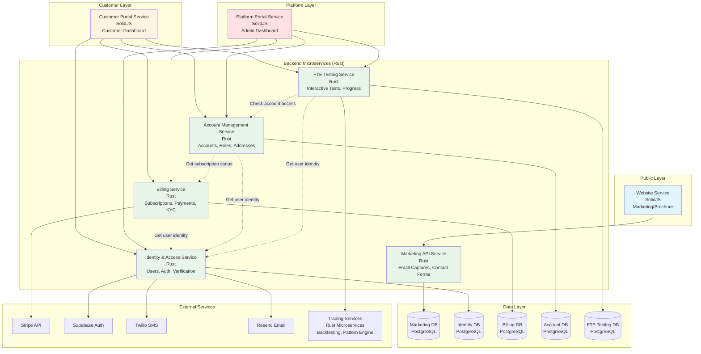
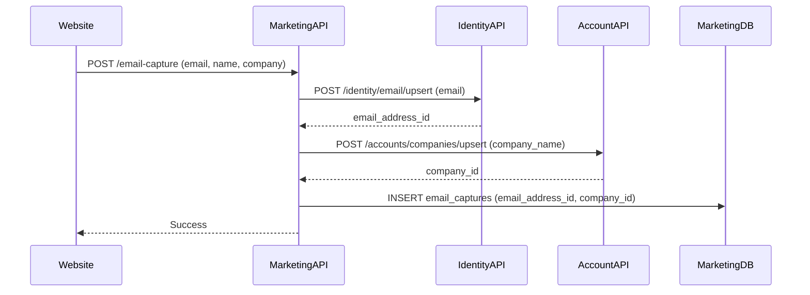
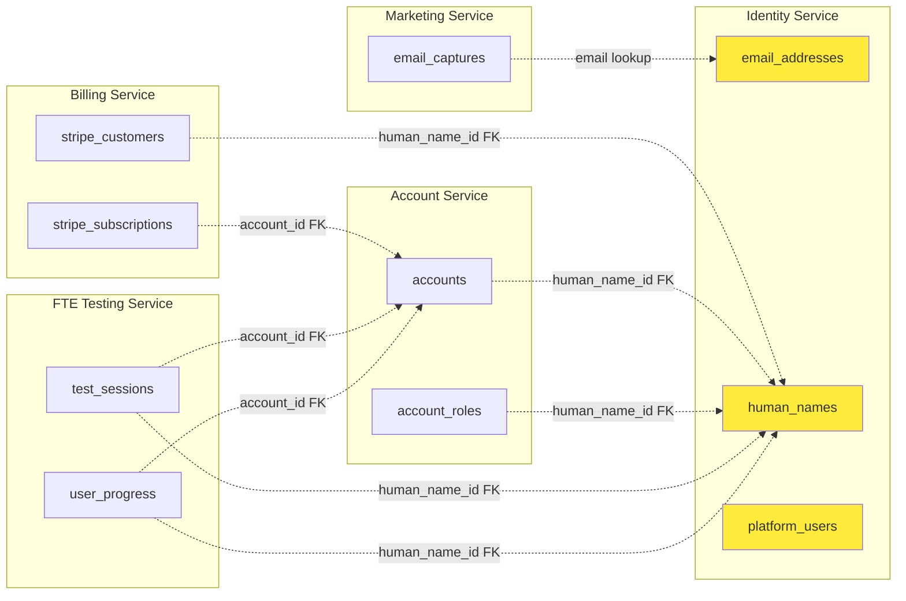
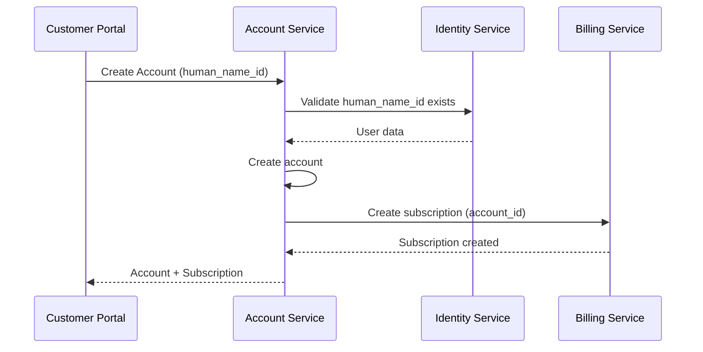
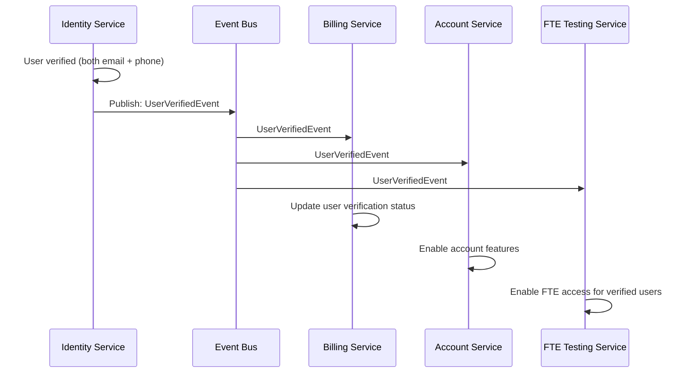
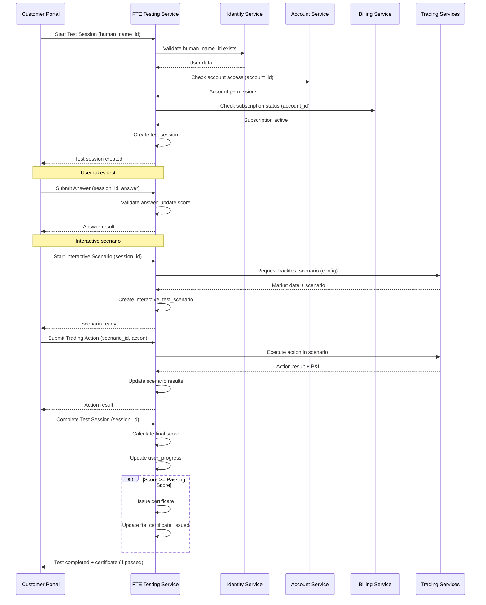
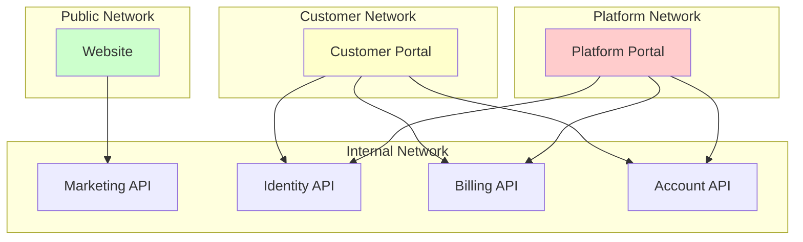

# RERP Microservices Architecture

## Executive Summary

The current monolithic database schema should be **decomposed into domain-specific microservices** to achieve proper separation of concerns, scalability, and security boundaries. This document provides a domain-driven design analysis and proposed architecture.

---

## Current Schema Analysis

### Domain Boundaries Identified

1. **Marketing/Website Domain** (Public-facing)
   - `email_captures` - Lead generation
   - `contact_messages` - Contact form submissions
   - `companies` - Company references (for forms)

2. **Identity & Access Domain** (Core)
   - `email_addresses` - Central email registry
   - `human_names` - Customer identity
   - `mobile_numbers` - Phone verification
   - `verification_tracking` - Dual verification state
   - `platform_users` - Platform staff identity
   - `admins` - Platform roles

3. **Billing & Payments Domain** (Financial)
   - `stripe_customers` - Stripe customer mapping
   - `stripe_payment_methods` - Payment methods
   - `stripe_subscriptions` - Subscription management
   - `stripe_payment_intents` - Payment transactions
   - `plans` - Subscription plans
   - `kyc_billing_verification` - KYC compliance

4. **Account Management Domain** (Customer)
   - `accounts` - User accounts
   - `account_roles` - Role-based access control
   - `addresses` - KYC addresses

5. **FTE Testing Domain** (Education & Interactive Tests)
   - Test sessions and results
   - User progress tracking
   - Interactive test scenarios
   - Completion certificates
   - Integration with trading/backtesting services

---

## Proposed Microservices Architecture

### Service Boundaries



---

## Service Overview

### Frontend Applications

1. **Website Service** (SolidJS) - Public marketing/brochure site
2. **Customer Portal Service** (SolidJS) - Customer dashboard and trading interface
3. **Platform Portal Service** (SolidJS) - Admin dashboard for platform staff

### Backend Microservices (Rust)

1. **Marketing API Service** - Website lead generation
2. **Identity & Access Service** - User identity and authentication
3. **Billing Service** - Subscriptions and payments
4. **Account Management Service** - Account lifecycle and RBAC
5. **FTE Testing Service** - Financial Trading Education and interactive tests

### Trading Services (Rust - Existing)

- Market Data Ingestor
- Pattern Engine
- Sentiment Analyzer
- Signal Fusion
- Risk Manager
- Trade Orchestrator
- Broker Adapters
- Backtesting Framework

---

## Domain Decomposition

### 1. Marketing Service (Website)

**Purpose**: Handle public-facing marketing website operations

**Database Schema**:
```sql
-- marketing_db
-- NO email_addresses, companies, or human_names tables
-- These are owned by Identity Service

email_captures (
  id UUID PRIMARY KEY,
  email_address_id UUID NOT NULL,  -- FK reference to Identity Service
  source TEXT NOT NULL,
  name TEXT,
  company_id UUID,  -- FK reference to Identity Service (via Account Service)
  plan_code TEXT,   -- Denormalized for analytics
  recaptcha_token TEXT,
  created_at TIMESTAMP WITH TIME ZONE
);

contact_messages (
  id UUID PRIMARY KEY,
  email_address_id UUID NOT NULL,  -- FK reference to Identity Service
  name TEXT NOT NULL,
  company_id UUID,  -- FK reference to Identity Service (via Account Service)
  message TEXT NOT NULL,
  recaptcha_token TEXT,
  created_at TIMESTAMP WITH TIME ZONE
);
```

**Responsibilities**:
- Email capture from hero, exit intent, free trial forms
- Contact form submissions
- **NO ownership of email_addresses or companies** - always calls Identity Service
- Minimal data retention (GDPR compliance)
- Analytics and lead tracking

**API Endpoints**:
- `POST /api/marketing/email-capture` - Calls Identity Service to upsert email
- `POST /api/marketing/contact` - Calls Identity Service to upsert email/company

**Data Flow**:


**Critical Design Decision**: 
- ✅ **Marketing Service calls Identity Service API** - Single source of truth
- ❌ **NO duplicate email_addresses or companies in Marketing DB**
- ❌ **NO cross-database joins** - Defeats microservices purpose
- ✅ **Marketing DB stores only references (UUIDs)** - No data duplication

---

### 2. Identity & Access Service

**Purpose**: Central identity management for all users (customers and platform)

**Database Schema**:
```sql
-- identity_db
-- SINGLE SOURCE OF TRUTH for all email addresses and user identity

email_addresses (
  id UUID PRIMARY KEY,
  email TEXT NOT NULL UNIQUE,  -- Global uniqueness enforced here
  verified BOOLEAN DEFAULT false,
  verification_token TEXT,
  verification_sent_at TIMESTAMP WITH TIME ZONE,
  verified_at TIMESTAMP WITH TIME ZONE,
  created_at TIMESTAMP WITH TIME ZONE,
  updated_at TIMESTAMP WITH TIME ZONE
);

human_names (
  id UUID PRIMARY KEY,
  email_address_id UUID NOT NULL UNIQUE REFERENCES email_addresses(id),
  first_name TEXT,
  surname TEXT,
  username TEXT UNIQUE,
  created_at TIMESTAMP WITH TIME ZONE,
  updated_at TIMESTAMP WITH TIME ZONE
);

mobile_numbers (
  id UUID PRIMARY KEY,
  human_name_id UUID NOT NULL UNIQUE REFERENCES human_names(id),
  phone_number TEXT NOT NULL,
  country_code TEXT,
  is_verified BOOLEAN DEFAULT false,
  verification_code TEXT,
  verification_sent_at TIMESTAMP WITH TIME ZONE,
  verified_at TIMESTAMP WITH TIME ZONE,
  created_at TIMESTAMP WITH TIME ZONE,
  updated_at TIMESTAMP WITH TIME ZONE
);

verification_tracking (
  id UUID PRIMARY KEY,
  human_name_id UUID NOT NULL UNIQUE REFERENCES human_names(id),
  email_verified BOOLEAN DEFAULT false,
  phone_verified BOOLEAN DEFAULT false,
  both_verified BOOLEAN DEFAULT false,
  ...
);

platform_users (
  id UUID PRIMARY KEY,
  email TEXT NOT NULL UNIQUE,  -- Separate from customer emails
  phone TEXT UNIQUE,
  first_name TEXT NOT NULL,
  surname TEXT NOT NULL,
  username TEXT UNIQUE,
  is_active BOOLEAN DEFAULT true,
  ...
);

admins (
  id UUID PRIMARY KEY,
  platform_user_id UUID NOT NULL UNIQUE REFERENCES platform_users(id),
  account_id UUID,  -- Optional link to customer account
  role role_type DEFAULT 'admin',
  ...
);
```

**Responsibilities**:
- **SINGLE SOURCE OF TRUTH** for email addresses (no duplication allowed)
- Email address management (central registry)
- Customer identity (human_names)
- Platform identity (platform_users)
- Dual verification (email + phone)
- Authentication state management
- Integration with Supabase Auth

**API Endpoints**:
- `POST /api/identity/email/upsert` - Creates or returns existing email_address_id
- `GET /api/identity/email/{email}` - Lookup email_address_id by email
- `GET /api/identity/email/{email_address_id}` - Get email details
- `POST /api/identity/verify/email`
- `POST /api/identity/verify/phone`
- `GET /api/identity/user/{human_name_id}`
- `GET /api/identity/verification-status/{human_name_id}`

**Data Flow**:
- **All services → Identity Service** (for email/identity lookup - NO direct DB access)
- Identity Service → Supabase Auth (for authentication)
- Identity Service → Twilio (for SMS OTP)
- Identity Service → Resend (for email OTP)

**Critical Design Decision**:
- ✅ **ONLY Identity Service owns email_addresses** - No other service has this table
- ✅ **All services call Identity API** - Never duplicate email data
- ✅ **Global email uniqueness** - Enforced in Identity Service database

---

### 3. Billing Service

**Purpose**: Handle all subscription and payment operations

**Database Schema**:
```sql
-- billing_db
plans (id, code, name, ...)
stripe_customers (id, human_name_id, stripe_customer_id, email, ...)
stripe_payment_methods (id, human_name_id, stripe_payment_method_id, ...)
stripe_subscriptions (id, account_id, stripe_subscription_id, plan_id, status, ...)
stripe_payment_intents (id, account_id, stripe_payment_intent_id, ...)
kyc_billing_verification (id, account_id, human_name_id, verification_status, ...)
```

**Responsibilities**:
- Subscription plan management
- Stripe integration (customers, payment methods, subscriptions)
- Payment processing
- KYC billing verification
- Trial period management
- Billing webhooks from Stripe

**API Endpoints**:
- `GET /api/billing/plans`
- `POST /api/billing/customers`
- `POST /api/billing/payment-methods`
- `POST /api/billing/subscriptions`
- `GET /api/billing/subscription/{account_id}`
- `POST /api/billing/kyc/verify`
- `GET /api/billing/kyc/status/{account_id}`

**Data Flow**:
- Customer Portal → Billing Service → Stripe
- Billing Service → Identity Service (to get human_name_id)
- Billing Service → Account Service (to get account_id)

---

### 4. Account Management Service

**Purpose**: Manage customer accounts and access control

**Database Schema**:
```sql
-- account_db
-- SINGLE SOURCE OF TRUTH for companies and addresses

accounts (
  id UUID PRIMARY KEY,
  human_name_id UUID NOT NULL UNIQUE,  -- Reference to Identity Service (validated via API)
  plan_id UUID,  -- Reference to Billing Service
  created_at TIMESTAMP WITH TIME ZONE,
  updated_at TIMESTAMP WITH TIME ZONE
);

account_roles (
  id UUID PRIMARY KEY,
  account_id UUID NOT NULL REFERENCES accounts(id),
  human_name_id UUID NOT NULL,  -- Reference to Identity Service
  role role_type NOT NULL,
  created_at TIMESTAMP WITH TIME ZONE,
  updated_at TIMESTAMP WITH TIME ZONE,
  UNIQUE(account_id, human_name_id, role)
);

addresses (
  id UUID PRIMARY KEY,
  type address_type NOT NULL,
  person_id UUID,  -- Reference to Identity Service (human_name_id)
  company_id UUID REFERENCES companies(id),
  street_address TEXT,
  city TEXT,
  state_province TEXT,
  postal_code TEXT,
  country TEXT,
  is_primary BOOLEAN DEFAULT false,
  created_at TIMESTAMP WITH TIME ZONE,
  updated_at TIMESTAMP WITH TIME ZONE,
  CHECK ((person_id IS NOT NULL AND company_id IS NULL) OR 
         (person_id IS NULL AND company_id IS NOT NULL))
);

companies (
  id UUID PRIMARY KEY,
  name TEXT NOT NULL UNIQUE,  -- Global uniqueness enforced here
  created_at TIMESTAMP WITH TIME ZONE,
  updated_at TIMESTAMP WITH TIME ZONE
);
```

**Responsibilities**:
- **SINGLE SOURCE OF TRUTH** for companies (no duplication allowed)
- Account lifecycle management
- Role-based access control (customer-side roles)
- Address management (for KYC)
- Company management
- Account-to-user relationships

**API Endpoints**:
- `POST /api/accounts/companies/upsert` - Creates or returns existing company_id
- `GET /api/accounts/companies/{name}` - Lookup company_id by name
- `GET /api/accounts/companies/{company_id}` - Get company details
- `POST /api/accounts`
- `GET /api/accounts/{id}`
- `POST /api/accounts/{id}/roles`
- `GET /api/accounts/{id}/roles`
- `POST /api/accounts/{id}/addresses`
- `GET /api/accounts/{id}/addresses`

**Data Flow**:
- Customer Portal → Account Service
- Account Service → Identity Service (to validate human_name_id exists)
- Account Service → Billing Service (to get subscription status)
- **Marketing Service → Account Service** (to upsert companies)

**Critical Design Decision**:
- ✅ **ONLY Account Service owns companies** - No other service has this table
- ✅ **All services call Account API for companies** - Never duplicate company data
- ✅ **Global company name uniqueness** - Enforced in Account Service database

---

### 5. FTE Testing Service

**Purpose**: Financial Trading Education and interactive testing system

**Database Schema**:
```sql
-- fte_testing_db
-- SINGLE SOURCE OF TRUTH for FTE test data

test_sessions (
  id UUID PRIMARY KEY,
  human_name_id UUID NOT NULL,  -- Reference to Identity Service
  account_id UUID,  -- Reference to Account Service (for access control)
  test_type TEXT NOT NULL,  -- 'module_quiz', 'interactive_scenario', 'final_assessment'
  module_id TEXT,  -- Which FTE module this test belongs to
  status TEXT NOT NULL,  -- 'in_progress', 'completed', 'failed', 'expired'
  score DECIMAL,  -- Test score (0-100)
  passing_score DECIMAL DEFAULT 70.0,  -- Required score to pass
  started_at TIMESTAMP WITH TIME ZONE,
  completed_at TIMESTAMP WITH TIME ZONE,
  expires_at TIMESTAMP WITH TIME ZONE,
  created_at TIMESTAMP WITH TIME ZONE,
  updated_at TIMESTAMP WITH TIME ZONE
);

test_answers (
  id UUID PRIMARY KEY,
  test_session_id UUID NOT NULL REFERENCES test_sessions(id),
  question_id TEXT NOT NULL,
  answer TEXT NOT NULL,
  is_correct BOOLEAN,
  points_awarded DECIMAL,
  answered_at TIMESTAMP WITH TIME ZONE,
  created_at TIMESTAMP WITH TIME ZONE
);

user_progress (
  id UUID PRIMARY KEY,
  human_name_id UUID NOT NULL UNIQUE,  -- Reference to Identity Service
  account_id UUID,  -- Reference to Account Service
  current_module TEXT,
  modules_completed TEXT[],  -- Array of completed module IDs
  overall_progress DECIMAL DEFAULT 0.0,  -- 0-100 percentage
  fte_certificate_issued BOOLEAN DEFAULT false,
  certificate_issued_at TIMESTAMP WITH TIME ZONE,
  last_accessed_at TIMESTAMP WITH TIME ZONE,
  created_at TIMESTAMP WITH TIME ZONE,
  updated_at TIMESTAMP WITH TIME ZONE
);

interactive_test_scenarios (
  id UUID PRIMARY KEY,
  test_session_id UUID NOT NULL REFERENCES test_sessions(id),
  scenario_type TEXT NOT NULL,  -- 'backtest', 'live_simulation', 'pattern_recognition'
  scenario_config JSONB,  -- Configuration for the test scenario
  trading_data JSONB,  -- Market data used in the scenario
  user_actions JSONB,  -- User's trading decisions/actions
  results JSONB,  -- Test results and performance metrics
  started_at TIMESTAMP WITH TIME ZONE,
  completed_at TIMESTAMP WITH TIME ZONE,
  created_at TIMESTAMP WITH TIME ZONE,
  updated_at TIMESTAMP WITH TIME ZONE
);

fte_certificates (
  id UUID PRIMARY KEY,
  human_name_id UUID NOT NULL UNIQUE,  -- Reference to Identity Service
  account_id UUID,  -- Reference to Account Service
  certificate_number TEXT NOT NULL UNIQUE,
  issued_at TIMESTAMP WITH TIME ZONE NOT NULL,
  expires_at TIMESTAMP WITH TIME ZONE,  -- Optional expiration
  verification_token TEXT UNIQUE,  -- For certificate verification
  created_at TIMESTAMP WITH TIME ZONE
);
```

**Responsibilities**:
- **SINGLE SOURCE OF TRUTH** for FTE test data and progress
- Test session management
- User progress tracking
- Interactive test scenario execution
- Integration with trading services for realistic scenarios
- Certificate generation and verification
- Module completion tracking

**API Endpoints**:
- `GET /api/fte/progress/{human_name_id}` - Get user progress
- `POST /api/fte/sessions` - Start new test session
- `GET /api/fte/sessions/{session_id}` - Get session details
- `POST /api/fte/sessions/{session_id}/answers` - Submit test answer
- `POST /api/fte/sessions/{session_id}/complete` - Complete test session
- `POST /api/fte/scenarios` - Start interactive scenario
- `POST /api/fte/scenarios/{scenario_id}/actions` - Submit trading action
- `GET /api/fte/certificates/{human_name_id}` - Get user certificate
- `GET /api/fte/certificates/verify/{token}` - Verify certificate

**Data Flow**:
- Customer Portal → FTE Testing Service
- FTE Testing Service → Identity Service (to validate human_name_id)
- FTE Testing Service → Account Service (to check account access/permissions)
- FTE Testing Service → Trading Services (for backtesting, pattern recognition scenarios)
- FTE Testing Service → Billing Service (to check if user has active subscription for FTE access)

**Critical Design Decision**:
- ✅ **ONLY FTE Testing Service owns test data** - No other service has these tables
- ✅ **Stores only UUID references** - `human_name_id`, `account_id` (never duplicates user data)
- ✅ **Integration with Trading Services** - Uses real backtesting/pattern recognition for interactive tests
- ✅ **Certificate verification** - Public verification endpoint for certificate validation

---

## Data Ownership & Access Patterns

### Cross-Service Data Dependencies



### Shared Data Strategy

**✅ Recommended: API Calls with Caching** (Chosen Approach)

**For Email Addresses**:
- All services call Identity Service API: `POST /api/identity/email/upsert`
- Identity Service returns `email_address_id` (UUID)
- Services store only the UUID reference, never duplicate email data
- Caching layer in each service to reduce API calls
- Fallback: Service can operate with cached data if Identity Service is temporarily unavailable

**For Companies**:
- All services call Account Service API: `POST /api/accounts/companies/upsert`
- Account Service returns `company_id` (UUID)
- Services store only the UUID reference, never duplicate company data
- Caching layer for performance

**For User Identity**:
- Services store `human_name_id` (UUID) as reference
- Call Identity Service API when user details needed
- Event-driven updates for real-time changes (optional optimization)

**❌ NOT Recommended Options**:

**Option 1: Event-Driven Replication** (Rejected)
- ❌ Creates duplicate data
- ❌ Risk of inconsistency
- ❌ Complex to maintain sync

**Option 2: Cross-Database Joins** (Rejected)
- ❌ Defeats microservices purpose
- ❌ Creates tight coupling
- ❌ Database-level dependencies
- ❌ Cannot scale independently

**Option 3: Shared Database View** (Rejected)
- ❌ Defeats microservices purpose
- ❌ Single point of failure
- ❌ Cannot deploy independently

---

## Recommended Architecture

### Phase 1: Initial Split (MVP)

```
┌─────────────────────────────────────────────────────────┐
│                    Monolithic Database                  │
│  (Keep current schema, but logically separate)         │
└─────────────────────────────────────────────────────────┘
                          │
        ┌─────────────────┼─────────────────┐
        │                 │                 │
   Marketing API    Identity API      Billing API
   Account API      FTE Testing API
```

**Rationale**: Start with API layer separation, shared database. This allows:
- Clear service boundaries
- Independent deployment
- Easier migration to separate databases later

### Phase 2: Database Split

```
Marketing DB    Identity DB    Billing DB    Account DB    FTE Testing DB
     │              │              │              │              │
     └──────────────┴──────────────┴──────────────┴──────────────┘
                    │
            Event Bus / API Gateway
```

**Migration Strategy**:
1. Identity DB first (foundational)
2. Marketing DB (lowest risk, isolated)
3. Billing DB (requires careful migration of subscriptions)
4. Account DB (depends on Identity and Billing)
5. FTE Testing DB (depends on Identity and Account)

---

## Critical Design Decisions

### 1. Email Address Ownership

**Decision**: Identity Service owns `email_addresses` - **SINGLE SOURCE OF TRUTH**

**Rationale**:
- Central registry prevents duplicates
- Single source of truth for email verification
- All services reference Identity Service for email lookups
- **NO duplication allowed** - Prevents inconsistency and confusion

**Implementation**:
- Marketing Service calls Identity API: `POST /api/identity/email/upsert`
- Identity Service returns `email_address_id` (UUID)
- Marketing Service stores only `email_address_id` in its database
- **Marketing Service NEVER stores email addresses directly**
- Other services follow same pattern

**Example Flow**:
```typescript
// Marketing Service receives email capture
const email = "user@example.com";

// Call Identity Service (never duplicate)
const response = await identityAPI.upsertEmail(email);
const emailAddressId = response.email_address_id; // UUID

// Store only the reference
await marketingDB.insertEmailCapture({
  email_address_id: emailAddressId,  // UUID reference
  source: 'hero',
  // NO email field in marketing DB
});
```

### 2. User Identity Ownership

**Decision**: Identity Service owns `human_names` and `platform_users` - **SINGLE SOURCE OF TRUTH**

**Rationale**:
- Clear separation: customer vs platform users
- Single authentication source
- All services reference Identity Service for user data
- **NO duplication allowed** - Prevents inconsistency

**Implementation**:
- Services store `human_name_id` or `platform_user_id` as UUID reference
- **Services NEVER store user names, emails, or phone numbers directly**
- Use API calls to Identity Service when user details needed
- Caching layer for performance (with TTL)

### 3. Company Ownership

**Decision**: Account Service owns `companies` - **SINGLE SOURCE OF TRUTH**

**Rationale**:
- Central registry prevents duplicate company records
- Single source of truth for company data
- All services reference Account Service for company lookups
- **NO duplication allowed** - Prevents inconsistency and confusion

**Implementation**:
- Marketing Service calls Account API: `POST /api/accounts/companies/upsert`
- Account Service returns `company_id` (UUID)
- Marketing Service stores only `company_id` in its database
- **Marketing Service NEVER stores company names directly**
- Other services follow same pattern

**Example Flow**:
```typescript
// Marketing Service receives contact form with company
const companyName = "Acme Corp";

// Call Account Service (never duplicate)
const response = await accountAPI.upsertCompany(companyName);
const companyId = response.company_id; // UUID

// Store only the reference
await marketingDB.insertContactMessage({
  email_address_id: emailAddressId,
  company_id: companyId,  // UUID reference
  message: "...",
  // NO company_name field in marketing DB
});
```

### 3. Account vs Identity

**Decision**: Account Service owns `accounts`, Identity Service owns `human_names`

**Rationale**:
- Account = business entity (subscription, billing)
- Identity = authentication entity (email, phone, verification)
- One identity can have multiple accounts (future: multi-tenant)

**Implementation**:
- `accounts.human_name_id` → Identity Service API call
- Account Service validates `human_name_id` exists before creating account

### 5. Billing Data Isolation

**Decision**: Billing Service owns all Stripe-related data

**Rationale**:
- PCI compliance requirements
- Isolated payment processing
- Clear audit trail

**Implementation**:
- Billing Service is only service that talks to Stripe
- Other services query billing status via API
- **Billing Service stores `human_name_id` as UUID reference** (never duplicates user data)

---

## Service Communication Patterns

### Synchronous (API Calls)



### Asynchronous (Events)



### FTE Testing Service Flow



---

## Security Boundaries

### Service Isolation



**Security Rules**:
1. **Platform Portal** → Can access all services (admin privileges)
2. **Customer Portal** → Can only access own data (RLS enforced)
3. **Website** → Can only access Marketing API (public endpoints)
4. **Services** → Mutual TLS, service-to-service authentication

---

## Database Schema Per Service

### Marketing Service Database

```sql
-- Marketing Service Database
-- NO email_addresses or companies tables - these are owned by other services
-- Stores only references (UUIDs) to maintain single source of truth

CREATE TABLE email_captures (
  id UUID PRIMARY KEY DEFAULT gen_random_uuid(),
  email_address_id UUID NOT NULL,  -- Reference to Identity Service
  source TEXT NOT NULL CHECK (source IN ('hero', 'exit_intent', 'free_trial')),
  name TEXT,
  company_id UUID,  -- Reference to Account Service (companies table)
  plan_code TEXT,  -- Denormalized for analytics (not FK, just for reporting)
  recaptcha_token TEXT,
  created_at TIMESTAMP WITH TIME ZONE DEFAULT NOW()
);

CREATE TABLE contact_messages (
  id UUID PRIMARY KEY DEFAULT gen_random_uuid(),
  email_address_id UUID NOT NULL,  -- Reference to Identity Service
  name TEXT NOT NULL,
  company_id UUID,  -- Reference to Account Service (companies table)
  message TEXT NOT NULL,
  recaptcha_token TEXT,
  created_at TIMESTAMP WITH TIME ZONE DEFAULT NOW()
);

-- Indexes for lookups
CREATE INDEX idx_email_captures_email_address_id ON email_captures(email_address_id);
CREATE INDEX idx_email_captures_company_id ON email_captures(company_id);
CREATE INDEX idx_email_captures_source ON email_captures(source);
CREATE INDEX idx_email_captures_created_at ON email_captures(created_at);

CREATE INDEX idx_contact_messages_email_address_id ON contact_messages(email_address_id);
CREATE INDEX idx_contact_messages_company_id ON contact_messages(company_id);
CREATE INDEX idx_contact_messages_created_at ON contact_messages(created_at);
```

**Critical Design Principles**:
- ✅ **NO email_addresses table** - Always call Identity Service API
- ✅ **NO companies table** - Always call Account Service API
- ✅ **Store only UUID references** - No data duplication
- ✅ **Single source of truth** - Email and company data only in owning services
- ❌ **NO cross-database joins** - Use API calls instead

### Identity Service Database

```sql
-- Core identity tables (as per current schema)
-- email_addresses, human_names, mobile_numbers, verification_tracking
-- platform_users, admins
```

### Billing Service Database

```sql
-- Billing tables (as per current schema)
-- plans, stripe_customers, stripe_payment_methods, 
-- stripe_subscriptions, stripe_payment_intents, kyc_billing_verification

-- Reference Identity Service via human_name_id (UUID)
-- No FK constraint, validated via API
```

### Account Service Database

```sql
-- Account tables (as per current schema)
-- accounts, account_roles, addresses, companies

-- Reference Identity Service via human_name_id (UUID)
-- Reference Billing Service via account_id (for subscription status)
-- No FK constraints, validated via API
```

### FTE Testing Service Database

```sql
-- FTE Testing tables (as per schema above)
-- test_sessions, test_answers, user_progress, 
-- interactive_test_scenarios, fte_certificates

-- Reference Identity Service via human_name_id (UUID)
-- Reference Account Service via account_id (UUID)
-- No FK constraints, validated via API
-- Integration with Trading Services for interactive scenarios
```

---

## Migration Path

### Step 1: API Layer Separation (Week 1-2)
- [ ] Create service APIs (Marketing, Identity, Billing, Account)
- [ ] Implement API Gateway
- [ ] Update frontends to call APIs instead of direct DB
- [ ] Keep shared database

### Step 2: Identity Service Split (Week 3-4)
- [ ] Create Identity DB
- [ ] Migrate identity tables
- [ ] Update other services to call Identity API
- [ ] Remove direct DB access to identity tables

### Step 3: Marketing Service Split (Week 5)
- [ ] Create Marketing DB
- [ ] Migrate marketing tables
- [ ] Implement event sync with Identity Service

### Step 4: Billing Service Split (Week 6-7)
- [ ] Create Billing DB
- [ ] Migrate billing tables
- [ ] Implement Stripe webhook handling
- [ ] Update Account Service to call Billing API

### Step 5: Account Service Split (Week 8)
- [ ] Create Account DB
- [ ] Migrate account tables
- [ ] Implement event-driven updates

### Step 6: FTE Testing Service Split (Week 9-10)
- [ ] Create FTE Testing DB
- [ ] Migrate FTE testing tables
- [ ] Implement integration with Trading Services
- [ ] Update Customer Portal to call FTE Testing API

---

## Recommendations

### ✅ DO

1. **Start with API separation** - Logical boundaries first, physical later
2. **Identity Service first** - Foundation for all other services
3. **API calls for shared data** - Single source of truth, no duplication
4. **Store only UUID references** - Services store foreign key UUIDs, not data
5. **Caching layer** - Reduce API calls with TTL-based caching
6. **API Gateway** - Centralized routing, authentication, rate limiting
7. **Service mesh** - For service-to-service communication (Istio/Linkerd)

### ❌ DON'T

1. **Don't duplicate email_addresses** - Always call Identity Service API
2. **Don't duplicate companies** - Always call Account Service API
3. **Don't duplicate user data** - Always call Identity Service API
4. **Don't use cross-database joins** - Use API calls instead
5. **Don't share databases** - Defeats microservices purpose
6. **Don't use distributed transactions** - Use eventual consistency
7. **Don't create circular dependencies** - Identity → Billing → Account (not reverse)
8. **Don't expose internal APIs** - Use API Gateway for external access

## Data Consistency Guarantees

### Single Source of Truth

| Data Type | Owner Service | How Other Services Access |
|-----------|--------------|---------------------------|
| `email_addresses` | Identity Service | `POST /api/identity/email/upsert` → Returns `email_address_id` |
| `human_names` | Identity Service | `GET /api/identity/user/{human_name_id}` → Returns user data |
| `companies` | Account Service | `POST /api/accounts/companies/upsert` → Returns `company_id` |
| `platform_users` | Identity Service | `GET /api/identity/platform-user/{platform_user_id}` → Returns user data |
| `test_sessions` | FTE Testing Service | `POST /api/fte/sessions` → Returns `session_id` |
| `user_progress` | FTE Testing Service | `GET /api/fte/progress/{human_name_id}` → Returns progress data |
| `fte_certificates` | FTE Testing Service | `GET /api/fte/certificates/{human_name_id}` → Returns certificate |

### No Duplication Rules

1. **Marketing Service**:
   - ❌ NO `email_addresses` table
   - ❌ NO `companies` table
   - ❌ NO `human_names` table
   - ✅ Stores only `email_address_id` and `company_id` (UUIDs)

2. **Billing Service**:
   - ❌ NO `email_addresses` table
   - ❌ NO `human_names` table
   - ✅ Stores only `human_name_id` (UUID reference)

3. **Account Service**:
   - ❌ NO `email_addresses` table
   - ❌ NO `human_names` table
   - ✅ Stores only `human_name_id` (UUID reference)
   - ✅ Owns `companies` (single source of truth)

4. **Identity Service**:
   - ✅ Owns `email_addresses` (single source of truth)
   - ✅ Owns `human_names` (single source of truth)
   - ✅ Owns `platform_users` (single source of truth)

5. **FTE Testing Service**:
   - ❌ NO `email_addresses` table
   - ❌ NO `human_names` table
   - ❌ NO `companies` table
   - ✅ Stores only `human_name_id` and `account_id` (UUID references)
   - ✅ Owns all FTE test data (single source of truth)

---

## Conclusion

**Current State**: Monolithic database with clear logical domains

**Recommended State**: 5 microservices with separate databases:
1. **Marketing Service** - Public website operations
2. **Identity Service** - Core identity and authentication
3. **Billing Service** - Payments and subscriptions
4. **Account Service** - Account management and RBAC
5. **FTE Testing Service** - Financial Trading Education and interactive tests

**Migration Strategy**: Phased approach starting with API layer, then database splits

**Key Benefits**:
- ✅ Clear service boundaries
- ✅ Independent scaling
- ✅ Security isolation (especially billing)
- ✅ Technology flexibility per service
- ✅ Team ownership and autonomy

---

*Last Updated: 2025-01-01*

